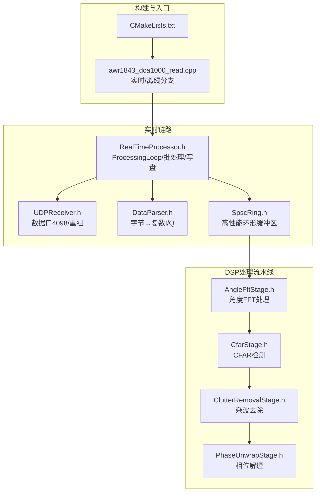
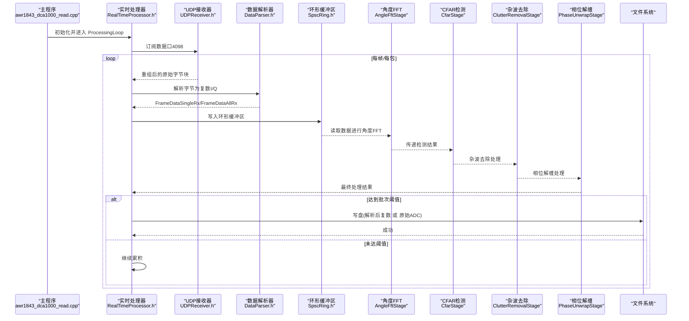
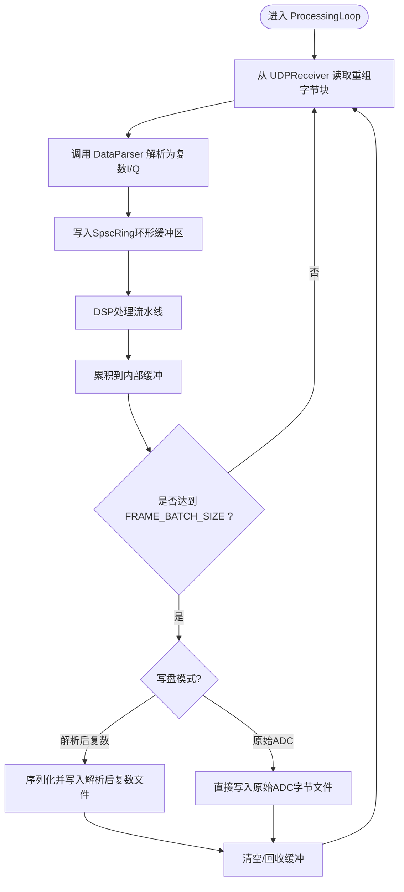
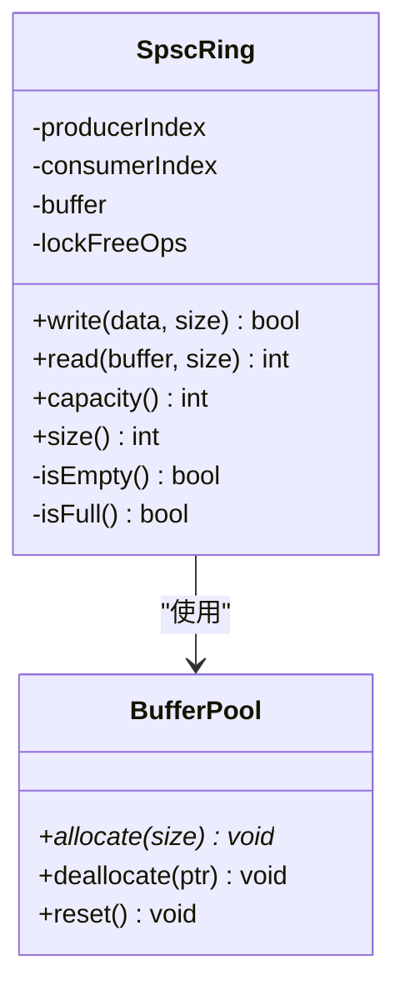
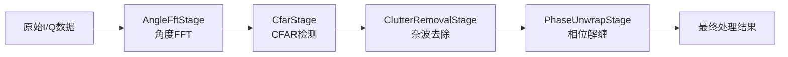
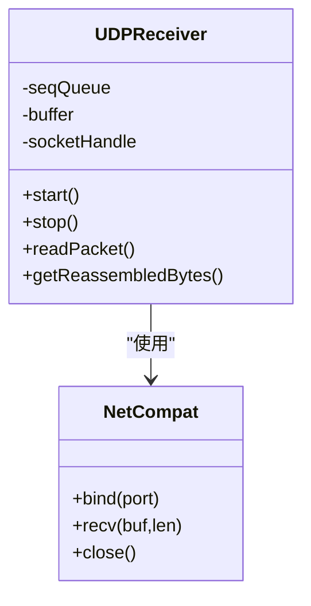
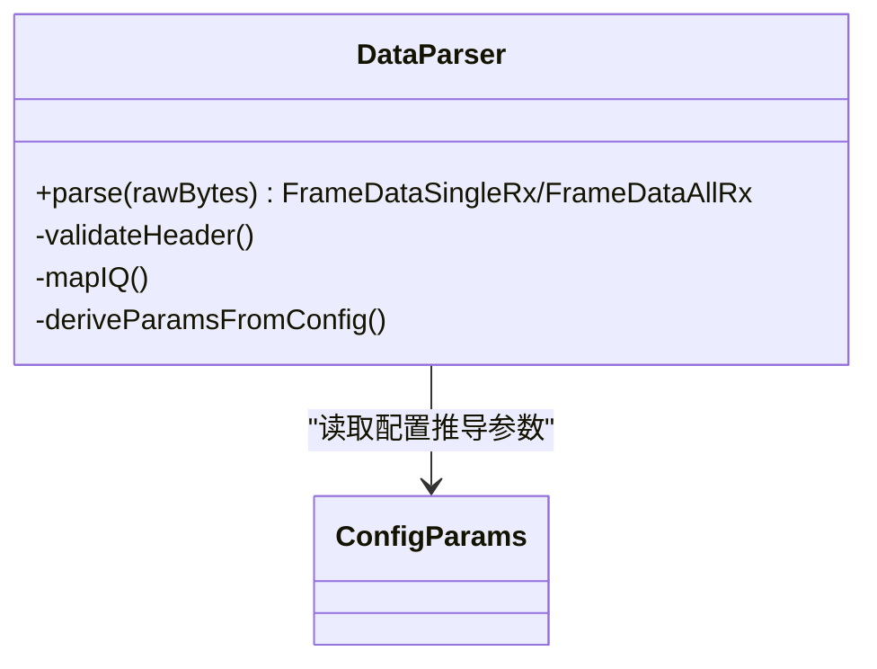
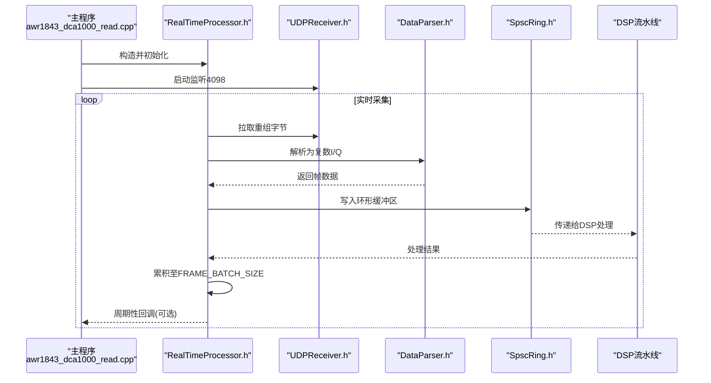
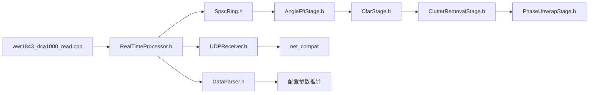

# 实时处理流水线与数据流

<cite>
**本文引用的文件**   
- [CMakeLists.txt](file://CMakeLists.txt)
- [awr1843_dca1000_read.cpp](file://src/awr1843_dca1000_read.cpp)
- [RealTimeProcessor.h](file://include/RealTimeProcessor.h)
- [UDPReceiver.h](file://include/UDPReceiver.h)
- [DataParser.h](file://include/DataParser.h)
- [SpscRing.h](file://src/core/SpscRing.h)
- [AngleFftStage.h](file://src/dsp/AngleFftStage.h)
- [CfarStage.h](file://src/dsp/CfarStage.h)
- [ClutterRemovalStage.h](file://src/dsp/ClutterRemovalStage.h)
- [PhaseUnwrapStage.h](file://src/dsp/PhaseUnwrapStage.h)
</cite>

## 更新摘要
**所做更改**   
- 更新了DSP流水线架构，新增AngleFftStage、CfarStage、ClutterRemovalStage和PhaseUnwrapStage组件
- 增强了单生产者单消费者环形缓冲区(SpscRing)的性能优化
- 改进了数据传输和帧缓冲机制
- 更新了实时处理流水线的端到端数据流时序

## 目录
1. [简介](#简介)
2. [项目结构](#项目结构)
3. [核心组件](#核心组件)
4. [架构总览](#架构总览)
5. [详细组件分析](#详细组件分析)
6. [依赖关系分析](#依赖关系分析)
7. [性能考量](#性能考量)
8. [故障排查指南](#故障排查指南)
9. [结论](#结论)
10. [附录](#附录)

## 简介
本文件聚焦于 AWR1843 毫米波雷达 + DCA1000 采集卡的实时数据采集与解析流水线，重点说明 RealTimeDataProcessor 如何串联 UDPReceiver 与 DataParser，按 FRAME_BATCH_SIZE 批量累积后落盘（支持"解析后的复数 I/Q"和"原始 ADC 字节"两种写盘模式），并给出端到端的数据流时序。该流水线属于"数据接收与帧重组"和"雷达数据解析"两层：第一层负责从 DCA1000 数据口(4098)搬运原始字节并完成序列号重组；第二层将字节还原为复数 I/Q 并输出给上层应用或写入磁盘。

**更新** 新增了DSP流水线重构内容，包括角度FFT、CFAR检测、杂波去除和相位解缠等高级处理阶段。

## 项目结构
- 构建目标
  - test_udp：不含串口链、三平台可构建，配合 Python 回放泵测试 UDP→重组→解析。
  - radar_full：包含串口链的完整程序。
- 入口与分支
  - awr1843_dca1000_read.cpp 通过条件编译切换 main 行为：#if 0 为实时采集路径，#if 1 为离线 bin→CSV 解析路径（当前默认）。
- 网络通道约定
  - 上位机 IP 192.168.33.30，DCA1000 IP 192.18.33.180。
  - 命令口 4096（UDPController）、数据口 4098（UDPReceiver）、串口 CLI 115200 / 数据口 921600（AWR1843Controller）。

**图表来源** 
- [CMakeLists.txt](file://CMakeLists.txt)
- [awr1843_dca1000_read.cpp](file://src/awr1843_dca1000_read.cpp)
- [RealTimeProcessor.h](file://include/RealTimeProcessor.h)
- [UDPReceiver.h](file://include/UDPReceiver.h)
- [DataParser.h](file://include/DataParser.h)
- [SpscRing.h](file://src/core/SpscRing.h)
- [AngleFftStage.h](file://src/dsp/AngleFftStage.h)
- [CfarStage.h](file://src/dsp/CfarStage.h)
- [ClutterRemovalStage.h](file://src/dsp/ClutterRemovalStage.h)
- [PhaseUnwrapStage.h](file://src/dsp/PhaseUnwrapStage.h)

**章节来源**
- [CMakeLists.txt](file://CMakeLists.txt)
- [awr1843_dca1000_read.cpp](file://src/awr1843_dca1000_read.cpp)

## 核心组件
- UDPReceiver
  - 职责：监听 DCA1000 数据口(4098)，基于 UnlockQueue 与 seqNum 完成数据包重组，输出连续原始字节流。
  - 关键点：跨平台 socket(net_compat)、丢包/乱序处理、缓冲区管理。
- DataParser
  - 职责：将原始字节流解析为复数 I/Q（FrameDataSingleRx/FrameDataAllRx），依据配置文件推导距离/多普勒分辨率等参数。
  - 关键点：帧边界识别、I/Q 解包、采样点映射。
- RealTimeDataProcessor
  - 职责：在 ProcessingLoop 中循环拉取 UDP 数据，调用 DataParser 解析，按 FRAME_BATCH_SIZE 累积，达到阈值后触发写盘（解析后复数或原始 ADC 两种模式）。
  - 关键点：批处理阈值、双写盘模式、线程安全与内存复用。
- SpscRing (单生产者单消费者环形缓冲区)
  - 职责：提供高性能无锁环形缓冲区，用于实时数据传递。
  - 关键点：零拷贝传输、原子操作、内存对齐优化。
- DSP处理阶段
  - AngleFftStage：角度FFT处理，实现空间域到角度域的转换。
  - CfarStage：恒虚警率检测，自适应阈值设定。
  - ClutterRemovalStage：杂波去除，提升信噪比。
  - PhaseUnwrapStage：相位解缠，恢复真实相位信息。

**更新** 新增了SpscRing环形缓冲区和完整的DSP处理流水线组件。

**章节来源**
- [UDPReceiver.h](file://include/UDPReceiver.h)
- [DataParser.h](file://include/DataParser.h)
- [RealTimeProcessor.h](file://include/RealTimeProcessor.h)
- [SpscRing.h](file://src/core/SpscRing.h)
- [AngleFftStage.h](file://src/dsp/AngleFftStage.h)
- [CfarStage.h](file://src/dsp/CfarStage.h)
- [ClutterRemovalStage.h](file://src/dsp/ClutterRemovalStage.h)
- [PhaseUnwrapStage.h](file://src/dsp/PhaseUnwrapStage.h)

## 架构总览
下图展示实时采集端到端的控制与数据流：main 选择实时分支 → 初始化 RealTimeDataProcessor → 启动 UDPReceiver → ProcessingLoop 循环拉取并解析 → 通过SpscRing传递到DSP流水线 → 批量落盘。

**图表来源** 
- [awr1843_dca1000_read.cpp](file://src/awr1843_dca1000_read.cpp)
- [RealTimeProcessor.h](file://include/RealTimeProcessor.h)
- [UDPReceiver.h](file://include/UDPReceiver.h)
- [DataParser.h](file://include/DataParser.h)
- [SpscRing.h](file://src/core/SpscRing.h)
- [AngleFftStage.h](file://src/dsp/AngleFftStage.h)
- [CfarStage.h](file://src/dsp/CfarStage.h)
- [ClutterRemovalStage.h](file://src/dsp/ClutterRemovalStage.h)
- [PhaseUnwrapStage.h](file://src/dsp/PhaseUnwrapStage.h)

## 详细组件分析

### RealTimeDataProcessor 批处理与写盘流程
- ProcessingLoop
  - 循环从 UDPReceiver 获取重组后的原始字节块。
  - 调用 DataParser 进行解析，得到复数 I/Q 数据结构。
  - 将解析结果或原始字节累积到内部缓冲，当累积数量达到 FRAME_BATCH_SIZE 时触发写盘。
- 写盘模式
  - 解析后复数：将 FrameDataSingleRx/FrameDataAllRx 序列化落盘，便于后续 FFT/CFAR 等算法直接消费。
  - 原始 ADC：将 UDP 重组后的原始字节直接落盘，保留最原始数据用于离线重解析或调试。
- 关键实现要点
  - 批大小控制：FRAME_BATCH_SIZE 决定落盘粒度，影响 I/O 吞吐与延迟。
  - 内存复用：避免频繁分配释放，降低 GC/碎片压力。
  - 错误恢复：解析失败或丢包时的回退策略（丢弃/重试/告警）。

**更新** 新增了SpscRing环形缓冲区集成，提供更高效的数据传递机制。

**图表来源** 
- [RealTimeProcessor.h](file://include/RealTimeProcessor.h)
- [DataParser.h](file://include/DataParser.h)
- [UDPReceiver.h](file://include/UDPReceiver.h)
- [SpscRing.h](file://src/core/SpscRing.h)

**章节来源**
- [RealTimeProcessor.h](file://include/RealTimeProcessor.h)
- [DataParser.h](file://include/DataParser.h)
- [UDPReceiver.h](file://include/UDPReceiver.h)
- [SpscRing.h](file://src/core/SpscRing.h)

### SpscRing 高性能环形缓冲区
- 设计特点
  - 单生产者单消费者模型，避免锁竞争。
  - 原子操作保证线程安全。
  - 内存对齐优化，提升缓存命中率。
- 核心功能
  - 非阻塞写入：生产者可以立即返回，无需等待消费者。
  - 批量操作：支持批量读写，减少系统调用开销。
  - 内存池管理：预分配固定大小缓冲区，避免动态分配。
- 性能优势
  - 零拷贝传输：数据直接在缓冲区间传递。
  - 低延迟：无锁设计确保最小处理延迟。
  - 高吞吐：批量操作最大化带宽利用率。

**新增** 这是全新的性能优化组件，替代原有的队列机制。

**图表来源** 
- [SpscRing.h](file://src/core/SpscRing.h)

**章节来源**
- [SpscRing.h](file://src/core/SpscRing.h)

### DSP处理流水线
- AngleFftStage (角度FFT处理)
  - 输入：复数I/Q数据矩阵
  - 处理：执行角度域FFT变换
  - 输出：角度谱数据
- CfarStage (CFAR检测)
  - 输入：角度谱数据
  - 处理：自适应阈值检测
  - 输出：目标检测结果
- ClutterRemovalStage (杂波去除)
  - 输入：检测后的数据
  - 处理：杂波抑制算法
  - 输出：纯净信号
- PhaseUnwrapStage (相位解缠)
  - 输入：去杂波数据
  - 处理：相位连续性恢复
  - 输出：最终处理结果

**新增** 完整的DSP处理流水线，提供从原始数据到最终结果的完整处理链。

**图表来源** 
- [AngleFftStage.h](file://src/dsp/AngleFftStage.h)
- [CfarStage.h](file://src/dsp/CfarStage.h)
- [ClutterRemovalStage.h](file://src/dsp/ClutterRemovalStage.h)
- [PhaseUnwrapStage.h](file://src/dsp/PhaseUnwrapStage.h)

**章节来源**
- [AngleFftStage.h](file://src/dsp/AngleFftStage.h)
- [CfarStage.h](file://src/dsp/CfarStage.h)
- [ClutterRemovalStage.h](file://src/dsp/ClutterRemovalStage.h)
- [PhaseUnwrapStage.h](file://src/dsp/PhaseUnwrapStage.h)

### UDPReceiver 数据接收与重组
- 监听端口：DCA1000 数据口 4098。
- 重组机制：基于 UnlockQueue 与 seqNum 对 UDP 包进行排序与拼接，保证字节流的连续性。
- 跨平台适配：使用 net_compat 封装 socket 接口，确保 Windows/Linux/macOS 一致行为。
- 异常处理：丢包检测、超时重试、缓冲区溢出保护。

**图表来源** 
- [UDPReceiver.h](file://include/UDPReceiver.h)

**章节来源**
- [UDPReceiver.h](file://include/UDPReceiver.h)

### DataParser 解析逻辑
- 输入：UDP 重组后的原始字节流。
- 输出：FrameDataSingleRx/FrameDataAllRx（复数 I/Q 矩阵/向量）。
- 参数推导：从雷达配置文件(profileCfg/frameCfg/channelCfg)推导采样率、 chirp 数、帧长等，用于正确切分与映射 I/Q。
- 错误处理：帧头校验、长度不一致、非法采样值等。

**图表来源** 
- [DataParser.h](file://include/DataParser.h)

**章节来源**
- [DataParser.h](file://include/DataParser.h)

### 主程序实时分支与调用关系
- awr1843_dca1000_read.cpp 的 #if 0 分支启用实时采集：
  - 初始化 RealTimeDataProcessor。
  - 启动 UDPReceiver。
  - 进入 ProcessingLoop，循环拉取数据、解析、批处理、写盘。
- 与离线分支(#if 1)的区别：离线模式直接从 bin 文件解析为 CSV，不经过 UDP 链路。

**更新** 新增了SpscRing和DSP流水线的集成调用。

**图表来源** 
- [awr1843_dca1000_read.cpp](file://src/awr1843_dca1000_read.cpp)
- [RealTimeProcessor.h](file://include/RealTimeProcessor.h)
- [UDPReceiver.h](file://include/UDPReceiver.h)
- [DataParser.h](file://include/DataParser.h)
- [SpscRing.h](file://src/core/SpscRing.h)

**章节来源**
- [awr1843_dca1000_read.cpp](file://src/awr1843_dca1000_read.cpp)
- [RealTimeProcessor.h](file://include/RealTimeProcessor.h)

## 依赖关系分析
- 模块耦合
  - RealTimeDataProcessor 依赖 UDPReceiver 提供原始字节流，依赖 DataParser 提供复数 I/Q 解析。
  - UDPReceiver 依赖 net_compat 提供的跨平台 socket 能力。
  - DataParser 依赖配置参数推导以正确解析帧结构。
  - SpscRing 被 RealTimeDataProcessor 和 DSP流水线共同使用。
  - DSP流水线各阶段按顺序依赖，形成处理链。
- 外部依赖
  - 无第三方库，仅标准库与系统网络/文件系统接口。
- 潜在环路
  - 单向依赖，无循环引用风险。

**更新** 新增了SpscRing和DSP流水线的依赖关系。

**图表来源** 
- [awr1843_dca1000_read.cpp](file://src/awr1843_dca1000_read.cpp)
- [RealTimeProcessor.h](file://include/RealTimeProcessor.h)
- [UDPReceiver.h](file://include/UDPReceiver.h)
- [DataParser.h](file://include/DataParser.h)
- [SpscRing.h](file://src/core/SpscRing.h)
- [AngleFftStage.h](file://src/dsp/AngleFftStage.h)
- [CfarStage.h](file://src/dsp/CfarStage.h)
- [ClutterRemovalStage.h](file://src/dsp/ClutterRemovalStage.h)
- [PhaseUnwrapStage.h](file://src/dsp/PhaseUnwrapStage.h)

**章节来源**
- [CMakeLists.txt](file://CMakeLists.txt)
- [awr1843_dca1000_read.cpp](file://src/awr1843_dca1000_read.cpp)

## 性能考量
- 批大小 FRAME_BATCH_SIZE
  - 增大可降低 I/O 次数、提高吞吐，但会增加延迟与内存占用。
  - 建议根据磁盘 I/O 特性与实时性需求调优。
- 内存复用
  - 避免在循环内频繁分配/释放缓冲，减少碎片与拷贝开销。
- 解析效率
  - DataParser 应尽量避免不必要的拷贝与类型转换，采用零拷贝或视图方式处理 I/Q。
- 网络接收
  - UDPReceiver 需合理设置接收缓冲区大小与超时，避免丢包与阻塞。
- SpscRing性能优化
  - 无锁设计消除锁竞争开销。
  - 原子操作保证线程安全。
  - 内存对齐提升缓存命中率。
- DSP流水线优化
  - 各处理阶段独立并行化。
  - 数据流式处理，减少中间存储。
  - 算法复杂度优化，适合实时处理。

**更新** 新增了SpscRing和DSP流水线的性能优化考虑。

## 故障排查指南
- 无法收到 UDP 数据
  - 检查防火墙与端口 4098 是否开放。
  - 确认 DCA1000 与上位机 IP 配置正确。
- 帧重组失败
  - 观察 seqNum 是否连续，是否存在丢包或乱序。
  - 检查 UnlockQueue 容量与超时设置。
- 解析异常
  - 核对配置文件(profileCfg/frameCfg/channelCfg)与实际硬件设置一致。
  - 验证帧头校验与长度计算。
- 写盘失败
  - 检查磁盘空间与权限。
  - 确认写盘路径存在且可写。
- SpscRing相关问题
  - 检查缓冲区溢出或下溢情况。
  - 验证生产者-消费者同步状态。
  - 监控内存使用情况。
- DSP流水线问题
  - 检查各阶段输入输出数据格式。
  - 验证算法参数配置。
  - 监控处理延迟和吞吐量。

**更新** 新增了SpscRing和DSP流水线的故障排查指导。

**章节来源**
- [UDPReceiver.h](file://include/UDPReceiver.h)
- [DataParser.h](file://include/DataParser.h)
- [RealTimeProcessor.h](file://include/RealTimeProcessor.h)
- [SpscRing.h](file://src/core/SpscRing.h)
- [AngleFftStage.h](file://src/dsp/AngleFftStage.h)
- [CfarStage.h](file://src/dsp/CfarStage.h)
- [ClutterRemovalStage.h](file://src/dsp/ClutterRemovalStage.h)
- [PhaseUnwrapStage.h](file://src/dsp/PhaseUnwrapStage.h)

## 结论
RealTimeDataProcessor 作为实时流水线的中枢，将 UDPReceiver 的原始字节流与 DataParser 的复数 I/Q 解析有机串联，通过 FRAME_BATCH_SIZE 批处理机制平衡吞吐与延迟，并提供"解析后复数"和"原始 ADC"两种写盘模式以满足不同应用场景。结合清晰的端到端时序与模块化设计，该流水线具备良好的可扩展性与稳定性，便于后续接入 Range/Doppler FFT、CFAR 等高级处理算法。

**更新** 新增的SpscRing环形缓冲区和完整的DSP处理流水线进一步提升了系统的性能和功能完整性，提供了从原始数据到最终处理结果的完整解决方案。

## 附录
- 术语
  - 复数 I/Q：每个采样点由实部(I)与虚部(Q)组成，通常以 int16 存储。
  - 帧：一次完整的雷达采集单元，包含多个 chirp 与采样点。
  - SpscRing：单生产者单消费者环形缓冲区，提供高性能无锁数据传递。
  - CFAR：恒虚警率检测，自适应阈值设定的目标检测方法。
- 扩展建议
  - 在 parse_FrameData 成功后，以 FrameDataSingleRx/FrameDataAllRx 为统一接口接入新算法。
  - 考虑增加异步写盘线程，进一步降低主循环延迟。
  - 利用SpscRing的高性能特性，扩展更多并行处理阶段。
  - 根据具体应用场景定制DSP流水线各阶段的参数和算法。

**更新** 新增了SpscRing和DSP相关术语及扩展建议。