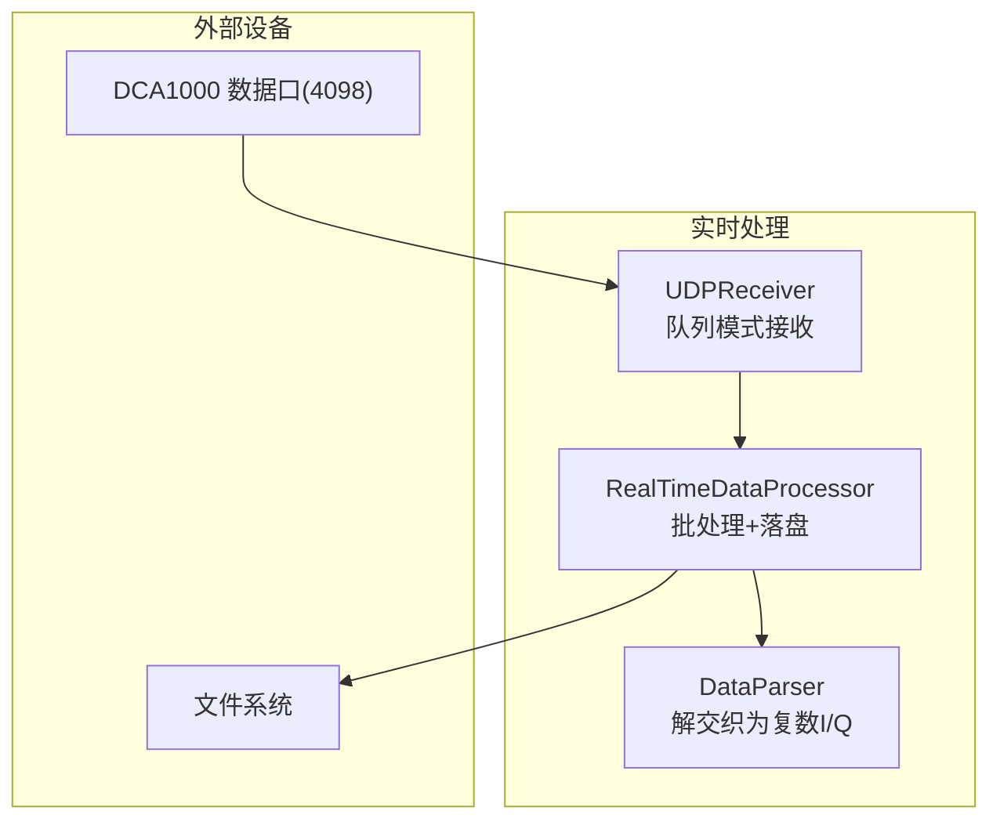
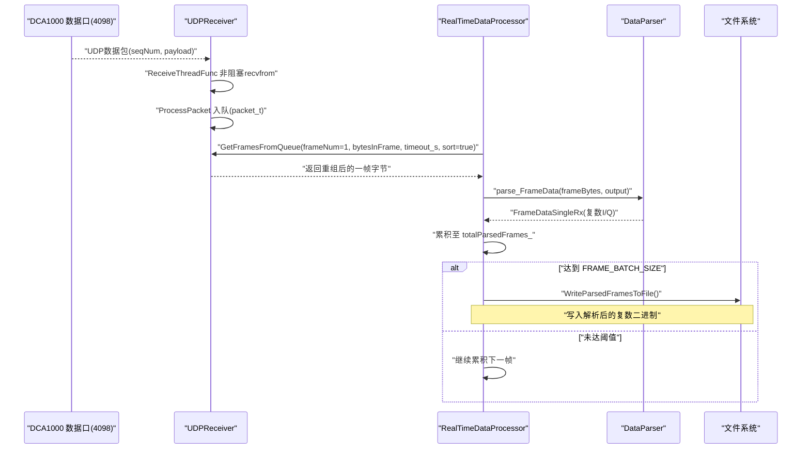
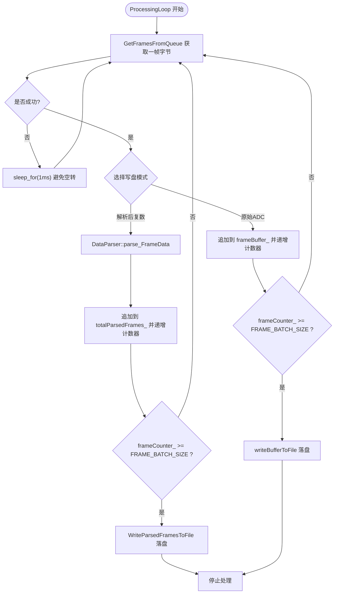
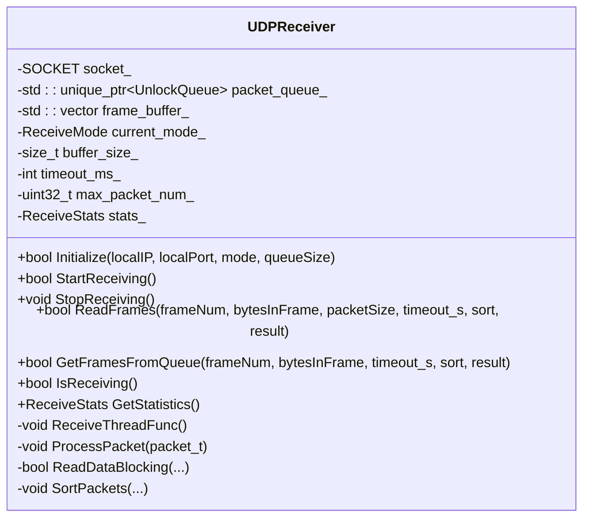
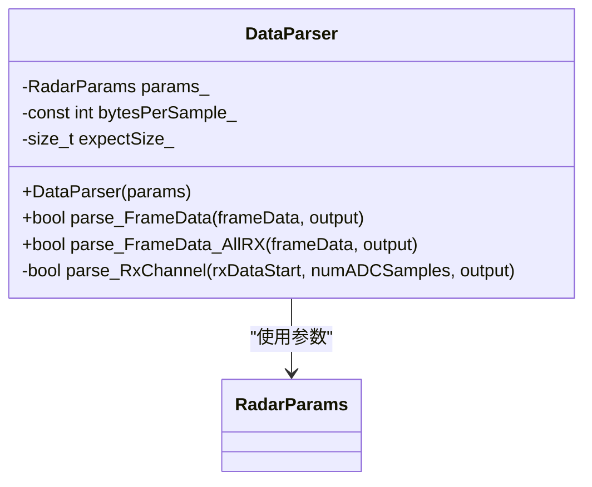
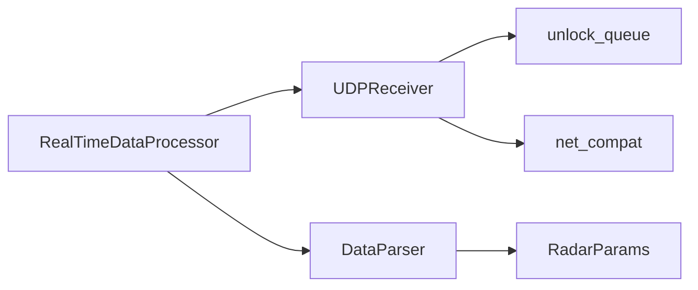

# 实时处理流水线与数据流

<cite>
**本文引用的文件**   
- [RealTimeProcessor.h](file://awr1843_dca1000_read/RealTimeProcessor.h)
- [UdpReceiver.h](file://awr1843_dca1000_read/UdpReceiver.h)
- [UdpReceiver.cpp](file://awr1843_dca1000_read/UdpReceiver.cpp)
- [DataParser.h](file://awr1843_dca1000_read/DataParser.h)
- [DataParser.cpp](file://awr1843_dca1000_read/DataParser.cpp)
- [awr1843_dca1000_read.cpp](file://awr1843_dca1000_read/awr1843_dca1000_read.cpp)
</cite>

## 目录
1. [简介](#简介)
2. [项目结构](#项目结构)
3. [核心组件](#核心组件)
4. [架构总览](#架构总览)
5. [详细组件分析](#详细组件分析)
6. [依赖关系分析](#依赖关系分析)
7. [性能考量](#性能考量)
8. [故障排查指南](#故障排查指南)
9. [结论](#结论)

## 简介
本文件聚焦于实时采集链路：由 UDPReceiver 接收 DCA1000 数据口（4098）的原始字节，经 RealTimeDataProcessor 以 FRAME_BATCH_SIZE 批量累积后落盘；支持两种写盘模式：
- 解析后复数 I/Q 落盘（默认路径）
- 原始 ADC 字节流落盘（可选路径）

同时给出端到端数据流时序，帮助读者理解从网络到磁盘的完整流程。

## 项目结构
与实时链路直接相关的源文件如下：
- 实时处理器：RealTimeProcessor.h
- 数据接收层：UdpReceiver.h/.cpp
- 数据解析层：DataParser.h/.cpp
- 主程序入口（含实时分支）：awr1843_dca1000_read.cpp

图表来源
- [RealTimeProcessor.h:11-184](file://awr1843_dca1000_read/RealTimeProcessor.h#L11-L184)
- [UdpReceiver.h:34-114](file://awr1843_dca1000_read/UdpReceiver.h#L34-L114)
- [DataParser.h:16-41](file://awr1843_dca1000_read/DataParser.h#L16-L41)

章节来源
- [RealTimeProcessor.h:11-184](file://awr1843_dca1000_read/RealTimeProcessor.h#L11-L184)
- [UdpReceiver.h:34-114](file://awr1843_dca1000_read/UdpReceiver.h#L34-L114)
- [DataParser.h:16-41](file://awr1843_dca1000_read/DataParser.h#L16-L41)
- [awr1843_dca1000_read.cpp:54-142](file://awr1843_dca1000_read/awr1843_dca1000_read.cpp#L54-L142)

## 核心组件
- RealTimeDataProcessor
  - 职责：串联 UDPReceiver 与 DataParser，按帧累积并批量落盘；提供两种写盘模式。
  - 关键成员：FRAME_BATCH_SIZE、frameCounter_、frameBuffer_、bytesPerFrame_、totalParsedFrames_。
  - 关键方法：Start()、StopProcessing()、ProcessingLoop()、WriteParsedFramesToFile()、writeBufferToFile()。
- UDPReceiver
  - 职责：跨平台 UDP 接收，支持阻塞/异步线程/队列三种模式；队列模式下内部线程收包入队，GetFramesFromQueue 负责按序列重组整帧。
  - 关键接口：Initialize()、StartReceiving()、GetFramesFromQueue()。
- DataParser
  - 职责：将一帧原始字节解交织为复数 I/Q 矩阵（单通道或全通道）。
  - 关键接口：parse_FrameData()、parse_FrameData_AllRX()。

章节来源
- [RealTimeProcessor.h:11-184](file://awr1843_dca1000_read/RealTimeProcessor.h#L11-L184)
- [UdpReceiver.h:34-114](file://awr1843_dca1000_read/UdpReceiver.h#L34-L114)
- [UdpReceiver.cpp:151-229](file://awr1843_dca1000_read/UdpReceiver.cpp#L151-L229)
- [DataParser.h:16-41](file://awr1843_dca1000_read/DataParser.h#L16-L41)
- [DataParser.cpp:20-56](file://awr1843_dca1000_read/DataParser.cpp#L20-L56)

## 架构总览
实时链路整体分为三层：
- 网络接收层：UDPReceiver 在后台线程非阻塞 recvfrom，将 packet_t 推入 UnlockQueue；GetFramesFromQueue 根据 seqNum 计算首包偏移，等待剩余包并按序拼接成完整帧。
- 处理编排层：RealTimeDataProcessor::ProcessingLoop 循环调用 GetFramesFromQueue 取出一帧，进入解析或原始累积分支，达到 FRAME_BATCH_SIZE 后触发落盘。
- 解析与落盘层：DataParser 将原始字节解交织为复数 I/Q；WriteParsedFramesToFile 写入解析后的复数二进制；writeBufferToFile 写入原始 ADC 字节流。

图表来源
- [UdpReceiver.cpp:231-283](file://awr1843_dca1000_read/UdpReceiver.cpp#L231-L283)
- [UdpReceiver.cpp:151-229](file://awr1843_dca1000_read/UdpReceiver.cpp#L151-L229)
- [RealTimeProcessor.h:82-139](file://awr1843_dca1000_read/RealTimeProcessor.h#L82-L139)
- [DataParser.cpp:20-56](file://awr1843_dca1000_read/DataParser.cpp#L20-L56)
- [RealTimeProcessor.h:162-183](file://awr1843_dca1000_read/RealTimeProcessor.h#L162-L183)

## 详细组件分析

### RealTimeDataProcessor 实时处理流水线
- 启动流程
  - Start() 初始化 UDPReceiver（队列模式，端口4098），启动接收线程，随后创建 ProcessingLoop 工作线程。
- 处理循环
  - ProcessingLoop 循环调用 GetFramesFromQueue 获取一帧字节；当前默认路径走“解析后复数”分支：
    - 调用 DataParser::parse_FrameData 得到 FrameDataSingleRx
    - 追加到 totalParsedFrames_，递增 frameCounter_
    - 当 frameCounter_ >= FRAME_BATCH_SIZE 时，调用 WriteParsedFramesToFile 落盘，并重置计数与停止标志
  - 另一条“原始ADC”分支（条件编译关闭）演示了将每帧字节追加到 frameBuffer_，达到阈值后 writeBufferToFile 落盘。
- 落盘实现
  - WriteParsedFramesToFile：遍历累积的 FrameDataSingleRx，逐采样点以 std::complex<float> 内存布局写入二进制文件。
  - writeBufferToFile：将 frameBuffer_ 中累积的原始字节一次性追加写入 bin 文件。

图表来源
- [RealTimeProcessor.h:82-139](file://awr1843_dca1000_read/RealTimeProcessor.h#L82-L139)
- [RealTimeProcessor.h:141-159](file://awr1843_dca1000_read/RealTimeProcessor.h#L141-L159)
- [RealTimeProcessor.h:162-183](file://awr1843_dca1000_read/RealTimeProcessor.h#L162-L183)

章节来源
- [RealTimeProcessor.h:38-77](file://awr1843_dca1000_read/RealTimeProcessor.h#L38-L77)
- [RealTimeProcessor.h:82-139](file://awr1843_dca1000_read/RealTimeProcessor.h#L82-L139)
- [RealTimeProcessor.h:141-183](file://awr1843_dca1000_read/RealTimeProcessor.h#L141-L183)

### UDPReceiver 数据接收与帧重组
- 初始化与启动
  - Initialize 创建 socket、设置接收缓冲区、绑定本地地址；若为 QUEUE_BASED 模式则创建 UnlockQueue。
  - StartReceiving 启动后台 ReceiveThreadFunc 进行非阻塞 recvfrom，并将 packet_t 入队。
- 帧重组
  - GetFramesFromQueue 基于 seqNum 计算首包偏移，先取一个包定位帧起始位置，再等待剩余包，最后 SortPackets 按序拼接输出整帧字节。
- 统计信息
  - 维护 receivedPacketNum、totalFrames、errorCount 等指标，便于诊断丢包与超时。

图表来源
- [UdpReceiver.h:34-114](file://awr1843_dca1000_read/UdpReceiver.h#L34-L114)
- [UdpReceiver.cpp:41-92](file://awr1843_dca1000_read/UdpReceiver.cpp#L41-L92)
- [UdpReceiver.cpp:151-229](file://awr1843_dca1000_read/UdpReceiver.cpp#L151-L229)
- [UdpReceiver.cpp:377-410](file://awr1843_dca1000_read/UdpReceiver.cpp#L377-L410)

章节来源
- [UdpReceiver.h:34-114](file://awr1843_dca1000_read/UdpReceiver.h#L34-L114)
- [UdpReceiver.cpp:231-283](file://awr1843_dca1000_read/UdpReceiver.cpp#L231-L283)
- [UdpReceiver.cpp:151-229](file://awr1843_dca1000_read/UdpReceiver.cpp#L151-L229)

### DataParser 解析逻辑
- 输入校验：期望字节数 = numChirpsEachFrame × numRX × numADCSamples × 4。
- 单通道解析 parse_FrameData：
  - 按 chirp 维度遍历，结合 rxIdx 定位对应 RX 的数据段，调用 parse_RxChannel 将 int16 I/Q 两两组合为 complex<float>。
- 全通道解析 parse_FrameData_AllRX：
  - 输出类型为 FrameDataAllRx[chirp][rx][sample]，同样复用 parse_RxChannel。
- 核心转换 parse_RxChannel：
  - 每两个相邻采样点为一组 I/Q，分别来自连续 int16 元素，构造复数。

图表来源
- [DataParser.h:16-41](file://awr1843_dca1000_read/DataParser.h#L16-L41)
- [DataParser.cpp:5-10](file://awr1843_dca1000_read/DataParser.cpp#L5-L10)
- [DataParser.cpp:20-56](file://awr1843_dca1000_read/DataParser.cpp#L20-L56)
- [DataParser.cpp:100-120](file://awr1843_dca1000_read/DataParser.cpp#L100-L120)

章节来源
- [DataParser.h:16-41](file://awr1843_dca1000_read/DataParser.h#L16-L41)
- [DataParser.cpp:20-56](file://awr1843_dca1000_read/DataParser.cpp#L20-L56)
- [DataParser.cpp:100-120](file://awr1843_dca1000_read/DataParser.cpp#L100-L120)

### 主程序与实时分支
- 实时分支（#if 0 块）展示了完整的控制与采集流程：
  - 通过 UDPController 配置 DCA1000（复位、系统连接、FPGA 配置、数据包配置、开始录制）
  - 通过 AWR1843Controller 启动传感器
  - 创建 RealTimeDataProcessor，设置文件路径与每帧字节数，Start() 启动处理
  - 用户按键后 StopProcessing()，停止录制并关闭设备
- 注意：当前默认 main 为离线解析分支（#if 1），实时分支需切换宏启用。

章节来源
- [awr1843_dca1000_read.cpp:54-142](file://awr1843_dca1000_read/awr1843_dca1000_read.cpp#L54-L142)

## 依赖关系分析
- RealTimeDataProcessor 依赖：
  - UDPReceiver：用于获取重组后的整帧字节
  - DataParser：用于将字节解析为复数 I/Q
  - 标准库：thread、atomic、mutex、fstream、iostream、complex
- UDPReceiver 依赖：
  - net_compat：跨平台 socket 封装
  - unlock_queue：无锁队列
  - 标准库：thread、condition_variable、mutex、memory、vector
- DataParser 依赖：
  - RadarParams：雷达配置参数
  - 标准库：vector、cstdint、complex、mutex、iostream、shared_mutex

图表来源
- [RealTimeProcessor.h:1-10](file://awr1843_dca1000_read/RealTimeProcessor.h#L1-L10)
- [UdpReceiver.h:1-11](file://awr1843_dca1000_read/UdpReceiver.h#L1-L11)
- [DataParser.h:1-10](file://awr1843_dca1000_read/DataParser.h#L1-L10)

章节来源
- [RealTimeProcessor.h:1-10](file://awr1843_dca1000_read/RealTimeProcessor.h#L1-L10)
- [UdpReceiver.h:1-11](file://awr1843_dca1000_read/UdpReceiver.h#L1-L11)
- [DataParser.h:1-10](file://awr1843_dca1000_read/DataParser.h#L1-L10)

## 性能考量
- 网络接收
  - 非阻塞 recvfrom + 条件变量通知，避免忙等；合理设置 SO_RCVBUF 提升吞吐。
- 帧重组
  - 基于 seqNum 的排序与拼接，SortPackets 使用 memcpy 批量拷贝，减少逐字节开销。
- 解析
  - 预分配输出容器，避免运行时多次分配；按 int16 指针访问，降低越界与额外拷贝风险。
- 落盘
  - 批量累积后一次写入，减少系统调用次数；解析后复数落盘采用复杂数内存布局直写，高效。
- 并发
  - 文件写入加互斥锁，保证多帧写入一致性；处理线程与接收线程分离，降低耦合。

[本节为通用指导，不直接分析具体文件]

## 故障排查指南
- 无法收到数据
  - 检查 UDPReceiver::Initialize 绑定端口是否为 4098，以及防火墙/路由策略。
  - 查看 GetFramesFromQueue 的超时与 incomplete frame 日志，确认 seqNum 连续性。
- 帧大小不符
  - DataParser 会校验期望字节数，若不一致请核对 bytesPerFrame_ 与雷达配置（numRX×numChirps×numSamples×4）。
- 解析结果为空或异常
  - 确认 rxIdx 与 numRX 匹配；确保 parse_RxChannel 的 numADCSamples 为偶数。
- 文件写入失败
  - 检查文件路径权限与磁盘空间；关注 WriteParsedFramesToFile/writeBufferToFile 的错误输出。
- 资源泄漏
  - 确保 StopProcessing 正确调用 receiver_.StopReceiving() 并 join 处理线程；析构函数会清理 socket 与网络栈。

章节来源
- [UdpReceiver.cpp:151-229](file://awr1843_dca1000_read/UdpReceiver.cpp#L151-L229)
- [DataParser.cpp:20-56](file://awr1843_dca1000_read/DataParser.cpp#L20-L56)
- [RealTimeProcessor.h:141-183](file://awr1843_dca1000_read/RealTimeProcessor.h#L141-L183)

## 结论
RealTimeDataProcessor 作为实时链路的核心编排器，将 UDPReceiver 的网络接收能力与 DataParser 的解析能力串联起来，并以 FRAME_BATCH_SIZE 为单位批量落盘，既支持解析后的复数 I/Q 高效存储，也保留原始 ADC 字节流的灵活回放能力。配合 UDPReceiver 的队列化接收与帧重组机制，该流水线具备高吞吐、低延迟与可观测性，适合在 TI AWR1843 + DCA1000 平台上进行大规模数据采集与分析。