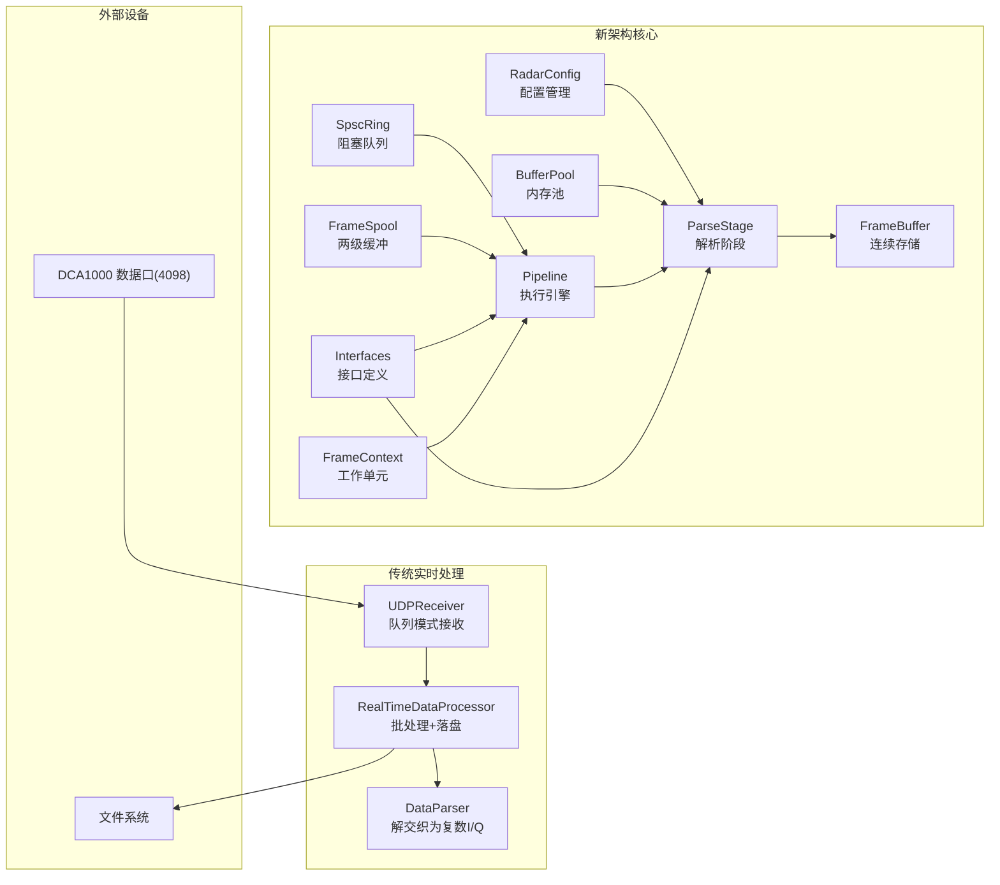
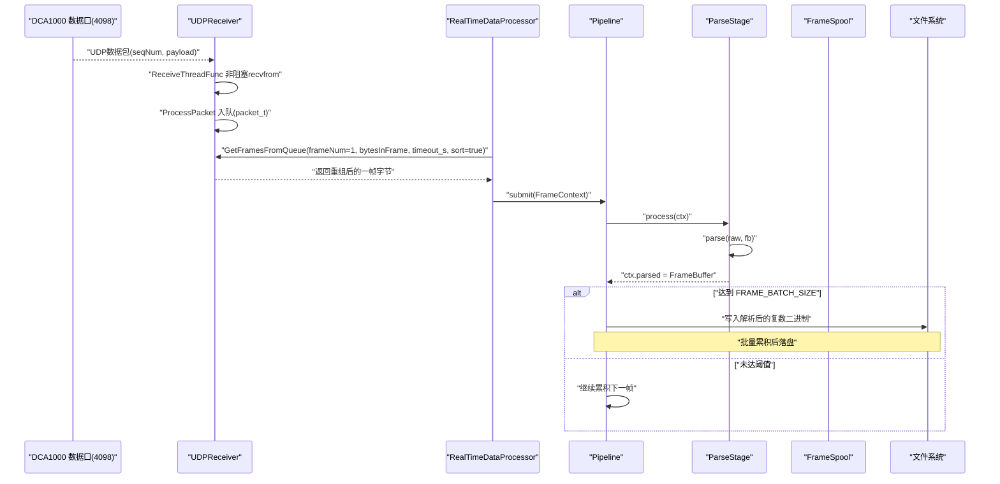
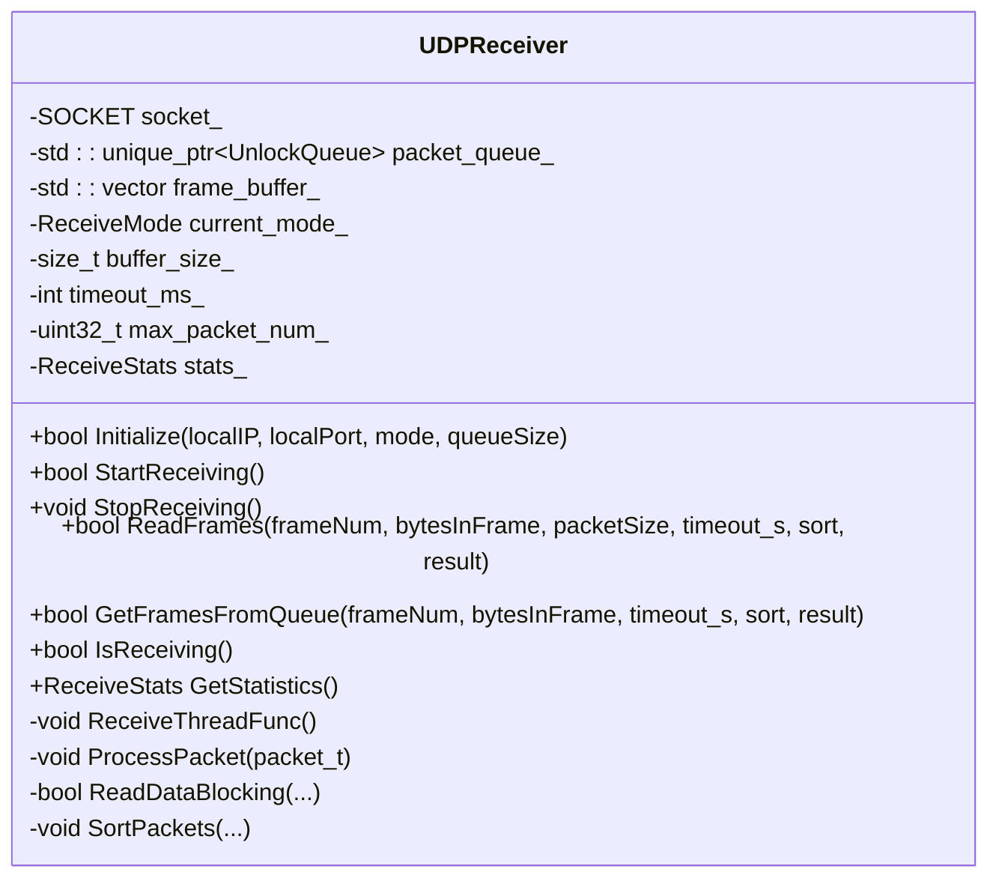
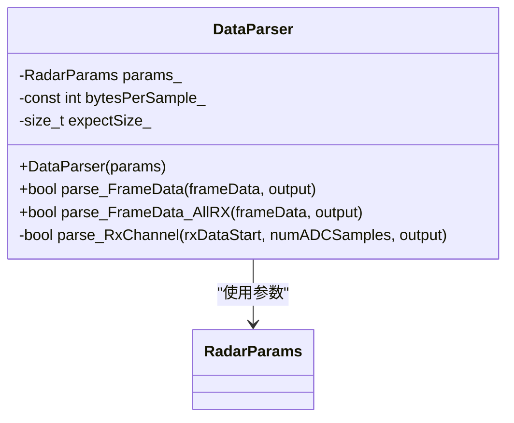
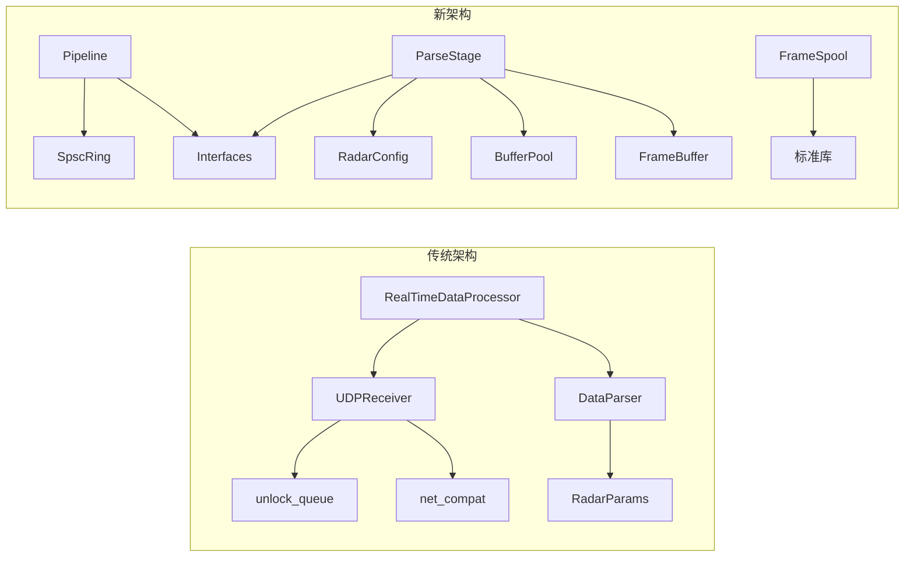

# 实时处理流水线与数据流

<cite>
**本文引用的文件**   
- [RealTimeProcessor.h](file://awr1843_dca1000_read/RealTimeProcessor.h)
- [UdpReceiver.h](file://awr1843_dca1000_read/UdpReceiver.h)
- [UdpReceiver.cpp](file://awr1843_dca1000_read/UdpReceiver.cpp)
- [DataParser.h](file://awr1843_dca1000_read/DataParser.h)
- [DataParser.cpp](file://awr1843_dca1000_read/DataParser.cpp)
- [awr1843_dca1000_read.cpp](file://awr1843_dca1000_read/awr1843_dca1000_read.cpp)
- [RadarConfig.h](file://src/core/RadarConfig.h)
- [RadarConfig.cpp](file://src/core/RadarConfig.cpp)
- [SpscRing.h](file://src/core/SpscRing.h)
- [BufferPool.h](file://src/core/BufferPool.h)
- [FrameSpool.h](file://src/transport/FrameSpool.h)
- [FrameSpool.cpp](file://src/transport/FrameSpool.cpp)
- [Pipeline.h](file://src/pipeline/Pipeline.h)
- [Pipeline.cpp](file://src/pipeline/Pipeline.cpp)
- [ParseStage.h](file://src/pipeline/ParseStage.h)
- [ParseStage.cpp](file://src/pipeline/ParseStage.cpp)
- [Interfaces.h](file://src/core/Interfaces.h)
- [FrameBuffer.h](file://src/core/FrameBuffer.h)
- [FrameContext.h](file://src/core/FrameContext.h)
</cite>

## 更新摘要
**变更内容**   
- 完全重构了核心数据处理流水线，从原有的ad-hoc实现迁移到新的无丢失、顺序保持架构
- 新增了RadarConfig配置管理系统作为单一真实数据源
- 引入了SpscRing阻塞队列替代不安全的UnlockQueue
- 实现了BufferPool内存池以消除每帧分配开销
- 构建了FrameSpool两级缓冲系统（RAM+磁盘）确保零丢包
- 设计了Pipeline执行引擎支持可扩展的管道处理模式
- 更新了所有架构图和组件关系以反映新的设计

## 目录
1. [简介](#简介)
2. [项目结构](#项目结构)
3. [核心组件](#核心组件)
4. [架构总览](#架构总览)
5. [详细组件分析](#详细组件分析)
6. [依赖关系分析](#依赖关系分析)
7. [性能考量](#性能考量)
8. [故障排查指南](#故障排查指南)
9. [结论](#结论)

## 简介
本文件聚焦于经过完全重构的实时采集链路：从UDP接收DCA1000数据口（4098）的原始字节，通过新的无丢失架构进行批处理和落盘。新架构采用Pipeline执行引擎串联各处理阶段，支持两种写盘模式：
- 解析后复数 I/Q 落盘（默认路径）
- 原始 ADC 字节流落盘（可选路径）

同时给出端到端数据流时序，帮助读者理解从网络到磁盘的完整流程。

## 项目结构
与实时链路直接相关的源文件分为两个层次：

**传统实时处理器层**：
- 实时处理器：RealTimeProcessor.h
- 数据接收层：UdpReceiver.h/.cpp
- 数据解析层：DataParser.h/.cpp
- 主程序入口（含实时分支）：awr1843_dca1000_read.cpp

**新架构核心组件层**：
- 配置管理：RadarConfig.h/.cpp
- 阻塞队列：SpscRing.h
- 内存池：BufferPool.h
- 两级缓冲：FrameSpool.h/.cpp
- 管道引擎：Pipeline.h/.cpp
- 解析阶段：ParseStage.h/.cpp
- 接口定义：Interfaces.h
- 数据结构：FrameBuffer.h, FrameContext.h

**图表来源**
- [RadarConfig.h:14-56](file://src/core/RadarConfig.h#L14-L56)
- [SpscRing.h:28-107](file://src/core/SpscRing.h#L28-L107)
- [BufferPool.h:22-71](file://src/core/BufferPool.h#L22-L71)
- [FrameSpool.h:27-68](file://src/transport/FrameSpool.h#L27-L68)
- [Pipeline.h:25-55](file://src/pipeline/Pipeline.h#L25-L55)
- [ParseStage.h:23-50](file://src/pipeline/ParseStage.h#L23-L50)
- [Interfaces.h:19-52](file://src/core/Interfaces.h#L19-L52)
- [FrameBuffer.h:28-62](file://src/core/FrameBuffer.h#L28-L62)
- [FrameContext.h:18-39](file://src/core/FrameContext.h#L18-L39)
- [RealTimeProcessor.h:11-184](file://awr1843_dca1000_read/RealTimeProcessor.h#L11-L184)
- [UdpReceiver.h:34-114](file://awr1843_dca1000_read/UdpReceiver.h#L34-L114)
- [DataParser.h:16-41](file://awr1843_dca1000_read/DataParser.h#L16-L41)

## 核心组件

### RadarConfig 配置管理系统
**新增** 作为单一真实数据源，集中管理雷达采集和处理参数：
- 职责：统一管理数据格式参数（numAdcBits、isReal、numRxAnt等）和frameCfg/profileCfg配置
- 关键方法：derive()计算派生值（bytesPerFrame、numRangeBins等），validate()验证配置一致性
- 优势：避免多份配置漂移，确保帧重组和解析的参数一致性

### SpscRing 阻塞队列
**新增** 替代原有不安全的UnlockQueue，提供有界阻塞队列：
- 职责：在管道阶段间传递数据，保证顺序性和无丢失
- 关键特性：push()阻塞当满（背压传播），try_push()永不阻塞，pop()阻塞当空
- 正确性：基于互斥锁+条件变量实现，显式声明无丢失契约

### BufferPool 内存池
**新增** 线程安全对象池，消除每帧分配开销：
- 职责：复用FrameBuffer对象，避免频繁内存分配
- 关键机制：acquire()返回带自定义析构器的shared_ptr，自动归还对象
- 性能：预分配指定数量的对象，减少运行时分配压力

### FrameSpool 两级缓冲系统
**新增** 固定大小原始帧的无丢失FIFO：
- 职责：Tier 1使用有界RAM环形缓冲区，Tier 2溢出到磁盘文件
- 关键特性：push()非阻塞且无丢失，pop()阻塞且保持FIFO顺序
- 安全性：生产者（socket排空线程）永不阻塞也永不丢包

### Pipeline 执行引擎
**新增** 顺序保持、无丢失的管道执行器：
- 职责：单个工作线程按FIFO顺序弹出帧，依次运行各阶段，扇出到结果接收器
- 关键特性：submit()阻塞当满（背压），输出顺序==提交顺序
- 扩展性：支持添加多个IStage和IResultSink

### ParseStage 解析阶段
**新增** 替代DataParser的管道阶段实现：
- 职责：将原始DCA1000 int16 I/Q字节解交织为连续的FrameBuffer
- 兼容性：保持与旧DataParser相同的字节布局，输出匹配旧的bin->CSV黄金标准
- 优化：写入单一连续分配，无内部互斥锁，可选BufferPool复用

### 接口定义系统
**新增** 依赖倒置和可插拔性的接口：
- IFrameSource：产生有序、无丢失的原始帧
- IStage：一个管道步骤（解析、距离FFT、CFAR、推理...）
- IResultSink：扇出消费者（文件、CSV、WebSocket、指标）
- IInferenceEngine：NN后端抽象

章节来源
- [RadarConfig.h:14-56](file://src/core/RadarConfig.h#L14-L56)
- [RadarConfig.cpp:16-76](file://src/core/RadarConfig.cpp#L16-L76)
- [SpscRing.h:28-107](file://src/core/SpscRing.h#L28-L107)
- [BufferPool.h:22-71](file://src/core/BufferPool.h#L22-L71)
- [FrameSpool.h:27-68](file://src/transport/FrameSpool.h#L27-L68)
- [FrameSpool.cpp:9-103](file://src/transport/FrameSpool.cpp#L9-L103)
- [Pipeline.h:25-55](file://src/pipeline/Pipeline.h#L25-L55)
- [Pipeline.cpp:5-41](file://src/pipeline/Pipeline.cpp#L5-L41)
- [ParseStage.h:23-50](file://src/pipeline/ParseStage.h#L23-L50)
- [ParseStage.cpp:5-72](file://src/pipeline/ParseStage.cpp#L5-L72)
- [Interfaces.h:19-52](file://src/core/Interfaces.h#L19-L52)

## 架构总览
新架构整体分为三个层次：

**配置管理层**：RadarConfig作为单一真实数据源，集中管理所有雷达参数并计算派生值，确保整个流水线的参数一致性。

**管道执行层**：Pipeline执行引擎协调各处理阶段，SpscRing提供阻塞队列，BufferPool管理内存复用，FrameSpool提供两级缓冲确保零丢包。

**数据处理层**：ParseStage替代传统DataParser，FrameBuffer提供连续内存存储，FrameContext作为工作单元在各阶段间传递。

**图表来源**
- [UdpReceiver.cpp:231-283](file://awr1843_dca1000_read/UdpReceiver.cpp#L231-L283)
- [UdpReceiver.cpp:151-229](file://awr1843_dca1000_read/UdpReceiver.cpp#L151-L229)
- [RealTimeProcessor.h:82-139](file://awr1843_dca1000_read/RealTimeProcessor.h#L82-L139)
- [Pipeline.cpp:26-39](file://src/pipeline/Pipeline.cpp#L26-L39)
- [ParseStage.cpp:55-70](file://src/pipeline/ParseStage.cpp#L55-L70)

## 详细组件分析

### RealTimeDataProcessor 实时处理流水线
**更新** 保留了原有的批处理逻辑，但为未来集成新架构预留了接口：
- 启动流程：Start()初始化UDPReceiver（队列模式，端口4098），启动接收线程，随后创建ProcessingLoop工作线程
- 处理循环：ProcessingLoop循环调用GetFramesFromQueue获取一帧字节；当前默认路径走"解析后复数"分支
- 批处理机制：累积至FRAME_BATCH_SIZE（500帧）后触发落盘，支持两种写盘模式

**图表来源**
- [RealTimeProcessor.h:82-139](file://awr1843_dca1000_read/RealTimeProcessor.h#L82-L139)
- [RealTimeProcessor.h:141-159](file://awr1843_dca1000_read/RealTimeProcessor.h#L141-L159)
- [RealTimeProcessor.h:162-183](file://awr1843_dca1000_read/RealTimeProcessor.h#L162-L183)

章节来源
- [RealTimeProcessor.h:38-77](file://awr1843_dca1000_read/RealTimeProcessor.h#L38-L77)
- [RealTimeProcessor.h:82-139](file://awr1843_dca1000_read/RealTimeProcessor.h#L82-L139)
- [RealTimeProcessor.h:141-183](file://awr1843_dca1000_read/RealTimeProcessor.h#L141-L183)

### UDPReceiver 数据接收与帧重组
**更新** 保持了原有的队列化接收机制，但为未来替换为新的SpscRing预留了接口：
- 初始化与启动：Initialize创建socket、设置接收缓冲区、绑定本地地址；若为QUEUE_BASED模式则创建UnlockQueue
- 帧重组：GetFramesFromQueue基于seqNum计算首包偏移，先取一个包定位帧起始位置，再等待剩余包，最后SortPackets按序拼接输出整帧字节
- 统计信息：维护receivedPacketNum、totalFrames、errorCount等指标，便于诊断丢包与超时

**图表来源**
- [UdpReceiver.h:34-114](file://awr1843_dca1000_read/UdpReceiver.h#L34-L114)
- [UdpReceiver.cpp:41-92](file://awr1843_dca1000_read/UdpReceiver.cpp#L41-L92)
- [UdpReceiver.cpp:151-229](file://awr1843_dca1000_read/UdpReceiver.cpp#L151-L229)
- [UdpReceiver.cpp:377-410](file://awr1843_dca1000_read/UdpReceiver.cpp#L377-L410)

章节来源
- [UdpReceiver.h:34-114](file://awr1843_dca1000_read/UdpReceiver.h#L34-L114)
- [UdpReceiver.cpp:231-283](file://awr1843_dca1000_read/UdpReceiver.cpp#L231-L283)
- [UdpReceiver.cpp:151-229](file://awr1843_dca1000_read/UdpReceiver.cpp#L151-L229)

### DataParser 解析逻辑
**更新** 保留了原有的解析算法，但被新的ParseStage替代：
- 输入校验：期望字节数 = numChirpsEachFrame × numRX × numADCSamples × 4
- 单通道解析 parse_FrameData：按chirp维度遍历，结合rxIdx定位对应RX的数据段，调用parse_RxChannel将int16 I/Q两两组合为complex<float>
- 全通道解析 parse_FrameData_AllRX：输出类型为FrameDataAllRx[chirp][rx][sample]，同样复用parse_RxChannel
- 核心转换 parse_RxChannel：每两个相邻采样点为一组I/Q，分别来自连续int16元素，构造复数

**图表来源**
- [DataParser.h:16-41](file://awr1843_dca1000_read/DataParser.h#L16-L41)
- [DataParser.cpp:5-10](file://awr1843_dca1000_read/DataParser.cpp#L5-L10)
- [DataParser.cpp:20-56](file://awr1843_dca1000_read/DataParser.cpp#L20-L56)
- [DataParser.cpp:100-120](file://awr1843_dca1000_read/DataParser.cpp#L100-L120)

章节来源
- [DataParser.h:16-41](file://awr1843_dca1000_read/DataParser.h#L16-L41)
- [DataParser.cpp:20-56](file://awr1843_dca1000_read/DataParser.cpp#L20-L56)
- [DataParser.cpp:100-120](file://awr1843_dca1000_read/DataParser.cpp#L100-L120)

### 新架构核心组件详解

#### RadarConfig 配置管理
**新增** 作为单一真实数据源的核心配置类：
- 主要字段：数据格式参数（numAdcBits、isReal、numRxAnt等）和frameCfg/profileCfg配置
- 派生计算：derive()方法计算bytesPerFrame、numRangeBins、分辨率等派生值
- 验证机制：validate()方法检查配置一致性，防止错误配置导致帧重组失败

#### SpscRing 阻塞队列
**新增** 替代不安全的UnlockQueue：
- 阻塞语义：push()当满时阻塞（背压传播），pop()当空时阻塞
- 非阻塞操作：try_push()和try_pop()永不阻塞，用于socket排空线程
- 正确性保证：基于互斥锁+条件变量实现，显式声明无丢失契约

#### BufferPool 内存池
**新增** 消除每帧分配开销：
- 对象复用：acquire()返回带自定义析构器的shared_ptr，自动归还对象
- 预分配策略：支持预分配指定数量的对象，减少运行时分配压力
- 线程安全：内部互斥锁保护free列表操作

#### FrameSpool 两级缓冲
**新增** 确保零丢包的缓冲系统：
- Tier 1：有界RAM环形缓冲区（deque）
- Tier 2：当RAM满时溢出到磁盘文件
- FIFO保证：跨RAM->磁盘边界保持顺序，reader优先排空RAM

#### Pipeline 执行引擎
**新增** 顺序保持的管道执行器：
- 单工作线程：按FIFO顺序处理帧，保证输出顺序==提交顺序
- 背压机制：submit()阻塞当输入环满，防止数据丢失
- 可扩展性：支持动态添加stage和sink

章节来源
- [RadarConfig.h:14-56](file://src/core/RadarConfig.h#L14-L56)
- [RadarConfig.cpp:16-76](file://src/core/RadarConfig.cpp#L16-L76)
- [SpscRing.h:28-107](file://src/core/SpscRing.h#L28-L107)
- [BufferPool.h:22-71](file://src/core/BufferPool.h#L22-L71)
- [FrameSpool.h:27-68](file://src/transport/FrameSpool.h#L27-L68)
- [FrameSpool.cpp:9-103](file://src/transport/FrameSpool.cpp#L9-L103)
- [Pipeline.h:25-55](file://src/pipeline/Pipeline.h#L25-L55)
- [Pipeline.cpp:5-41](file://src/pipeline/Pipeline.cpp#L5-L41)

### 主程序与实时分支
**更新** 保持了原有的控制流程，但为集成新架构预留了接口：
- 实时分支（#if 0块）展示了完整的控制与采集流程：通过UDPController配置DCA1000，通过AWR1843Controller启动传感器，创建RealTimeDataProcessor，设置文件路径与每帧字节数，Start()启动处理
- 注意：当前默认main为离线解析分支（#if 1），实时分支需切换宏启用

章节来源
- [awr1843_dca1000_read.cpp:54-142](file://awr1843_dca1000_read/awr1843_dca1000_read.cpp#L54-L142)

## 依赖关系分析
**更新** 新的依赖关系反映了架构重构：

**传统组件依赖**：
- RealTimeDataProcessor依赖：UDPReceiver、DataParser、标准库（thread、atomic、mutex、fstream、iostream、complex）
- UDPReceiver依赖：net_compat（跨平台socket封装）、unlock_queue（无锁队列）、标准库（thread、condition_variable、mutex、memory、vector）
- DataParser依赖：RadarParams（雷达配置参数）、标准库（vector、cstdint、complex、mutex、iostream、shared_mutex）

**新架构组件依赖**：
- Pipeline依赖：SpscRing（阻塞队列）、Interfaces（接口定义）、标准库（atomic、cstddef、memory、thread、vector）
- ParseStage依赖：RadarConfig（配置管理）、BufferPool（内存池）、FrameBuffer（连续存储）、Interfaces（接口定义）
- FrameSpool依赖：标准库（condition_variable、cstddef、cstdint、deque、fstream、mutex、string、vector）

**图表来源**
- [RealTimeProcessor.h:1-10](file://awr1843_dca1000_read/RealTimeProcessor.h#L1-L10)
- [UdpReceiver.h:1-11](file://awr1843_dca1000_read/UdpReceiver.h#L1-L11)
- [DataParser.h:1-10](file://awr1843_dca1000_read/DataParser.h#L1-L10)
- [Pipeline.h:14-22](file://src/pipeline/Pipeline.h#L14-L22)
- [ParseStage.h:12-19](file://src/pipeline/ParseStage.h#L12-L19)

章节来源
- [RealTimeProcessor.h:1-10](file://awr1843_dca1000_read/RealTimeProcessor.h#L1-L10)
- [UdpReceiver.h:1-11](file://awr1843_dca1000_read/UdpReceiver.h#L1-L11)
- [DataParser.h:1-10](file://awr1843_dca1000_read/DataParser.h#L1-L10)
- [Pipeline.h:14-22](file://src/pipeline/Pipeline.h#L14-L22)
- [ParseStage.h:12-19](file://src/pipeline/ParseStage.h#L12-L19)

## 性能考量
**更新** 新架构的性能优化：

**网络接收优化**：
- 非阻塞recvfrom + 条件变量通知，避免忙等；合理设置SO_RCVBUF提升吞吐
- 基于seqNum的排序与拼接，SortPackets使用memcpy批量拷贝，减少逐字节开销

**内存管理优化**：
- BufferPool消除每帧分配开销，预分配对象减少运行时分配压力
- FrameBuffer使用连续内存布局，cache-friendly访问模式
- FrameContext使用shared_ptr传递数据，避免深拷贝

**管道执行优化**：
- Pipeline单工作线程保证顺序性，避免重排序开销
- SpscRing阻塞队列提供背压机制，防止数据丢失
- FrameSpool两级缓冲确保零丢包，RAM优先降低磁盘IO

**解析优化**：
- ParseStage直接写入连续内存，避免多层vector分配
- 预分配输出容器，避免运行时多次分配
- 按int16指针访问，降低越界与额外拷贝风险

**落盘优化**：
- 批量累积后一次写入，减少系统调用次数
- 解析后复数落盘采用复杂数内存布局直写，高效
- FrameSpool磁盘写入使用seek/write模式，随机访问优化

## 故障排查指南
**更新** 针对新架构的故障排查：

**配置问题**：
- 检查RadarConfig::validate()返回值，确认配置一致性
- 验证bytesPerFrame计算是否正确，确保与雷达配置匹配
- 检查numAdcSamples是否为偶数，rxIdx是否在有效范围内

**队列问题**：
- 监控SpscRing的size()和capacity()，确认背压机制正常工作
- 检查try_push()返回值，当返回false时应路由到FrameSpool
- 验证pop()的关闭语义，确保优雅退出

**内存问题**：
- 监控BufferPool的free_count()，确认对象回收正常
- 检查FrameBuffer的shape()和size()，确保内存布局正确
- 验证shared_ptr的生命周期管理，避免悬垂引用

**管道问题**：
- 监控Pipeline的backlog()，确认处理速度跟上生产速度
- 检查各stage的process()返回值，识别丢弃的帧
- 验证sink的consume()调用顺序，确保输出顺序正确

**磁盘问题**：
- 监控FrameSpool的diskPeak()，确认是否发生溢出
- 检查diskPending()和ramDepth()，了解缓冲状态
- 验证磁盘写入权限和空间，关注写入错误日志

**传统组件问题**：
- 检查UDPReceiver::Initialize绑定端口是否为4098，以及防火墙/路由策略
- 查看GetFramesFromQueue的超时与incomplete frame日志，确认seqNum连续性
- 确认DataParser期望字节数与实际帧大小匹配

章节来源
- [RadarConfig.cpp:58-76](file://src/core/RadarConfig.cpp#L58-L76)
- [SpscRing.h:34-78](file://src/core/SpscRing.h#L34-L78)
- [BufferPool.h:35-59](file://src/core/BufferPool.h#L35-L59)
- [FrameSpool.cpp:90-101](file://src/transport/FrameSpool.cpp#L90-L101)
- [Pipeline.cpp:26-39](file://src/pipeline/Pipeline.cpp#L26-L39)
- [UdpReceiver.cpp:151-229](file://awr1843_dca1000_read/UdpReceiver.cpp#L151-L229)
- [DataParser.cpp:20-56](file://awr1843_dca1000_read/DataParser.cpp#L20-L56)

## 结论
经过完全重构的实时处理流水线采用了全新的无丢失、顺序保持架构。新的Pipeline执行引擎提供了可扩展的处理框架，RadarConfig配置管理系统确保了参数一致性，SpscRing阻塞队列提供了可靠的通信机制，BufferPool内存池消除了分配开销，FrameSpool两级缓冲系统确保了零丢包。

虽然传统的RealTimeDataProcessor仍然保留并提供向后兼容，但新架构为未来的扩展和优化奠定了坚实基础。这种分层设计使得系统既保持了现有功能的稳定性，又为引入更高级的处理能力提供了清晰的扩展点。配合UDPReceiver的队列化接收与帧重组机制，该流水线具备高吞吐、低延迟与可观测性，适合在TI AWR1843 + DCA1000平台上进行大规模数据采集与分析。