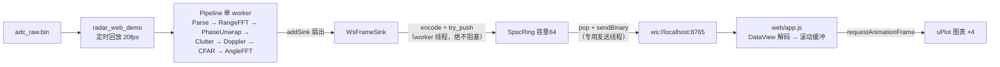

# 实时显示扩展开发指南

<cite>
**本文引用的文件**
- [WireProtocol.h](file://src/web/WireProtocol.h)
- [WsFrameSink.h](file://src/web/WsFrameSink.h)
- [WsFrameSink.cpp](file://src/web/WsFrameSink.cpp)
- [radar_web_demo.cpp](file://src/tools/radar_web_demo.cpp)
- [app.js](file://web/app.js)
- [index.html](file://web/index.html)
- [Interfaces.h](file://src/core/Interfaces.h)
- [FrameContext.h](file://src/core/FrameContext.h)
- [Pipeline.h](file://src/pipeline/Pipeline.h)
- [SpscRing.h](file://src/core/SpscRing.h)
- [test_web.cpp](file://src/tests/test_web.cpp)
- [CMakeLists.txt](file://CMakeLists.txt)
</cite>

## 目录
1. [引言](#引言)
2. [现有实时显示架构](#现有实时显示架构)
3. [线程模型与背压约定](#线程模型与背压约定)
4. [新增算法实时显示的五个步骤](#新增算法实时显示的五个步骤)
5. [案例：RBM 检测 + 呼吸识别的实时显示](#案例rbm-检测--呼吸识别的实时显示)
6. [协议演进规范](#协议演进规范)
7. [测试与验证清单](#测试与验证清单)
8. [常见陷阱](#常见陷阱)

## 引言
本指南面向二次开发：当你在 DSP 链中新增一个算法级（IStage）并希望它的结果实时显示在浏览器页面上时，应该改哪些文件、遵循哪些既定约定。配套案例给出"RBM（随机体动）检测 + 呼吸识别"这一具体扩展的完整落地路径（其参考算法来自论文 MATLAB 实现：TKEO 能量体动检测 + 带通呼吸提取）。

新增**算法**本身如何接入 Pipeline 见《数据处理流程扩展开发指南》；本文聚焦"算法结果 → 浏览器实时图表"这后半段通路。

## 现有实时显示架构
实时显示是挂在 Pipeline 扇出上的**显示旁路**，与数据路径（CSV/落盘）互不干扰：

各组件职责（改动时对号入座）：

| 组件 | 文件 | 职责 |
|---|---|---|
| 二进制协议 | `src/web/WireProtocol.h` | 唯一的编码点：`encodeFramePacket()`（每帧一条 binary 消息）+ `buildMetaJson()`（接入时一次性的配置元数据） |
| 推送 sink | `src/web/WsFrameSink.{h,cpp}` | IResultSink 实现；worker 侧只编码+入队，发送线程广播；丢帧计数 |
| 回放入口 | `src/tools/radar_web_demo.cpp` | 组装 Pipeline + 定时提交 + `--loop`；新算法 stage 在这里 addStage |
| 前端 | `web/app.js` + `web/index.html` | 解码、环形缓冲、图表、控制栏（连接/断开、暂停/继续、清空） |
| 单测 | `src/tests/test_web.cpp` | 协议布局回读对拍（模拟前端 DataView 读法） |

**章节来源**
- [WireProtocol.h](file://src/web/WireProtocol.h)
- [WsFrameSink.h](file://src/web/WsFrameSink.h)
- [radar_web_demo.cpp](file://src/tools/radar_web_demo.cpp)

## 线程模型与背压约定
这是本通路**不可违反**的核心约定：

1. `IResultSink::consume()` 运行在 Pipeline 的 DSP worker 线程上，其中**只允许**做序列化 + `SpscRing::try_push`。任何网络/磁盘同步 IO、任何可能阻塞的调用都会拖慢 DSP 节奏。
2. 发送队列满（客户端太慢/无人观看时积压）就**丢帧并计数**（`framesDropped()`）——显示旁路允许丢帧，数据路径的"无损"原则不适用于此。
3. 真正的 `sendBinary` 全部发生在 WsFrameSink 自有的发送线程；IXWebSocket 每连接又有内部缓冲，慢客户端不会拖累快客户端。
4. 前端侧同样解耦：`onmessage` 只写缓冲，重绘统一在 `requestAnimationFrame` 中（浏览器每帧最多一次 setData）。

**章节来源**
- [WsFrameSink.cpp](file://src/web/WsFrameSink.cpp)
- [SpscRing.h](file://src/core/SpscRing.h)
- [app.js](file://web/app.js)

## 新增算法实时显示的五个步骤

### 步骤① 算法 stage 产出写入 FrameContext
新算法以 IStage 接入（见《数据处理流程扩展开发指南》），结果写入 `FrameContext` 新字段。加字段遵循现有先例：

- **逐帧标量**（相位、呼吸率、布尔标志）：直接加 POD 字段，未产出时用 NaN/-1 哨兵值（先例：`unwrappedPhaseRad`、`phaseTrackBin`）。
- **数组/大块产物**（谱、检测列表）：用 `std::shared_ptr` 持有，产出前为空（先例：`rangeCube`、`detections`）——池化复用、级间零拷贝。

stage 插入位置由数据依赖决定：消费 `displacementMm` 的放 PhaseUnwrapStage 之后；消费未滤波 rangeCube 的放 ClutterRemovalStage 之前（同 PhaseUnwrap 的理由）。

### 步骤② 扩展 WireProtocol
所有编码集中在 `encodeFramePacket()`，改这里一处即可：

- 新增**逐帧标量** → 追加到 v1 头部之后、数组区之前，并把 `kVersion` 递增；同步更新偏移常量表（`kOffXxx`）。
- 新增**数组** → 追加到 payload 尾部，长度写进头部（参考 `nWave`/`nBins` 的模式）。
- 需要前端换算/建图的静态参数（如新算法的窗长、量纲）→ 加进 `buildMetaJson()`。
- 形状与配置漂移时返回空 vector 的守门逻辑必须保留——绝不发送与 meta 声明不符的包。

### 步骤③ WsFrameSink 通常零改动
编码函数是纯函数、集中在 WireProtocol.h，sink 只搬运字节。仅当新增**独立消息流**（如低频率的事件消息）时才需要在 senderLoop/回调中扩展。

### 步骤④ 前端解码与图表
`web/app.js` 按固定模式扩展：

1. `onFrame()`：更新 `VERSION` 常量与 DataView 偏移，解出新字段；数组用 TypedArray 切片后 `.slice()` 拷贝。
2. 时间序列 → 加一条环形缓冲（参考 `phaseBuf`）；逐帧量 → 挂到 `lastFrame`。
3. 图表 → `mkChart()` 一行注册新卡片（index.html 加对应 `
`）；事件/布尔类结果推荐叠加在已有图上（null 断线或背景色带），而不是单开一张图。
4. 徽标类读数（如呼吸率）直接更新 header 上的元素。

### 步骤⑤ 测试与验证
- `test_web.cpp`：为新字段加回读对拍断言（按偏移 memcpy 解码 == 写入值）、守门分支（未产出 → 哨兵值/空包）。
- 全链冒烟：`radar_web_demo --loop` + 浏览器确认新图表数据合理、控制台无错误、服务端丢帧计数为 0。

## 案例：RBM 检测 + 呼吸识别的实时显示
以论文 MATLAB 参考实现（`detectRBM_by_TKEO.m`、`respiratory_butterworth_filter.m` 等）为蓝本，把两个算法固化到 C++ 并实时显示。

### C++ 侧新增
**RbmDetectStage**（放 PhaseUnwrapStage 之后）：
- 输入：跟踪 bin 的幅度序列 `ctx.phaseTrackAmp`（或融合幅度）。
- 算法：TKEO 能量 `ψ[n] = x[n]² − x[n−1]·x[n+1]` → 短窗平滑 → 双阈值滞回判决（进入阈值取滑窗高分位如 0.90、退出阈值 0.60，最短持续 0.3 s、间隙合并 0.6 s——对齐 MATLAB 参数）。
- 输出：`ctx.rbmActive`（bool）、`ctx.rbmEnergy`（float）。

**BreathStage**（放 RbmDetectStage 之后）：
- 输入：`ctx.displacementMm`；RBM 段内可冻结/降权更新。
- 算法：2 阶 biquad 带通 0.1–0.5 Hz（系数公式与 `web/app.js` 的 `makeBandpass()` 一致，把显示原型下沉固化）→ `ctx.breathDispMm`；30 s 滑窗 Goertzel 扫 0.05–0.7 Hz 谱峰 → `ctx.breathRateBpm`（窗未满时 NaN）。
- 既定策略：显示原型可先放前端 JS 快速迭代；一旦呼吸率/体动要驱动下游逻辑（记录、报警、门控），必须下沉到 C++ stage，前端退化为纯显示。

### 协议 v2 布局（示例）
标量追加在 v1 头部之后（偏移 36 起），数组区顺延；`kVersion` 递增为 2：

| 偏移 | 类型 | 字段 |
|---|---|---|
| 0–35 | — | v1 头部原样（magic/version/flags/seq/相位/位移/trackBin/trackAmp/nWave/nBins） |
| 36 | u16 | rbmActive（0/1） |
| 38 | u16 | 保留（对齐） |
| 40 | f32 | rbmEnergy |
| 44 | f32 | breathDispMm |
| 48 | f32 | breathRateBpm（未收敛为 NaN） |
| 52 | i16[nWave]×2 + f32[nBins] | 原 v1 数组区顺延 |

meta JSON 增加 `"rbm":{"qHigh":0.9,"qLow":0.6}` 等前端展示所需参数。

### 前端改动
- `VERSION = 2`，`onFrame()` 解码新标量；呼吸率徽标改用服务端 `breathRateBpm`（删除前端 Goertzel），呼吸图改画 `breathDispMm`。
- RBM 显示：呼吸图上叠加红色背景带（`rbmActive` 帧区间），与质量门控的灰断区分开——语义分别是"体动污染"与"信噪不可靠"。

### 构建与测试
- 新 stage 源文件加入 `CMakeLists.txt` 的 `DSP_SRCS`；算法单测进 `test_dsp.cpp`（合成体动/呼吸信号对拍）；协议断言进 `test_web.cpp`。
- `radar_web_demo.cpp` 在 addStage 序列中插入两个新 stage 即完成接线。

**章节来源**
- [radar_web_demo.cpp](file://src/tools/radar_web_demo.cpp)
- [WireProtocol.h](file://src/web/WireProtocol.h)
- [app.js](file://web/app.js)

## 协议演进规范
- 头部含 `version` + `flags`：字段只增不改不删；标量进头部扩展区、数组进 payload 尾部并在头部声明长度。
- 前端对不识别的 `magic`/`version` **直接丢弃**该消息（已实现）——旧页面遇到新服务端安全失效，而不是画出错误数据。
- 低频事件类数据（如 RBM 起止事件列表）可选择独立消息类型（新 magic 或 type 字段）而非塞进每帧包；此时才需要动 WsFrameSink。
- 所有多字节小端；平台假设与例外处理见 WireProtocol.h 文件头注释。

## 测试与验证清单
1. `ctest`：原套件 + `radar_web_tests` 全绿；`-DRADAR_BUILD_WEB=OFF` 构建不受影响。
2. 回放节奏：日志 200 帧/10 s（20 fps），发送队列丢帧 0。
3. 浏览器：新图表实时刷新、数值物理合理（呼吸率 5–30 bpm 量级）、控制台无错误；暂停/断开/清空按钮行为正常。
4. 慢客户端韧性：DevTools 暂停 JS ≥30 s → 服务端丢帧计数增长、回放 fps 不受影响（验证 worker 零阻塞）。

## 常见陷阱
- **在 consume()/stage 里做阻塞 IO**：会直接拖慢 DSP 节奏；一切网络发送必须走发送线程。
- **有状态 stage 忽略 `--loop` 回卷**：回放回卷处相位/滤波器状态跨越不连续点（现有行为是 PhaseUnwrap 桥接吸收 ≤π 跳变）；新增有状态 stage 需明确自己的回卷语义并注释。
- **协议改了但 version 没动**：新旧前后端混用时会按错误偏移解码出"看似合理"的垃圾数据——比崩溃更难排查。
- **前端在 onmessage 里直接 setData**：20 Hz × 多图会掉帧，必须走 rAF 汇总重绘。
- **把 RBM 门控和幅度门控混为一谈**：`trackAmp` 塌陷标记的是相位不可信（相量过原点），RBM 标记的是体动污染；显示与下游处理都应区分两种语义。
