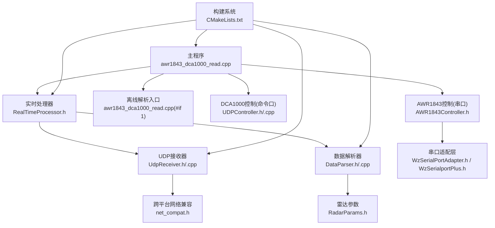
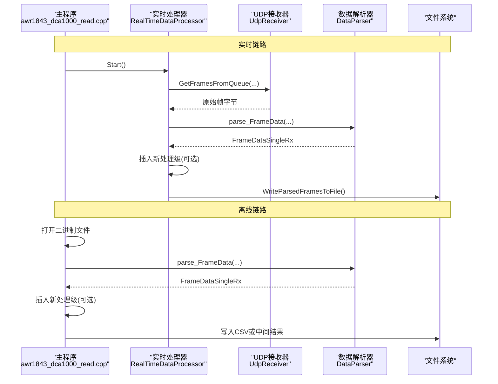
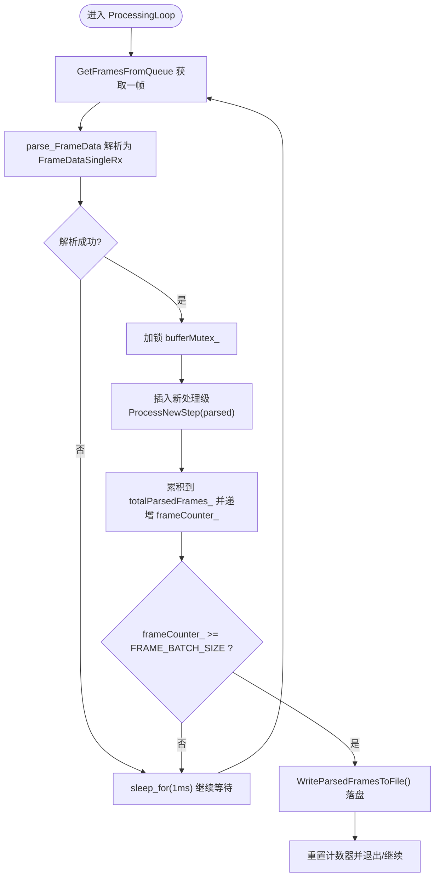
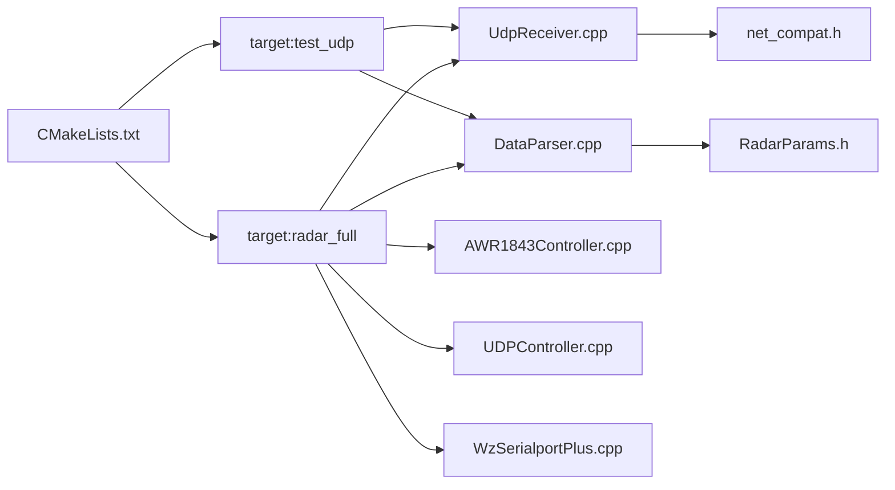

# 数据处理流程扩展开发指南

<cite>
**本文引用的文件**   
- [awr1843_dca1000_read.cpp](file://awr1843_dca1000_read/awr1843_dca1000_read.cpp)
- [RealTimeProcessor.h](file://awr1843_dca1000_read/RealTimeProcessor.h)
- [DataParser.h](file://awr1843_dca1000_read/DataParser.h)
- [DataParser.cpp](file://awr1843_dca1000_read/DataParser.cpp)
- [RadarParams.h](file://awr1843_dca1000_read/RadarParams.h)
- [Logger.h](file://awr1843_dca1000_read/Logger.h)
- [UdpReceiver.h](file://awr1843_dca1000_read/UdpReceiver.h)
- [UdpReceiver.cpp](file://awr1843_dca1000_read/UdpReceiver.cpp)
- [UDPController.h](file://awr1843_dca1000_read/UDPController.h)
- [UDPController.cpp](file://awr1843_dca1000_read/UDPController.cpp)
- [AWR1843Controller.h](file://awr1843_dca1000_read/AWR1843Controller.h)
- [WzSerialportPlus.h](file://awr1843_dca1000_read/WzSerialportPlus.h)
- [WzSerialPortAdapter.h](file://awr1843_dca1000_read/WzSerialPortAdapter.h)
- [net_compat.h](file://awr1843_dca1000_read/net_compat.h)
- [CMakeLists.txt](file://CMakeLists.txt)
</cite>

## 目录
1. [简介](#简介)
2. [项目结构](#项目结构)
3. [核心组件](#核心组件)
4. [架构总览](#架构总览)
5. [详细组件分析](#详细组件分析)
6. [依赖关系分析](#依赖关系分析)
7. [性能与并发约定](#性能与并发约定)
8. [故障排查](#故障排查)
9. [结论](#结论)
10. [附录：接入清单与检查表](#附录接入清单与检查表)

## 简介
本指南面向二次开发，聚焦“如何在现有流水线中新增算法级处理步骤（如 Range-FFT/Doppler-FFT/CFAR/点云检测）”。文档明确两条链路的接入点、统一的数据契约、配置与落盘约定、日志与线程锁使用规范，并给出可复用的流程图与时序图，帮助开发者以最小改动完成扩展。

## 项目结构
仓库采用单目录组织，核心模块均位于 awr1843_dca1000_read 下；顶层 CMakeLists.txt 定义两个目标：
- test_udp：仅网络链路测试（不含串口），用于回放泵验证 UDP→重组→解析
- radar_full：完整程序（含串口控制链路与实时处理）

图表来源
- [CMakeLists.txt:25-47](file://CMakeLists.txt#L25-L47)
- [awr1843_dca1000_read.cpp:145-212](file://awr1843_dca1000_read/awr1843_dca1000_read.cpp#L145-L212)
- [RealTimeProcessor.h:10-188](file://awr1843_dca1000_read/RealTimeProcessor.h#L10-L188)
- [UdpReceiver.h:34-116](file://awr1843_dca1000_read/UdpReceiver.h#L34-L116)
- [DataParser.h:11-45](file://awr1843_dca1000_read/DataParser.h#L11-L45)
- [RadarParams.h:4-14](file://awr1843_dca1000_read/RadarParams.h#L4-L14)
- [UDPController.h:45-102](file://awr1843_dca1000_read/UDPController.h#L45-L102)
- [AWR1843Controller.h:86-214](file://awr1843_dca1000_read/AWR1843Controller.h#L86-L214)
- [WzSerialPortAdapter.h:10-39](file://awr1843_dca1000_read/WzSerialPortAdapter.h#L10-L39)
- [WzSerialportPlus.h:30-81](file://awr1843_dca1000_read/WzSerialportPlus.h#L30-L81)
- [net_compat.h:39-100](file://awr1843_dca1000_read/net_compat.h#L39-L100)

章节来源
- [CMakeLists.txt:1-63](file://CMakeLists.txt#L1-L63)
- [README.md:81-95](file://README.md#L81-L95)

## 核心组件
- 数据契约与类型
  - FrameDataSingleRx：[chirp][sample] 的复数帧（单天线）
  - FrameDataAllRx：[chirp][rx][sample] 的复数帧（全天线）
  - 上述类型由 DataParser 输出，作为后续所有算法级的统一输入接口
- 解析器 DataParser
  - 提供 parse_FrameData 与 parse_FrameData_AllRX 两个入口，内部按 chirp×rx×sample 布局将原始字节流解交织为复数矩阵
  - 内部使用互斥锁 dataMtx_ 保证多线程安全
- 实时处理器 RealTimeDataProcessor
  - 负责从 UDPReceiver 取帧、调用 DataParser 解析、批量累积与落盘
  - 关键循环 ProcessingLoop 是插入新处理级的首选位置
- 离线入口 main(#if 1)
  - 直接读取二进制帧，调用 DataParser 解析后写入 CSV
  - 适合在解析成功后插入离线批处理步骤
- 配置 RadarParams
  - 包含 numADCSamples、numChirpsEachFrame、numRX、rxIdx 等关键维度信息，供解析与后续算法使用
- 日志 Logger
  - 提供多级别日志与异步工作线程，支持控制台与文件 Sink
- 线程与锁
  - bufferMutex_：保护帧缓冲与计数器
  - fileMutex_：保护文件写入
  - DataParser::dataMtx_：保护解析过程

章节来源
- [DataParser.h:11-45](file://awr1843_dca1000_read/DataParser.h#L11-L45)
- [DataParser.cpp:20-96](file://awr1843_dca1000_read/DataParser.cpp#L20-L96)
- [RealTimeProcessor.h:10-188](file://awr1843_dca1000_read/RealTimeProcessor.h#L10-L188)
- [RadarParams.h:4-14](file://awr1843_dca1000_read/RadarParams.h#L4-L14)
- [Logger.h:116-241](file://awr1843_dca1000_read/Logger.h#L116-L241)

## 架构总览
下图展示了两条链路的整体数据流与扩展点：

图表来源
- [awr1843_dca1000_read.cpp:145-212](file://awr1843_dca1000_read/awr1843_dca1000_read.cpp#L145-L212)
- [RealTimeProcessor.h:82-183](file://awr1843_dca1000_read/RealTimeProcessor.h#L82-L183)
- [UdpReceiver.h:151-229](file://awr1843_dca1000_read/UdpReceiver.h#L151-L229)
- [DataParser.h:20-24](file://awr1843_dca1000_read/DataParser.h#L20-L24)

## 详细组件分析

### 实时链路接入点：ProcessingLoop
- 接入位置
  - 在 RealTimeDataProcessor::ProcessingLoop 中，parse_FrameData 成功产出 FrameDataSingleRx 之后，插入新的处理级
  - 该位置已持有 bufferMutex_ 锁，且 frameCounter_ 已递增，便于批量落盘
- 建议做法
  - 新增一个函数 ProcessNewStep(FrameDataSingleRx&)，在解析成功后调用
  - 若需要写中间结果，建议使用 WriteParsedFramesToFile 模式（见下文“批量落盘约定”）
  - 如需记录状态，使用 Logger 的 info/warn/error 接口
- 注意事项
  - 避免在锁内做耗时操作；必要时将计算移出临界区或使用独立队列
  - 保持对 FRAME_BATCH_SIZE 的一致性，确保落盘时机正确

图表来源
- [RealTimeProcessor.h:82-139](file://awr1843_dca1000_read/RealTimeProcessor.h#L82-L139)
- [RealTimeProcessor.h:162-183](file://awr1843_dca1000_read/RealTimeProcessor.h#L162-L183)

章节来源
- [RealTimeProcessor.h:82-183](file://awr1843_dca1000_read/RealTimeProcessor.h#L82-L183)

### 离线链路接入点：main(#if 1)
- 接入位置
  - 在 awr1843_dca1000_read.cpp 的 #if 1 分支中，parser.parse_FrameData 成功返回后，插入新处理级
- 建议做法
  - 新增函数 OfflineProcess(const FrameDataSingleRx&)，在解析成功后调用
  - 可将结果追加写入 CSV 或保存为中间格式，便于后续分析
- 注意事项
  - 离线链路不涉及多线程竞争，但仍需保证文件写入顺序与完整性

章节来源
- [awr1843_dca1000_read.cpp:145-212](file://awr1843_dca1000_read/awr1843_dca1000_read.cpp#L145-L212)

### 数据契约：FrameDataSingleRx / FrameDataAllRx
- 类型定义
  - FrameDataSingleRx：std::vector<std::vector<std::complex<float>>>，维度为 [chirp][sample]
  - FrameDataAllRx：std::vector<std::vector<std::vector<std::complex<float>>>>，维度为 [chirp][rx][sample]
- 数据来源
  - DataParser::parse_FrameData 与 parse_FrameData_AllRX 的输出
- 使用约定
  - 所有新增算法级步骤应以上述类型为输入/输出
  - 若需要保留多天线信息，优先使用 FrameDataAllRx；否则使用 FrameDataSingleRx

章节来源
- [DataParser.h:11-24](file://awr1843_dca1000_read/DataParser.h#L11-L24)
- [DataParser.cpp:20-96](file://awr1843_dca1000_read/DataParser.cpp#L20-L96)

### 配置：RadarParams
- 关键字段
  - numADCSamples：每 chirp 的 ADC 采样数
  - numChirpsEachFrame：每帧 chirp 数
  - numRX：接收天线数
  - rxIdx：选中的天线索引（单天线模式常用）
- 作用范围
  - DataParser 构造时用于计算期望帧大小与内存分配
  - 后续算法可使用这些维度进行索引与边界校验
- 建议
  - 新增算法不应硬编码维度，应从 RadarParams 或输入帧尺寸推导

章节来源
- [RadarParams.h:4-14](file://awr1843_dca1000_read/RadarParams.h#L4-L14)
- [DataParser.cpp:5-10](file://awr1843_dca1000_read/DataParser.cpp#L5-L10)

### 批量落盘：WriteParsedFramesToFile 模式
- 实时链路
  - 当累积满 FRAME_BATCH_SIZE 帧时，调用 WriteParsedFramesToFile 将 totalParsedFrames_ 写入二进制文件
  - 文件路径通过 SetBinFilePath 设置
- 建议
  - 新增处理级可在落盘前对数据进行二次压缩或特征提取
  - 如需落盘中间结果，遵循相同二进制写入方式，注意 complex<float> 的连续内存布局

章节来源
- [RealTimeProcessor.h:162-183](file://awr1843_dca1000_read/RealTimeProcessor.h#L162-L183)
- [RealTimeProcessor.h:31-36](file://awr1843_dca1000_read/RealTimeProcessor.h#L31-L36)

### 日志：Logger
- 使用方式
  - 通过 Logger::getInstance().info()/warn()/error() 记录日志
  - 支持 ConsoleSink 与 FileSink 两种输出目标
- 建议
  - 在关键处理节点（解析成功/失败、落盘开始/结束、异常捕获）记录日志
  - 避免在高频路径上执行重格式化操作

章节来源
- [Logger.h:116-241](file://awr1843_dca1000_read/Logger.h#L116-L241)

### 线程与锁：bufferMutex_ / fileMutex_ / dataMtx_
- bufferMutex_
  - 保护帧缓冲与计数器，在 ProcessingLoop 中解析成功后加锁
- fileMutex_
  - 保护文件写入，WriteParsedFramesToFile 内部加锁
- dataMtx_
  - DataParser 内部解析互斥锁，保证多线程安全
- 建议
  - 新增处理级应避免长时间持有 bufferMutex_；必要时将计算移出临界区
  - 文件写入必须使用 fileMutex_ 保护

章节来源
- [RealTimeProcessor.h:18-24](file://awr1843_dca1000_read/RealTimeProcessor.h#L18-L24)
- [RealTimeProcessor.h:162-183](file://awr1843_dca1000_read/RealTimeProcessor.h#L162-L183)
- [DataParser.h:33](file://awr1843_dca1000_read/DataParser.h#L33)

### 设备控制与通信通道（背景参考）
- DCA1000 命令控制（UDPController，端口 4096）
  - 用于复位、配置、启动/停止采集等命令
- AWR1843 串口控制（AWR1843Controller + WzSerialportPlus）
  - 通过 CLI 串口下发 mmWave CLI 命令，解析 profileCfg/frameCfg/channelCfg 推导分辨率等参数
- 数据接收（UdpReceiver，端口 4098）
  - 基于 UnlockQueue 与 seqNum 重组帧，SortPackets 排序后输出连续字节帧

章节来源
- [UDPController.h:45-102](file://awr1843_dca1000_read/UDPController.h#L45-L102)
- [UDPController.cpp:62-110](file://awr1843_dca1000_read/UDPController.cpp#L62-L110)
- [AWR1843Controller.h:259-381](file://awr1843_dca1000_read/AWR1843Controller.h#L259-L381)
- [UdpReceiver.h:34-116](file://awr1843_dca1000_read/UdpReceiver.h#L34-L116)
- [UdpReceiver.cpp:151-229](file://awr1843_dca1000_read/UdpReceiver.cpp#L151-L229)

## 依赖关系分析
- 构建目标与源码映射
  - test_udp：test_udp_main.cpp + UdpReceiver.cpp + DataParser.cpp
  - radar_full：awr1843_dca1000_read.cpp + AWR1843Controller.cpp + DataParser.cpp + UDPController.cpp + UdpReceiver.cpp + WzSerialportPlus.cpp
- 运行时依赖
  - net_compat.h 为 UDP 相关组件提供跨平台 socket 抽象
  - Logger 为各组件提供统一日志能力
  - RealTimeDataProcessor 组合 UDPReceiver 与 DataParser，形成实时处理主干

图表来源
- [CMakeLists.txt:25-47](file://CMakeLists.txt#L25-L47)
- [UdpReceiver.cpp:1-10](file://awr1843_dca1000_read/UdpReceiver.cpp#L1-L10)
- [DataParser.cpp:1-5](file://awr1843_dca1000_read/DataParser.cpp#L1-L5)
- [AWR1843Controller.h:1-24](file://awr1843_dca1000_read/AWR1843Controller.h#L1-L24)
- [UDPController.cpp:1-10](file://awr1843_dca1000_read/UDPController.cpp#L1-L10)
- [WzSerialportPlus.h:1-20](file://awr1843_dca1000_read/WzSerialportPlus.h#L1-L20)
- [RadarParams.h:1-10](file://awr1843_dca1000_read/RadarParams.h#L1-L10)
- [net_compat.h:1-20](file://awr1843_dca1000_read/net_compat.h#L1-L20)

章节来源
- [CMakeLists.txt:1-63](file://CMakeLists.txt#L1-L63)

## 性能与并发约定
- 批处理大小
  - FRAME_BATCH_SIZE 控制落盘频率，增大可减少 IO 次数但增加内存占用
- 锁粒度
  - 尽量缩小 bufferMutex_ 持有时间，避免在临界区内执行复杂计算
- 内存预分配
  - DataParser 内部已对输出向量进行 resize 预分配，减少运行时分配开销
- 非阻塞接收
  - UdpReceiver 在非阻塞模式下轮询并 sleep_for(1ms)，降低 CPU 占用

章节来源
- [RealTimeProcessor.h:20-24](file://awr1843_dca1000_read/RealTimeProcessor.h#L20-L24)
- [DataParser.cpp:29-33](file://awr1843_dca1000_read/DataParser.cpp#L29-L33)
- [UdpReceiver.cpp:276-279](file://awr1843_dca1000_read/UdpReceiver.cpp#L276-L279)

## 故障排查
- 解析失败
  - 检查帧大小是否与 expectSize_ 一致（由 RadarParams 推导）
  - 确认 bytesPerFrame_ 与实际配置一致
- 文件无法写入
  - 检查路径权限与磁盘空间
  - 确认 fileMutex_ 未被长时间占用
- 数据不完整
  - 调整 FRAME_BATCH_SIZE 以减少写入频率
  - 检查网络丢包与超时逻辑
- 日志无输出
  - 确认 Logger 已添加相应 Sink（Console/File）

章节来源
- [DataParser.cpp:25-28](file://awr1843_dca1000_read/DataParser.cpp#L25-L28)
- [RealTimeProcessor.h:162-183](file://awr1843_dca1000_read/RealTimeProcessor.h#L162-L183)
- [UdpReceiver.cpp:174-201](file://awr1843_dca1000_read/UdpReceiver.cpp#L174-L201)
- [Logger.h:245-261](file://awr1843_dca1000_read/Logger.h#L245-L261)

## 结论
通过在 ProcessingLoop 与 main(#if 1) 两处明确的接入点，并以 DataParser 输出的 FrameDataSingleRx/FrameDataAllRx 作为统一数据契约，新增算法级步骤可以低耦合地融入现有流水线。配合 RadarParams 配置、WriteParsedFramesToFile 落盘模式、Logger 日志以及 bufferMutex_/fileMutex_/dataMtx_ 的锁约定，可实现稳定高效的扩展。

## 附录：接入清单与检查表
- 实时链路
  - 在 ProcessingLoop 中 parse_FrameData 成功后插入新处理级
  - 使用 Logger 记录关键事件
  - 避免在 bufferMutex_ 临界区内做耗时计算
  - 如需落盘，遵循 WriteParsedFramesToFile 模式
- 离线链路
  - 在 main(#if 1) 的 parse 成功后插入新处理级
  - 输出 CSV 或中间结果，确保行尾换行与逗号分隔
- 数据契约
  - 输入/输出使用 FrameDataSingleRx 或 FrameDataAllRx
  - 维度来自 RadarParams，不硬编码
- 并发与锁
  - 文件写入使用 fileMutex_
  - 解析使用 DataParser::dataMtx_
  - 缓冲与计数使用 bufferMutex_
- 构建与运行
  - 根据目标选择 test_udp 或 radar_full
  - 确认网络端口与 IP 地址符合约定

章节来源
- [RealTimeProcessor.h:82-183](file://awr1843_dca1000_read/RealTimeProcessor.h#L82-L183)
- [awr1843_dca1000_read.cpp:145-212](file://awr1843_dca1000_read/awr1843_dca1000_read.cpp#L145-L212)
- [DataParser.h:11-24](file://awr1843_dca1000_read/DataParser.h#L11-L24)
- [RadarParams.h:4-14](file://awr1843_dca1000_read/RadarParams.h#L4-L14)
- [CMakeLists.txt:25-47](file://CMakeLists.txt#L25-L47)