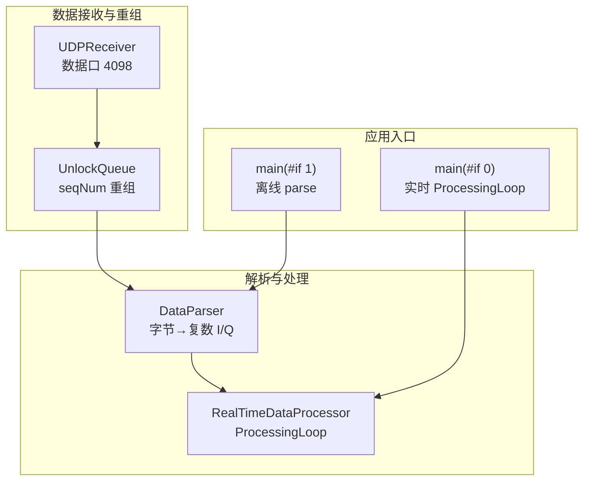
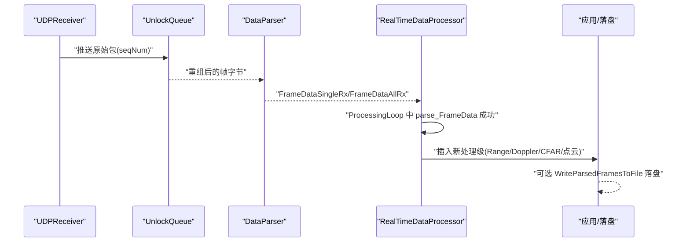
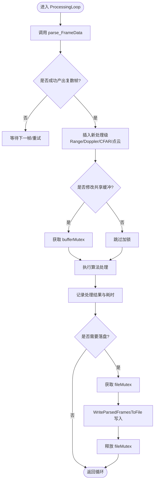
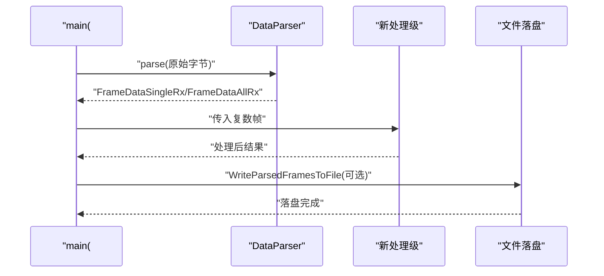
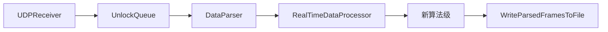

# 数据处理流程扩展开发指南

<cite>
**本文引用的文件**   
- [awr1843_dca1000_read.cpp](file://awr1843_dca1000_read.cpp)
- [RealTimeProcessor.h](file://RealTimeProcessor.h)
- [DataParser.h](file://DataParser.h)
- [RadarParams.h](file://RadarParams.h)
- [Logger.h](file://Logger.h)
- [CMakeLists.txt](file://CMakeLists.txt)
</cite>

## 目录
1. [引言](#引言)
2. [项目结构](#项目结构)
3. [核心组件](#核心组件)
4. [架构总览](#架构总览)
5. [详细组件分析](#详细组件分析)
6. [依赖关系分析](#依赖关系分析)
7. [性能考虑](#性能考虑)
8. [故障排查指南](#故障排查指南)
9. [结论](#结论)
10. [附录](#附录)

## 引言
本指南面向二次开发，聚焦如何在现有 AWR1843 + DCA1000 数据采集与解析流水线中，新增算法级处理步骤（如 Range-FFT、Doppler-FFT、CFAR、点云检测）。文档明确：
- 实时链路接入点：在 RealTimeDataProcessor::ProcessingLoop 中，parse_FrameData 成功产出复数帧之后插入新处理级。
- 离线链路接入点：在 main(#if 1) 的 parse 之后接入。
- 级间数据契约：统一使用 DataParser 输出类型 FrameDataSingleRx/FrameDataAllRx。
- 配套约定：配置(RadarParams)、批量落盘(WriteParsedFramesToFile 模式)、日志(Logger)、线程与锁(bufferMutex/fileMutex)等。
- 新增算法步骤的实施要点与注意事项。

## 项目结构
本项目为 C++17 工程，仅依赖标准库，构建目标由 CMakeLists.txt 定义：
- test_udp：不含串口链，三平台可构建，配合 Python 回放泵测试 UDP→重组→解析。
- radar_full：含串口链的完整程序。

入口文件 awr1843_dca1000_read.cpp 通过 #if 0/#if 1 切换两种运行模式：
- #if 0：实时采集模式，走 RealTimeDataProcessor::ProcessingLoop。
- #if 1：离线 bin→CSV 解析模式，main 中执行 parse。

网络数据链路分为两层：
- 第1层「数据接收与帧重组」：UDPReceiver 数据口 4098 + UnlockQueue + seqNum 重组，基于 net_compat 跨平台 socket。
- 第2层「雷达数据解析」：DataParser 将字节还原为复数 I/Q，并输出 FrameDataSingleRx/FrameDataAllRx。

设备控制通道（不进入数据通路）：
- DCA1000 命令口 4096：UDPController。
- AWR1843 CLI/数据口：AWR1843Controller（头文件实现）+ WzSerialportPlus/POSIX 分支。

图表来源
- [awr1843_dca1000_read.cpp:1-200](file://awr1843_dca1000_read.cpp#L1-L200)
- [RealTimeProcessor.h:1-200](file://RealTimeProcessor.h#L1-L200)
- [DataParser.h:1-200](file://DataParser.h#L1-L200)

章节来源
- [CMakeLists.txt:1-200](file://CMakeLists.txt#L1-L200)
- [awr1843_dca1000_read.cpp:1-200](file://awr1843_dca1000_read.cpp#L1-L200)

## 核心组件
- DataParser：负责把 UDP 重组后的原始字节流解析为复数 I/Q 帧，输出类型为 FrameDataSingleRx/FrameDataAllRx。该类型作为后续所有处理级的统一级间接口。
- RealTimeDataProcessor：实时链路的核心处理器，ProcessingLoop 循环拉取帧、调用 parse_FrameData，成功后进入后续处理阶段。
- 主程序入口 awr1843_dca1000_read.cpp：提供 #if 0/#if 1 双模式；#if 1 离线模式下，parse 完成后即进入后续处理或落盘逻辑。
- RadarParams：集中管理雷达参数（距离/多普勒分辨率、采样率、帧长等），供各处理级读取。
- Logger：统一日志接口，贯穿数据接收、解析、处理全流程。
- 线程与锁：bufferMutex 用于保护缓冲区读写，fileMutex 用于保护文件写入，确保多线程安全。

章节来源
- [DataParser.h:1-200](file://DataParser.h#L1-L200)
- [RealTimeProcessor.h:1-200](file://RealTimeProcessor.h#L1-L200)
- [RadarParams.h:1-200](file://RadarParams.h#L1-L200)
- [Logger.h:1-200](file://Logger.h#L1-L200)
- [awr1843_dca1000_read.cpp:1-200](file://awr1843_dca1000_read.cpp#L1-L200)

## 架构总览
下图展示从 UDP 接收到解析、再到实时/离线处理的主干流程，以及新增算法级应插入的位置。

图表来源
- [awr1843_dca1000_read.cpp:1-200](file://awr1843_dca1000_read.cpp#L1-L200)
- [RealTimeProcessor.h:1-200](file://RealTimeProcessor.h#L1-L200)
- [DataParser.h:1-200](file://DataParser.h#L1-L200)

## 详细组件分析

### 实时链路接入点：RealTimeDataProcessor::ProcessingLoop
- 接入位置：在 ProcessingLoop 中，当 parse_FrameData 成功产出复数帧后，立即插入新的处理级。
- 输入契约：必须消费 DataParser 输出的 FrameDataSingleRx/FrameDataAllRx。
- 输出契约：建议保持同一类型或派生类型，以便下游继续串联。
- 线程与锁：若修改共享缓冲，需持有 bufferMutex；若进行文件写入，需持有 fileMutex。
- 日志：关键路径（帧到达、解析成功、处理耗时、异常）均需记录。
- 配置：读取 RadarParams 中的分辨率、采样率、帧长度等参数以驱动算法。

图表来源
- [RealTimeProcessor.h:1-200](file://RealTimeProcessor.h#L1-L200)
- [DataParser.h:1-200](file://DataParser.h#L1-L200)
- [Logger.h:1-200](file://Logger.h#L1-L200)
- [RadarParams.h:1-200](file://RadarParams.h#L1-L200)

章节来源
- [RealTimeProcessor.h:1-200](file://RealTimeProcessor.h#L1-L200)

### 离线链路接入点：main(#if 1) 的 parse 之后
- 接入位置：在 main(#if 1) 的 parse 完成后，直接接入新处理级。
- 输入契约：同样使用 FrameDataSingleRx/FrameDataAllRx。
- 输出契约：可与实时链路保持一致，便于复用算法模块。
- 落盘：支持 WriteParsedFramesToFile 模式，按批次写入 CSV/二进制文件。
- 日志：记录解析完成时间、处理耗时、落盘大小等。

图表来源
- [awr1843_dca1000_read.cpp:1-200](file://awr1843_dca1000_read.cpp#L1-L200)
- [DataParser.h:1-200](file://DataParser.h#L1-L200)

章节来源
- [awr1843_dca1000_read.cpp:1-200](file://awr1843_dca1000_read.cpp#L1-L200)

### 级间数据契约：FrameDataSingleRx / FrameDataAllRx
- 语义：
  - FrameDataSingleRx：单天线通道的复数帧。
  - FrameDataAllRx：全通道复数帧。
- 字段约定（示例性说明，具体以 DataParser 输出为准）：
  - 复数数组（I/Q）、采样点数、帧号、时间戳、通道维度信息。
- 使用规范：
  - 所有新增处理级必须接受上述类型之一作为输入。
  - 输出类型应与输入一致或为派生类型，保证流水线可串接。
  - 禁止在级间随意转换数据结构，避免拷贝与不一致。

章节来源
- [DataParser.h:1-200](file://DataParser.h#L1-L200)

### 配置约定：RadarParams
- 作用：集中管理雷达相关参数，如距离/多普勒分辨率、采样率、帧长、通道数等。
- 使用方式：
  - 各处理级在初始化时读取 RadarParams，用于计算 FFT 点数、窗函数、阈值等。
  - 配置文件（mmWave CLI .cfg 与 cf.json）由上层解析后填充 RadarParams。
- 注意事项：
  - 参数变更需触发处理级重新初始化或参数同步。
  - 对数值范围与单位进行校验，防止越界。

章节来源
- [RadarParams.h:1-200](file://RadarParams.h#L1-L200)

### 批量落盘约定：WriteParsedFramesToFile 模式
- 触发条件：在实时或离线链路中，根据配置开关决定是否启用。
- 写入策略：
  - 按批次写入（FRAME_BATCH_SIZE），减少 I/O 次数。
  - 文件名包含时间戳或帧号，便于回溯。
- 线程安全：
  - 写文件前获取 fileMutex，避免并发写入导致数据损坏。
- 内容格式：
  - 建议 CSV 或二进制，字段顺序固定，便于下游工具解析。

章节来源
- [awr1843_dca1000_read.cpp:1-200](file://awr1843_dca1000_read.cpp#L1-L200)

### 日志约定：Logger
- 级别：DEBUG/INFO/WARN/ERROR，按阶段分级记录。
- 内容：
  - 数据到达、解析成功、处理开始/结束、耗时、错误码。
- 输出：
  - 控制台与文件双写，便于调试与审计。
- 性能：
  - 高频路径使用轻量级日志，避免阻塞数据通路。

章节来源
- [Logger.h:1-200](file://Logger.h#L1-L200)

### 线程与锁约定：bufferMutex / fileMutex
- bufferMutex：
  - 保护共享缓冲区（复数帧缓存、中间结果）的读写。
  - 临界区尽量短，避免长时间持锁。
- fileMutex：
  - 保护文件写入操作，确保批写入原子性。
- 死锁规避：
  - 严格规定加锁顺序，禁止嵌套加锁。
  - 使用 RAII 锁守卫，确保异常路径也能释放。

章节来源
- [RealTimeProcessor.h:1-200](file://RealTimeProcessor.h#L1-L200)
- [awr1843_dca1000_read.cpp:1-200](file://awr1843_dca1000_read.cpp#L1-L200)

### 新增算法步骤实施清单
- 选择接入点：
  - 实时：RealTimeDataProcessor::ProcessingLoop 中 parse_FrameData 成功后。
  - 离线：main(#if 1) 的 parse 之后。
- 输入输出：
  - 输入：FrameDataSingleRx/FrameDataAllRx。
  - 输出：同类型或派生类型，保持流水线一致性。
- 配置读取：
  - 初始化时读取 RadarParams，设置算法参数。
- 线程安全：
  - 修改共享缓冲加 bufferMutex；写文件加 fileMutex。
- 日志记录：
  - 记录关键事件与耗时，便于性能分析。
- 落盘支持：
  - 如需持久化，遵循 WriteParsedFramesToFile 模式。
- 单元测试：
  - 针对算法模块编写用例，验证边界条件与性能。

章节来源
- [RealTimeProcessor.h:1-200](file://RealTimeProcessor.h#L1-L200)
- [DataParser.h:1-200](file://DataParser.h#L1-L200)
- [RadarParams.h:1-200](file://RadarParams.h#L1-L200)
- [Logger.h:1-200](file://Logger.h#L1-L200)
- [awr1843_dca1000_read.cpp:1-200](file://awr1843_dca1000_read.cpp#L1-L200)

## 依赖关系分析
- 数据流向：
  - UDPReceiver → UnlockQueue → DataParser → RealTimeDataProcessor → 新处理级 → 落盘/可视化。
- 控制流向：
  - AWR1843Controller/UDPController 负责设备配置与启停，不进入数据通路。
- 构建依赖：
  - CMakeLists.txt 定义 test_udp 与 radar_full 两个目标，按需编译。

图表来源
- [CMakeLists.txt:1-200](file://CMakeLists.txt#L1-L200)
- [awr1843_dca1000_read.cpp:1-200](file://awr1843_dca1000_read.cpp#L1-L200)
- [RealTimeProcessor.h:1-200](file://RealTimeProcessor.h#L1-L200)
- [DataParser.h:1-200](file://DataParser.h#L1-L200)

章节来源
- [CMakeLists.txt:1-200](file://CMakeLists.txt#L1-L200)

## 性能考虑
- 数据通路零拷贝：尽量在级间传递引用或指针，避免不必要的内存分配与拷贝。
- 批处理：合理设置 FRAME_BATCH_SIZE，平衡 I/O 与 CPU 利用率。
- 并行与串行：CPU 密集型算法（FFT/CFAR）可在独立线程执行，但需注意锁粒度。
- 日志开销：高频路径使用轻量级日志，必要时关闭 DEBUG 级别。
- 内存池：对频繁分配的对象使用对象池，降低 GC/分配压力。

[本节为通用指导，无需特定文件来源]

## 故障排查指南
- 常见问题：
  - 帧丢失：检查 UnlockQueue 的 seqNum 重组与超时策略。
  - 解析失败：确认字节序、帧头校验、通道数与采样点匹配。
  - 处理卡顿：定位热点函数，检查锁竞争与 I/O 阻塞。
  - 落盘异常：核对 fileMutex 使用与文件权限。
- 诊断手段：
  - 开启详细日志，记录关键路径耗时。
  - 使用性能分析工具（perf/VTune）定位瓶颈。
  - 构造最小复现用例，隔离问题模块。

章节来源
- [Logger.h:1-200](file://Logger.h#L1-L200)
- [RealTimeProcessor.h:1-200](file://RealTimeProcessor.h#L1-L200)
- [awr1843_dca1000_read.cpp:1-200](file://awr1843_dca1000_read.cpp#L1-L200)

## 结论
通过在指定接入点（实时 ProcessingLoop 与离线 parse 之后）统一使用 DataParser 的输出类型（FrameDataSingleRx/FrameDataAllRx），并结合 RadarParams、Logger、bufferMutex/fileMutex 与 WriteParsedFramesToFile 模式，可安全、高效地扩展新的算法级处理步骤。遵循本文规范，可确保新增模块与现有流水线的无缝集成与稳定运行。

[本节为总结性内容，无需特定文件来源]

## 附录
- 术语表：
  - Range-FFT：距离维快速傅里叶变换。
  - Doppler-FFT：多普勒维快速傅里叶变换。
  - CFAR：恒虚警率检测。
  - 点云检测：目标点云生成与聚类。
- 参考路径：
  - 实时接入点：RealTimeProcessor.h 中的 ProcessingLoop。
  - 离线接入点：awr1843_dca1000_read.cpp 的 main(#if 1)。
  - 数据契约：DataParser.h 的 FrameDataSingleRx/FrameDataAllRx。
  - 配置：RadarParams.h。
  - 日志：Logger.h。
  - 落盘：awr1843_dca1000_read.cpp 中的 WriteParsedFramesToFile。

[本节为补充信息，无需特定文件来源]