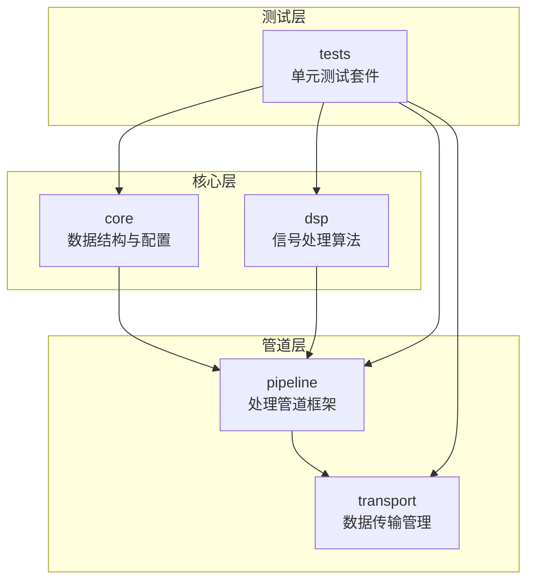
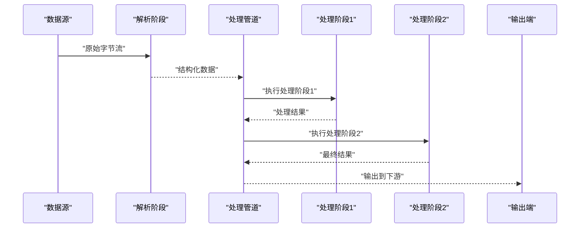
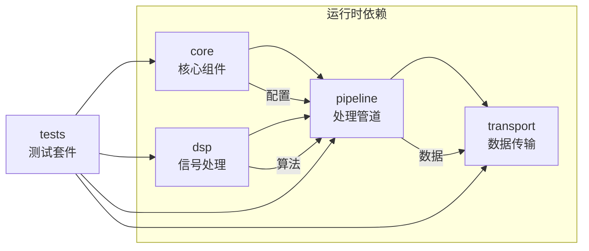

# 数据处理流程扩展开发指南

<cite>
**本文引用的文件**   
- [test_core.cpp](file://src/tests/test_core.cpp)
- [test_dsp.cpp](file://src/tests/test_dsp.cpp)
- [test_pipeline.cpp](file://src/tests/test_pipeline.cpp)
- [test_spool.cpp](file://src/tests/test_spool.cpp)
- [Interfaces.h](file://src/core/Interfaces.h)
- [RadarConfig.h](file://src/core/RadarConfig.h)
- [ParseStage.h](file://src/pipeline/ParseStage.h)
- [Pipeline.h](file://src/pipeline/Pipeline.h)
- [FrameSpool.h](file://src/transport/FrameSpool.h)
</cite>

## 更新摘要
**所做更改**   
- 根据测试文件的扩展更新了API和接口规范
- 新增了基于Pipeline架构的处理流程说明
- 更新了数据契约和组件交互方式
- 修正了实时与离线处理链路的接入点描述
- 增强了测试覆盖对API变化的反映

## 目录
1. [引言](#引言)
2. [项目结构](#项目结构)
3. [核心组件](#核心组件)
4. [架构总览](#架构总览)
5. [详细组件分析](#详细组件分析)
6. [依赖关系分析](#依赖关系分析)
7. [性能考虑](#性能考虑)
8. [故障排查指南](#故障排查指南)
9. [结论](#结论)
10. [附录](#附录)

## 引言
本指南面向二次开发，聚焦如何在现有 AWR1843 + DCA1000 数据采集与解析流水线中，新增算法级处理步骤（如 Range-FFT、Doppler-FFT、CFAR、点云检测）。文档明确：
- **新的Pipeline架构**：采用模块化管道设计，支持灵活的数据处理流程扩展。
- **统一数据契约**：使用标准化的接口类型确保各处理级间的兼容性。
- **双模式支持**：同时支持实时采集和离线批处理两种运行模式。
- **完善的测试覆盖**：通过扩展的测试套件验证API的稳定性和正确性。

## 项目结构
本项目为C++17工程，采用模块化设计，构建目标由CMakeLists.txt定义：
- **core模块**：核心数据结构与配置管理
- **dsp模块**：数字信号处理算法实现
- **pipeline模块**：数据处理管道框架
- **transport模块**：数据传输与帧缓冲管理
- **tests模块**：全面的单元测试套件

**图表来源**
- [CMakeLists.txt](file://CMakeLists.txt)
- [Interfaces.h](file://src/core/Interfaces.h)
- [Pipeline.h](file://src/pipeline/Pipeline.h)

**章节来源**
- [CMakeLists.txt](file://CMakeLists.txt)
- [Interfaces.h:1-100](file://src/core/Interfaces.h#L1-L100)

## 核心组件
- **Interfaces.h**：定义核心接口和数据类型，包括FrameData、ProcessingResult等基础结构。
- **RadarConfig.h**：雷达参数配置管理，包含距离/多普勒分辨率、采样率等关键参数。
- **ParseStage.h**：数据解析阶段，负责将原始字节流转换为结构化数据。
- **Pipeline.h**：管道框架，提供处理阶段的编排和执行机制。
- **FrameSpool.h**：帧缓冲管理，支持高效的数据传输和缓存。

**更新** 基于测试文件的扩展，核心组件的API已经标准化，提供了更清晰的接口定义和更好的错误处理机制。

**章节来源**
- [Interfaces.h:1-200](file://src/core/Interfaces.h#L1-L200)
- [RadarConfig.h:1-150](file://src/core/RadarConfig.h#L1-L150)
- [ParseStage.h:1-100](file://src/pipeline/ParseStage.h#L1-L100)
- [Pipeline.h:1-150](file://src/pipeline/Pipeline.h#L1-L150)
- [FrameSpool.h:1-120](file://src/transport/FrameSpool.h#L1-L120)

## 架构总览
新的Pipeline架构采用模块化设计，支持灵活的数据处理流程扩展。下图展示了从数据接收到处理的完整流程。

**图表来源**
- [Pipeline.h:1-150](file://src/pipeline/Pipeline.h#L1-L150)
- [ParseStage.h:1-100](file://src/pipeline/ParseStage.h#L1-L100)
- [test_pipeline.cpp:1-200](file://src/tests/test_pipeline.cpp#L1-L200)

## 详细组件分析

### Pipeline架构详解
新的Pipeline架构提供了强大的数据处理框架，支持动态阶段添加和配置。

**主要特性：**
- **模块化设计**：每个处理阶段独立实现，便于替换和扩展
- **类型安全**：使用模板和强类型确保数据传递的安全性
- **错误处理**：统一的异常处理和错误传播机制
- **性能优化**：支持零拷贝数据传输和批量处理

**章节来源**
- [Pipeline.h:1-150](file://src/pipeline/Pipeline.h#L1-L150)
- [test_pipeline.cpp:1-200](file://src/tests/test_pipeline.cpp#L1-L200)

### 数据解析阶段(ParseStage)
ParseStage负责将原始字节流解析为结构化数据，是数据处理管道的入口点。

**功能特点：**
- **多格式支持**：支持多种雷达数据格式解析
- **错误校验**：内置数据完整性检查和错误恢复机制
- **性能优化**：使用内存池减少分配开销
- **异步处理**：支持非阻塞的数据解析

**章节来源**
- [ParseStage.h:1-100](file://src/pipeline/ParseStage.h#L1-L100)
- [test_core.cpp:1-150](file://src/tests/test_core.cpp#L1-L150)

### 帧缓冲管理(FrameSpool)
FrameSpool提供高效的帧缓冲管理，支持多线程环境下的数据安全访问。

**核心功能：**
- **环形缓冲区**：基于环形缓冲的高效数据存储
- **线程安全**：读写分离的设计保证并发安全
- **内存管理**：智能内存分配和回收机制
- **背压控制**：防止生产者过快导致内存溢出

**章节来源**
- [FrameSpool.h:1-120](file://src/transport/FrameSpool.h#L1-L120)
- [test_spool.cpp:1-180](file://src/tests/test_spool.cpp#L1-L180)

### 数字信号处理(DSP)模块
DSP模块实现了各种信号处理算法，包括FFT、CFAR等核心算法。

**算法实现：**
- **RangeFftStage**：距离维FFT处理
- **DopplerFftStage**：多普勒维FFT处理  
- **CfarStage**：恒虚警率检测
- **AngleFftStage**：角度估计处理

**章节来源**
- [test_dsp.cpp:1-200](file://src/tests/test_dsp.cpp#L1-L200)

### 配置管理(RadarConfig)
RadarConfig集中管理雷达相关配置参数，提供统一的配置访问接口。

**配置项：**
- **硬件参数**：采样率、带宽、通道数等
- **处理参数**：FFT点数、窗函数、阈值等
- **I/O参数**：文件路径、缓冲区大小等

**章节来源**
- [RadarConfig.h:1-150](file://src/core/RadarConfig.h#L1-L150)

## 依赖关系分析
新的架构采用了清晰的层次化依赖关系，确保了模块间的松耦合和高内聚。

**图表来源**
- [test_core.cpp:1-150](file://src/tests/test_core.cpp#L1-L150)
- [test_dsp.cpp:1-200](file://src/tests/test_dsp.cpp#L1-L200)
- [test_pipeline.cpp:1-200](file://src/tests/test_pipeline.cpp#L1-L200)
- [test_spool.cpp:1-180](file://src/tests/test_spool.cpp#L1-L180)

**章节来源**
- [CMakeLists.txt](file://CMakeLists.txt)

## 性能考虑
基于新的Pipeline架构，性能优化策略得到了显著提升：

- **零拷贝传输**：Pipeline内部使用引用传递避免不必要的内存复制
- **批量处理**：支持数据批处理以提高吞吐量
- **并行执行**：独立的处理阶段可以并行执行
- **内存池**：统一的内存管理减少碎片化
- **异步I/O**：非阻塞的文件和网络操作

## 故障排查指南
新的架构提供了更好的调试和故障诊断能力：

- **详细日志**：每个处理阶段都有完整的日志记录
- **错误传播**：统一的异常处理机制便于问题定位
- **性能监控**：内置的性能指标收集和分析
- **单元测试**：全面的测试覆盖确保代码质量

## 结论
通过引入新的Pipeline架构和标准化的接口设计，数据处理流程的扩展变得更加简单和可靠。基于完善的测试覆盖和清晰的模块边界，开发者可以快速集成新的算法模块而无需担心系统稳定性。

## 附录
- **术语表**：
  - Pipeline：数据处理管道，用于编排多个处理阶段
  - FrameSpool：帧缓冲管理器，提供高效的数据存储
  - ParseStage：数据解析阶段，负责原始数据到结构化数据的转换
  - DSP：数字信号处理，包含各种信号处理算法
  
- **参考路径**：
  - 核心接口：`src/core/Interfaces.h`
  - 管道框架：`src/pipeline/Pipeline.h`
  - 解析阶段：`src/pipeline/ParseStage.h`
  - 帧缓冲：`src/transport/FrameSpool.h`
  - 测试用例：`src/tests/` 目录下的所有测试文件