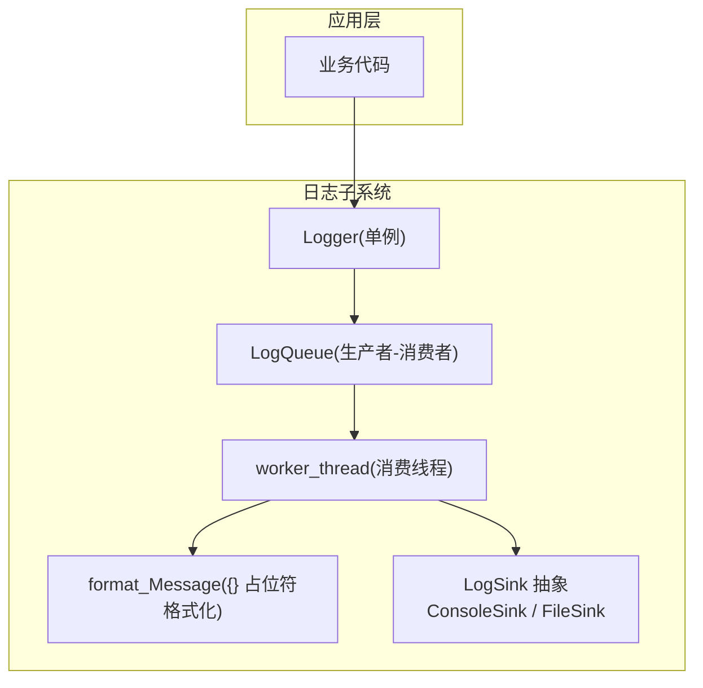
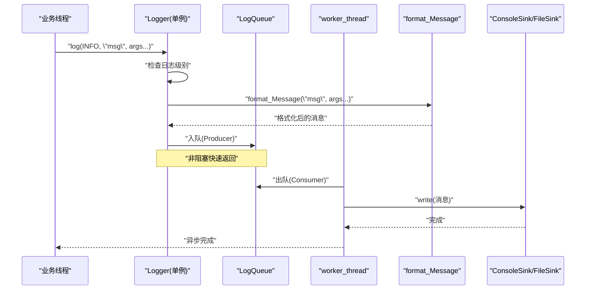
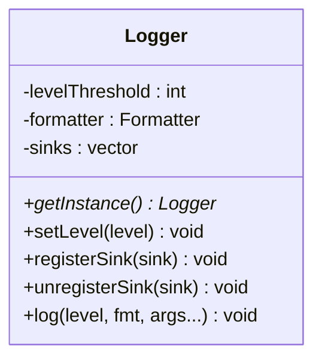
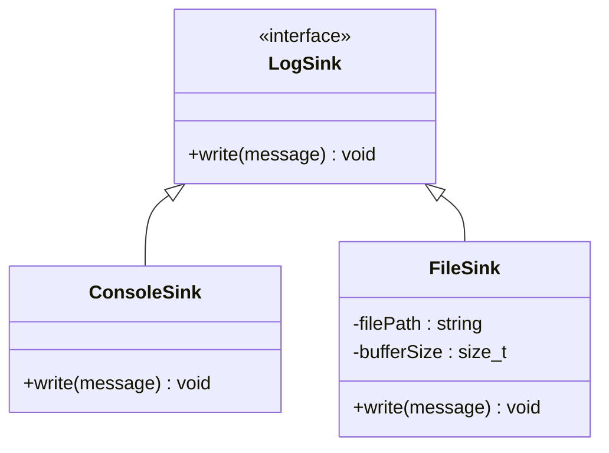
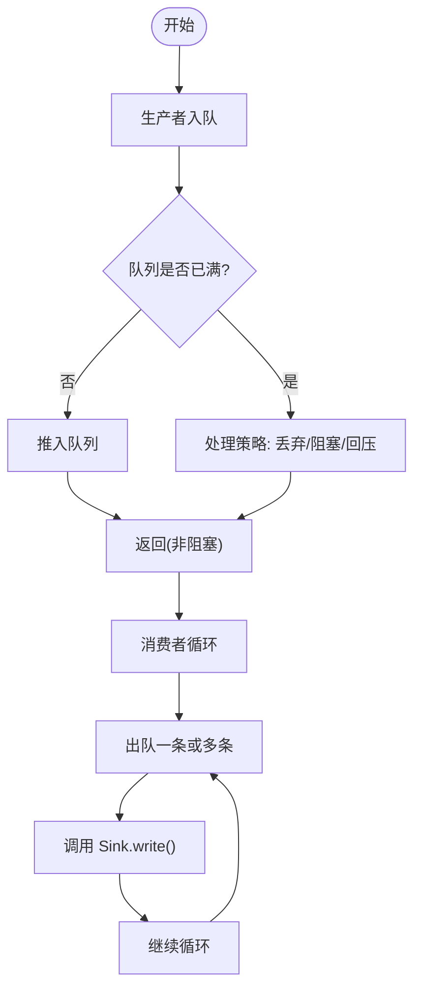
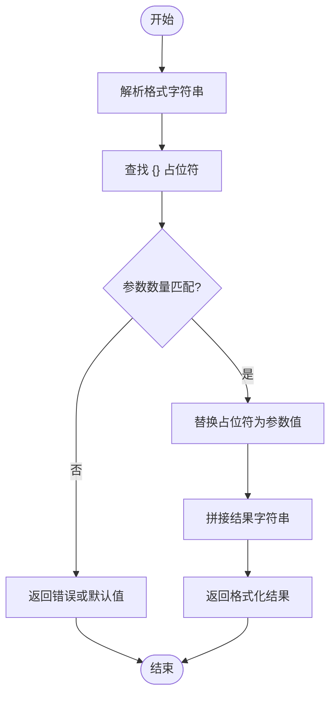
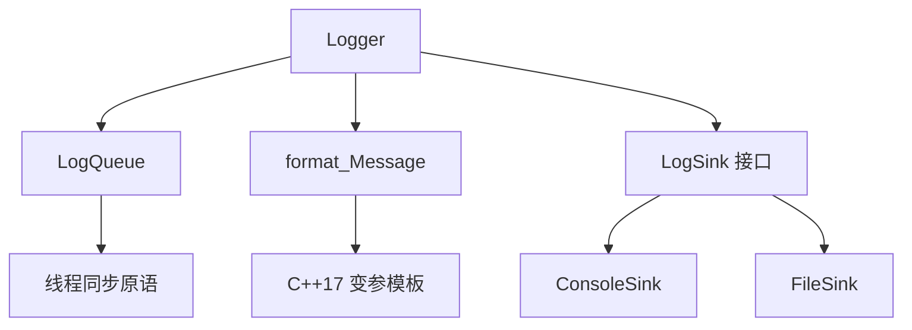

# 日志系统

<cite>
**本文引用的文件**   
- [Logger.h](file://Logger.h)
</cite>

## 目录
1. [简介](#简介)
2. [项目结构](#项目结构)
3. [核心组件](#核心组件)
4. [架构总览](#架构总览)
5. [详细组件分析](#详细组件分析)
6. [依赖关系分析](#依赖关系分析)
7. [性能考量](#性能考量)
8. [故障排查指南](#故障排查指南)
9. [结论](#结论)

## 简介
本章节概述 Logger.h 实现的多线程安全日志子系统。该子系统采用单例模式提供全局日志入口，通过观察者模式将日志事件分发到多个输出端（控制台、文件等），并使用生产者-消费者队列异步写出，避免阻塞业务线程。同时支持基于 {} 占位符的变参模板格式化与多级日志级别控制。

## 项目结构
- 日志系统以单个头文件形式组织，便于跨平台集成与零外部依赖使用。
- 主要职责划分：
  - 单例 Logger：生命周期管理、注册/注销 Sink、设置日志级别与格式器。
  - LogSink 抽象与具体实现：ConsoleSink、FileSink 等。
  - LogQueue：无锁或轻量同步的生产者-消费者队列，承载待写出的日志条目。
  - 格式化器：基于 {} 占位符的变参模板解析与字符串组装。
  - 日志级别枚举与过滤：按级别决定是否记录与输出。

图表来源
- [Logger.h](file://Logger.h)

章节来源
- [Logger.h](file://Logger.h)

## 核心组件
- 单例 Logger
  - 提供全局唯一实例访问点，确保多线程环境下构造与初始化顺序正确。
  - 维护日志级别阈值、格式器与一组已注册的 LogSink。
  - 对外暴露 log(level, message, ...) 接口，内部完成级别过滤、格式化与入队。

- 观察者模式 LogSink
  - 定义统一的 Sink 接口，支持多目标输出。
  - ConsoleSink：输出至标准输出或错误流。
  - FileSink：输出至指定文件路径，支持追加/覆盖策略与缓冲刷新策略。

- LogQueue 生产者-消费者
  - 生产者：Logger 在业务线程中快速入队，避免阻塞。
  - 消费者：后台 worker_thread 持续出队并调用各 Sink 的 write() 方法。
  - 保证线程安全与内存可见性，防止数据竞争与丢失。

- 格式化器 format_Message
  - 支持 {} 占位符的变参模板，自动匹配参数类型与数量。
  - 高效拼接字符串，减少临时对象分配。

- 日志级别
  - 典型级别：TRACE、DEBUG、INFO、WARN、ERROR、FATAL。
  - 通过阈值过滤，低于阈级别的日志直接丢弃，降低开销。

章节来源
- [Logger.h](file://Logger.h)

## 架构总览
下图展示了从业务线程调用日志到最终输出的完整流程，包括级别过滤、格式化、异步入队与后台消费。

图表来源
- [Logger.h](file://Logger.h)

## 详细组件分析

### 单例 Logger
- 设计要点
  - 使用线程安全的单例构造方式，避免重复初始化与竞态条件。
  - 持有日志级别阈值、格式器指针与 Sink 列表。
  - 提供注册/注销 Sink 的 API，支持运行时扩展输出目标。
- 关键行为
  - 级别过滤：仅当传入级别大于等于当前阈值时才继续处理。
  - 格式化：调用 format_Message 生成最终文本。
  - 入队：将格式化后的消息推入 LogQueue，立即返回，不阻塞业务线程。

图表来源
- [Logger.h](file://Logger.h)

章节来源
- [Logger.h](file://Logger.h)

### 观察者模式 LogSink 体系
- 抽象接口
  - 定义统一的 write(message) 接口，所有具体 Sink 必须实现。
- 具体实现
  - ConsoleSink：将消息写入标准输出/错误流，适合调试与实时观察。
  - FileSink：将消息写入文件，支持路径配置、缓冲策略与刷新时机控制。
- 扩展性
  - 新增 Sink 只需实现统一接口并注册到 Logger，即可无缝接入。

图表来源
- [Logger.h](file://Logger.h)

章节来源
- [Logger.h](file://Logger.h)

### LogQueue 生产者-消费者异步写出
- 设计要点
  - 使用线程安全的队列结构，支持高并发入队与稳定出队。
  - 生产者（Logger）快速入队，消费者（worker_thread）批量或逐条处理。
  - 队列满时的策略：可配置丢弃、阻塞或回压，避免内存膨胀。
- 关键行为
  - 入队：原子操作或互斥保护，确保线程安全。
  - 出队：消费者循环拉取，调用各 Sink 的 write() 方法。
  - 优雅退出：支持停止信号，确保队列清空后退出。

图表来源
- [Logger.h](file://Logger.h)

章节来源
- [Logger.h](file://Logger.h)

### 格式化器 format_Message 与 {} 占位符
- 设计要点
  - 支持可变参数模板，自动匹配参数类型与数量。
  - 扫描格式字符串中的 {} 占位符，依次替换为对应参数。
  - 优化字符串拼接，减少临时对象与内存分配。
- 关键行为
  - 参数校验：确保占位符数量与参数数量一致。
  - 类型适配：支持常见类型（整数、浮点、字符串等）。
  - 异常安全：在格式化失败时返回空字符串或默认值。

图表来源
- [Logger.h](file://Logger.h)

章节来源
- [Logger.h](file://Logger.h)

### 日志级别与过滤
- 级别定义
  - TRACE：最详细的跟踪信息，通常用于开发调试。
  - DEBUG：调试信息，包含关键变量状态。
  - INFO：一般信息，记录重要业务流程。
  - WARN：警告信息，潜在问题但不影响运行。
  - ERROR：错误信息，功能异常但可恢复。
  - FATAL：致命错误，程序无法继续运行。
- 过滤机制
  - 设置全局阈值，低于阈值的日志直接丢弃。
  - 支持运行时动态调整阈值，无需重启程序。

章节来源
- [Logger.h](file://Logger.h)

## 依赖关系分析
- 内部依赖
  - Logger 依赖 LogQueue、Formatter 与 LogSink 接口。
  - LogQueue 依赖线程安全数据结构（如互斥量、条件变量）。
  - Formatter 依赖 C++17 变参模板与类型推导。
- 外部依赖
  - 仅依赖标准库，无第三方库。
  - 跨平台兼容：使用 net_compat 风格的跨平台抽象（如文件 I/O、线程原语）。

图表来源
- [Logger.h](file://Logger.h)

章节来源
- [Logger.h](file://Logger.h)

## 性能考量
- 异步写出
  - 业务线程仅负责入队，避免 I/O 阻塞。
  - 后台消费线程批量处理，提高吞吐。
- 内存管理
  - 队列容量限制，防止内存泄漏。
  - 字符串复用与零拷贝优化（如可能）。
- 级别过滤
  - 早期丢弃低级别日志，减少格式化与入队开销。
- 线程安全
  - 最小化锁粒度，使用无锁队列或分段锁提升并发性能。

[本节为通用指导，不直接分析具体文件]

## 故障排查指南
- 常见问题
  - 日志未输出：检查日志级别阈值是否过高。
  - 输出乱码：确认编码设置（UTF-8 vs GBK）。
  - 性能下降：检查队列是否频繁满，调整缓冲区大小。
  - 死锁或崩溃：检查 Sink 实现是否线程安全。
- 调试技巧
  - 启用 TRACE 级别，观察入队与出队过程。
  - 单独测试 ConsoleSink 与 FileSink，定位问题源。
  - 使用工具检测内存泄漏与竞态条件。

章节来源
- [Logger.h](file://Logger.h)

## 结论
Logger.h 实现的日志系统通过单例模式、观察者模式与生产者-消费者队列，提供了高性能、可扩展且线程安全的日志解决方案。其 {} 占位符格式化与多级日志过滤机制，既保证了易用性，又兼顾了性能。在实际应用中，可根据需求扩展新的 Sink 或调整队列策略，以满足不同场景的需求。