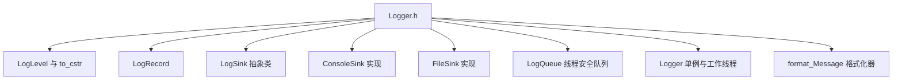
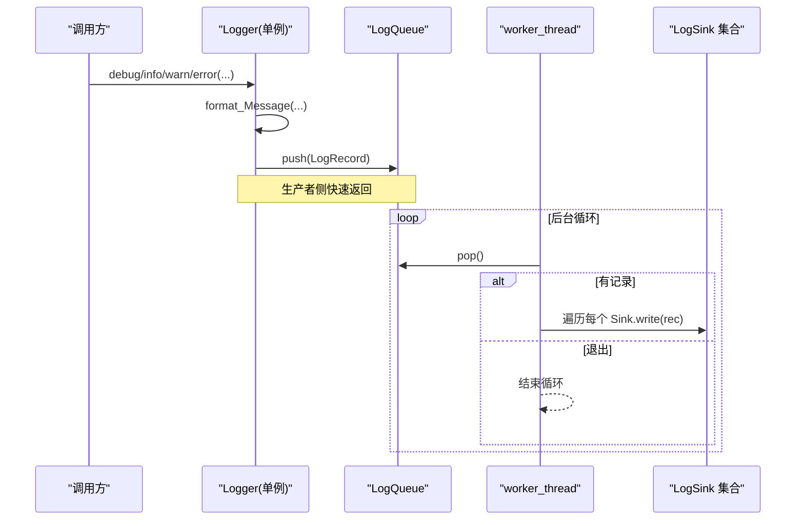
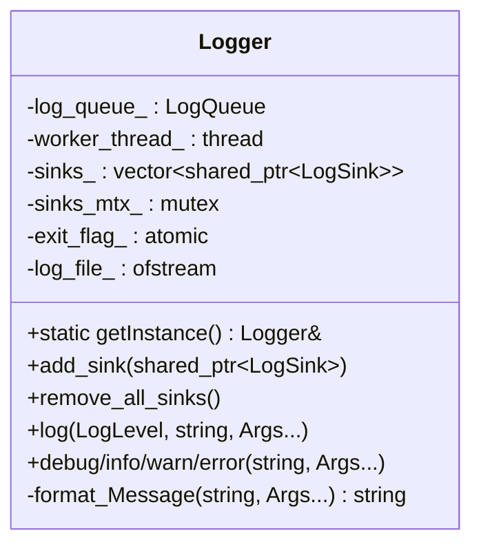
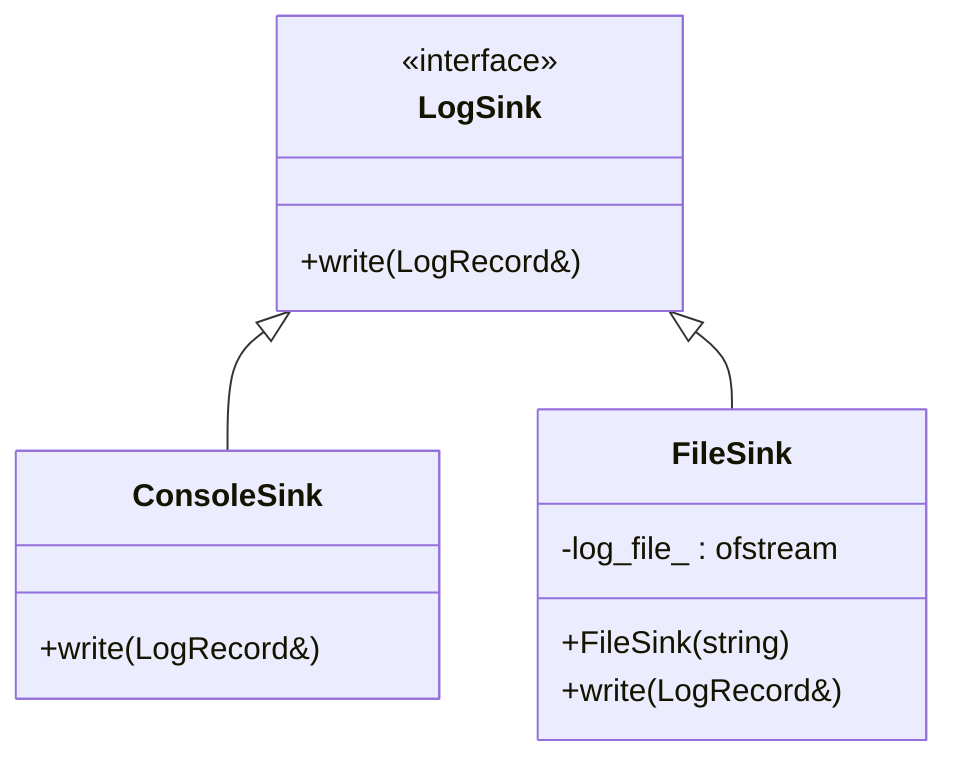
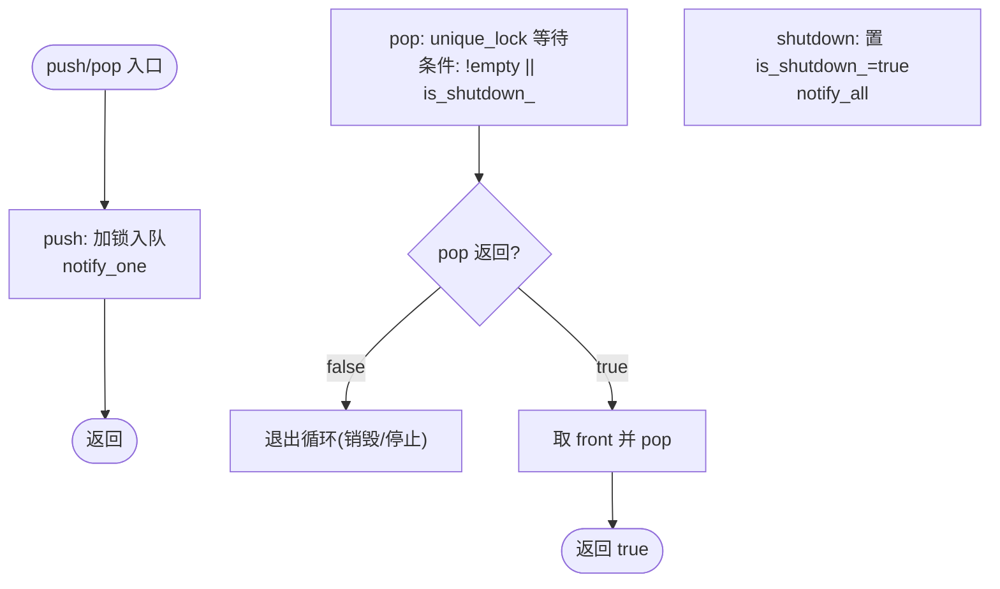
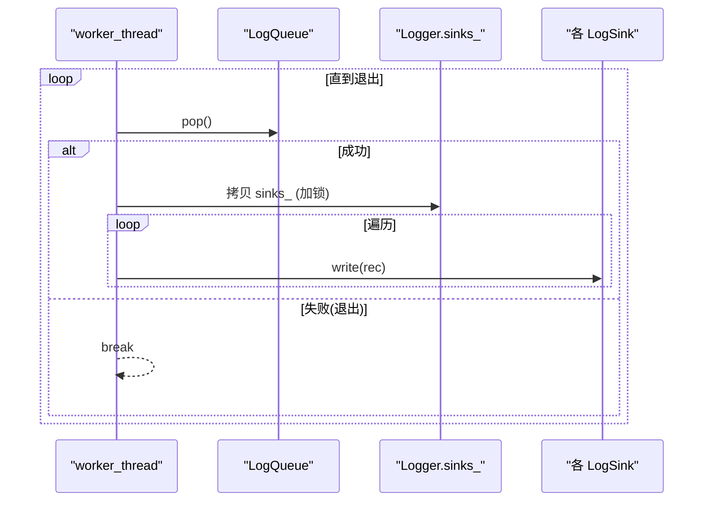
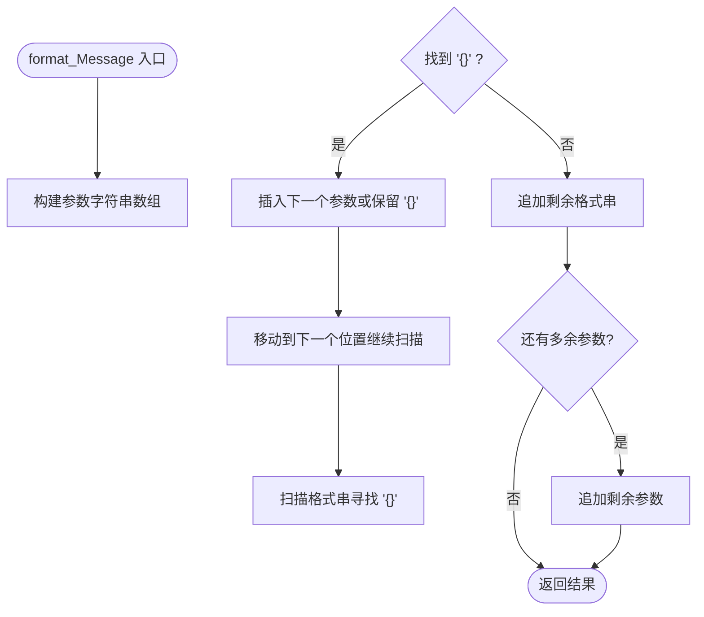
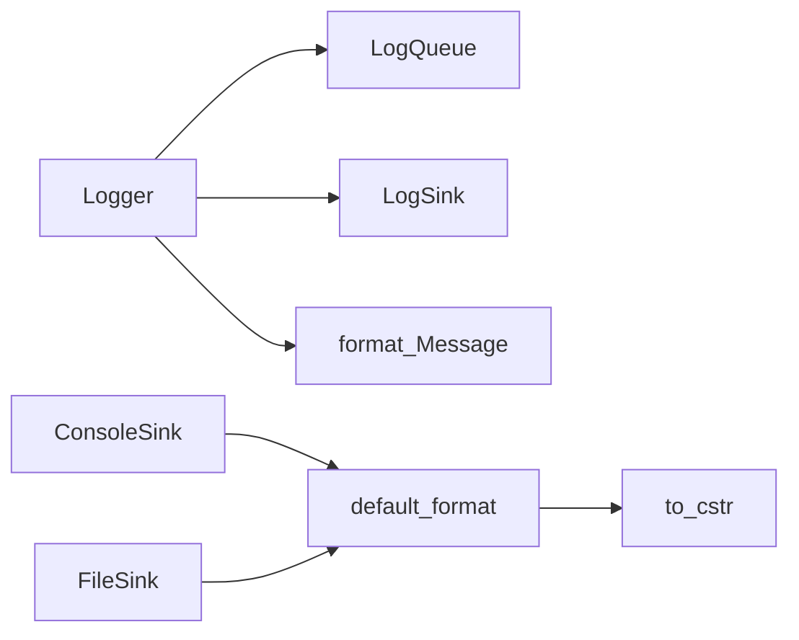

# 日志系统

<cite>
**本文引用的文件**   
- [Logger.h](file://awr1843_dca1000_read/Logger.h)
</cite>

## 目录
1. [简介](#简介)
2. [项目结构](#项目结构)
3. [核心组件](#核心组件)
4. [架构总览](#架构总览)
5. [详细组件分析](#详细组件分析)
6. [依赖关系分析](#依赖关系分析)
7. [性能考量](#性能考量)
8. [故障排查指南](#故障排查指南)
9. [结论](#结论)

## 简介
本章节面向 Logger.h 的多线程安全日志子系统，围绕以下要点进行系统化说明：
- 单例 Logger：全局唯一实例，集中管理日志工作线程与观察者集合。
- 观察者模式 LogSink：抽象输出接口，提供 ConsoleSink（控制台）与 FileSink（文件）两种实现。
- 生产者-消费者异步写出：LogQueue 基于互斥量与条件变量实现线程安全的队列，配合后台 worker_thread 消费并广播给所有 Sink。
- {} 占位符变参模板格式化：format_Message 使用可变参数包将任意类型拼接为字符串，按顺序替换格式串中的 "{}"。
- 日志级别：Debug、Info、Warn、Error 四级，统一通过 to_cstr 转换为文本标签。

该设计在仅依赖标准库的前提下，实现了低耦合、可扩展、线程安全的日志基础设施，便于在雷达数据采集与解析链路中广泛使用。

## 项目结构
Logger.h 是一个头文件形式的完整实现，包含：
- 日志级别枚举与转换
- 日志记录结构体 LogRecord
- 观察者抽象 LogSink 及其两个具体实现 ConsoleSink、FileSink
- 线程安全队列 LogQueue（生产者-消费者）
- 单例 Logger（含后台工作线程、观察者集合、格式化器）

图表来源
- [Logger.h:1-264](file://awr1843_dca1000_read/Logger.h#L1-L264)

章节来源
- [Logger.h:1-264](file://awr1843_dca1000_read/Logger.h#L1-L264)

## 核心组件
本节对关键组件的职责与交互进行概览式说明，后续章节再深入展开。

- LogLevel 与 to_cstr：定义四种日志级别并提供到字符串的映射，用于日志行前缀。
- LogRecord：携带时间戳、级别、线程 ID、消息文本的一条日志记录。
- LogSink 抽象类：定义 write(LogRecord&) 接口，作为观察者基类。
- ConsoleSink：将格式化后的日志写入 std::cout。
- FileSink：将格式化后的日志追加写入指定文件。
- LogQueue：线程安全队列，支持 push/pop/shutdown，内部使用互斥量与条件变量协调生产与消费。
- Logger：单例，负责：
  - 维护观察者集合 sinks_，并发安全地添加/清空；
  - 后台 worker_thread 循环 pop 队列并广播给所有 Sink；
  - 对外暴露 log/debug/info/warn/error 等便捷接口；
  - format_Message 实现 {} 占位符替换与多类型参数拼接。

章节来源
- [Logger.h:10-21](file://awr1843_dca1000_read/Logger.h#L10-L21)
- [Logger.h:22-28](file://awr1843_dca1000_read/Logger.h#L22-L28)
- [Logger.h:30-34](file://awr1843_dca1000_read/Logger.h#L30-L34)
- [Logger.h:54-63](file://awr1843_dca1000_read/Logger.h#L54-L63)
- [Logger.h:245-261](file://awr1843_dca1000_read/Logger.h#L245-L261)
- [Logger.h:74-114](file://awr1843_dca1000_read/Logger.h#L74-L114)
- [Logger.h:116-241](file://awr1843_dca1000_read/Logger.h#L116-L241)

## 架构总览
下图展示了 Logger 的整体架构与数据流：调用方通过 Logger 的便捷接口提交日志，Logger 将其封装为 LogRecord 后推入 LogQueue；后台工作线程从队列取出记录，拷贝当前观察者列表并逐一调用其 write 方法完成输出。

图表来源
- [Logger.h:151-162](file://awr1843_dca1000_read/Logger.h#L151-L162)
- [Logger.h:74-114](file://awr1843_dca1000_read/Logger.h#L74-L114)
- [Logger.h:175-195](file://awr1843_dca1000_read/Logger.h#L175-L195)
- [Logger.h:30-34](file://awr1843_dca1000_read/Logger.h#L30-L34)

## 详细组件分析

### 单例 Logger 与生命周期
- 获取方式：getInstance 使用局部静态对象保证线程安全的延迟初始化。
- 构造：启动 worker_thread，进入 pop 循环，读取队列并广播给观察者。
- 析构：shutdown 队列、设置退出标志、关闭文件句柄、join 工作线程，确保资源释放与线程安全退出。
- 观察者管理：add_sink/remove_all_sinks 使用独立互斥锁保护 sinks_，避免与写路径竞争。

图表来源
- [Logger.h:116-241](file://awr1843_dca1000_read/Logger.h#L116-L241)

章节来源
- [Logger.h:116-195](file://awr1843_dca1000_read/Logger.h#L116-L195)

### 观察者模式 LogSink 及实现
- LogSink：纯虚接口，定义 write(const LogRecord&)。
- ConsoleSink：使用 default_format 格式化后输出到 std::cout。
- FileSink：构造时打开文件（追加模式），失败抛出异常；write 同样使用 default_format 写入文件。

图表来源
- [Logger.h:30-34](file://awr1843_dca1000_read/Logger.h#L30-L34)
- [Logger.h:54-63](file://awr1843_dca1000_read/Logger.h#L54-L63)
- [Logger.h:245-261](file://awr1843_dca1000_read/Logger.h#L245-L261)

章节来源
- [Logger.h:30-34](file://awr1843_dca1000_read/Logger.h#L30-L34)
- [Logger.h:54-63](file://awr1843_dca1000_read/Logger.h#L54-L63)
- [Logger.h:245-261](file://awr1843_dca1000_read/Logger.h#L245-L261)

### LogQueue 生产者-消费者队列
- 数据结构：std::queue<LogRecord>，配合 std::mutex 与 std::condition_variable。
- 生产者 push：加锁入队，notify_one 唤醒一个等待的消费者。
- 消费者 pop：unique_lock 持有锁，wait 条件为“队列非空或已关闭”；若因关闭且队列为空则返回 false，否则取 front 并 pop。
- shutdown：标记 is_shutdown_ 并 notify_all，使所有等待的 pop 能够检查退出条件。

图表来源
- [Logger.h:74-114](file://awr1843_dca1000_read/Logger.h#L74-L114)

章节来源
- [Logger.h:74-114](file://awr1843_dca1000_read/Logger.h#L74-L114)

### 后台工作线程与观察者广播
- 构造时启动 worker_thread，循环执行 pop。
- 每次成功 pop 后，先拷贝当前 sinks_ 列表（减少持锁时间），再逐个调用 write。
- 当 pop 返回 false（队列关闭且为空）时退出循环。

图表来源
- [Logger.h:175-195](file://awr1843_dca1000_read/Logger.h#L175-L195)
- [Logger.h:124-132](file://awr1843_dca1000_read/Logger.h#L124-L132)

章节来源
- [Logger.h:175-195](file://awr1843_dca1000_read/Logger.h#L175-L195)
- [Logger.h:124-132](file://awr1843_dca1000_read/Logger.h#L124-L132)

### {} 占位符变参模板格式化与日志级别
- format_Message：
  - 将可变参数包依次转换为字符串，存入临时向量；
  - 从左到右扫描格式串，查找 "{}" 并按顺序替换；
  - 若参数不足，保留原 "{}"；若参数多余，将剩余参数直接拼接到末尾；
  - 最终返回拼接结果。
- 日志级别：
  - Debug/Info/Warn/Error 四级；
  - to_cstr 将级别转为字符串标签，供默认格式器使用。

图表来源
- [Logger.h:208-240](file://awr1843_dca1000_read/Logger.h#L208-L240)
- [Logger.h:10-21](file://awr1843_dca1000_read/Logger.h#L10-L21)

章节来源
- [Logger.h:208-240](file://awr1843_dca1000_read/Logger.h#L208-L240)
- [Logger.h:10-21](file://awr1843_dca1000_read/Logger.h#L10-L21)

## 依赖关系分析
- 标准库依赖：iostream、queue、condition_variable、mutex、sstream、fstream、string、atomic、thread、chrono。
- 模块内依赖：
  - Logger 依赖 LogQueue、LogSink 集合、format_Message；
  - ConsoleSink/FileSink 依赖 default_format；
  - default_format 依赖 to_cstr 与 chrono/time 工具。

图表来源
- [Logger.h:10-21](file://awr1843_dca1000_read/Logger.h#L10-L21)
- [Logger.h:36-49](file://awr1843_dca1000_read/Logger.h#L36-L49)
- [Logger.h:74-114](file://awr1843_dca1000_read/Logger.h#L74-L114)
- [Logger.h:116-241](file://awr1843_dca1000_read/Logger.h#L116-L241)
- [Logger.h:54-63](file://awr1843_dca1000_read/Logger.h#L54-L63)
- [Logger.h:245-261](file://awr1843_dca1000_read/Logger.h#L245-L261)

章节来源
- [Logger.h:1-264](file://awr1843_dca1000_read/Logger.h#L1-L264)

## 性能考量
- 生产者路径尽量短：log 接口仅做格式化与入队，避免阻塞调用线程。
- 观察者广播优化：工作线程在持有锁的情况下仅拷贝 sinks_ 指针容器，随后在无锁状态下遍历调用 write，降低锁竞争。
- 队列同步：条件变量 wait 仅在队列为空且未关闭时挂起，避免忙轮询。
- 格式化开销：format_Message 会创建中间字符串向量并进行多次子串拼接，建议在高频路径控制参数数量与字符串长度。
- 文件 I/O：FileSink 每次 write 都会进行一次追加写入，建议结合业务场景考虑批量落盘策略（例如在扩展层引入缓冲）。

[本节为通用性能讨论，不直接分析具体代码片段]

## 故障排查指南
- 文件无法打开：FileSink 构造时若打开失败会抛出运行时异常，应在创建 FileSink 前后捕获异常并处理。
- 程序退出卡住：确认 Logger 析构顺序，确保在 main 退出前 Logger 被正确析构以触发 shutdown 与 join。
- 日志丢失：检查是否过早销毁 Logger 或提前退出主线程导致 worker_thread 尚未消费完队列。
- 输出重复或缺失：确认 add_sink 与 remove_all_sinks 的使用时机，避免在广播过程中修改观察者集合。

章节来源
- [Logger.h:245-261](file://awr1843_dca1000_read/Logger.h#L245-L261)
- [Logger.h:140-149](file://awr1843_dca1000_read/Logger.h#L140-L149)
- [Logger.h:175-195](file://awr1843_dca1000_read/Logger.h#L175-L195)

## 结论
Logger.h 提供了一个轻量、可扩展、线程安全的日志基础设施：
- 单例 Logger 统一管理工作线程与观察者；
- 观察者模式使得输出目标可插拔（控制台/文件/未来扩展）；
- LogQueue 实现高效的生产者-消费者异步写出；
- {} 占位符与变参模板简化了日志格式化；
- 四级日志级别满足常见调试与运维需求。

在实际工程中，建议：
- 合理选择日志级别，避免 Info/Debug 级别过高造成性能压力；
- 谨慎管理 FileSink 的生命周期与文件路径权限；
- 如需更高吞吐，可在 Sink 层引入缓冲或批处理策略。