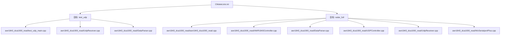
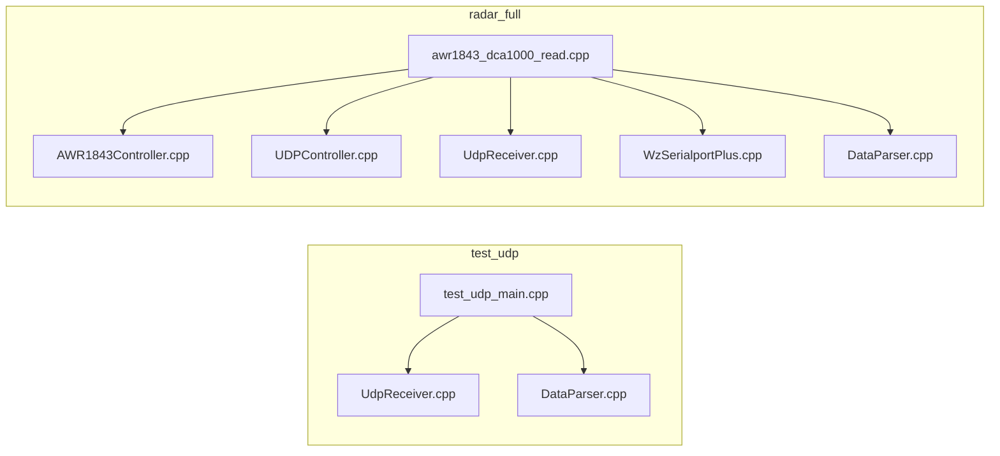
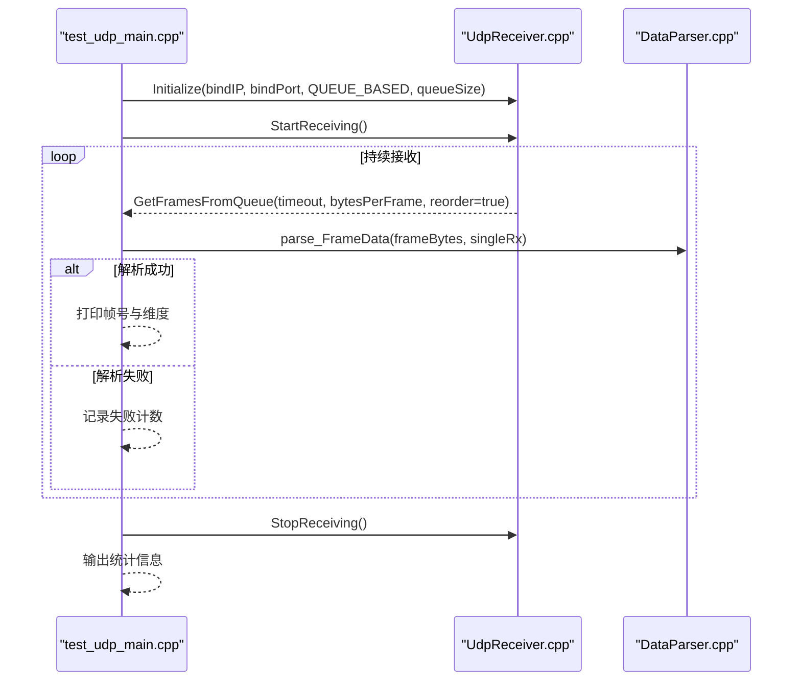
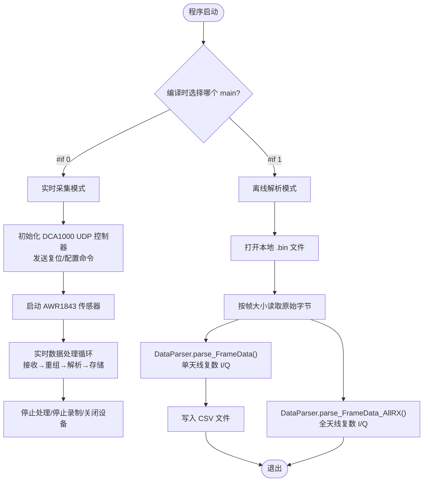
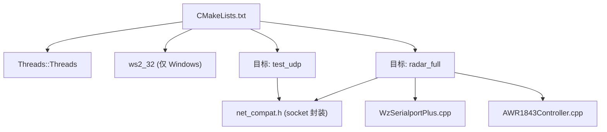

# 构建系统与运行入口

<cite>
**本文引用的文件**
- [CMakeLists.txt](file://CMakeLists.txt)
- [awr1843_dca1000_read.cpp](file://awr1843_dca1000_read/awr1843_dca1000_read.cpp)
- [test_udp_main.cpp](file://awr1843_dca1000_read/test_udp_main.cpp)
- [README.md](file://README.md)
</cite>

## 目录
1. [简介](#简介)
2. [项目结构](#项目结构)
3. [核心组件](#核心组件)
4. [架构总览](#架构总览)
5. [详细组件分析](#详细组件分析)
6. [依赖分析](#依赖分析)
7. [性能考虑](#性能考虑)
8. [故障排查指南](#故障排查指南)
9. [结论](#结论)

## 简介
本文件聚焦于构建系统与运行入口，围绕以下目标展开：
- 解析 CMakeLists.txt 的跨平台配置策略与两个构建目标的源文件组成、用途差异；
- 说明 test_udp 与 radar_full 两个可执行文件的职责边界与适用场景；
- 解释主程序 awr1843_dca1000_read.cpp 中 #if 0（实时采集）与 #if 1（离线解析）两种运行模式的行为差异与切换方式。

## 项目结构
仓库根目录包含一个顶层 CMakeLists.txt 与一个 awr1843_dca1000_read 子目录，后者集中存放雷达数据采集与解析相关的头文件与实现文件。构建系统通过 CMake 定义了两个独立的可执行目标：
- test_udp：仅包含网络接收与数据解析链路，不含串口链路与设备控制，用于三平台快速验证 UDP→重组→解析通路；
- radar_full：完整程序，包含串口链路与 DCA1000 命令通道，支持真实硬件交互与实时采集。

图表来源
- [CMakeLists.txt:25-47](file://CMakeLists.txt#L25-L47)

章节来源
- [CMakeLists.txt:1-63](file://CMakeLists.txt#L1-L63)

## 核心组件
- 构建系统
  - 使用 C++17 标准，默认 Release 构建类型；
  - 通过 find_package(Threads) 引入线程库，Windows 上为空实现，POSIX 需要 pthread；
  - 在 Windows 下显式链接 ws2_32 以支持 net_compat.h 的网络接口；
  - 定义两个目标：test_udp 与 radar_full，分别对应不同功能范围。
- 运行入口
  - awr1843_dca1000_read.cpp 提供两套 main 分支：
    - #if 0：实时采集模式（连接 DCA1000 命令口、启动传感器、写入二进制帧）；
    - #if 1：离线解析模式（读取本地 bin 文件，调用 DataParser 解析为复数 I/Q，并输出 CSV）。
  - test_udp_main.cpp 提供纯网络测试入口，不依赖串口与设备控制，适合无硬件环境下的端到端链路验证。

章节来源
- [CMakeLists.txt:1-63](file://CMakeLists.txt#L1-L63)
- [awr1843_dca1000_read.cpp:54-144](file://awr1843_dca1000_read/awr1843_dca1000_read.cpp#L54-L144)
- [awr1843_dca1000_read.cpp:145-212](file://awr1843_dca1000_read/awr1843_dca1000_read.cpp#L145-L212)
- [test_udp_main.cpp:1-117](file://awr1843_dca1000_read/test_udp_main.cpp#L1-L117)

## 架构总览
下图展示两个构建目标在源码层面的组成关系与职责边界。

图表来源
- [CMakeLists.txt:25-47](file://CMakeLists.txt#L25-L47)

## 详细组件分析

### 构建目标 test_udp
- 目的
  - 在不连接真实硬件的情况下，验证“UDP 接收 → seqNum 重组 → DataParser 解析”的数据通路；
  - 配合 Python 回放泵脚本，将本地 .bin 文件按帧重放至 UDP 端口，便于 CI 或无硬件调试。
- 源文件组成
  - test_udp_main.cpp：命令行参数绑定地址与端口、初始化 UDPReceiver、循环取帧并调用 DataParser 解析；
  - UdpReceiver.cpp：基于 net_compat 的跨平台 socket 封装，负责从 UDP 数据口接收原始字节并进行序列号重组；
  - DataParser.cpp：将原始字节还原为复数 I/Q 数据，支持单天线与全天线两种输出格式。
- 关键行为
  - 默认监听 0.0.0.0:4098，bytesPerFrame 可由命令行覆盖；
  - 内部队列模式接收，开启 seqNum 排序重组，超时等待；
  - 解析成功打印帧号与维度，Ctrl-C 优雅退出并统计成功/失败帧数与包错误计数。

图表来源
- [test_udp_main.cpp:43-116](file://awr1843_dca1000_read/test_udp_main.cpp#L43-L116)

章节来源
- [test_udp_main.cpp:1-117](file://awr1843_dca1000_read/test_udp_main.cpp#L1-L117)
- [CMakeLists.txt:25-31](file://CMakeLists.txt#L25-L31)

### 构建目标 radar_full
- 目的
  - 完整程序，包含串口链路与 DCA1000 命令通道，支持真实硬件交互与实时采集；
  - 保留原 main 的 #if 0/#if 1 双分支结构，默认走离线回放分支。
- 源文件组成
  - awr1843_dca1000_read.cpp：主程序入口，含两套 main 分支；
  - AWR1843Controller.cpp：AWR1843 雷达控制（header-only 逻辑主要在头文件中）；
  - UDPController.cpp：DCA1000 命令通道（命令口 4096）；
  - UdpReceiver.cpp：数据通道（数据口 4098）；
  - WzSerialportPlus.cpp：跨平台串口实现（POSIX termios 分支）；
  - DataParser.cpp：数据解析器。
- 关键行为
  - #if 0 分支：复位 DCA1000 ARM/FPGA、配置 cf.json 相关参数、启动录制、启动传感器、进入实时处理循环；
  - #if 1 分支：打开本地 .bin 文件，按帧大小读取，调用 DataParser 解析为复数 I/Q，并输出 CSV；同时演示全天线解析接口。

图表来源
- [awr1843_dca1000_read.cpp:54-144](file://awr1843_dca1000_read/awr1843_dca1000_read.cpp#L54-L144)
- [awr1843_dca1000_read.cpp:145-212](file://awr1843_dca1000_read/awr1843_dca1000_read.cpp#L145-L212)

章节来源
- [CMakeLists.txt:38-47](file://CMakeLists.txt#L38-L47)
- [awr1843_dca1000_read.cpp:54-144](file://awr1843_dca1000_read/awr1843_dca1000_read.cpp#L54-L144)
- [awr1843_dca1000_read.cpp:145-212](file://awr1843_dca1000_read/awr1843_dca1000_read.cpp#L145-L212)

### 主程序运行模式切换（#if 0 vs #if 1）
- 当前默认
  - #if 1 分支启用，即离线解析模式；
  - 该模式不依赖串口与 DCA1000 命令通道，仅依赖 DataParser 与本地输入文件。
- 切换方式
  - 将 awr1843_dca1000_read.cpp 中的 #if 0 改为 #if 1，并将 #if 1 改为 #if 0，即可切换到实时采集模式；
  - 注意修改路径与参数（如每帧字节数、输入/输出路径等）与实际硬件配置一致。
- 注意事项
  - 实时模式需确保网络与串口连通性，以及 cf.json 与 mmWave CLI 配置文件正确；
  - 离线模式需保证输入 .bin 文件大小与帧大小计算一致（numRX × numChirpsEachFrame × numADCSamples × 4）。

章节来源
- [awr1843_dca1000_read.cpp:54-144](file://awr1843_dca1000_read/awr1843_dca1000_read.cpp#L54-L144)
- [awr1843_dca1000_read.cpp:145-212](file://awr1843_dca1000_read/awr1843_dca1000_read.cpp#L145-L212)

## 依赖分析
- 线程库
  - 通过 find_package(Threads) 引入，POSIX 平台需要 pthread，Windows 为空实现；
  - 两个目标均链接 Threads::Threads。
- 网络库
  - Windows 下显式链接 ws2_32，确保非 MSVC 工具链也能通过；
  - net_compat.h 提供跨平台 socket 封装，test_udp 与 radar_full 均依赖。
- 串口与设备控制
  - radar_full 额外包含 WzSerialportPlus.cpp 与 AWR1843Controller.cpp，用于串口通信与雷达控制；
  - test_udp 不包含这些模块，因此可在 Mac/Linux 直接构建与运行。

图表来源
- [CMakeLists.txt:14-15](file://CMakeLists.txt#L14-L15)
- [CMakeLists.txt:50-55](file://CMakeLists.txt#L50-L55)
- [CMakeLists.txt:25-47](file://CMakeLists.txt#L25-L47)

章节来源
- [CMakeLists.txt:1-63](file://CMakeLists.txt#L1-L63)

## 性能考虑
- 帧大小一致性
  - 帧字节数 = numRX × numChirpsEachFrame × numADCSamples × 4；若与实际配置不一致，会导致解析失败或数据错位；
- 队列与重组
  - test_udp 使用队列模式与 seqNum 重组，建议根据回放速率调整队列大小与超时时间；
- I/O 吞吐
  - 离线解析模式下，CSV 写入频率较高，可适当批量化以减少磁盘 I/O 压力；
- 线程与同步
  - 多线程环境下日志与队列操作应保证线程安全，避免竞争条件导致丢帧或重复帧。

[本节为通用指导，不涉及具体文件分析]

## 故障排查指南
- 构建阶段
  - Windows 下缺少 ws2_32 链接：检查 CMakeLists.txt 是否包含平台判断与链接；
  - POSIX 平台未安装 pthread：确认 Threads 包可用且编译器支持。
- 运行阶段
  - UDP 接收失败：检查绑定地址与端口是否与回放脚本一致；
  - 解析失败：核对帧大小与输入文件完整性；
  - 串口无法打开：确认串口号与权限，关闭占用串口的其他进程。

章节来源
- [README.md:102-108](file://README.md#L102-L108)

## 结论
- CMakeLists.txt 清晰定义了 test_udp 与 radar_full 两个目标，前者用于无硬件环境下的网络链路验证，后者为完整程序；
- 主程序通过 #if 0/#if 1 切换实时采集与离线解析两种模式，默认启用离线解析；
- 跨平台改造体现在 net_compat.h、WzSerialportPlus 的 POSIX 分支与 test_udp_main.cpp 的跨平台设计；
- 建议在扩展数据处理流程时，统一接入点位于 DataParser 的输出类型 FrameDataSingleRx/FrameDataAllRx，以便在实时与离线两条链路中复用。