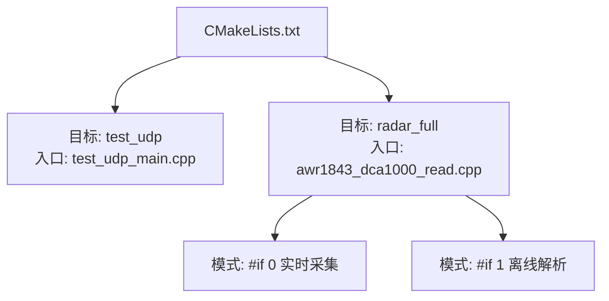
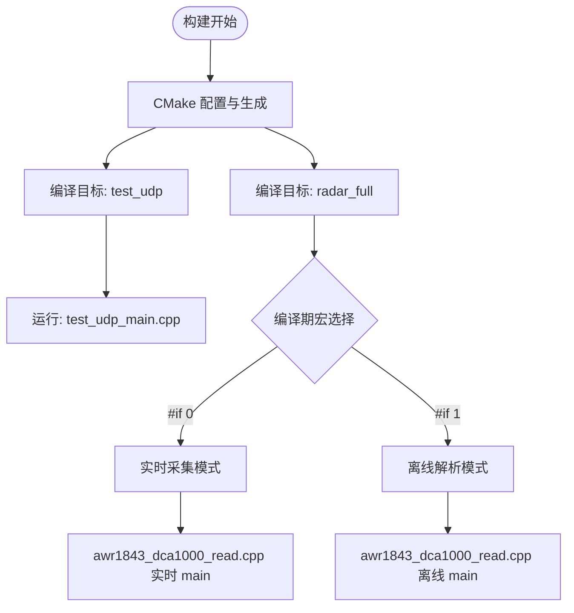
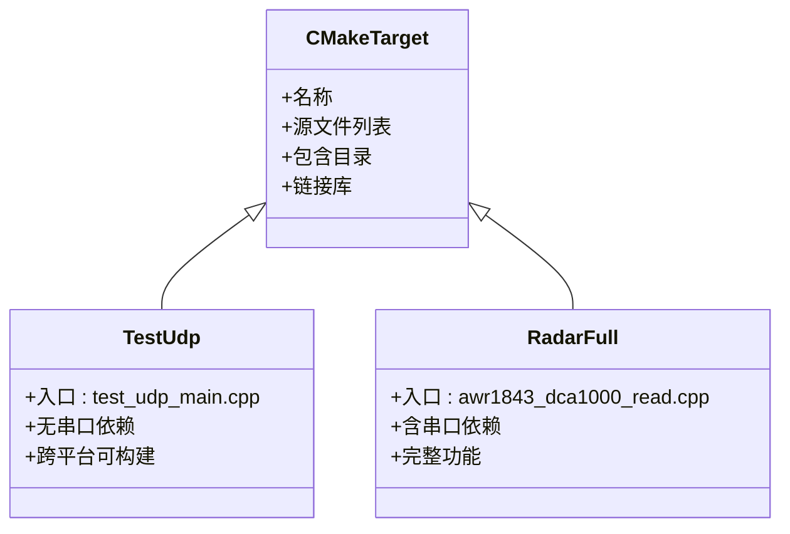
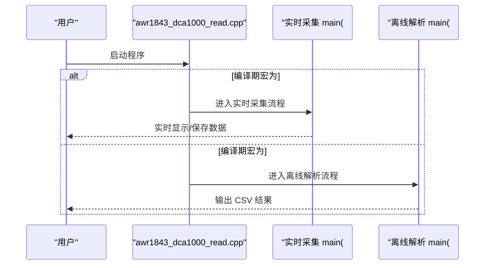
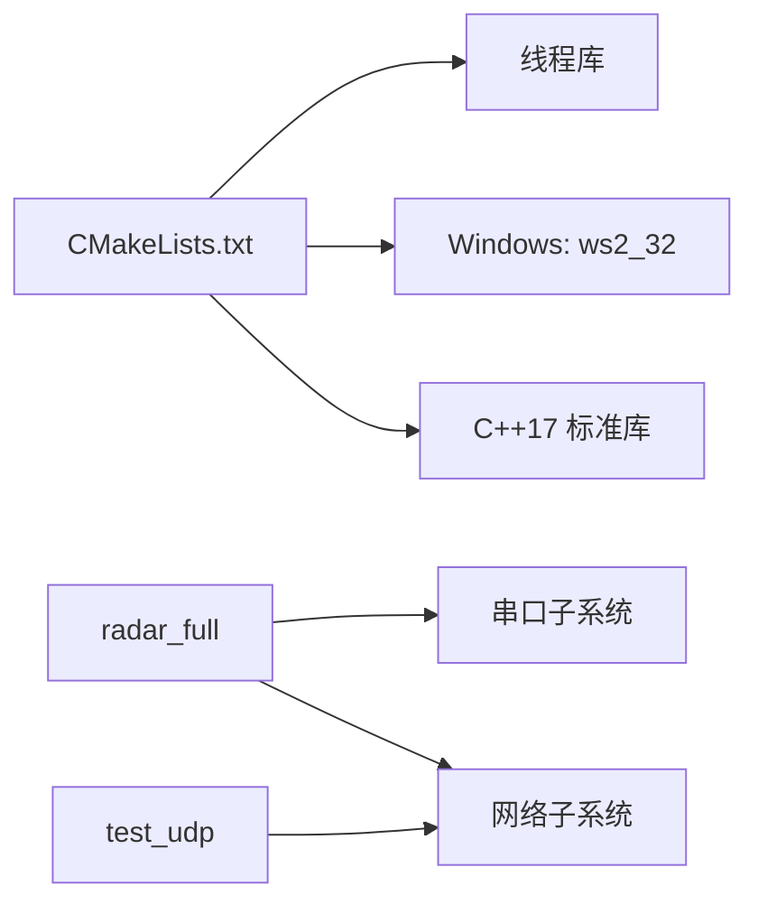

# 构建系统与运行入口

<cite>
**本文引用的文件**   
- [CMakeLists.txt](file://CMakeLists.txt)
- [awr1843_dca1000_read.cpp](file://awr1843_dca1000_read.cpp)
- [test_udp_main.cpp](file://test_udp_main.cpp)
</cite>

## 目录
1. [简介](#简介)
2. [项目结构](#项目结构)
3. [核心组件](#核心组件)
4. [架构总览](#架构总览)
5. [详细组件分析](#详细组件分析)
6. [依赖分析](#依赖分析)
7. [性能考虑](#性能考虑)
8. [故障排查指南](#故障排查指南)
9. [结论](#结论)

## 简介
本文件聚焦于该 AWR1843 雷达工具的构建系统与运行入口，重点解析：
- CMakeLists.txt 的跨平台配置策略与目标定义
- test_udp 与 radar_full 两个构建目标的源文件组成与用途差异
- awr1843_dca1000_read.cpp 中通过 #if 0/#if 1 切换的两种运行模式（实时采集/离线解析）

本项目为 C++17，仅依赖标准库；网络与串口相关能力通过跨平台适配层实现。

## 项目结构
- 顶层包含 CMakeLists.txt 作为构建入口，定义了两个可执行目标：test_udp 与 radar_full。
- 主程序入口位于 awr1843_dca1000_read.cpp，通过编译期宏开关选择“实时采集”或“离线解析”两种 main 分支。
- test_udp 目标以 test_udp_main.cpp 为入口，用于配合 Python 回放泵进行 UDP→重组→解析链路测试。

**图表来源** 
- [CMakeLists.txt](file://CMakeLists.txt)
- [awr1843_dca1000_read.cpp](file://awr1843_dca1000_read.cpp)
- [test_udp_main.cpp](file://test_udp_main.cpp)

**章节来源**
- [CMakeLists.txt](file://CMakeLists.txt)
- [awr1843_dca1000_read.cpp](file://awr1843_dca1000_read.cpp)
- [test_udp_main.cpp](file://test_udp_main.cpp)

## 核心组件
- 构建系统（CMake）
  - 定义两个可执行目标：test_udp、radar_full
  - 根据平台自动链接线程库与 Windows 特定库（ws2_32）
  - 设置 C++17 标准与必要的编译选项
- 运行入口（awr1843_dca1000_read.cpp）
  - 使用 #if 0 分支：实时采集模式（从 DCA1000/雷达设备接收数据并处理）
  - 使用 #if 1 分支：离线解析模式（读取 bin 文件并输出 CSV）
- 测试入口（test_udp_main.cpp）
  - 面向 UDP 数据通路的独立测试程序，便于在无硬件环境下验证数据重组与解析流程

**章节来源**
- [CMakeLists.txt](file://CMakeLists.txt)
- [awr1843_dca1000_read.cpp](file://awr1843_dca1000_read.cpp)
- [test_udp_main.cpp](file://test_udp_main.cpp)

## 架构总览
下图展示了 CMake 构建产物与运行时入口的关系，以及两种运行模式的分支点。

**图表来源** 
- [CMakeLists.txt](file://CMakeLists.txt)
- [awr1843_dca1000_read.cpp](file://awr1843_dca1000_read.cpp)
- [test_udp_main.cpp](file://test_udp_main.cpp)

## 详细组件分析

### CMakeLists.txt 跨平台配置与目标定义
- 目标划分
  - test_udp：不包含串口链，三平台可构建，用于 UDP 数据通路测试
  - radar_full：包含串口链，完整功能的可执行程序
- 平台差异处理
  - 在 Windows 上链接 ws2_32（Winsock）
  - 在所有平台链接线程库（Threads::Threads），保证多线程能力
- 语言与标准
  - 启用 C++17 标准
  - 设置必要的编译选项（如警告级别、优化等）
- 源文件组织
  - 各目标通过 target_sources 指定其源文件集合
  - 头文件路径通过 include_directories 或 target_include_directories 暴露给编译器

**图表来源** 
- [CMakeLists.txt](file://CMakeLists.txt)

**章节来源**
- [CMakeLists.txt](file://CMakeLists.txt)

### test_udp 目标：源文件组成与用途
- 入口文件：test_udp_main.cpp
- 用途：
  - 独立于硬件的 UDP 数据通路测试
  - 配合 Python 回放泵模拟 DCA1000 数据流，验证“接收→重组→解析”链路
- 特点：
  - 不依赖串口与设备控制模块
  - 强调网络兼容性与帧重组逻辑的正确性

**章节来源**
- [CMakeLists.txt](file://CMakeLists.txt)
- [test_udp_main.cpp](file://test_udp_main.cpp)

### radar_full 目标：源文件组成与用途
- 入口文件：awr1843_dca1000_read.cpp
- 用途：
  - 完整功能的雷达数据采集/解析工具
  - 支持实时采集与离线解析两种模式
- 特点：
  - 包含串口链路与设备控制逻辑
  - 通过编译期宏切换运行模式

**章节来源**
- [CMakeLists.txt](file://CMakeLists.txt)
- [awr1843_dca1000_read.cpp](file://awr1843_dca1000_read.cpp)

### 主程序运行模式：#if 0(实时采集)/#if 1(离线解析)
- 模式选择机制
  - 通过 #if 0/#if 1 编译期宏控制 main 分支
  - 当前默认 #if 1 为离线解析模式
- 实时采集模式（#if 0）
  - 负责从 DCA1000/雷达设备接收原始数据
  - 进入实时数据处理流水线（接收→重组→解析）
- 离线解析模式（#if 1）
  - 读取已保存的 bin 文件
  - 将二进制数据转换为 CSV 文本输出

**图表来源** 
- [awr1843_dca1000_read.cpp](file://awr1843_dca1000_read.cpp)

**章节来源**
- [awr1843_dca1000_read.cpp](file://awr1843_dca1000_read.cpp)

## 依赖分析
- 构建期依赖
  - C++17 标准库
  - 线程库（所有平台）
  - Windows 特定库（ws2_32，仅在 Windows 平台链接）
- 运行期依赖
  - 实时采集模式需要串口与网络设备接口
  - 离线解析模式仅需文件系统访问权限

**图表来源** 
- [CMakeLists.txt](file://CMakeLists.txt)

**章节来源**
- [CMakeLists.txt](file://CMakeLists.txt)

## 性能考虑
- 构建优化
  - 合理设置 CMake 优化等级（如 Release/Debug）
  - 避免不必要的源文件参与构建
- 运行性能
  - 实时模式下注意 I/O 与网络吞吐瓶颈
  - 离线模式下建议批量读写以减少系统调用开销

[本节为通用指导，不直接分析具体文件]

## 故障排查指南
- 构建失败
  - 检查是否安装了 C++17 支持的编译器
  - Windows 平台确认 ws2_32 库可用
  - 线程库是否正确链接（CMake 自动处理）
- 运行问题
  - 实时模式：确认串口权限与网络端口可达性
  - 离线模式：确认输入 bin 文件路径与权限正确

[本节为通用指导，不直接分析具体文件]

## 结论
- CMakeLists.txt 清晰定义了 test_udp 与 radar_full 两个目标，并通过平台检测实现跨平台构建
- awr1843_dca1000_read.cpp 通过编译期宏提供两种运行模式，满足实时采集与离线解析的不同需求
- test_udp 目标为纯软件测试场景提供了独立的 UDP 数据通路验证能力

[本节为总结性内容，不直接分析具体文件]