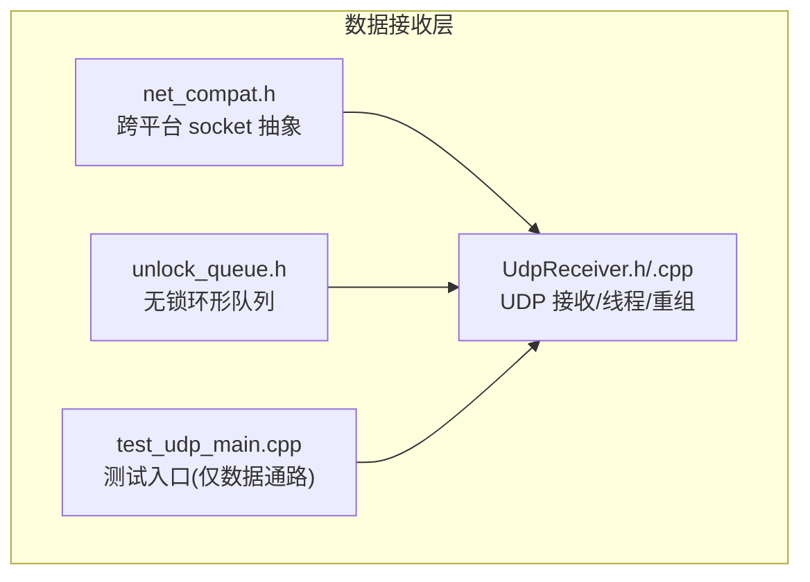
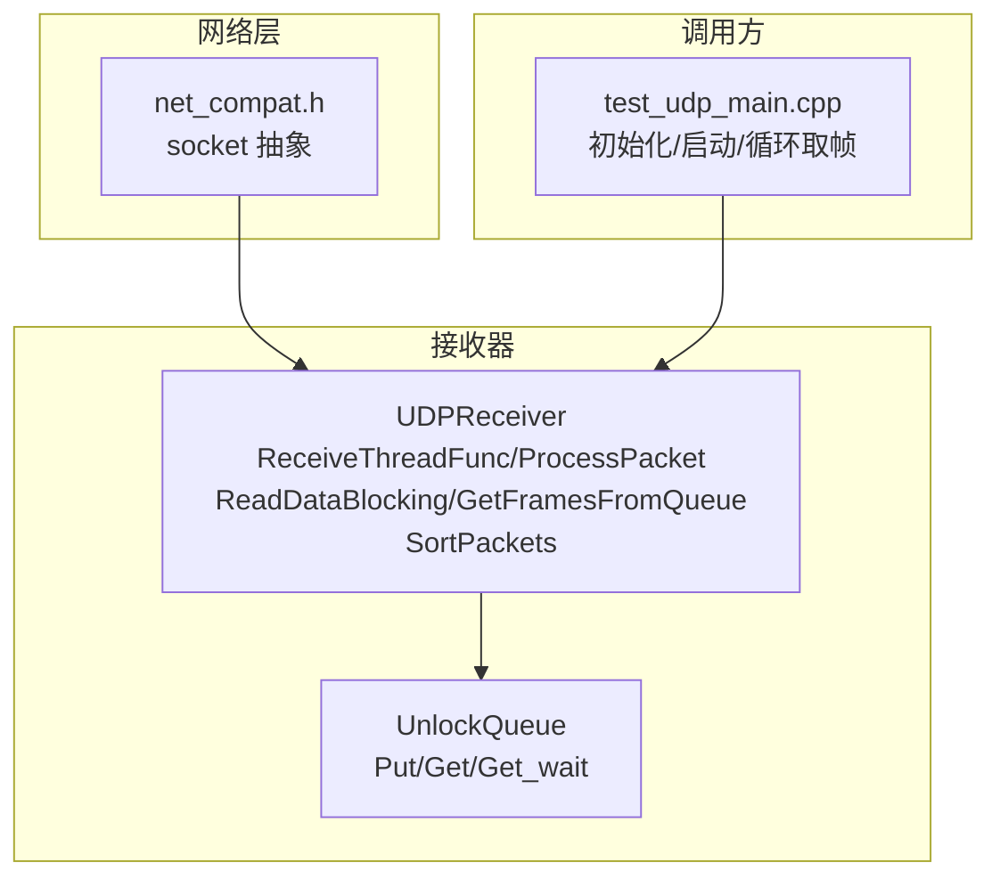
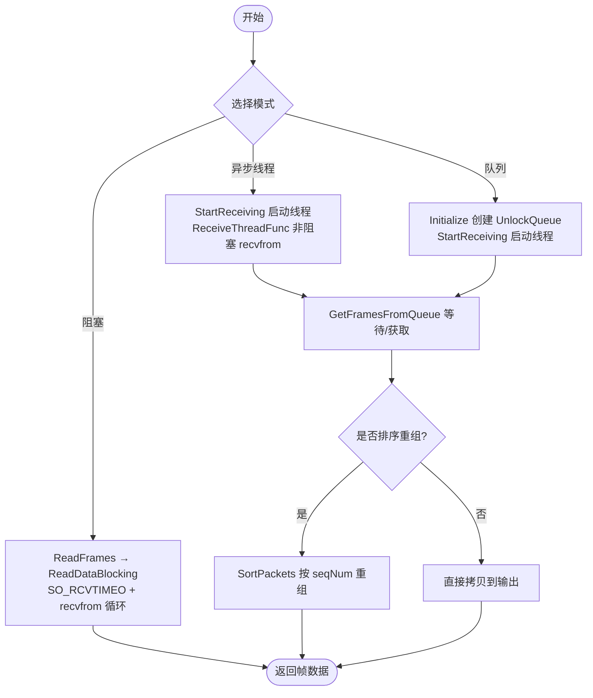
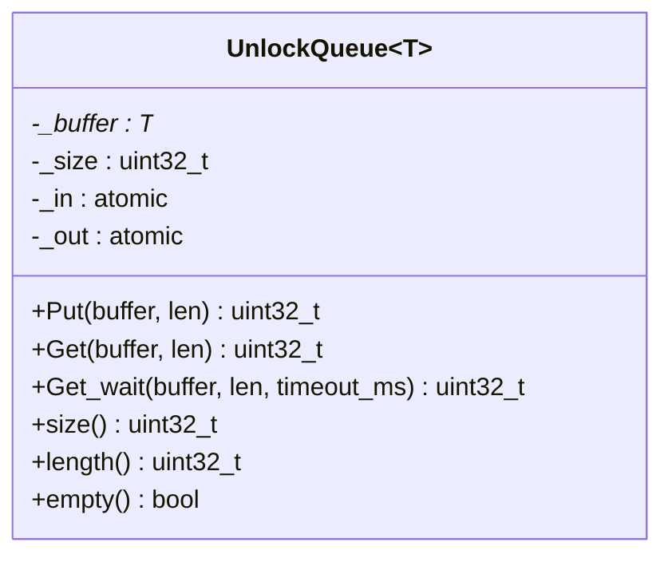
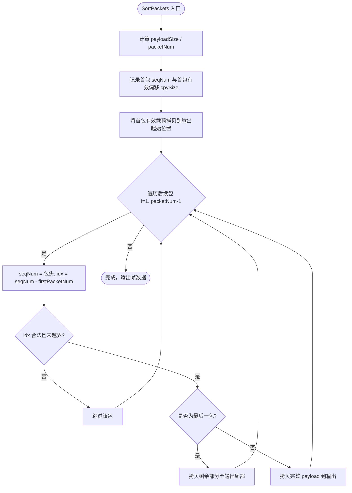
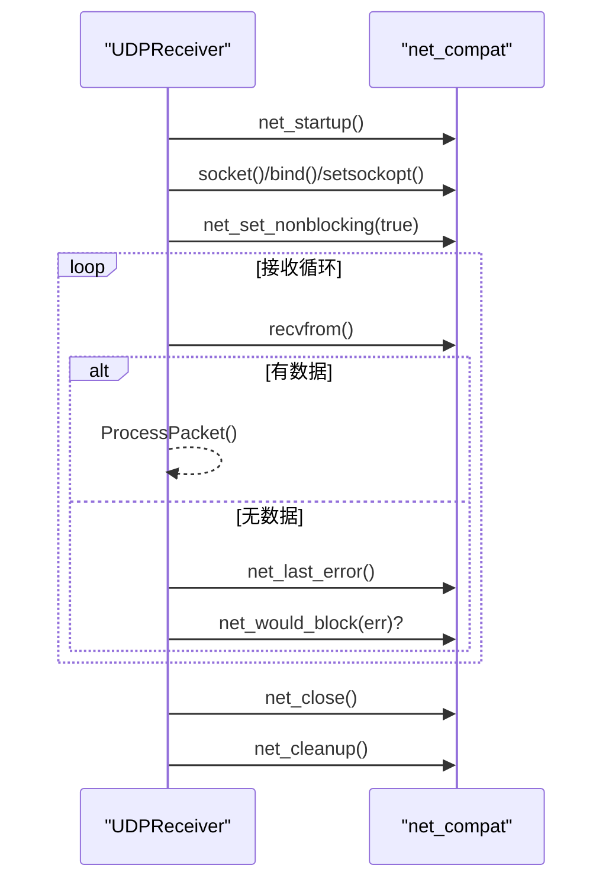
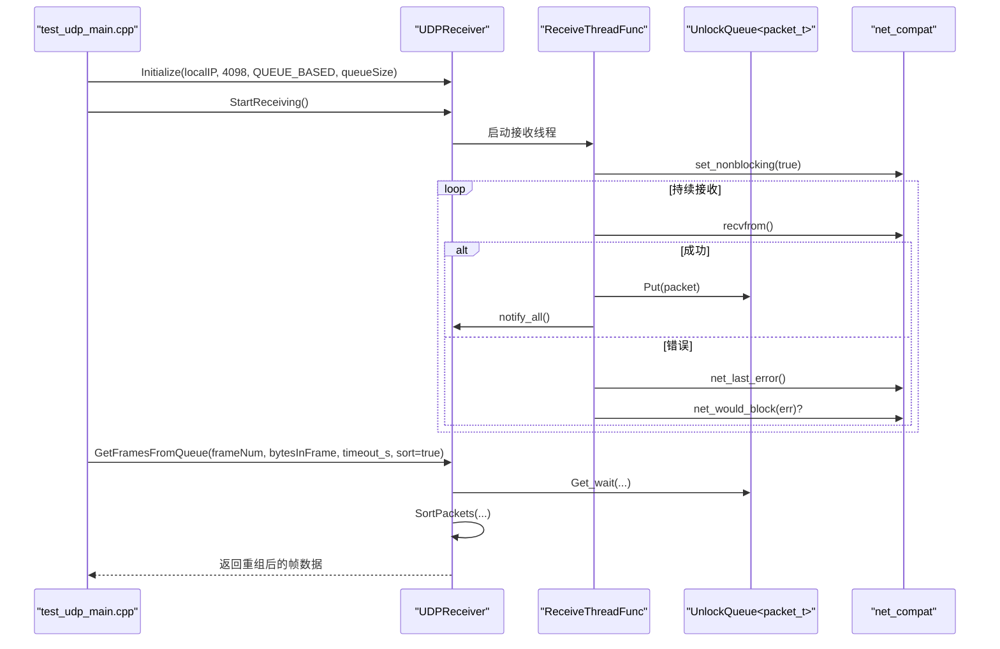
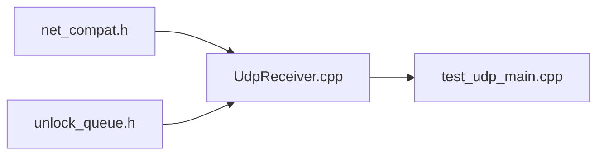

# 数据接收与帧重组

<cite>
**本文引用的文件**   
- [UdpReceiver.h](file://awr1843_dca1000_read/UdpReceiver.h)
- [UdpReceiver.cpp](file://awr1843_dca1000_read/UdpReceiver.cpp)
- [unlock_queue.h](file://awr1843_dca1000_read/unlock_queue.h)
- [net_compat.h](file://awr1843_dca1000_read/net_compat.h)
- [test_udp_main.cpp](file://awr1843_dca1000_read/test_udp_main.cpp)
</cite>

## 目录
1. [简介](#简介)
2. [项目结构](#项目结构)
3. [核心组件](#核心组件)
4. [架构总览](#架构总览)
5. [详细组件分析](#详细组件分析)
6. [依赖关系分析](#依赖关系分析)
7. [性能考量](#性能考量)
8. [故障排查指南](#故障排查指南)
9. [结论](#结论)

## 简介
本章节聚焦第 1 层（数据接收层）：以 net_compat.h 跨平台 socket 层为基础，讲解 UDPReceiver 经数据口 4098 接收 DCA1000 的 LVDS 数据流，包括三种接收模式、UDP 包结构 seqNum+byteCnt+payload、UnlockQueue 无锁环形队列缓冲，以及基于 seqNum 的跨帧重组算法 SortPackets。该链路为纯数据通路，不包含任何设备控制命令。

## 项目结构
围绕数据接收与重组的相关源文件如下：
- UdpReceiver.h/.cpp：实现 UDP 接收、线程模型、帧重组与统计
- unlock_queue.h：无锁环形队列 UnlockQueue<T>
- net_compat.h：跨平台 socket 薄层封装
- test_udp_main.cpp：仅使用 UDPReceiver/DataParser 的测试入口，验证“UDP 接收 → 重组 → 解析”链路

图表来源
- [net_compat.h:1-100](file://awr1843_dca1000_read/net_compat.h#L1-L100)
- [UdpReceiver.h:1-116](file://awr1843_dca1000_read/UdpReceiver.h#L1-L116)
- [UdpReceiver.cpp:1-415](file://awr1843_dca1000_read/UdpReceiver.cpp#L1-L415)
- [unlock_queue.h:1-119](file://awr1843_dca1000_read/unlock_queue.h#L1-L119)
- [test_udp_main.cpp:1-117](file://awr1843_dca1000_read/test_udp_main.cpp#L1-L117)

章节来源
- [UdpReceiver.h:1-116](file://awr1843_dca1000_read/UdpReceiver.h#L1-L116)
- [UdpReceiver.cpp:1-415](file://awr1843_dca1000_read/UdpReceiver.cpp#L1-L415)
- [unlock_queue.h:1-119](file://awr1843_dca1000_read/unlock_queue.h#L1-L119)
- [net_compat.h:1-100](file://awr1843_dca1000_read/net_compat.h#L1-L100)
- [test_udp_main.cpp:1-117](file://awr1843_dca1000_read/test_udp_main.cpp#L1-L117)

## 核心组件
- 网络兼容层 net_compat.h
  - 统一 SOCKET/INVALID_SOCKET/SOCKET_ERROR 等类型与错误码
  - 提供 net_startup/net_cleanup/net_close/net_last_error/net_would_block/net_set_nonblocking 等 API
- UDP 数据包结构 packet_t
  - 头部包含序列号 seqNum 与字节计数 byteCnt[6]
  - 负载 payload 长度固定为 PACKET_SIZE_DEFAULT - 10
- UDPReceiver
  - 支持三种接收模式：阻塞、异步线程、基于队列的异步
  - 内部维护接收线程、条件变量、统计信息
  - 提供 ReadFrames（阻塞）、GetFramesFromQueue（队列模式）接口
  - 提供 SortPackets 按 seqNum 重组一帧
- UnlockQueue<T>
  - 基于原子指针的无锁环形队列，Put/Get/Get_wait 提供高效缓冲
- 测试入口 test_udp_main.cpp
  - 演示 QUEUE_BASED 模式下从 4098 端口取帧并交由 DataParser 解析

章节来源
- [net_compat.h:1-100](file://awr1843_dca1000_read/net_compat.h#L1-L100)
- [UdpReceiver.h:12-33](file://awr1843_dca1000_read/UdpReceiver.h#L12-L33)
- [UdpReceiver.h:34-116](file://awr1843_dca1000_read/UdpReceiver.h#L34-L116)
- [UdpReceiver.cpp:1-415](file://awr1843_dca1000_read/UdpReceiver.cpp#L1-L415)
- [unlock_queue.h:1-119](file://awr1843_dca1000_read/unlock_queue.h#L1-L119)
- [test_udp_main.cpp:1-117](file://awr1843_dca1000_read/test_udp_main.cpp#L1-L117)

## 架构总览
下图展示数据接收层在运行时的交互关系：底层 socket 由 net_compat 屏蔽差异；UDPReceiver 负责收包、入队、等待与重组；UnlockQueue 作为生产者-消费者缓冲；测试程序驱动整个流程。

图表来源
- [net_compat.h:1-100](file://awr1843_dca1000_read/net_compat.h#L1-L100)
- [UdpReceiver.cpp:231-283](file://awr1843_dca1000_read/UdpReceiver.cpp#L231-L283)
- [UdpReceiver.cpp:285-290](file://awr1843_dca1000_read/UdpReceiver.cpp#L285-L290)
- [UdpReceiver.cpp:151-229](file://awr1843_dca1000_read/UdpReceiver.cpp#L151-L229)
- [UdpReceiver.cpp:377-410](file://awr1843_dca1000_read/UdpReceiver.cpp#L377-L410)
- [unlock_queue.h:34-117](file://awr1843_dca1000_read/unlock_queue.h#L34-L117)
- [test_udp_main.cpp:71-106](file://awr1843_dca1000_read/test_udp_main.cpp#L71-L106)

## 详细组件分析

### UDP 包结构与帧边界
- 包结构
  - seqNum：32 位序列号，用于排序与帧内定位
  - byteCnt：6 字节字段，表示当前包的字节计数（实际重组主要依赖 seqNum）
  - payload：PACKET_SIZE_DEFAULT - 10 字节负载
- 帧大小约定
  - 每帧字节数 = numRX × numChirpsEachFrame × numADCSamples × 4
  - 帧内包数量根据 bytesInFrame 与 payloadSize 计算
- 帧起始判定
  - 通过首个包的 seqNum 与 bytesInFrame 推导 lastFrameRemainBytes，从而确定首包在帧内的偏移位置

章节来源
- [UdpReceiver.h:16-22](file://awr1843_dca1000_read/UdpReceiver.h#L16-L22)
- [UdpReceiver.cpp:151-229](file://awr1843_dca1000_read/UdpReceiver.cpp#L151-L229)
- [UdpReceiver.cpp:292-375](file://awr1843_dca1000_read/UdpReceiver.cpp#L292-L375)

### 三种接收模式
- 阻塞模式（BLOCKING）
  - 调用 ReadFrames → ReadDataBlocking
  - 设置 SO_RCVTIMEO 超时，recvfrom 阻塞等待直到收到完整帧或超时
- 异步线程模式（ASYNC_THREAD）
  - 启动 ReceiveThreadFunc 非阻塞 recvfrom，将包放入 UnlockQueue
  - 主线程通过 GetFramesFromQueue 等待并消费
- 基于队列模式（QUEUE_BASED）
  - 与 ASYNC_THREAD 类似，但强调通过 UnlockQueue 解耦收发
  - 使用条件变量 data_ready_cv_ 通知等待者

图表来源
- [UdpReceiver.cpp:94-118](file://awr1843_dca1000_read/UdpReceiver.cpp#L94-L118)
- [UdpReceiver.cpp:136-149](file://awr1843_dca1000_read/UdpReceiver.cpp#L136-L149)
- [UdpReceiver.cpp:151-229](file://awr1843_dca1000_read/UdpReceiver.cpp#L151-L229)
- [UdpReceiver.cpp:231-283](file://awr1843_dca1000_read/UdpReceiver.cpp#L231-L283)
- [UdpReceiver.cpp:292-375](file://awr1843_dca1000_read/UdpReceiver.cpp#L292-L375)

章节来源
- [UdpReceiver.h:36-41](file://awr1843_dca1000_read/UdpReceiver.h#L36-L41)
- [UdpReceiver.cpp:94-118](file://awr1843_dca1000_read/UdpReceiver.cpp#L94-L118)
- [UdpReceiver.cpp:136-149](file://awr1843_dca1000_read/UdpReceiver.cpp#L136-L149)
- [UdpReceiver.cpp:151-229](file://awr1843_dca1000_read/UdpReceiver.cpp#L151-L229)
- [UdpReceiver.cpp:231-283](file://awr1843_dca1000_read/UdpReceiver.cpp#L231-L283)
- [UdpReceiver.cpp:292-375](file://awr1843_dca1000_read/UdpReceiver.cpp#L292-L375)

### 无锁环形队列 UnlockQueue
- 设计要点
  - 容量自动向上取整为 2 的幂，便于用位运算做索引掩码
  - _in/_out 为原子计数器，Put/Get 使用 memcpy 分两段拷贝处理环回
  - Get_wait 提供带超时的批量读取
- 复杂度
  - Put/Get 时间复杂度 O(n)，空间复杂度 O(capacity)
  - 内存访问局部性好，适合高吞吐场景

图表来源
- [unlock_queue.h:34-117](file://awr1843_dca1000_read/unlock_queue.h#L34-L117)

章节来源
- [unlock_queue.h:17-32](file://awr1843_dca1000_read/unlock_queue.h#L17-L32)
- [unlock_queue.h:34-117](file://awr1843_dca1000_read/unlock_queue.h#L34-L117)

### 基于 seqNum 的跨帧重组 SortPackets
- 输入
  - 已按接收顺序存放的原始包缓冲区（含包头）
  - frameNum、bytesInFrame、packetSize、lastFrameRemainBytes
- 关键步骤
  - 计算 payloadSize = packetSize - 10
  - 计算所需包数 packetNum
  - 以首包的 seqNum 为基准，按 seqNum 映射到输出 buffer 的目标位置
  - 首包只拷贝 payload 中属于当前帧的部分（跳过 lastFrameRemainBytes）
  - 后续包按 seqNum 顺序写入，最后一个包可能截断至帧尾
- 结果
  - output 大小为 frameNum × bytesInFrame，即完整的一帧 I/Q 数据

图表来源
- [UdpReceiver.cpp:377-410](file://awr1843_dca1000_read/UdpReceiver.cpp#L377-L410)

章节来源
- [UdpReceiver.cpp:377-410](file://awr1843_dca1000_read/UdpReceiver.cpp#L377-L410)

### 跨平台 socket 层 net_compat
- 作用
  - 统一 SOCKET/INVALID_SOCKET/SOCKET_ERROR 等类型与错误码
  - 提供 net_startup/net_cleanup/net_close/net_last_error/net_would_block/net_set_nonblocking
- 影响范围
  - UDPReceiver 构造/析构/初始化/接收线程均通过 netcompat 进行平台相关操作
  - 确保 Windows 与 POSIX 行为一致

图表来源
- [net_compat.h:39-97](file://awr1843_dca1000_read/net_compat.h#L39-L97)
- [UdpReceiver.cpp:8-39](file://awr1843_dca1000_read/UdpReceiver.cpp#L8-L39)
- [UdpReceiver.cpp:41-92](file://awr1843_dca1000_read/UdpReceiver.cpp#L41-L92)
- [UdpReceiver.cpp:231-283](file://awr1843_dca1000_read/UdpReceiver.cpp#L231-L283)

章节来源
- [net_compat.h:1-100](file://awr1843_dca1000_read/net_compat.h#L1-L100)
- [UdpReceiver.cpp:8-39](file://awr1843_dca1000_read/UdpReceiver.cpp#L8-L39)
- [UdpReceiver.cpp:41-92](file://awr1843_dca1000_read/UdpReceiver.cpp#L41-L92)
- [UdpReceiver.cpp:231-283](file://awr1843_dca1000_read/UdpReceiver.cpp#L231-L283)

### 端到端调用时序（队列模式）

图表来源
- [test_udp_main.cpp:71-106](file://awr1843_dca1000_read/test_udp_main.cpp#L71-L106)
- [UdpReceiver.cpp:94-118](file://awr1843_dca1000_read/UdpReceiver.cpp#L94-L118)
- [UdpReceiver.cpp:151-229](file://awr1843_dca1000_read/UdpReceiver.cpp#L151-L229)
- [UdpReceiver.cpp:231-283](file://awr1843_dca1000_read/UdpReceiver.cpp#L231-L283)
- [UdpReceiver.cpp:377-410](file://awr1843_dca1000_read/UdpReceiver.cpp#L377-L410)

## 依赖关系分析
- UDPReceiver 依赖
  - net_compat：socket 生命周期、错误处理、非阻塞设置
  - UnlockQueue：生产者-消费者缓冲
  - std::thread/std::mutex/std::condition_variable：线程与同步
- 外部耦合
  - 上层调用方（如 test_udp_main.cpp）仅依赖 UDPReceiver 的公共接口
  - 不依赖串口或 DCA1000 命令通道（命令口 4096 不在本链路范围内）

图表来源
- [UdpReceiver.cpp:1-415](file://awr1843_dca1000_read/UdpReceiver.cpp#L1-L415)
- [net_compat.h:1-100](file://awr1843_dca1000_read/net_compat.h#L1-L100)
- [unlock_queue.h:1-119](file://awr1843_dca1000_read/unlock_queue.h#L1-L119)
- [test_udp_main.cpp:1-117](file://awr1843_dca1000_read/test_udp_main.cpp#L1-L117)

章节来源
- [UdpReceiver.cpp:1-415](file://awr1843_dca1000_read/UdpReceiver.cpp#L1-L415)
- [net_compat.h:1-100](file://awr1843_dca1000_read/net_compat.h#L1-L100)
- [unlock_queue.h:1-119](file://awr1843_dca1000_read/unlock_queue.h#L1-L119)
- [test_udp_main.cpp:1-117](file://awr1843_dca1000_read/test_udp_main.cpp#L1-L117)

## 性能考量
- 接收路径
  - 非阻塞 recvfrom + 短睡眠避免忙轮询
  - UnlockQueue 使用原子计数与 memcpy，减少锁竞争
- 重组路径
  - SortPackets 单次线性扫描，按 seqNum 直接映射写入，避免额外排序开销
- 缓冲区
  - 可配置 SO_RCVBUF 提升内核接收缓冲
  - 建议根据带宽与丢包率调整队列深度与超时参数

## 故障排查指南
- 常见现象与定位
  - 接收超时：检查 SO_RCVTIMEO 设置与网络连通性
  - 不完整帧：确认 expectedPacketNum 计算与 lastFrameRemainBytes 推导是否正确
  - 乱序导致重组失败：确认 seqNum 单调递增且无跳号
  - 队列溢出：增大 UnlockQueue 容量或降低发送速率
- 诊断手段
  - 使用 GetStatistics 查看 receivedPacketNum/errorCount/expectedPacketNum
  - 打印首包 seqNum 与 lastFrameRemainBytes，验证帧起始判断
  - 在非阻塞模式下捕获 net_would_block 错误码，区分“暂无数据”与真实错误

章节来源
- [UdpReceiver.cpp:151-229](file://awr1843_dca1000_read/UdpReceiver.cpp#L151-L229)
- [UdpReceiver.cpp:292-375](file://awr1843_dca1000_read/UdpReceiver.cpp#L292-L375)
- [UdpReceiver.cpp:412-415](file://awr1843_dca1000_read/UdpReceiver.cpp#L412-L415)
- [net_compat.h:76-83](file://awr1843_dca1000_read/net_compat.h#L76-L83)

## 结论
数据接收层以 net_compat 为基石，通过 UDPReceiver 提供三种灵活的接收模式，并以 UnlockQueue 实现低延迟、高吞吐的数据缓冲。SortPackets 利用 seqNum 完成跨帧重组，保证输出为一帧完整的 I/Q 数据。该链路为纯数据通路，不包含任何设备控制命令，易于与上层解析与处理模块对接。