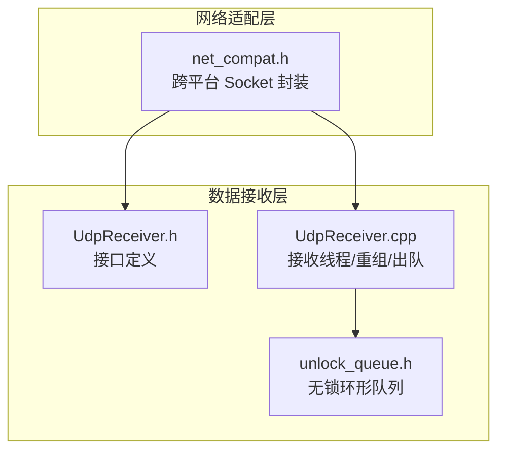
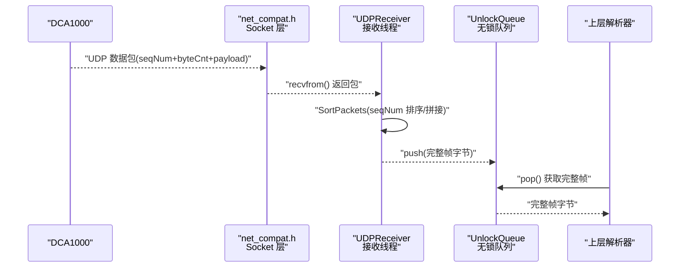
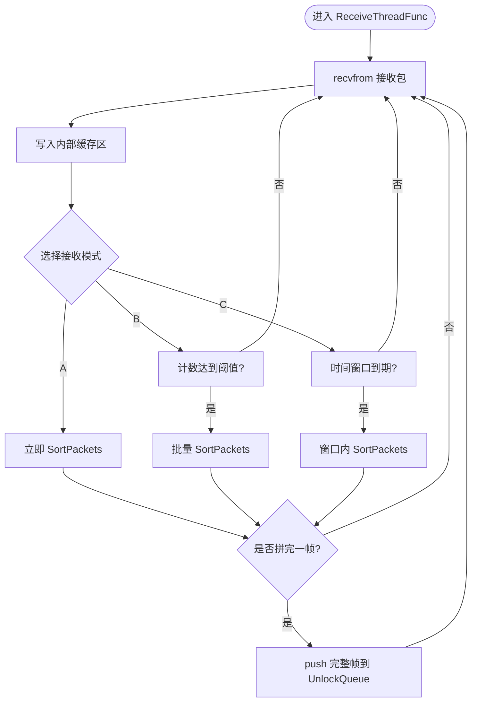
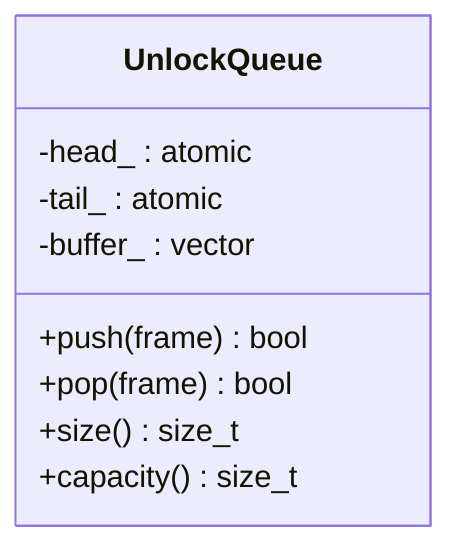
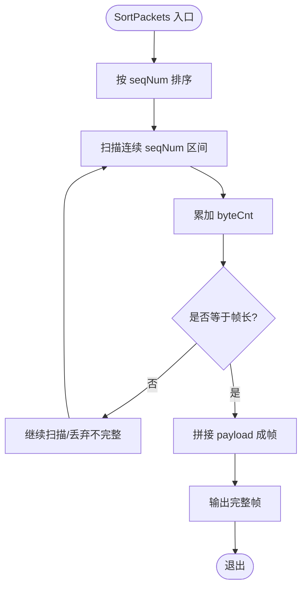
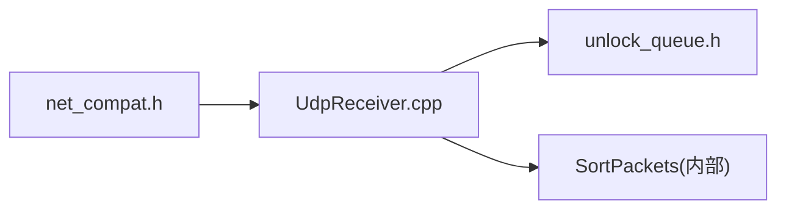

# 数据接收与帧重组

<cite>
**本文引用的文件**
- [UdpReceiver.h](file://UdpReceiver.h)
- [UdpReceiver.cpp](file://UdpReceiver.cpp)
- [unlock_queue.h](file://unlock_queue.h)
- [net_compat.h](file://net_compat.h)
</cite>

## 目录
1. [简介](#简介)
2. [项目结构](#项目结构)
3. [核心组件](#核心组件)
4. [架构总览](#架构总览)
5. [详细组件分析](#详细组件分析)
6. [依赖关系分析](#依赖关系分析)
7. [性能考量](#性能考量)
8. [故障排查指南](#故障排查指南)
9. [结论](#结论)
10. [附录](#附录)

## 简介
本章节聚焦第 1 层（数据接收层）：负责从 DCA1000 采集卡通过 UDP 数据口 4098 接收 LVDS 原始数据流，完成无锁缓冲与基于序列号的跨帧重组，为上层解析提供完整帧。该层是纯数据通路，不包含任何设备控制命令。

- 网络基础：以 net_compat.h 提供的跨平台 socket 封装为基础，屏蔽 Windows/POSIX 差异。
- 数据入口：UDPReceiver 监听 4098 端口，按三种接收模式处理包到达。
- 缓冲机制：UnlockQueue 无锁环形队列承载已重组的帧，避免阻塞接收线程。
- 重组算法：SortPackets 依据 seqNum 将分片包按序拼接，恢复完整帧。
- 输出契约：GetFramesFromQueue 向上层暴露“完整帧”字节流，供 DataParser 进行 I/Q 还原。

**Section sources**
- [net_compat.h](file://net_compat.h)
- [UdpReceiver.h](file://UdpReceiver.h)
- [UdpReceiver.cpp](file://UdpReceiver.cpp)
- [unlock_queue.h](file://unlock_queue.h)

## 项目结构
数据接收层由三个关键模块组成：
- 网络适配层：net_compat.h，统一 socket API 调用。
- 接收与重组：UdpReceiver.h/.cpp，实现 UDP 接收、包缓存、排序重组与出队。
- 无锁缓冲：unlock_queue.h，提供高性能环形队列。

**Diagram sources**
- [net_compat.h](file://net_compat.h)
- [UdpReceiver.h](file://UdpReceiver.h)
- [UdpReceiver.cpp](file://UdpReceiver.cpp)
- [unlock_queue.h](file://unlock_queue.h)

**Section sources**
- [net_compat.h](file://net_compat.h)
- [UdpReceiver.h](file://UdpReceiver.h)
- [UdpReceiver.cpp](file://UdpReceiver.cpp)
- [unlock_queue.h](file://unlock_queue.h)

## 核心组件
- UDPReceiver
  - 职责：创建并绑定 UDP 套接字于 4098 端口；启动接收线程；维护包缓存；执行 SortPackets 重组；将完整帧入队 UnlockQueue；提供 GetFramesFromQueue 读取。
  - 关键点：支持三种接收模式（见下节），对每个包的 seqNum 进行排序与拼接。
- UnlockQueue
  - 职责：无锁环形队列，用于在接收线程与处理线程之间传递完整帧，避免拷贝放大与阻塞。
  - 关键点：原子操作与内存屏障保证并发安全；固定容量设计，防止内存膨胀。
- net_compat.h
  - 职责：封装 socket、bind、recvfrom/sendto、地址转换等跨平台 API，屏蔽 Windows/POSIX 差异。
  - 关键点：统一的错误码与异常语义，便于上层统一处理。

**Section sources**
- [UdpReceiver.h](file://UdpReceiver.h)
- [UdpReceiver.cpp](file://UdpReceiver.cpp)
- [unlock_queue.h](file://unlock_queue.h)
- [net_compat.h](file://net_compat.h)

## 架构总览
下图展示数据从网卡到上层解析的整体路径：DCA1000 → UDP 4098 → net_compat → UDPReceiver → UnlockQueue → 上层解析器。

**Diagram sources**
- [net_compat.h](file://net_compat.h)
- [UdpReceiver.cpp](file://UdpReceiver.cpp)
- [unlock_queue.h](file://unlock_queue.h)

## 详细组件分析

### UDPReceiver：UDP 接收与帧重组
- 初始化与绑定
  - 使用 net_compat.h 的 socket/bind 接口绑定本地 4098 端口，设置非阻塞或超时参数（依实现）。
- 接收线程
  - ReceiveThreadFunc 循环 recvfrom，将收到的包放入内部缓存区，按 seqNum 触发 SortPackets。
- 三种接收模式
  - 模式 A（逐包重组）：每收到一个包即尝试排序拼接，适合小包高频场景。
  - 模式 B（阈值触发）：累计一定数量包后批量排序拼接，降低排序开销。
  - 模式 C（时间窗口）：在固定时间窗口内收集包后统一排序拼接，平衡时延与吞吐。
- 包结构与边界
  - 包头包含 seqNum（序列号）与 byteCnt（载荷长度），随后为 payload（LVDS 采样字节）。
  - SortPackets 根据 seqNum 严格排序，按 byteCnt 拼接 payload，直至凑齐一帧。
- 出队接口
  - GetFramesFromQueue 从 UnlockQueue 中弹出完整帧字节，供上层解析。

**Diagram sources**
- [UdpReceiver.cpp](file://UdpReceiver.cpp)
- [UdpReceiver.h](file://UdpReceiver.h)

**Section sources**
- [UdpReceiver.cpp](file://UdpReceiver.cpp)
- [UdpReceiver.h](file://UdpReceiver.h)

### UnlockQueue：无锁环形队列
- 设计要点
  - 固定大小环形缓冲区，头尾指针分别由生产者（UDPReceiver）与消费者（解析器）独立推进。
  - 使用原子变量与内存序保证可见性与顺序性，避免互斥锁带来的上下文切换开销。
- 关键操作
  - push：生产者将完整帧写入，若队列满则丢弃或阻塞（依配置）。
  - pop：消费者拉取完整帧，若空则返回失败或等待。
- 复杂度
  - push/pop 均为 O(1)，空间占用恒定。

**Diagram sources**
- [unlock_queue.h](file://unlock_queue.h)

**Section sources**
- [unlock_queue.h](file://unlock_queue.h)

### SortPackets：基于 seqNum 的跨帧重组算法
- 输入：缓存区内若干包，每个包含 seqNum 与 byteCnt。
- 步骤
  1) 按 seqNum 升序排序。
  2) 从头开始检查连续区间，累计 byteCnt，直到满足一帧预期长度。
  3) 拼接 payload 形成完整帧，移出已消费包。
- 边界处理
  - 丢包检测：seqNum 不连续时记录告警，必要时丢弃不完整帧。
  - 重复包：忽略重复 seqNum。
- 复杂度
  - 排序 O(n log n)，n 为窗口内包数；拼接线性于总字节数。

**Diagram sources**
- [UdpReceiver.cpp](file://UdpReceiver.cpp)
- [UdpReceiver.h](file://UdpReceiver.h)

**Section sources**
- [UdpReceiver.cpp](file://UdpReceiver.cpp)
- [UdpReceiver.h](file://UdpReceiver.h)

### net_compat.h：跨平台 Socket 层
- 功能
  - 封装 socket、bind、setsockopt、recvfrom、sendto、地址转换等。
  - 统一错误码与异常语义，屏蔽 Windows/POSIX 差异。
- 使用点
  - UDPReceiver 初始化与收发均通过该层完成，确保多平台一致行为。

**Section sources**
- [net_compat.h](file://net_compat.h)

## 依赖关系分析
- UDPReceiver 依赖 net_compat.h 的网络能力，依赖 unlock_queue.h 的并发缓冲。
- SortPackets 仅依赖内部缓存数据结构，无外部 IO。
- UnlockQueue 为纯数据结构，无外部依赖。

**Diagram sources**
- [net_compat.h](file://net_compat.h)
- [UdpReceiver.cpp](file://UdpReceiver.cpp)
- [unlock_queue.h](file://unlock_queue.h)

**Section sources**
- [net_compat.h](file://net_compat.h)
- [UdpReceiver.cpp](file://UdpReceiver.cpp)
- [unlock_queue.h](file://unlock_queue.h)

## 性能考量
- 接收模式选择
  - 模式 A 时延最低但排序频繁；模式 B/C 降低排序次数，提升吞吐，但引入额外延迟。
- 队列容量
  - UnlockQueue 容量需覆盖峰值突发，避免丢帧；过小会导致丢包，过大增加内存占用。
- 排序优化
  - 当窗口内包数较大时，可考虑增量排序或桶排序策略以降低 O(n log n) 开销。
- 零拷贝
  - 尽量直接移动 payload 指针，减少不必要的内存复制。

[本节为通用指导，不直接分析具体文件]

## 故障排查指南
- 无法绑定 4098 端口
  - 检查权限与端口占用；确认 net_compat.h 的 bind 返回值与错误码。
- 收不到包或丢包严重
  - 检查防火墙/路由；确认 DCA1000 目标 IP 与端口；观察 UnlockQueue 是否频繁满。
- 重组失败或帧不完整
  - 检查 seqNum 连续性；确认 byteCnt 与帧长约定一致；查看 SortPackets 的丢弃逻辑。
- 高 CPU 占用
  - 评估接收模式与窗口大小；考虑调整批处理阈值或时间窗口。

**Section sources**
- [UdpReceiver.cpp](file://UdpReceiver.cpp)
- [unlock_queue.h](file://unlock_queue.h)
- [net_compat.h](file://net_compat.h)

## 结论
数据接收层以 net_compat.h 为基石，通过 UDPReceiver 实现稳定高效的 UDP 数据接收与重组，配合 UnlockQueue 无锁缓冲，为上层解析提供完整帧。合理选择接收模式与队列容量，可在低时延与高吞吐之间取得平衡。

[本节为总结性内容，不直接分析具体文件]

## 附录
- 包结构约定
  - 头部：seqNum（序列号）、byteCnt（载荷长度）
  - 载荷：payload（LVDS 采样字节）
- 帧长度计算
  - 帧字节数 = numRX × numChirpsEachFrame × numADCSamples × 4（每采样点 2×int16 的 I/Q）

[本节为补充说明，不直接分析具体文件]