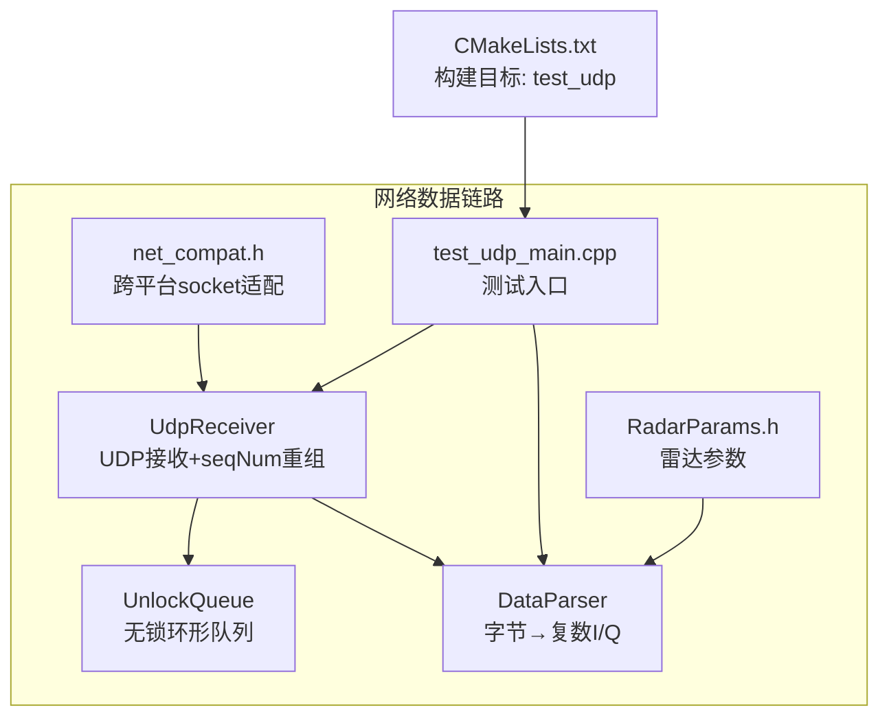
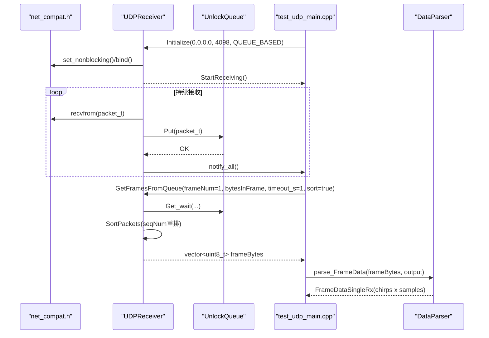
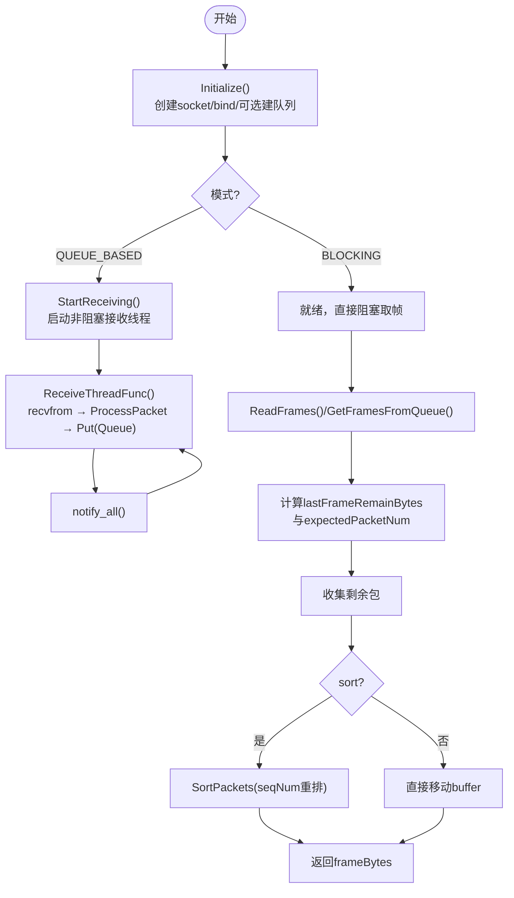
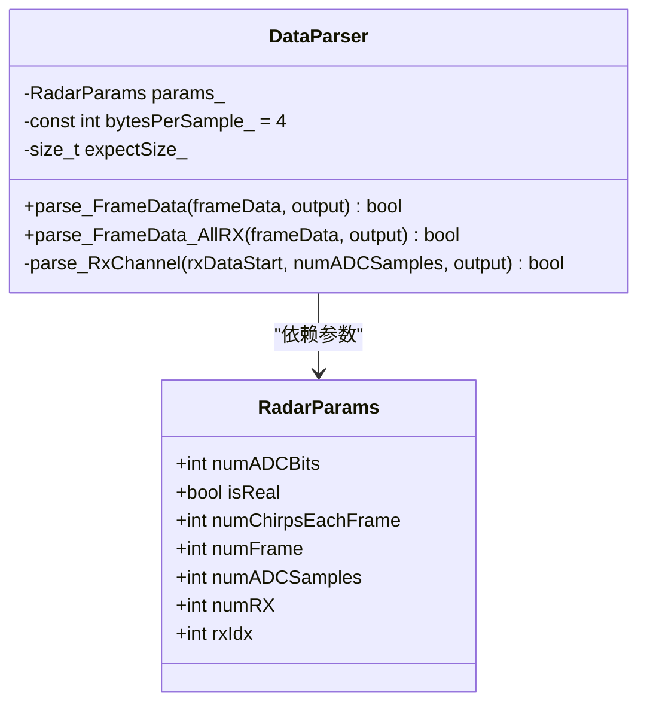
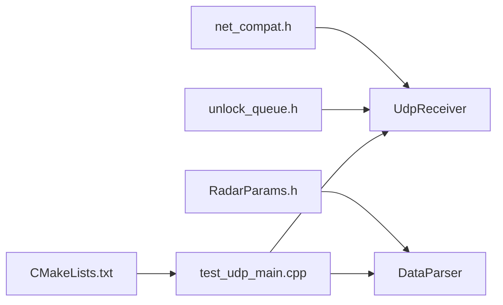

# 网络数据链路与解析

<cite>
**本文引用的文件**   
- [README.md](file://README.md)
- [CMakeLists.txt](file://CMakeLists.txt)
- [net_compat.h](file://awr1843_dca1000_read/net_compat.h)
- [UdpReceiver.h](file://awr1843_dca1000_read/UdpReceiver.h)
- [UdpReceiver.cpp](file://awr1843_dca1000_read/UdpReceiver.cpp)
- [unlock_queue.h](file://awr1843_dca1000_read/unlock_queue.h)
- [DataParser.h](file://awr1843_dca1000_read/DataParser.h)
- [DataParser.cpp](file://awr1843_dca1000_read/DataParser.cpp)
- [RadarParams.h](file://awr1843_dca1000_read/RadarParams.h)
- [test_udp_main.cpp](file://awr1843_dca1000_read/test_udp_main.cpp)
</cite>

## 目录
1. [引言](#引言)
2. [项目结构](#项目结构)
3. [核心组件](#核心组件)
4. [架构总览](#架构总览)
5. [详细组件分析](#详细组件分析)
6. [依赖关系分析](#依赖关系分析)
7. [性能与稳定性](#性能与稳定性)
8. [故障排查指南](#故障排查指南)
9. [结论](#结论)

## 引言
本章节聚焦“从数据接收到解析”的两层链路：下层负责跨平台 UDP 接收与按 seqNum 重组帧，上层负责将原始字节还原为复数 I/Q。该链路仅包含数据通路；DCA1000 命令控制（UDPController）属于设备控制范畴，不纳入本链路范围。

## 项目结构
围绕数据通路的代码主要分布在以下文件中：
- 跨平台 socket 兼容层：net_compat.h
- 数据接收与帧重组：UdpReceiver.h/.cpp、unlock_queue.h
- 雷达数据解析：DataParser.h/.cpp、RadarParams.h
- 测试入口（不含串口/命令通道）：test_udp_main.cpp
- 构建配置（定义 test_udp 目标）：CMakeLists.txt
- 项目说明与约定：README.md

图表来源
- [CMakeLists.txt:21-31](file://CMakeLists.txt#L21-L31)
- [net_compat.h:1-100](file://awr1843_dca1000_read/net_compat.h#L1-L100)
- [UdpReceiver.h:1-116](file://awr1843_dca1000_read/UdpReceiver.h#L1-L116)
- [UdpReceiver.cpp:1-415](file://awr1843_dca1000_read/UdpReceiver.cpp#L1-L415)
- [unlock_queue.h:1-119](file://awr1843_dca1000_read/unlock_queue.h#L1-L119)
- [DataParser.h:1-45](file://awr1843_dca1000_read/DataParser.h#L1-L45)
- [DataParser.cpp:1-126](file://awr1843_dca1000_read/DataParser.cpp#L1-L126)
- [RadarParams.h:1-14](file://awr1843_dca1000_read/RadarParams.h#L1-L14)
- [test_udp_main.cpp:1-117](file://awr1843_dca1000_read/test_udp_main.cpp#L1-L117)

章节来源
- [CMakeLists.txt:21-31](file://CMakeLists.txt#L21-L31)
- [README.md:81-100](file://README.md#L81-L100)

## 核心组件
- 跨平台 socket 适配层 netcompat：统一 Windows winsock 与 POSIX BSD socket 的初始化、关闭、错误码与非阻塞设置等差异，供上层复用。
- UDPReceiver：提供三种接收模式（阻塞、异步线程、基于队列的异步），内部维护非阻塞接收线程、无锁环形队列 UnlockQueue、条件变量同步，以及按 seqNum 的帧重组逻辑。
- UnlockQueue：固定容量、幂次对齐的环形缓冲，支持 Put/Get/Get_wait 原子操作，适合生产者-消费者场景。
- DataParser：根据 RadarParams 计算期望帧大小，将一帧原始字节流按 chirp×rx×sample 布局解交织为复数 I/Q 矩阵。
- test_udp_main：最小化测试入口，绑定 0.0.0.0:4098，循环取帧并调用 DataParser 解析，打印维度统计。

章节来源
- [net_compat.h:1-100](file://awr1843_dca1000_read/net_compat.h#L1-L100)
- [UdpReceiver.h:1-116](file://awr1843_dca1000_read/UdpReceiver.h#L1-L116)
- [UdpReceiver.cpp:1-415](file://awr1843_dca1000_read/UdpReceiver.cpp#L1-L415)
- [unlock_queue.h:1-119](file://awr1843_dca1000_read/unlock_queue.h#L1-L119)
- [DataParser.h:1-45](file://awr1843_dca1000_read/DataParser.h#L1-L45)
- [DataParser.cpp:1-126](file://awr1843_dca1000_read/DataParser.cpp#L1-L126)
- [RadarParams.h:1-14](file://awr1843_dca1000_read/RadarParams.h#L1-L14)
- [test_udp_main.cpp:1-117](file://awr1843_dca1000_read/test_udp_main.cpp#L1-L117)

## 架构总览
自下而上的数据流协作关系如下：
- 底层：net_compat 屏蔽平台差异，向上暴露统一的 socket API。
- 中间层：UDPReceiver 通过非阻塞 recvfrom 读取 packet_t（含 seqNum 与 payload），放入 UnlockQueue；消费端等待队列满或超时后，按 seqNum 排序重组为一帧字节流。
- 上层：DataParser 依据 RadarParams 校验帧长度，将字节流解释为 int16 I/Q 序列，组装成复数 I/Q 矩阵输出。

图表来源
- [test_udp_main.cpp:71-106](file://awr1843_dca1000_read/test_udp_main.cpp#L71-L106)
- [UdpReceiver.cpp:231-283](file://awr1843_dca1000_read/UdpReceiver.cpp#L231-L283)
- [UdpReceiver.cpp:151-229](file://awr1843_dca1000_read/UdpReceiver.cpp#L151-L229)
- [UdpReceiver.cpp:377-410](file://awr1843_dca1000_read/UdpReceiver.cpp#L377-L410)
- [DataParser.cpp:20-56](file://awr1843_dca1000_read/DataParser.cpp#L20-L56)

## 详细组件分析

### 数据接收与帧重组层（UDPReceiver + UnlockQueue + net_compat）
职责边界
- 只负责“搬运与重组”：从 UDP 套接字读取 packet_t，按 seqNum 拼接为一帧连续字节流，不做任何业务语义解析。
- 提供阻塞与异步两种取帧接口：ReadFrames（阻塞）与 GetFramesFromQueue（基于队列的异步）。
- 统计信息：记录收到包数、首尾包号、期望包数、总帧计数与错误计数。

关键实现要点
- 非阻塞接收线程：在 ReceiveThreadFunc 中设置非阻塞，循环 recvfrom，成功则入队 UnlockQueue 并通过条件变量通知。
- 帧起始定位：根据首个包的 seqNum 与每帧字节数，计算当前帧剩余字节 lastFrameRemainBytes，从而确定需要再收多少包。
- 排序重组：SortPackets 使用 seqNum 相对偏移将乱序包按顺序拷贝到输出 buffer。
- 超时处理：阻塞模式使用 SO_RCVTIMEO；队列模式使用条件变量 wait_for 与队列 Get_wait 组合。

图表来源
- [UdpReceiver.cpp:41-92](file://awr1843_dca1000_read/UdpReceiver.cpp#L41-L92)
- [UdpReceiver.cpp:94-118](file://awr1843_dca1000_read/UdpReceiver.cpp#L94-L118)
- [UdpReceiver.cpp:231-283](file://awr1843_dca1000_read/UdpReceiver.cpp#L231-L283)
- [UdpReceiver.cpp:151-229](file://awr1843_dca1000_read/UdpReceiver.cpp#L151-L229)
- [UdpReceiver.cpp:292-375](file://awr1843_dca1000_read/UdpReceiver.cpp#L292-L375)
- [UdpReceiver.cpp:377-410](file://awr1843_dca1000_read/UdpReceiver.cpp#L377-L410)

章节来源
- [UdpReceiver.h:1-116](file://awr1843_dca1000_read/UdpReceiver.h#L1-L116)
- [UdpReceiver.cpp:1-415](file://awr1843_dca1000_read/UdpReceiver.cpp#L1-L415)
- [unlock_queue.h:1-119](file://awr1843_dca1000_read/unlock_queue.h#L1-L119)
- [net_compat.h:1-100](file://awr1843_dca1000_read/net_compat.h#L1-L100)

### 雷达数据解析层（DataParser）
职责边界
- 只负责“字节→复数 I/Q”的解析：校验帧长度、按 chirp×rx×sample 布局解交织，输出 std::complex<float> 矩阵。
- 提供单天线与全天线两种解析接口：parse_FrameData 与 parse_FrameData_AllRX。

关键实现要点
- 期望帧大小：由 RadarParams 推导，numChirpsEachFrame × numRX × numADCSamples × 4。
- 内存视图：将 uint8_t 帧数据 reinterpret_cast 为 const int16_t*，避免逐字节开销。
- 通道解析：parse_RxChannel 以步长 2 遍历采样点，按 I0/I1/Q0/Q1 四元组构造两个复数样本。

图表来源
- [DataParser.h:1-45](file://awr1843_dca1000_read/DataParser.h#L1-L45)
- [DataParser.cpp:1-126](file://awr1843_dca1000_read/DataParser.cpp#L1-L126)
- [RadarParams.h:1-14](file://awr1843_dca1000_read/RadarParams.h#L1-L14)

章节来源
- [DataParser.h:1-45](file://awr1843_dca1000_read/DataParser.h#L1-L45)
- [DataParser.cpp:1-126](file://awr1843_dca1000_read/DataParser.cpp#L1-L126)
- [RadarParams.h:1-14](file://awr1843_dca1000_read/RadarParams.h#L1-L14)

### 测试入口（test_udp_main）
- 绑定 0.0.0.0:4098，使用 QUEUE_BASED 模式，循环调用 GetFramesFromQueue 获取一帧字节流，随后调用 DataParser.parse_FrameData 解析为复数 I/Q。
- 打印维度与统计，Ctrl-C 优雅退出。

章节来源
- [test_udp_main.cpp:1-117](file://awr1843_dca1000_read/test_udp_main.cpp#L1-L117)

## 依赖关系分析
- UDPReceiver 依赖 net_compat 提供的跨平台 socket 能力，依赖 UnlockQueue 作为无锁缓冲。
- DataParser 依赖 RadarParams 提供的雷达采集参数。
- test_udp_main 同时依赖 UDPReceiver 与 DataParser，构成端到端的最小可运行链路。
- CMakeLists.txt 定义 test_udp 目标，仅链接网络与解析相关源文件，不包含串口与命令通道。

图表来源
- [CMakeLists.txt:21-31](file://CMakeLists.txt#L21-L31)
- [net_compat.h:1-100](file://awr1843_dca1000_read/net_compat.h#L1-L100)
- [UdpReceiver.h:1-116](file://awr1843_dca1000_read/UdpReceiver.h#L1-L116)
- [unlock_queue.h:1-119](file://awr1843_dca1000_read/unlock_queue.h#L1-L119)
- [DataParser.h:1-45](file://awr1843_dca1000_read/DataParser.h#L1-L45)
- [RadarParams.h:1-14](file://awr1843_dca1000_read/RadarParams.h#L1-L14)
- [test_udp_main.cpp:1-117](file://awr1843_dca1000_read/test_udp_main.cpp#L1-L117)

章节来源
- [CMakeLists.txt:21-31](file://CMakeLists.txt#L21-L31)

## 性能与稳定性
- 无锁队列：UnlockQueue 采用幂次对齐环形缓冲与原子指针，Put/Get 为 O(1)，在高吞吐场景降低锁竞争。
- 非阻塞接收：接收线程以非阻塞方式轮询，配合 sleep_for 与条件变量，避免忙等导致的 CPU 占用过高。
- 批量重组：SortPackets 一次性按 seqNum 重排，减少多次小拷贝带来的开销。
- 内存预分配：DataParser 在解析前按维度 resize，避免运行时重复分配。
- 建议
  - 合理设置队列深度与缓冲区大小，避免丢包或频繁扩容。
  - 对高丢包率环境，可在 GetFramesFromQueue 中增加丢包检测与告警。
  - 若需更高吞吐，可考虑零拷贝路径（如将 packet_t 直接映射到输出 buffer 的对应偏移）。

[本节为通用指导，不直接分析具体文件]

## 故障排查指南
- 无法绑定端口或连接失败
  - 检查本地 IP 与端口是否正确，确认防火墙放行 4098。
  - 参考初始化与 bind 流程的错误日志输出位置。
- 帧不完整或解析失败
  - 核对 bytesPerFrame 是否与回放/实际配置一致（numRX × numChirps × numADCSamples × 4）。
  - 检查 sort 标志是否开启，确保 seqNum 重排生效。
  - 关注 GetFramesFromQueue 的超时与 incomplete frame 提示。
- 解析维度异常
  - 确认 RadarParams 中的 numRX、numChirpsEachFrame、numADCSamples 与实际数据一致。
  - 单天线解析时 rxIdx 应指向有效索引。
- 统计指标异常
  - 通过 GetStatistics 查看 receivedPacketNum、errorCount、expectedPacketNum 等，辅助定位丢包或超时问题。

章节来源
- [UdpReceiver.cpp:151-229](file://awr1843_dca1000_read/UdpReceiver.cpp#L151-L229)
- [UdpReceiver.cpp:292-375](file://awr1843_dca1000_read/UdpReceiver.cpp#L292-L375)
- [DataParser.cpp:20-56](file://awr1843_dca1000_read/DataParser.cpp#L20-L56)
- [test_udp_main.cpp:88-106](file://awr1843_dca1000_read/test_udp_main.cpp#L88-L106)

## 结论
本链路清晰划分为两层：下层 UDPReceiver 专注跨平台 socket 接收与按 seqNum 重组帧，上层 DataParser 专注将原始字节还原为复数 I/Q。两者通过明确的输入输出契约协作，形成稳定、可扩展的数据通路。后续扩展（如 FFT/CFAR/目标检测）可直接接入 DataParser 的输出类型，无需改动底层接收与重组逻辑。