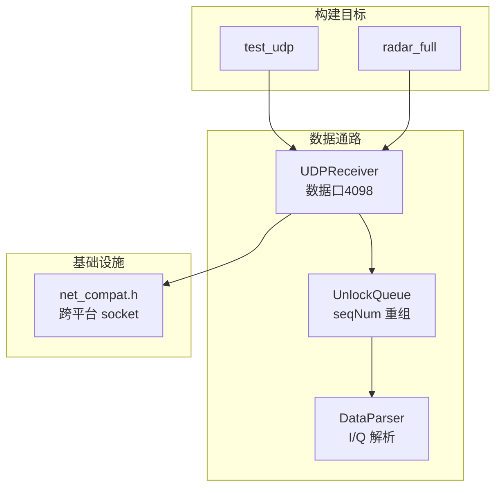
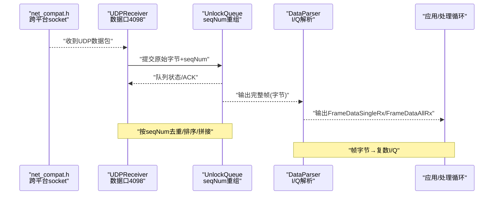
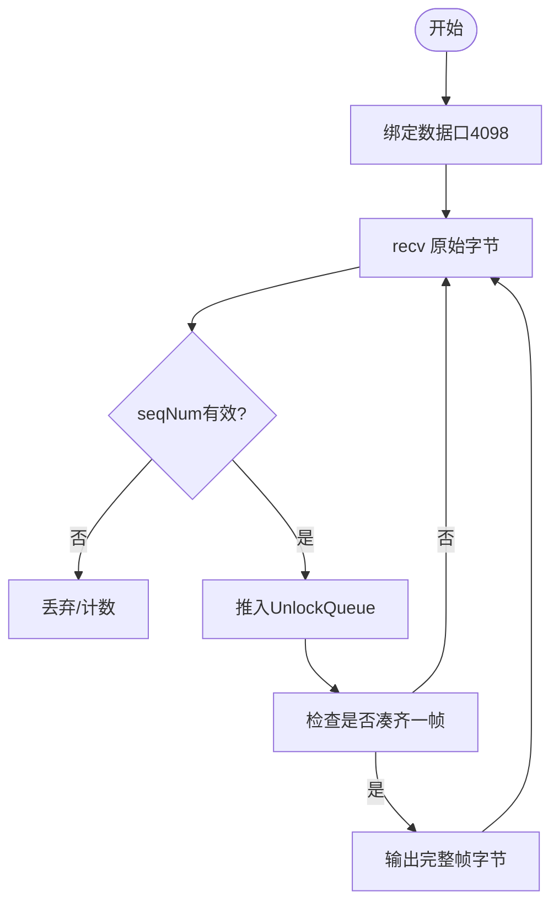
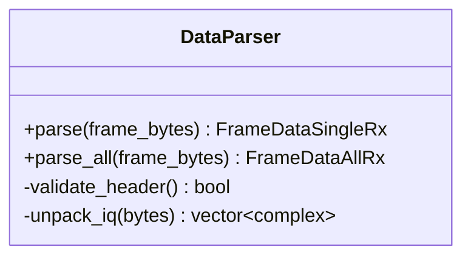
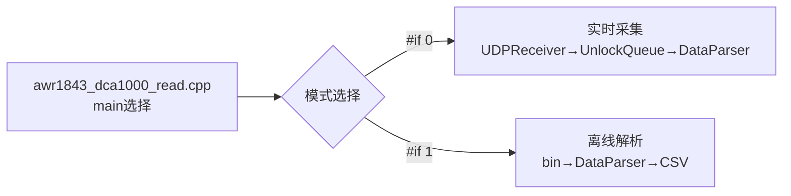
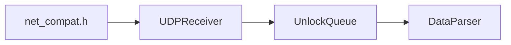

# 网络数据链路与解析

<cite>
**本文引用的文件**   
- [CMakeLists.txt](file://CMakeLists.txt)
- [awr1843_dca1000_read.cpp](file://awr1843_dca1000_read.cpp)
- [net_compat.h](file://net_compat.h)
- [UDPReceiver.h](file://UDPReceiver.h)
- [UnlockQueue.h](file://UnlockQueue.h)
- [DataParser.h](file://DataParser.h)
</cite>

## 目录
1. [简介](#简介)
2. [项目结构](#项目结构)
3. [核心组件](#核心组件)
4. [架构总览](#架构总览)
5. [详细组件分析](#详细组件分析)
6. [依赖分析](#依赖分析)
7. [性能考虑](#性能考虑)
8. [故障排查指南](#故障排查指南)
9. [结论](#结论)
10. [附录](#附录)

## 简介
本章节聚焦“从数据接收到解析”的两层数据通路：下层负责跨平台 socket 接收 LVDS 数据流并按 seqNum 重组为帧，上层负责将原始字节还原为复数 I/Q。该链路仅包含数据通路，DCA1000 命令控制（命令口4096）归入设备控制章节，不在此处讨论。

- 数据口端口：4098
- 关键分层：UDPReceiver + UnlockQueue（数据接收与帧重组）→ DataParser（雷达数据解析）
- 跨平台基础：net_compat.h 提供统一 socket API 抽象

## 项目结构
- CMakeLists.txt 定义两个可执行目标：
  - test_udp：不含串口链、三平台可构建，配合 Python 回放泵测试 UDP→重组→解析
  - radar_full：含串口链的完整程序
- awr1843_dca1000_read.cpp 通过 #if/#endif 切换两种 main：
  - #if 0：实时采集模式
  - #if 1（当前默认）：离线 bin→CSV 解析模式

图表来源
- [CMakeLists.txt](file://CMakeLists.txt)
- [awr1843_dca1000_read.cpp](file://awr1843_dca1000_read.cpp)
- [net_compat.h](file://net_compat.h)
- [UDPReceiver.h](file://UDPReceiver.h)
- [UnlockQueue.h](file://UnlockQueue.h)
- [DataParser.h](file://DataParser.h)

章节来源
- [CMakeLists.txt](file://CMakeLists.txt)
- [awr1843_dca1000_read.cpp](file://awr1843_dca1000_read.cpp)

## 核心组件
- 数据接收与帧重组层
  - UDPReceiver：基于 net_compat.h 的跨平台 socket 实现，监听数据口4098，持续收取 DCA1000 发送的原始字节流
  - UnlockQueue：按 seqNum 对乱序/分片数据进行排序与重组，输出完整帧
- 雷达数据解析层
  - DataParser：读取帧字节，依据帧长度公式计算并解包为复数 I/Q（每采样点 2×int16），向上层暴露结构化帧类型

职责边界
- 下层只关心“把字节按帧拼好”，不关心帧内语义
- 上层只关心“把帧字节解析成 I/Q”，不关心网络细节

章节来源
- [UDPReceiver.h](file://UDPReceiver.h)
- [UnlockQueue.h](file://UnlockQueue.h)
- [DataParser.h](file://DataParser.h)

## 架构总览
自下而上的数据流协作关系如下：

图表来源
- [net_compat.h](file://net_compat.h)
- [UDPReceiver.h](file://UDPReceiver.h)
- [UnlockQueue.h](file://UnlockQueue.h)
- [DataParser.h](file://DataParser.h)

## 详细组件分析

### 数据接收与帧重组层（UDPReceiver + UnlockQueue）
- 功能要点
  - 使用 net_compat.h 提供的 socket API 绑定/监听数据口4098
  - 持续 recv 原始字节，附带 seqNum 投递到 UnlockQueue
  - UnlockQueue 维护滑动窗口，按 seqNum 排序、去重、拼接，达到帧长阈值后出队完整帧
- 关键设计
  - 线程安全：接收线程与重组线程分离，避免阻塞
  - 内存管理：环形缓冲或预分配池减少拷贝
  - 容错：丢包检测、序列号回绕处理、超时清理

图表来源
- [UDPReceiver.h](file://UDPReceiver.h)
- [UnlockQueue.h](file://UnlockQueue.h)
- [net_compat.h](file://net_compat.h)

章节来源
- [UDPReceiver.h](file://UDPReceiver.h)
- [UnlockQueue.h](file://UnlockQueue.h)

### 雷达数据解析层（DataParser）
- 功能要点
  - 输入：完整帧字节
  - 输出：复数 I/Q（每采样点 2×int16）
  - 帧长度公式：numRX × numChirpsEachFrame × numADCSamples × 4
- 关键设计
  - 字节序处理：确保跨平台一致性
  - 校验：帧头/长度校验，异常帧丢弃
  - 接口：向上层暴露 FrameDataSingleRx / FrameDataAllRx 等结构体

图表来源
- [DataParser.h](file://DataParser.h)

章节来源
- [DataParser.h](file://DataParser.h)

### 入口与运行模式（awr1843_dca1000_read.cpp）
- 实时模式（#if 0）：启动 UDPReceiver → UnlockQueue → DataParser → 实时处理循环
- 离线模式（#if 1，默认）：读取已保存的 bin 文件，直接走 DataParser 解析为 CSV

图表来源
- [awr1843_dca1000_read.cpp](file://awr1843_dca1000_read.cpp)

章节来源
- [awr1843_dca1000_read.cpp](file://awr1843_dca1000_read.cpp)

## 依赖分析
- 组件耦合
  - UDPReceiver 依赖 net_compat.h（跨平台 socket）
  - UnlockQueue 被 UDPReceiver 写入，被 DataParser 消费
  - DataParser 仅依赖帧字节契约，与网络无关
- 外部依赖
  - 无第三方库，仅标准库与系统 socket 接口

图表来源
- [net_compat.h](file://net_compat.h)
- [UDPReceiver.h](file://UDPReceiver.h)
- [UnlockQueue.h](file://UnlockQueue.h)
- [DataParser.h](file://DataParser.h)

章节来源
- [net_compat.h](file://net_compat.h)
- [UDPReceiver.h](file://UDPReceiver.h)
- [UnlockQueue.h](file://UnlockQueue.h)
- [DataParser.h](file://DataParser.h)

## 性能考虑
- 零拷贝优化：尽量在 UnlockQueue 中复用缓冲区，减少 DataParser 的额外拷贝
- 批量处理：DataParser 可对多帧批处理以提升吞吐
- 线程模型：接收与重组并行，解析与处理并行，避免单点阻塞
- 内存池：固定大小帧缓冲池，降低频繁分配/释放开销
- 网络侧：增大 socket 接收缓冲区，避免丢包；合理设置非阻塞/超时策略

[本节为通用指导，无需代码引用]

## 故障排查指南
- 无法接收数据
  - 检查防火墙/路由是否放行数据口4098
  - 确认 net_compat.h 的 socket 初始化与 bind 成功
- 帧重组失败
  - 观察 UnlockQueue 的 seqNum 连续性，排查丢包与乱序
  - 调整窗口大小与超时清理策略
- 解析结果为空或异常
  - 核对帧长度公式与实际帧大小一致
  - 检查字节序与对齐问题
- 实时模式下卡顿
  - 评估 CPU 占用与 GC/分配热点，必要时引入批处理与内存池

章节来源
- [UDPReceiver.h](file://UDPReceiver.h)
- [UnlockQueue.h](file://UnlockQueue.h)
- [DataParser.h](file://DataParser.h)

## 结论
本链路以“接收与重组”和“解析”两层清晰分工，实现了从跨平台 socket 到复数 I/Q 的稳定数据通路。下层专注可靠搬运与重组，上层专注语义解析，二者通过“完整帧字节”契约解耦，便于扩展后续 FFT/CFAR/检测等处理流程。

[本节为总结性内容，无需代码引用]

## 附录
- 构建与测试
  - 使用 test_udp 目标进行端到端验证：Python 回放泵 → UDPReceiver → UnlockQueue → DataParser
- 配置参考
  - 帧长度公式：numRX × numChirpsEachFrame × numADCSamples × 4
  - 地址约定：上位机 IP 192.168.33.30，DCA1000 IP 192.168.33.180

[本节为补充信息，无需代码引用]