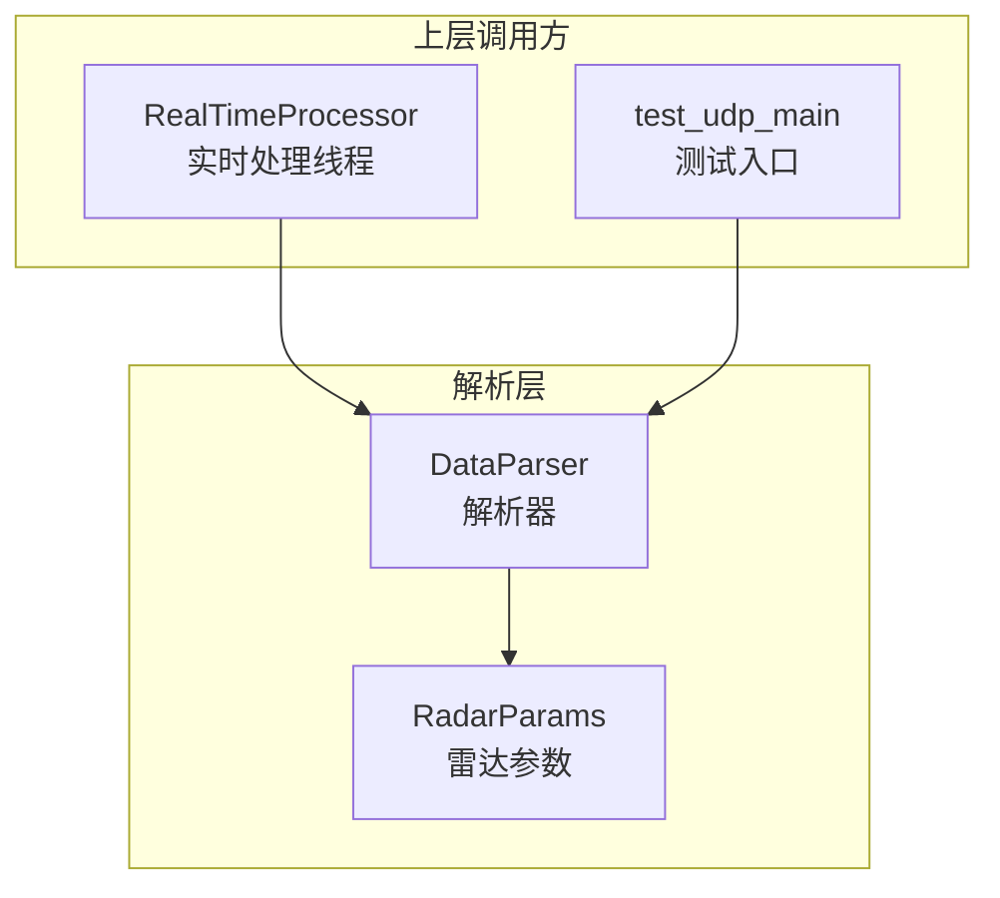
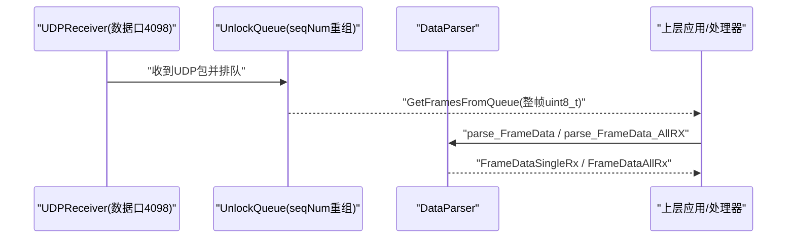
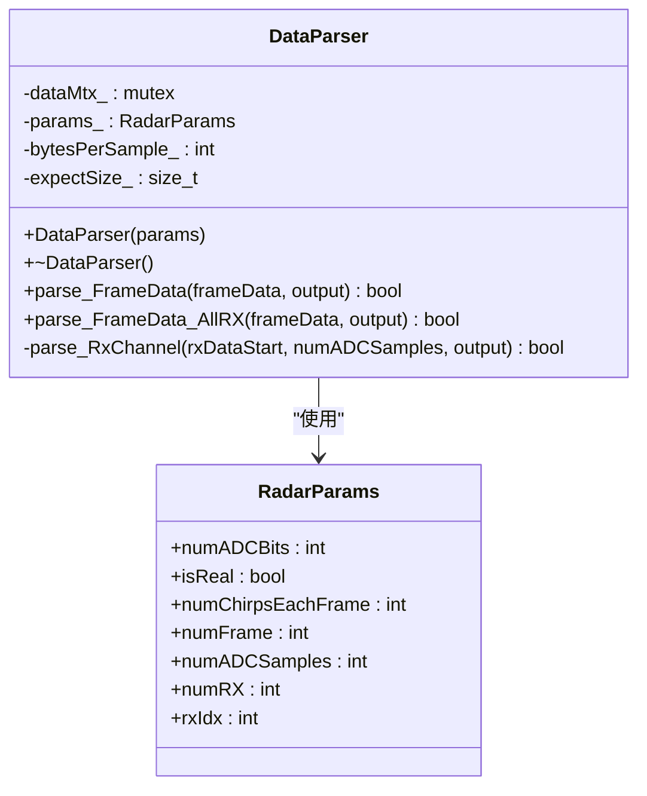
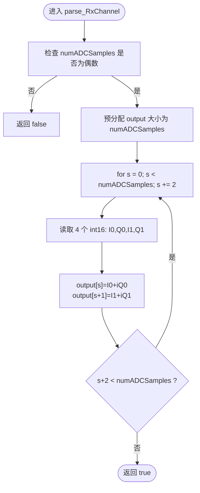
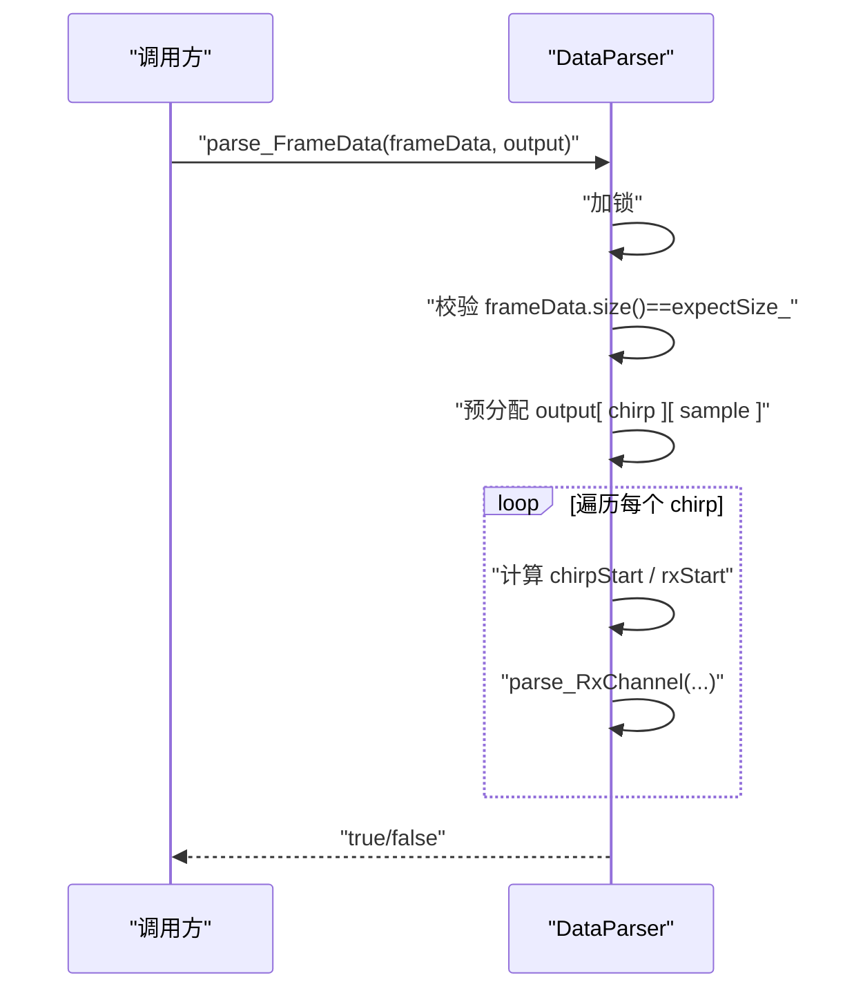
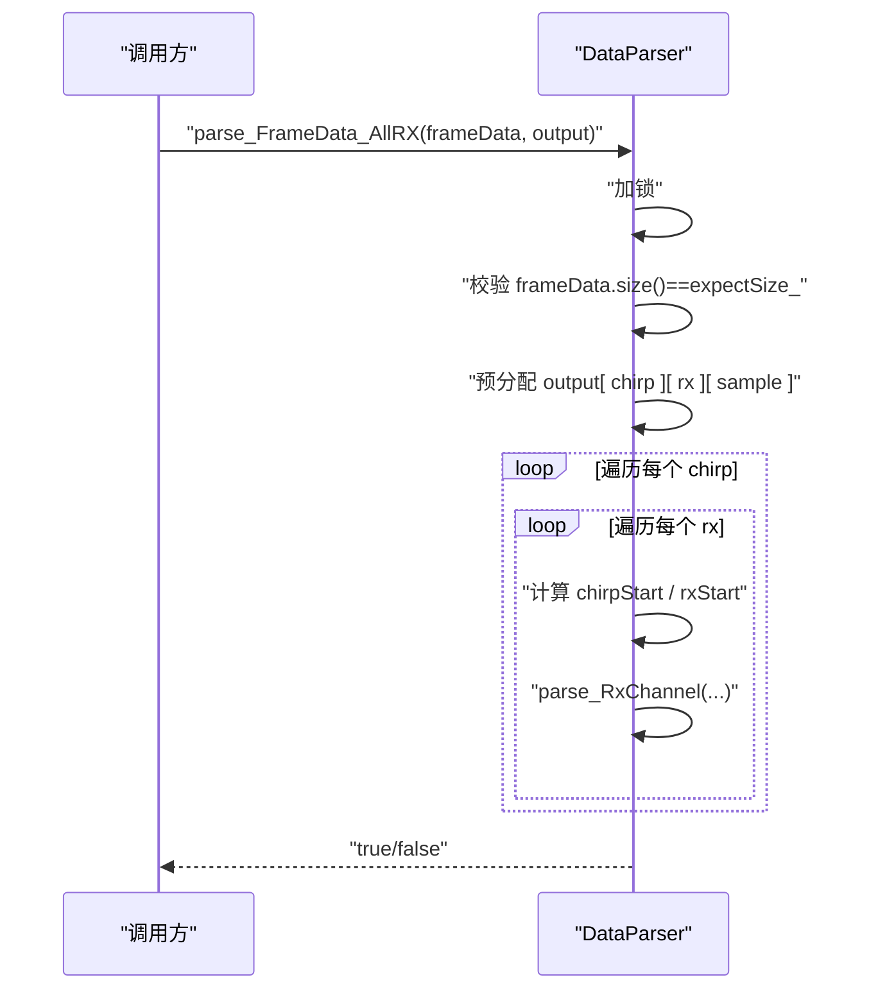
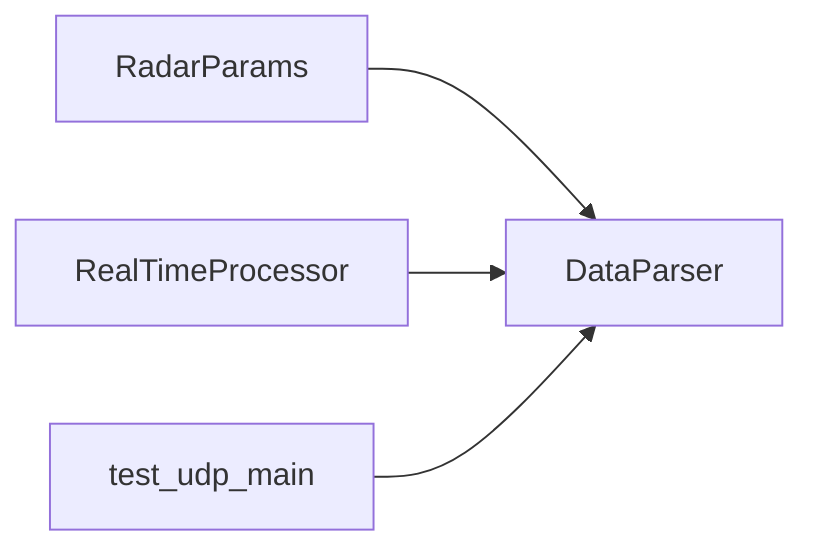

# 雷达数据解析

<cite>
**本文引用的文件**
- [DataParser.h](file://awr1843_dca1000_read/DataParser.h)
- [DataParser.cpp](file://awr1843_dca1000_read/DataParser.cpp)
- [RadarParams.h](file://awr1843_dca1000_read/RadarParams.h)
- [RealTimeProcessor.h](file://awr1843_dca1000_read/RealTimeProcessor.h)
- [test_udp_main.cpp](file://awr1843_dca1000_read/test_udp_main.cpp)
</cite>

## 目录
1. [简介](#简介)
2. [项目结构](#项目结构)
3. [核心组件](#核心组件)
4. [架构总览](#架构总览)
5. [详细组件分析](#详细组件分析)
6. [依赖关系分析](#依赖关系分析)
7. [性能考量](#性能考量)
8. [故障排查指南](#故障排查指南)
9. [结论](#结论)

## 简介
本章节聚焦第 2 层（解析层）：说明 DataParser 如何把数据接收层交付的原始 ADC 字节流解析为复数 I/Q。内容涵盖：
- 单天线输出 parse_FrameData 与全天线输出 parse_FrameData_AllRX 两种接口
- I/Q 交织格式（每 2 个采样点占 4 个 int16，即 I0、Q0、I1、Q1 顺序）
- RadarParams 参数驱动帧尺寸与维度
- expectSize_ 校验机制

## 项目结构
解析层位于 awr1843_dca1000_read 子目录中，核心文件如下：
- DataParser.h/.cpp：实现从 uint8_t 字节流到 std::complex<float> 的解析
- RadarParams.h：提供雷达配置参数（每帧 chirp 数、采样点数、接收天线数等）
- RealTimeProcessor.h：实时链路中调用 DataParser 的入口示例
- test_udp_main.cpp：离线/测试链路中调用 DataParser 的入口示例

图表来源
- [DataParser.h:1-45](file://awr1843_dca1000_read/DataParser.h#L1-L45)
- [DataParser.cpp:1-126](file://awr1843_dca1000_read/DataParser.cpp#L1-L126)
- [RadarParams.h:1-14](file://awr1843_dca1000_read/RadarParams.h#L1-L14)
- [RealTimeProcessor.h:1-188](file://awr1843_dca1000_read/RealTimeProcessor.h#L1-L188)
- [test_udp_main.cpp:1-106](file://awr1843_dca1000_read/test_udp_main.cpp#L1-L106)

章节来源
- [DataParser.h:1-45](file://awr1843_dca1000_read/DataParser.h#L1-L45)
- [DataParser.cpp:1-126](file://awr1843_dca1000_read/DataParser.cpp#L1-L126)
- [RadarParams.h:1-14](file://awr1843_dca1000_read/RadarParams.h#L1-L14)
- [RealTimeProcessor.h:1-188](file://awr1843_dca1000_read/RealTimeProcessor.h#L1-L188)
- [test_udp_main.cpp:1-106](file://awr1843_dca1000_read/test_udp_main.cpp#L1-L106)

## 核心组件
- DataParser：负责将 uint8_t 帧字节流按 I/Q 交织布局还原为复数 I/Q；提供单天线与全天线两种输出接口；内部使用互斥锁保证线程安全；通过 expectSize_ 做帧长度校验。
- RadarParams：描述每帧 chirp 数、每个 chirp 的 ADC 采样数、接收天线数等关键参数，用于计算期望帧大小与输出维度。

章节来源
- [DataParser.h:16-41](file://awr1843_dca1000_read/DataParser.h#L16-L41)
- [DataParser.cpp:5-10](file://awr1843_dca1000_read/DataParser.cpp#L5-L10)
- [RadarParams.h:5-13](file://awr1843_dca1000_read/RadarParams.h#L5-L13)

## 架构总览
解析层处于“数据接收与帧重组”之后，负责把重组后的整帧字节流转换为复数 I/Q 矩阵，供后续 FFT/CFAR/目标检测等算法使用。

图表来源
- [RealTimeProcessor.h:82-139](file://awr1843_dca1000_read/RealTimeProcessor.h#L82-L139)
- [test_udp_main.cpp:71-106](file://awr1843_dca1000_read/test_udp_main.cpp#L71-L106)
- [DataParser.cpp:20-96](file://awr1843_dca1000_read/DataParser.cpp#L20-L96)

## 详细组件分析

### DataParser 类设计
- 输入：std::vector<uint8_t> 整帧字节流（来自 UDPReceiver 重组后）
- 输出：
  - 单天线：FrameDataSingleRx = [chirp][sample] 的复数 I/Q
  - 全天线：FrameDataAllRx = [chirp][rx][sample] 的复数 I/Q
- 关键成员：
  - params_：RadarParams，决定 numChirpsEachFrame、numADCSamples、numRX 等
  - bytesPerSample_：固定为 4（每采样点 2×int16）
  - expectSize_：由 params_ 计算的期望帧字节数
  - dataMtx_：互斥锁，保护并发解析

图表来源
- [DataParser.h:16-41](file://awr1843_dca1000_read/DataParser.h#L16-L41)
- [RadarParams.h:5-13](file://awr1843_dca1000_read/RadarParams.h#L5-L13)

章节来源
- [DataParser.h:16-41](file://awr1843_dca1000_read/DataParser.h#L16-L41)
- [DataParser.cpp:5-10](file://awr1843_dca1000_read/DataParser.cpp#L5-L10)

### 帧大小与 expectSize_ 校验
- 期望帧大小计算公式：
  - expectSize_ = numChirpsEachFrame × numRX × numADCSamples × 4
- 在 parse_FrameData 与 parse_FrameData_AllRX 入口处，若 frameData.size() != expectSize_，则直接返回失败并打印提示。该校验确保上游重组得到的整帧字节数正确，避免越界或错位解析。

章节来源
- [DataParser.cpp:5-10](file://awr1843_dca1000_read/DataParser.cpp#L5-L10)
- [DataParser.cpp:25-28](file://awr1843_dca1000_read/DataParser.cpp#L25-L28)
- [DataParser.cpp:62-65](file://awr1843_dca1000_read/DataParser.cpp#L62-L65)

### I/Q 交织格式与解交织逻辑
- 数据布局约定：
  - 每 2 个采样点占用 4 个 int16，顺序为 I0、Q0、I1、Q1
  - 因此每个采样点占 2 个 int16（实部+虚部），每 2 个采样点共 4 个 int16
- 解交织过程（以单个 RX 通道为例）：
  - 将 uint8_t* 重解释为 const int16_t*，避免逐字节拷贝
  - 按步长 2 遍历采样索引 s，读取 base = s*2 处的 4 个 int16，分别赋给 I0、Q0、I1、Q1
  - 写入 output[s] 与 output[s+1] 两个复数元素
- 复杂度：
  - 时间 O(N)，N 为采样点数
  - 空间 O(N)，输出向量预分配

图表来源
- [DataParser.cpp:100-120](file://awr1843_dca1000_read/DataParser.cpp#L100-L120)

章节来源
- [DataParser.cpp:100-120](file://awr1843_dca1000_read/DataParser.cpp#L100-L120)

### 单天线解析：parse_FrameData
- 功能：针对 1T1R（或指定 rxIdx）场景，输出 [chirp][sample] 的复数 I/Q
- 流程要点：
  - 加锁保护
  - 校验 frameData.size() == expectSize_
  - 预分配 output 为 [numChirpsEachFrame][numADCSamples]
  - 将 uint8_t* 重解释为 int16_t*，按 chirp 与 rx 偏移定位
  - 对每个 chirp 调用 parse_RxChannel 完成解交织
- 错误处理：
  - 长度不匹配直接返回 false
  - 捕获异常并返回 false

图表来源
- [DataParser.cpp:20-56](file://awr1843_dca1000_read/DataParser.cpp#L20-L56)

章节来源
- [DataParser.cpp:20-56](file://awr1843_dca1000_read/DataParser.cpp#L20-L56)

### 全天线解析：parse_FrameData_AllRX
- 功能：输出 [chirp][rx][sample] 的复数 I/Q
- 流程要点：
  - 加锁保护
  - 校验 frameData.size() == expectSize_
  - 预分配 output 为 [numChirpsEachFrame][numRX][numADCSamples]
  - 双重循环遍历 chirp 与 rx，计算偏移并调用 parse_RxChannel
- 错误处理：
  - 长度不匹配直接返回 false
  - 捕获异常并返回 false

图表来源
- [DataParser.cpp:58-96](file://awr1843_dca1000_read/DataParser.cpp#L58-L96)

章节来源
- [DataParser.cpp:58-96](file://awr1843_dca1000_read/DataParser.cpp#L58-L96)

### 与上层接口的集成点
- 实时链路：RealTimeDataProcessor::ProcessingLoop 在获取整帧 uint8_t 后调用 parse_FrameData，并将结果累积写入文件或继续后续处理。
- 测试/离线链路：test_udp_main 从队列取整帧后调用 parse_FrameData，打印维度统计。

章节来源
- [RealTimeProcessor.h:82-139](file://awr1843_dca1000_read/RealTimeProcessor.h#L82-L139)
- [test_udp_main.cpp:82-106](file://awr1843_dca1000_read/test_udp_main.cpp#L82-L106)

## 依赖关系分析
- DataParser 依赖 RadarParams 提供的维度参数，用于：
  - 构造时计算 expectSize_
  - 预分配输出容器维度
  - 控制循环边界与内存偏移
- 上层调用方（RealTimeProcessor、test_udp_main）仅依赖 DataParser 的公共接口，不感知内部字节布局细节。

图表来源
- [DataParser.h:16-41](file://awr1843_dca1000_read/DataParser.h#L16-L41)
- [RadarParams.h:5-13](file://awr1843_dca1000_read/RadarParams.h#L5-L13)
- [RealTimeProcessor.h:1-188](file://awr1843_dca1000_read/RealTimeProcessor.h#L1-L188)
- [test_udp_main.cpp:1-106](file://awr1843_dca1000_read/test_udp_main.cpp#L1-L106)

章节来源
- [DataParser.h:16-41](file://awr1843_dca1000_read/DataParser.h#L16-L41)
- [RadarParams.h:5-13](file://awr1843_dca1000_read/RadarParams.h#L5-L13)
- [RealTimeProcessor.h:1-188](file://awr1843_dca1000_read/RealTimeProcessor.h#L1-L188)
- [test_udp_main.cpp:1-106](file://awr1843_dca1000_read/test_udp_main.cpp#L1-L106)

## 性能考量
- 内存访问模式：
  - 使用 reinterpret_cast 将 uint8_t* 作为 int16_t* 访问，避免逐字节复制开销
  - 输出容器采用 resize 预分配，减少运行时重新分配
- 线程安全：
  - 解析函数内部使用互斥锁，保证多线程并发解析的安全性
- 可扩展性：
  - 若需更高吞吐，可考虑无锁环形缓冲与批量解析策略，但当前实现已满足一般实时需求

## 故障排查指南
- 常见错误：frameData.size() 与 expectSize_ 不一致
  - 现象：解析函数直接返回 false，并打印期望与实际大小
  - 排查要点：
    - 确认 bytesPerFrame 设置是否正确（numRX × numChirpsEachFrame × numADCSamples × 4）
    - 确认 UDPReceiver 的 GetFramesFromQueue 是否完整重组整帧
    - 确认网络回放工具或 DCA1000 输出的帧大小一致
- 其他异常：
  - 解析过程中抛出异常会被捕获并返回 false，建议在上层记录日志以便定位

章节来源
- [DataParser.cpp:25-28](file://awr1843_dca1000_read/DataParser.cpp#L25-L28)
- [DataParser.cpp:62-65](file://awr1843_dca1000_read/DataParser.cpp#L62-L65)
- [DataParser.cpp:51-55](file://awr1843_dca1000_read/DataParser.cpp#L51-L55)
- [DataParser.cpp:93-95](file://awr1843_dca1000_read/DataParser.cpp#L93-L95)

## 结论
DataParser 以简洁高效的方式将重组后的整帧 ADC 字节流解析为复数 I/Q，支持单天线与全天线两种输出形态。其核心在于：
- 基于 RadarParams 的参数化帧尺寸与维度
- 严格的 expectSize_ 校验保障数据完整性
- 明确的 I/Q 交织布局（每 2 个采样点 4 个 int16）与线性解交织算法
- 线程安全的解析入口，便于嵌入实时与离线链路