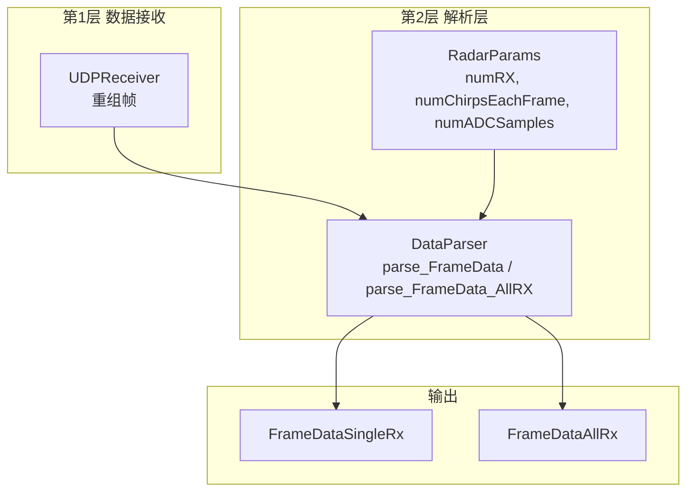
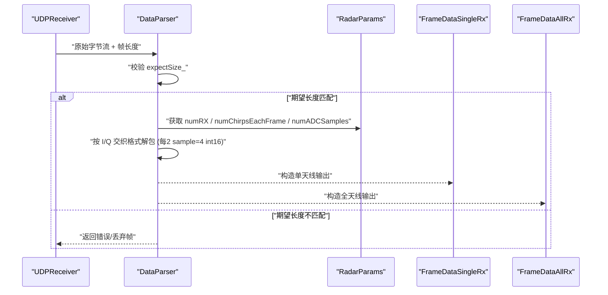
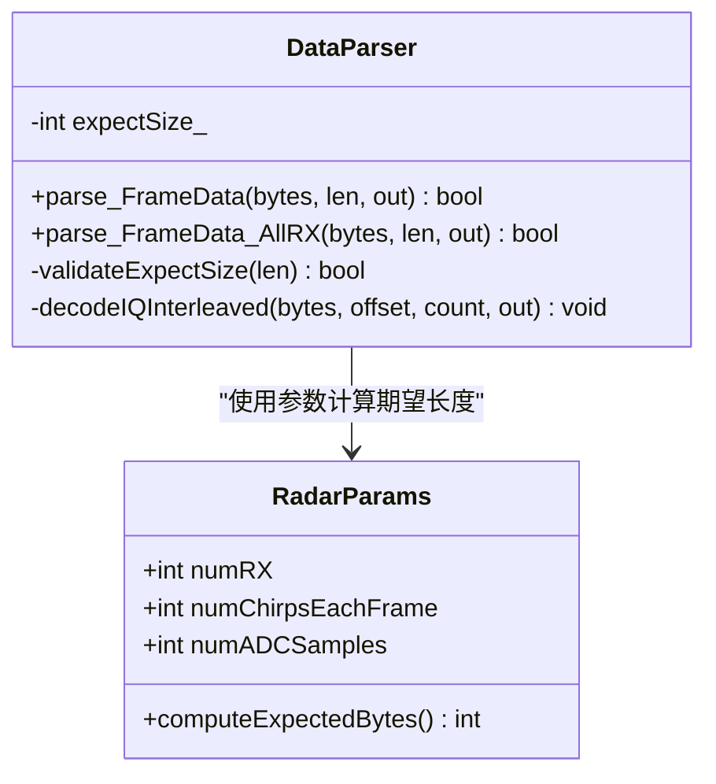
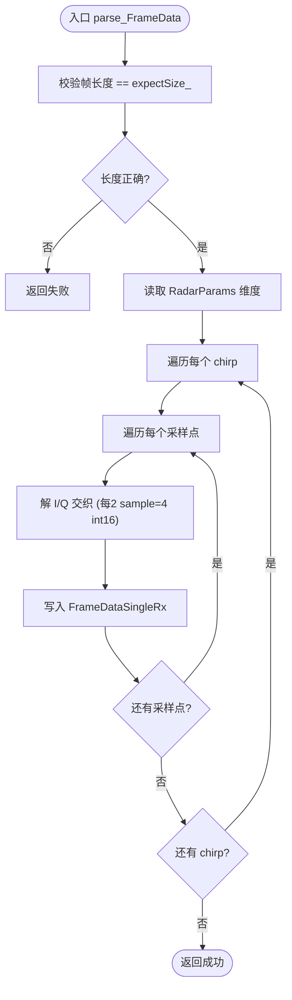
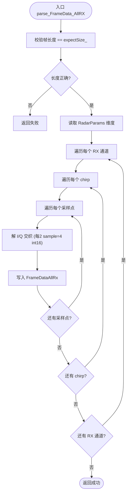
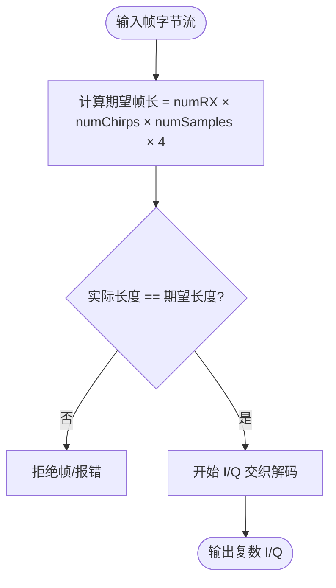
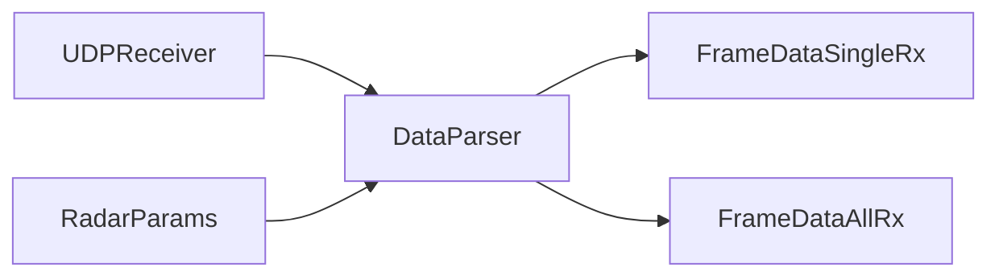

# 雷达数据解析

<cite>
**本文引用的文件**   
- [DataParser.h](file://DataParser.h)
- [DataParser.cpp](file://DataParser.cpp)
- [RadarParams.h](file://RadarParams.h)
- [UDPReceiver.h](file://UDPReceiver.h)
- [awr1843_dca1000_read.cpp](file://awr1843_dca1000_read.cpp)
</cite>

## 目录
1. [简介](#简介)
2. [项目结构](#项目结构)
3. [核心组件](#核心组件)
4. [架构总览](#架构总览)
5. [详细组件分析](#详细组件分析)
6. [依赖关系分析](#依赖关系分析)
7. [性能考虑](#性能考虑)
8. [故障排查指南](#故障排查指南)
9. [结论](#结论)
10. [附录](#附录)

## 简介
本章节聚焦第 2 层（解析层）：DataParser 负责将数据接收层交付的原始 ADC 字节流解析为复数 I/Q 数据。其关键职责包括：
- 输入：来自 UDPReceiver 重组后的帧字节流，按 DCA1000 以太网帧格式组织。
- 输出：单天线 FrameDataSingleRx 与全天线 FrameDataAllRx 两种数据结构。
- 数据格式：I/Q 交织，每 2 个采样点占用 4 个 int16（即每个采样点包含 I、Q 各一个 int16）。
- 参数来源：RadarParams 提供通道数、每帧 chirp 数、每 chirp 采样点数等关键维度信息。
- 校验：expectSize_ 用于校验帧长度是否符合预期，避免错位或丢包导致的解析错误。

## 项目结构
本项目采用分层设计：
- 第 1 层：数据接收与帧重组（UDPReceiver），负责从网络端口读取并重组出完整帧。
- 第 2 层：雷达数据解析（DataParser），负责把字节还原为复数 I/Q。
- 配置与控制：AWR1843Controller、DCA1000 控制接口等属于设备控制链路，不进入数据通路。

图表来源
- [UDPReceiver.h:1-200](file://UDPReceiver.h#L1-200)
- [DataParser.h:1-200](file://DataParser.h#L1-200)
- [RadarParams.h:1-200](file://RadarParams.h#L1-200)

章节来源
- [awr1843_dca1000_read.cpp:1-200](file://awr1843_dca1000_read.cpp#L1-200)

## 核心组件
- DataParser：实现 parse_FrameData 与 parse_FrameData_AllRX，完成字节到复数 I/Q 的转换与组织。
- RadarParams：提供解析所需的维度参数（如 numRX、numChirpsEachFrame、numADCSamples）。
- 输入/输出契约：
  - 输入：uint8_t* 原始字节流 + 帧长度。
  - 输出：FrameDataSingleRx（单天线视角）、FrameDataAllRx（全天线视角）。

章节来源
- [DataParser.h:1-200](file://DataParser.h#L1-200)
- [DataParser.cpp:1-200](file://DataParser.cpp#L1-200)
- [RadarParams.h:1-200](file://RadarParams.h#L1-200)

## 架构总览
下图展示从 UDP 帧到复数 I/Q 的端到端流程，强调 expectSize_ 校验与 I/Q 交织解码。

图表来源
- [DataParser.cpp:1-200](file://DataParser.cpp#L1-200)
- [RadarParams.h:1-200](file://RadarParams.h#L1-200)

## 详细组件分析

### DataParser 类与成员
- 成员变量
  - expectSize_：期望帧字节数，由 RadarParams 推导得出，用于校验输入帧长度。
  - 其他内部缓冲/索引：用于遍历 chirp、采样点与通道。
- 主要方法
  - parse_FrameData：生成单天线视角的 FrameDataSingleRx。
  - parse_FrameData_AllRX：生成全天线视角的 FrameDataAllRx。
- 设计要点
  - 严格遵循 I/Q 交织布局：每 2 个采样点占 4 个 int16（I0,Q0,I1,Q1...）。
  - 先做长度校验，再执行解包，确保鲁棒性。

图表来源
- [DataParser.h:1-200](file://DataParser.h#L1-200)
- [RadarParams.h:1-200](file://RadarParams.h#L1-200)

章节来源
- [DataParser.h:1-200](file://DataParser.h#L1-200)
- [DataParser.cpp:1-200](file://DataParser.cpp#L1-200)
- [RadarParams.h:1-200](file://RadarParams.h#L1-200)

### 解析流程：parse_FrameData（单天线）
- 输入：原始字节流、帧长度。
- 步骤：
  1) 校验帧长度是否等于 expectSize_。
  2) 根据 RadarParams 确定 numRX、numChirpsEachFrame、numADCSamples。
  3) 按 chirp × 采样点顺序遍历，逐点解出 I/Q 并写入 FrameDataSingleRx。
  4) 成功返回 true，失败返回 false。

图表来源
- [DataParser.cpp:1-200](file://DataParser.cpp#L1-200)

章节来源
- [DataParser.cpp:1-200](file://DataParser.cpp#L1-200)

### 解析流程：parse_FrameData_AllRX（全天线）
- 输入：原始字节流、帧长度。
- 步骤：
  1) 校验帧长度是否等于 expectSize_。
  2) 依据 RadarParams 的 numRX、numChirpsEachFrame、numADCSamples 构建全天线视图。
  3) 按通道×chirp×采样点的顺序解 I/Q 交织，填充 FrameDataAllRx。
  4) 成功返回 true，失败返回 false。

图表来源
- [DataParser.cpp:1-200](file://DataParser.cpp#L1-200)

章节来源
- [DataParser.cpp:1-200](file://DataParser.cpp#L1-200)

### I/Q 交织格式与 expectSize_ 校验
- I/Q 交织：每 2 个采样点占用 4 个 int16，即 I0、Q0、I1、Q1 连续排列。
- 期望帧长：frame_bytes = numRX × numChirpsEachFrame × numADCSamples × 4。
- 校验策略：在解析前比较实际帧长度与 expectSize_，不一致则直接拒绝该帧，防止后续越界或错位。

图表来源
- [DataParser.cpp:1-200](file://DataParser.cpp#L1-200)
- [RadarParams.h:1-200](file://RadarParams.h#L1-200)

章节来源
- [DataParser.cpp:1-200](file://DataParser.cpp#L1-200)
- [RadarParams.h:1-200](file://RadarParams.h#L1-200)

## 依赖关系分析
- DataParser 依赖 RadarParams 提供的维度信息以计算期望帧长与遍历边界。
- 上游依赖 UDPReceiver 输出的已重组帧；下游产出 FrameDataSingleRx/FrameDataAllRx 供上层处理（实时或离线）。

图表来源
- [UDPReceiver.h:1-200](file://UDPReceiver.h#L1-200)
- [DataParser.h:1-200](file://DataParser.h#L1-200)
- [RadarParams.h:1-200](file://RadarParams.h#L1-200)

章节来源
- [UDPReceiver.h:1-200](file://UDPReceiver.h#L1-200)
- [DataParser.h:1-200](file://DataParser.h#L1-200)
- [RadarParams.h:1-200](file://RadarParams.h#L1-200)

## 性能考虑
- 零拷贝/最小复制：尽量直接在目标缓冲区上写入，减少中间拷贝。
- 循环展开与向量化：对 I/Q 解包的密集循环可考虑编译器自动向量化或 SIMD 优化。
- 提前失败：expectSize_ 校验放在最前面，快速拒绝异常帧，降低无效开销。
- 内存布局：保持输出结构的连续内存布局，便于后续 FFT/CFAR 流水线高效访问。

[本节为通用指导，不直接分析具体文件]

## 故障排查指南
- 帧长度不匹配：检查 RadarParams 是否正确初始化；确认 UDPReceiver 重组逻辑未丢包或错序。
- I/Q 错位：确认 I/Q 交织顺序与步长（每 2 sample=4 int16）与硬件一致。
- 越界崩溃：优先定位 expectSize_ 校验分支，确保输入长度与期望一致。
- 输出为空或部分缺失：检查遍历边界（numRX、numChirpsEachFrame、numADCSamples）是否与配置一致。

章节来源
- [DataParser.cpp:1-200](file://DataParser.cpp#L1-200)
- [RadarParams.h:1-200](file://RadarParams.h#L1-200)

## 结论
DataParser 作为第 2 层解析核心，通过严格的 expectSize_ 校验与标准的 I/Q 交织解码，将 UDPReceiver 交付的原始字节流稳定地转换为复数 I/Q 数据，并提供单天线与全天线两种输出形态，满足后续实时与离线处理链路的统一接入需求。

[本节为总结性内容，不直接分析具体文件]

## 附录
- 典型调用位置：
  - 实时链路：RealTimeDataProcessor::ProcessingLoop 中在 parse_FrameData 成功后级联后续处理。
  - 离线链路：awr1843_dca1000_read.cpp 的 main(#if 1) 分支在解析阶段调用 DataParser。

章节来源
- [awr1843_dca1000_read.cpp:1-200](file://awr1843_dca1000_read.cpp#L1-200)