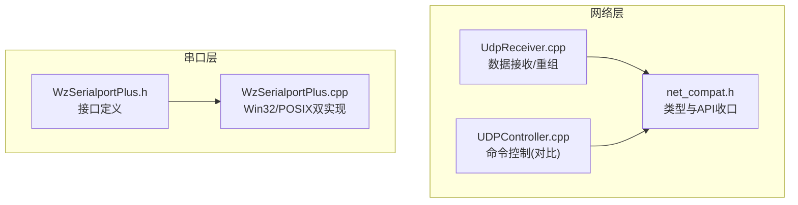
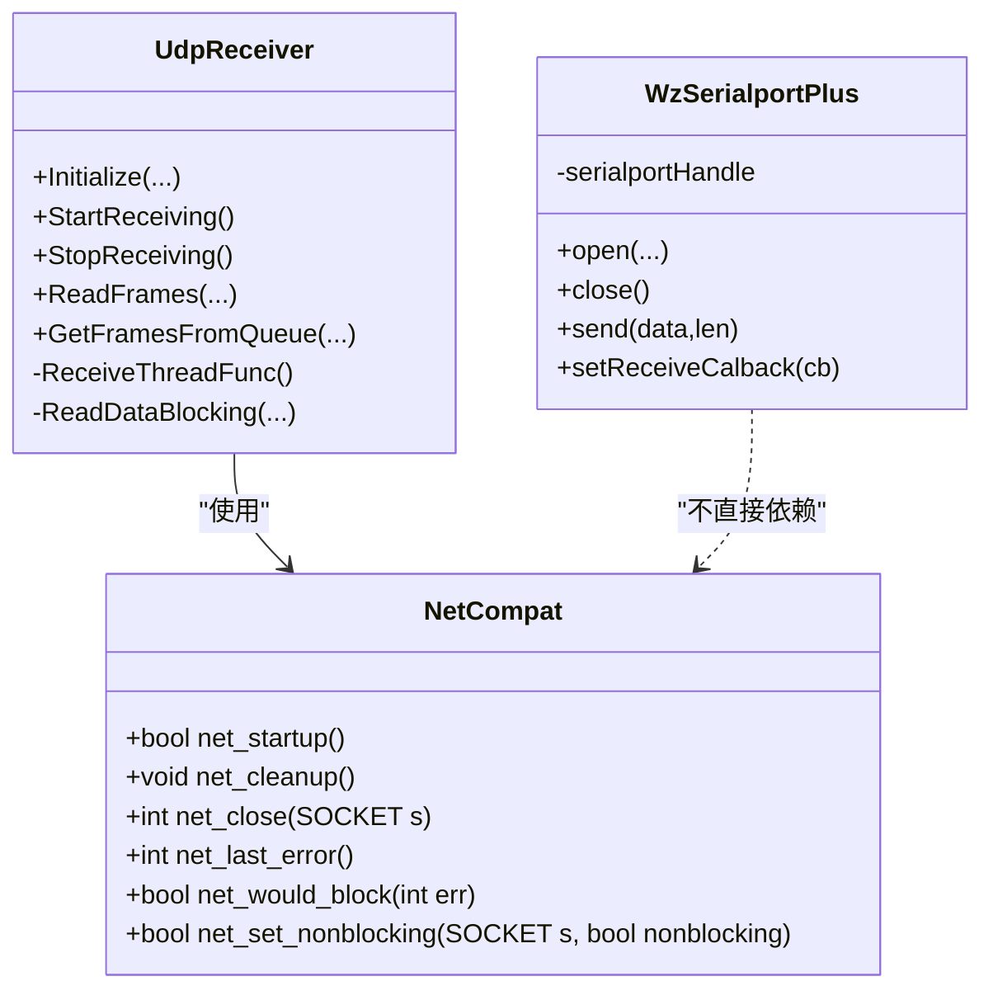
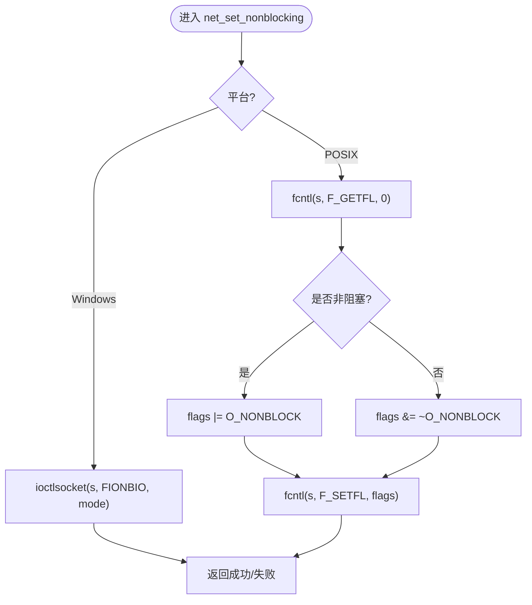
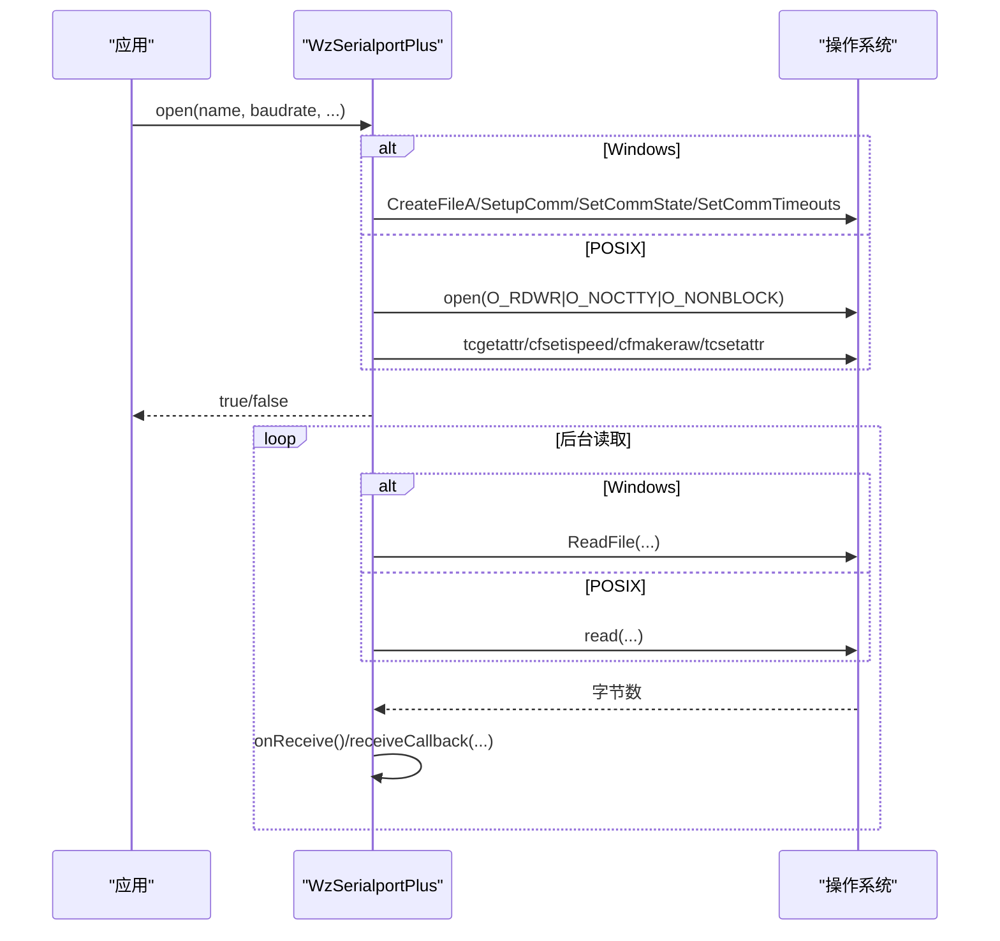
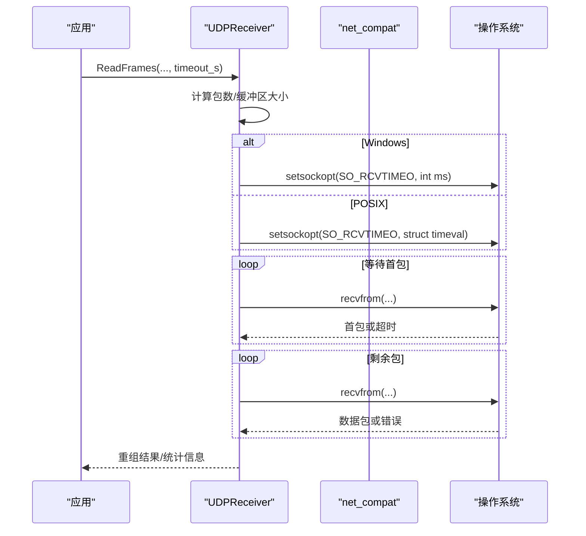
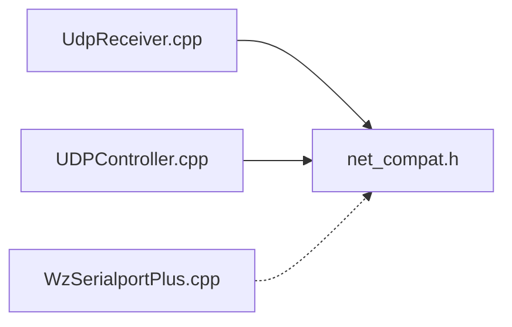

# 跨平台兼容性设计

<cite>
**本文引用的文件**
- [net_compat.h](file://awr1843_dca1000_read/net_compat.h)
- [WzSerialportPlus.h](file://awr1843_dca1000_read/WzSerialportPlus.h)
- [WzSerialportPlus.cpp](file://awr1843_dca1000_read/WzSerialportPlus.cpp)
- [UdpReceiver.cpp](file://awr1843_dca1000_read/UdpReceiver.cpp)
- [UDPController.cpp](file://awr1843_dca1000_read/UDPController.cpp)
</cite>

## 目录
1. [简介](#简介)
2. [项目结构](#项目结构)
3. [核心组件](#核心组件)
4. [架构总览](#架构总览)
5. [详细组件分析](#详细组件分析)
6. [依赖关系分析](#依赖关系分析)
7. [性能与超时特性](#性能与超时特性)
8. [故障排查指南](#故障排查指南)
9. [结论](#结论)

## 简介
本文件聚焦于跨平台兼容层的设计与实现，解释以下两点：
- net_compat.h 如何将 Windows winsock2 与 POSIX BSD socket 的差异收口（SOCKET 类型统一、net_* 辅助函数），使上层 UDP 收发代码无需感知平台差异。
- 串口层 WzSerialportPlus 在 Win32（DCB/ReadFile）与 POSIX（termios/read）上的双实现，并说明 SO_RCVTIMEO 在网络层的差异处理策略。

本项目为 TI AWR1843 毫米波雷达 + DCA1000 采集卡的原始数据采集/解析工具，C++17，仅依赖标准库，无第三方库。网络数据链路分为两层：第1层「数据接收与帧重组」（UDPReceiver 数据口 4098 + UnlockQueue + seqNum 重组，基于 net_compat）；第2层「雷达数据解析」（DataParser）。设备控制（DCA1000 命令口 4096 的 UDPController 与 AWR1843 的串口控制）归入“设备控制”语义，与数据通路分离。

## 项目结构
与本次文档相关的源文件组织如下：
- 网络兼容层：net_compat.h
- 串口抽象层：WzSerialportPlus.h/.cpp
- 数据接收层：UdpReceiver.cpp（含阻塞与非阻塞两种模式）
- 设备控制层（命令口）：UDPController.cpp（用于对比 SO_RCVTIMEO 用法）

图表来源
- [net_compat.h:1-100](file://awr1843_dca1000_read/net_compat.h#L1-L100)
- [UdpReceiver.cpp:231-283](file://awr1843_dca1000_read/UdpReceiver.cpp#L231-L283)
- [UDPController.cpp:60-80](file://awr1843_dca1000_read/UDPController.cpp#L60-L80)
- [WzSerialportPlus.h:18-26](file://awr1843_dca1000_read/WzSerialportPlus.h#L18-L26)
- [WzSerialportPlus.cpp:8-40](file://awr1843_dca1000_read/WzSerialportPlus.cpp#L8-L40)

章节来源
- [net_compat.h:1-100](file://awr1843_dca1000_read/net_compat.h#L1-L100)
- [WzSerialportPlus.h:18-26](file://awr1843_dca1000_read/WzSerialportPlus.h#L18-L26)
- [WzSerialportPlus.cpp:8-40](file://awr1843_dca1000_read/WzSerialportPlus.cpp#L8-L40)
- [UdpReceiver.cpp:231-283](file://awr1843_dca1000_read/UdpReceiver.cpp#L231-L283)
- [UDPController.cpp:60-80](file://awr1843_dca1000_read/UDPController.cpp#L60-L80)

## 核心组件
- 网络兼容层 net_compat.h
  - 统一 SOCKET / INVALID_SOCKET / SOCKET_ERROR 等类型与常量
  - 提供 net_startup/net_cleanup/net_close/net_last_error/net_would_block/net_set_nonblocking 等辅助函数
- 串口抽象层 WzSerialportPlus
  - 通过 SerialHandle 抽象句柄类型，屏蔽 HANDLE（Win32）与 int（POSIX）差异
  - 分别实现 DCB/ReadFile 与 termios/read 两套路径
- 数据接收层 UdpReceiver
  - 非阻塞轮询模式使用 netcompat::net_set_nonblocking + recvfrom + net_would_block
  - 阻塞模式设置 SO_RCVTIMEO，但 Windows 与 POSIX 参数类型不同，需条件编译适配
- 设备控制层 UDPController
  - 命令口控制中同样使用 setsockopt(SO_RCVTIMEO)，体现平台差异处理的必要性

章节来源
- [net_compat.h:39-97](file://awr1843_dca1000_read/net_compat.h#L39-L97)
- [WzSerialportPlus.h:18-26](file://awr1843_dca1000_read/WzSerialportPlus.h#L18-L26)
- [WzSerialportPlus.cpp:88-316](file://awr1843_dca1000_read/WzSerialportPlus.cpp#L88-L316)
- [UdpReceiver.cpp:231-283](file://awr1843_dca1000_read/UdpReceiver.cpp#L231-L283)
- [UdpReceiver.cpp:293-375](file://awr1843_dca1000_read/UdpReceiver.cpp#L293-L375)
- [UDPController.cpp:60-80](file://awr1843_dca1000_read/UDPController.cpp#L60-L80)

## 架构总览
下图展示 net_compat.h 如何被上层模块消费，以及串口层的双实现入口。

图表来源
- [net_compat.h:39-97](file://awr1843_dca1000_read/net_compat.h#L39-L97)
- [UdpReceiver.cpp:231-283](file://awr1843_dca1000_read/UdpReceiver.cpp#L231-L283)
- [UdpReceiver.cpp:293-375](file://awr1843_dca1000_read/UdpReceiver.cpp#L293-L375)
- [WzSerialportPlus.h:30-79](file://awr1843_dca1000_read/WzSerialportPlus.h#L30-L79)

## 详细组件分析

### 网络兼容层 net_compat.h
- 类型与常量统一
  - 在 POSIX 侧用 typedef/constexpr 补齐 SOCKET、INVALID_SOCKET、SOCKET_ERROR，避免与系统头冲突
- 生命周期管理
  - net_startup/net_cleanup：Windows 下调用 WSAStartup/WSACleanup，POSIX 为空操作
- 错误与状态
  - net_last_error：Windows 返回 WSAGetLastError，POSIX 返回 errno
  - net_would_block：识别 EWOULDBLOCK/WSAEWOULDBLOCK/EAGAIN
- I/O 模式切换
  - net_set_nonblocking：Windows 使用 ioctlsocket(FIONBIO)，POSIX 使用 fcntl(F_GETFL/F_SETFL) 设置 O_NONBLOCK

图表来源
- [net_compat.h:85-97](file://awr1843_dca1000_read/net_compat.h#L85-L97)

章节来源
- [net_compat.h:15-35](file://awr1843_dca1000_read/net_compat.h#L15-L35)
- [net_compat.h:41-97](file://awr1843_dca1000_read/net_compat.h#L41-L97)

### 串口层 WzSerialportPlus 双实现
- 句柄抽象
  - SerialHandle：Win32 为 HANDLE，POSIX 为 int
- 打开与配置
  - Win32：CreateFileA → SetupComm → DCB 配置（波特率/数据位/校验/停止位）→ SetCommState → COMMTIMEOUTS → PurgeComm
  - POSIX：open(O_RDWR | O_NOCTTY | O_NONBLOCK) → tcgetattr → cfsetispeed/cfsetospeed → cfmakeraw → 数据位/校验/停止位 → CLOCAL/CREAD → VMIN=0/VTIME=0 → tcsetattr → tcflush
- 读取线程
  - Win32：后台线程循环 ReadFile，回调 onReceive 与外部 receiveCallback
  - POSIX：后台线程循环 read，行为一致
- 关闭与发送
  - close：Win32 CloseHandle，POSIX ::close
  - send：Win32 WriteFile，POSIX ::write

图表来源
- [WzSerialportPlus.cpp:88-212](file://awr1843_dca1000_read/WzSerialportPlus.cpp#L88-L212)
- [WzSerialportPlus.cpp:213-316](file://awr1843_dca1000_read/WzSerialportPlus.cpp#L213-L316)
- [WzSerialportPlus.h:18-26](file://awr1843_dca1000_read/WzSerialportPlus.h#L18-L26)

章节来源
- [WzSerialportPlus.h:18-26](file://awr1843_dca1000_read/WzSerialportPlus.h#L18-L26)
- [WzSerialportPlus.cpp:8-40](file://awr1843_dca1000_read/WzSerialportPlus.cpp#L8-L40)
- [WzSerialportPlus.cpp:88-212](file://awr1843_dca1000_read/WzSerialportPlus.cpp#L88-L212)
- [WzSerialportPlus.cpp:213-316](file://awr1843_dca1000_read/WzSerialportPlus.cpp#L213-L316)

### 数据接收层 UdpReceiver 与 SO_RCVTIMEO 差异处理
- 非阻塞模式
  - ReceiveThreadFunc 中调用 netcompat::net_set_nonblocking(socket_, true)
  - 循环 recvfrom，若 n < 0 则通过 netcompat::net_last_error 与 netcompat::net_would_block 判断是否为“暂无数据”，否则记录错误
- 阻塞模式
  - ReadDataBlocking 中设置 SO_RCVTIMEO，但 Windows 与 POSIX 的参数类型不同：
    - Windows：int 毫秒
    - POSIX：struct timeval（秒+微秒）
  - 通过 #ifdef _WIN32 分支分别构造参数并 setsockopt

图表来源
- [UdpReceiver.cpp:293-375](file://awr1843_dca1000_read/UdpReceiver.cpp#L293-L375)
- [UdpReceiver.cpp:231-283](file://awr1843_dca1000_read/UdpReceiver.cpp#L231-L283)
- [net_compat.h:85-97](file://awr1843_dca1000_read/net_compat.h#L85-L97)

章节来源
- [UdpReceiver.cpp:231-283](file://awr1843_dca1000_read/UdpReceiver.cpp#L231-L283)
- [UdpReceiver.cpp:293-375](file://awr1843_dca1000_read/UdpReceiver.cpp#L293-L375)

### 设备控制层 UDPController 中的 SO_RCVTIMEO 用法（对比）
- 命令口控制中同样使用 setsockopt(SO_RCVTIMEO) 设置接收超时，体现该选项在不同平台下的参数类型差异需要显式处理
- 与数据通路的区别：命令口通常短连接/请求-响应，数据通路更关注高吞吐与低延迟

章节来源
- [UDPController.cpp:60-80](file://awr1843_dca1000_read/UDPController.cpp#L60-L80)

## 依赖关系分析
- UdpReceiver 依赖 net_compat 提供的 net_set_nonblocking、net_last_error、net_would_block 等
- WzSerialportPlus 独立于 net_compat，专注于串口 API 的跨平台封装
- UDPController 与 UdpReceiver 都涉及 SO_RCVTIMEO 的设置，但参数类型不同，需在各自实现中按平台分支处理

图表来源
- [UdpReceiver.cpp:231-283](file://awr1843_dca1000_read/UdpReceiver.cpp#L231-L283)
- [UDPController.cpp:60-80](file://awr1843_dca1000_read/UDPController.cpp#L60-L80)
- [net_compat.h:39-97](file://awr1843_dca1000_read/net_compat.h#L39-L97)

章节来源
- [UdpReceiver.cpp:231-283](file://awr1843_dca1000_read/UdpReceiver.cpp#L231-L283)
- [UDPController.cpp:60-80](file://awr1843_dca1000_read/UDPController.cpp#L60-L80)
- [net_compat.h:39-97](file://awr1843_dca1000_read/net_compat.h#L39-L97)

## 性能与超时特性
- 非阻塞轮询
  - 通过 netcompat::net_set_nonblocking 将 socket 设为非阻塞，recvfrom 立即返回；若无数据则依据 net_would_block 判定并短暂 sleep，降低 CPU 占用
- 阻塞超时
  - 阻塞模式下使用 SO_RCVTIMEO 控制 recvfrom 的等待时间；注意 Windows 与 POSIX 参数类型不同，必须按平台分支设置
- 串口读取
  - Win32 使用 COMMTIMEOUTS 控制读超时；POSIX 使用 termios 的 VMIN/VTIME 控制 read 的行为，两者均配合后台线程轮询以触发回调

[本节为通用指导，不直接分析具体文件]

## 故障排查指南
- 无法创建 socket 或 bind 失败
  - 检查 netcompat::net_last_error 返回值，确认端口占用或权限问题
- 非阻塞模式下频繁报“无数据”
  - 确认已正确调用 netcompat::net_set_nonblocking，并使用 netcompat::net_would_block 判断错误码
- 阻塞模式超时过早或过晚
  - 调整 SO_RCVTIMEO 的值，注意 Windows 单位为毫秒，POSIX 为 struct timeval
- 串口打不开或配置无效
  - Win32：检查 CreateFileA 返回值与 DCB 配置；POSIX：检查 open 权限、tcsetattr 返回值与波特率映射

章节来源
- [UdpReceiver.cpp:231-283](file://awr1843_dca1000_read/UdpReceiver.cpp#L231-L283)
- [UdpReceiver.cpp:293-375](file://awr1843_dca1000_read/UdpReceiver.cpp#L293-L375)
- [WzSerialportPlus.cpp:88-212](file://awr1843_dca1000_read/WzSerialportPlus.cpp#L88-L212)
- [WzSerialportPlus.cpp:213-316](file://awr1843_dca1000_read/WzSerialportPlus.cpp#L213-L316)

## 结论
- net_compat.h 通过类型与 API 收口，使上层网络代码可跨平台编译运行，且保持语义不变
- WzSerialportPlus 在 Win32 与 POSIX 上分别实现了串口打开、配置、读取与关闭，对外暴露一致的接口
- SO_RCVTIMEO 在 Windows 与 POSIX 的参数类型不同，必须在阻塞模式下按平台分支设置；非阻塞模式则通过 netcompat 统一处理错误码与轮询节拍