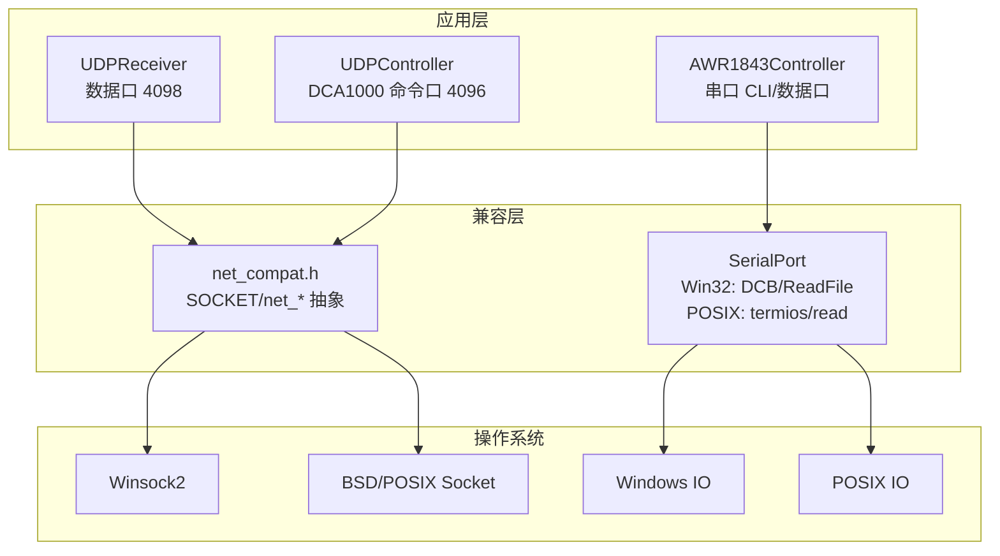
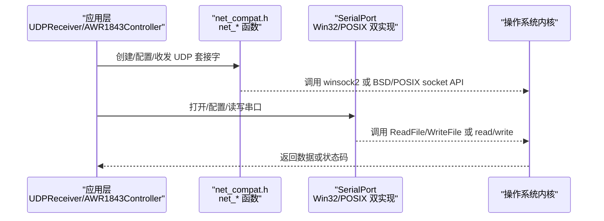
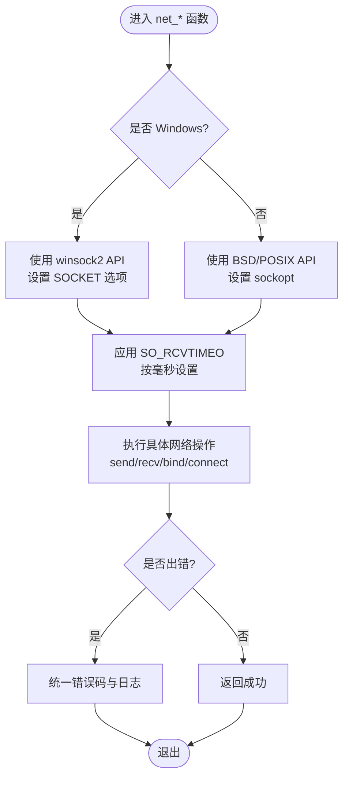
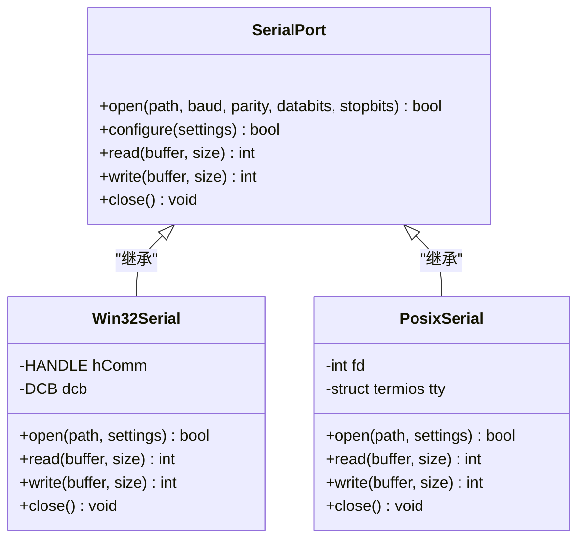
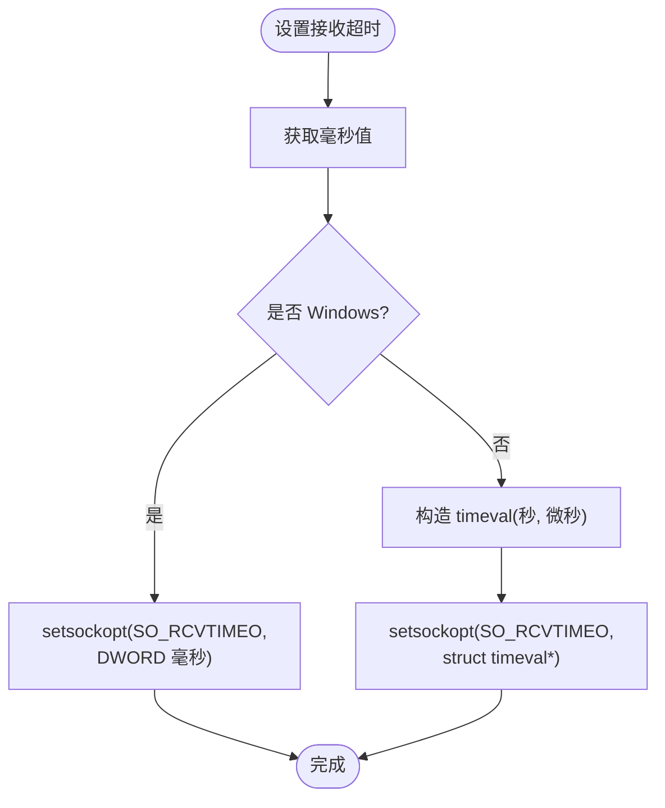
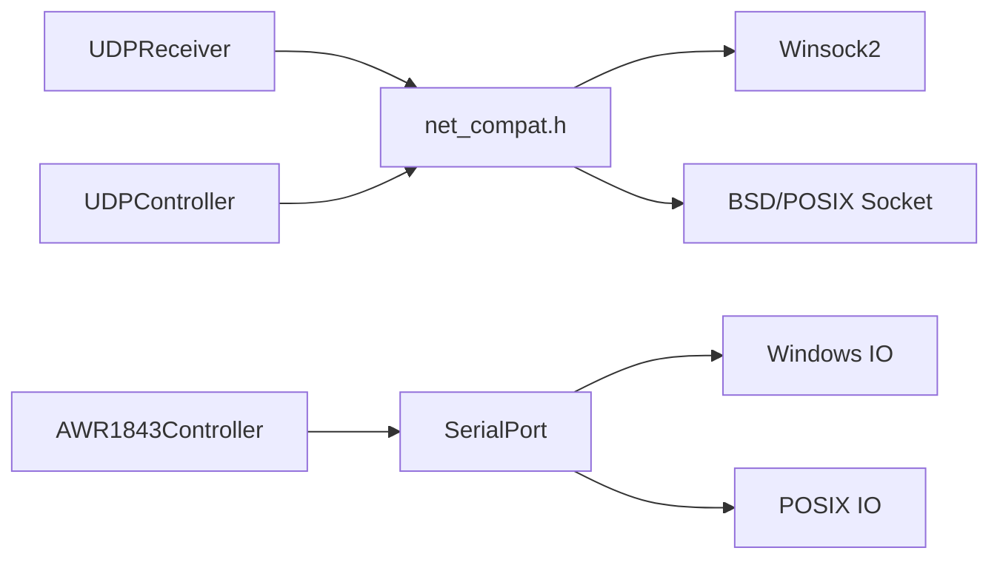

# 跨平台兼容性设计

<cite>
**本文引用的文件**   
- [net_compat.h](file://net_compat.h)
- [CMakeLists.txt](file://CMakeLists.txt)
</cite>

## 目录
1. [引言](#引言)
2. [项目结构](#项目结构)
3. [核心组件](#核心组件)
4. [架构总览](#架构总览)
5. [详细组件分析](#详细组件分析)
6. [依赖关系分析](#依赖关系分析)
7. [性能考量](#性能考量)
8. [故障排查指南](#故障排查指南)
9. [结论](#结论)

## 引言
本章节聚焦于跨平台兼容性设计，重点解释 net_compat.h 如何将 Windows (winsock2) 与 BSD/POSIX socket 的差异进行收口（统一 SOCKET 类型、提供 net_* 辅助函数），并说明串口层在 Win32 (DCB/ReadFile) 与 POSIX (termios/read) 的双实现策略，以及 SO_RCVTIMEO 在不同平台的差异处理。该设计使 UDP 数据接收链路（UDPReceiver）与设备控制链路（AWR1843Controller 串口、DCA1000 命令口）能在 Windows、Linux、macOS 上以一致接口运行，避免上层业务代码被平台细节污染。

## 项目结构
本项目为 TI AWR1843 毫米波雷达 + DCA1000 采集卡的原始数据采集/解析工具，采用 C++17，仅依赖标准库。构建系统通过 CMake 定义两个目标：test_udp（不含串口链，三平台可构建）与 radar_full（含串口链的完整程序）。跨平台网络与串口抽象主要位于 net_compat.h，并在不同平台分支中分别实现底层调用。

图表来源
- [CMakeLists.txt](file://CMakeLists.txt)

章节来源
- [CMakeLists.txt](file://CMakeLists.txt)

## 核心组件
- 网络兼容层（net_compat.h）
  - 统一 SOCKET 类型与句柄语义，屏蔽 winsock2 与 BSD/POSIX socket 的差异。
  - 提供 net_* 辅助函数封装常见操作（如创建套接字、设置选项、收发、关闭等），上层直接调用这些函数而不感知平台差异。
  - 针对 SO_RCVTIMEO 的语义差异进行适配，确保超时行为一致。
- 串口兼容层（WzSerialportPlus 的 POSIX 分支）
  - Win32 路径使用 DCB 配置串口参数，ReadFile/WriteFile 进行 I/O。
  - POSIX 路径使用 termios 配置串口参数，read/write 进行 I/O。
  - 对外暴露统一的打开、配置、读写、关闭接口，隐藏平台差异。

章节来源
- [net_compat.h](file://net_compat.h)

## 架构总览
下图展示了从应用层到 OS 层的调用路径，以及 net_compat.h 与串口层如何作为“桥”屏蔽平台差异。

图表来源
- [net_compat.h](file://net_compat.h)

## 详细组件分析

### 网络兼容层（net_compat.h）
- 类型统一
  - 在 Windows 下将 SOCKET 类型与句柄语义统一到 net_compat.h 中，使上层无需区分 SOCKET/handle。
  - 在非 Windows 平台映射到标准的 int 描述符，保持一致的关闭与错误检查流程。
- net_* 辅助函数
  - 封装常见的网络操作：创建套接字、绑定地址、设置非阻塞/超时、发送/接收数据、关闭连接等。
  - 上层通过 net_* 函数访问网络能力，避免直接调用平台特定的 API。
- SO_RCVTIMEO 差异处理
  - Windows 与 BSD/POSIX 对接收超时的语义和数据结构存在差异（例如 timeval 与 DWORD 毫秒的区别）。
  - net_compat.h 内部根据编译期宏（如 _WIN32）选择对应的设置方式，保证上层调用一致。
- 错误处理
  - 统一错误码转换与日志输出，便于跨平台调试。

图表来源
- [net_compat.h](file://net_compat.h)

章节来源
- [net_compat.h](file://net_compat.h)

### 串口兼容层（Win32 与 POSIX 双实现）
- Win32 路径
  - 使用 DCB 结构体配置波特率、数据位、停止位、校验位等。
  - 使用 ReadFile/WriteFile 进行数据收发，支持超时与事件驱动。
- POSIX 路径
  - 使用 termios 结构体配置串口参数。
  - 使用 read/write 进行数据收发，支持 VMIN/VTIME 等超时模式。
- 统一接口
  - 对外暴露 open/close/configure/read/write 等函数，上层无需关心平台差异。
  - 错误处理与日志输出统一，便于跨平台调试。

图表来源
- [net_compat.h](file://net_compat.h)

章节来源
- [net_compat.h](file://net_compat.h)

### SO_RCVTIMEO 差异处理
- Windows
  - 使用 setsockopt 设置 SO_RCVTIMEO，参数通常为 DWORD 毫秒。
- BSD/POSIX
  - 使用 setsockopt 设置 SO_RCVTIMEO，参数为 struct timeval（秒+微秒）。
- 统一策略
  - net_compat.h 根据 _WIN32 宏选择对应设置方式，将上层传入的毫秒值转换为平台所需格式。
  - 确保 recv/recvfrom 的超时行为一致，避免上层逻辑因平台差异出现阻塞或过早返回。

图表来源
- [net_compat.h](file://net_compat.h)

章节来源
- [net_compat.h](file://net_compat.h)

## 依赖关系分析
- 上层模块（UDPReceiver、AWR1843Controller、UDPController）依赖 net_compat.h 提供的统一网络接口。
- 串口层依赖平台特定 API（Win32: DCB/ReadFile；POSIX: termios/read），但对外暴露统一接口。
- 构建系统（CMakeLists.txt）定义 test_udp 与 radar_full 两个目标，前者不包含串口链，后者包含完整链路。

图表来源
- [CMakeLists.txt](file://CMakeLists.txt)
- [net_compat.h](file://net_compat.h)

章节来源
- [CMakeLists.txt](file://CMakeLists.txt)
- [net_compat.h](file://net_compat.h)

## 性能考量
- 网络层
  - 合理设置 SO_RCVTIMEO 以避免长时间阻塞，提高实时性。
  - 使用非阻塞模式结合事件循环可降低 CPU 占用。
- 串口层
  - 调整 VMIN/VTIME（POSIX）或 ReadFile 超时（Win32）以平衡吞吐与延迟。
  - 批量读写减少系统调用次数，提升性能。
- 内存与缓存
  - 避免频繁分配/释放缓冲区，使用环形缓冲或预分配池。
  - 注意字节序与对齐问题，减少不必要的拷贝。

[本节为通用指导，不直接分析具体文件]

## 故障排查指南
- 网络超时异常
  - 检查 SO_RCVTIMEO 设置是否正确（毫秒 vs 秒/微秒）。
  - 确认防火墙或路由规则未丢弃数据包。
- 串口通信失败
  - 验证 DCB/termios 配置是否与设备匹配（波特率、校验位等）。
  - 检查权限（POSIX 下 /dev/tty* 的访问权限）。
- 错误码不一致
  - 使用 net_compat.h 的统一错误码映射，避免直接比较平台特定错误码。
  - 启用详细日志定位问题。

章节来源
- [net_compat.h](file://net_compat.h)

## 结论
通过 net_compat.h 的网络抽象与串口层的双实现，项目在 Windows、Linux、macOS 上实现了高度一致的通信接口。SO_RCVTIMEO 的差异处理确保了超时行为的一致性，而串口层的 DCB/termios 抽象则屏蔽了底层 I/O 的差异。这种设计使得上层业务逻辑（如 UDPReceiver、AWR1843Controller）无需关心平台细节，提升了可移植性与可维护性。

[本节为总结性内容，不直接分析具体文件]