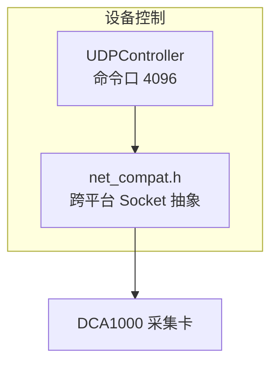
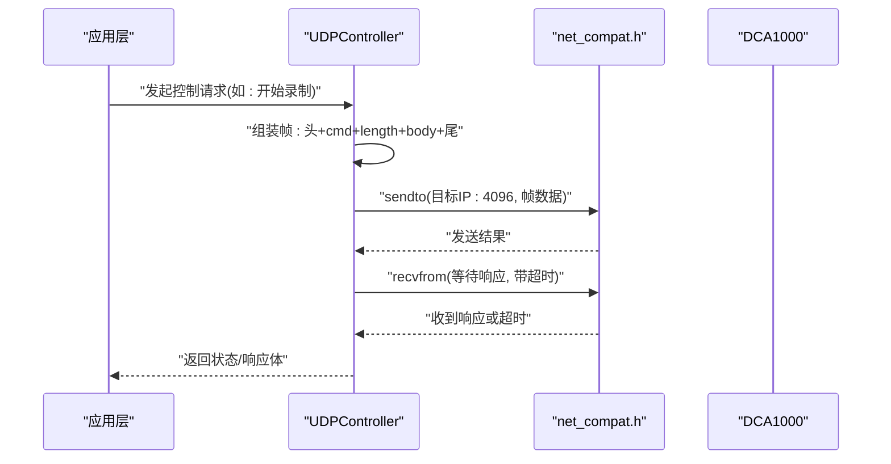
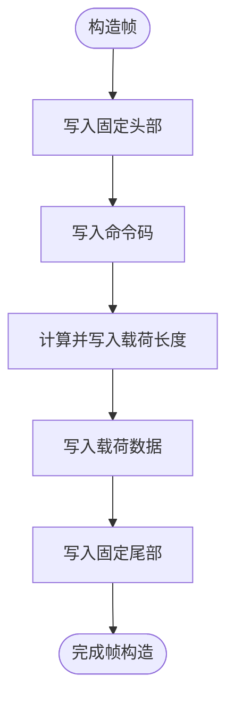
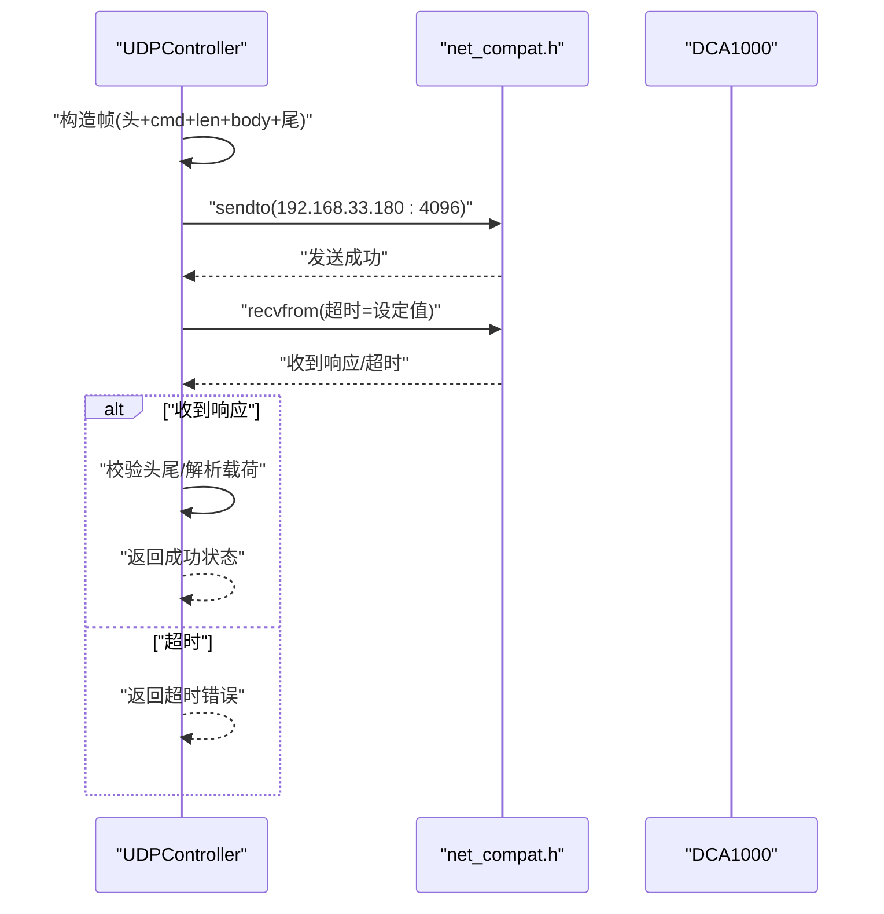

# DCA1000 命令控制

<cite>
**本文引用的文件**   
- [UDPController.h](file://UDPController.h)
- [UDPController.cpp](file://UDPController.cpp)
- [net_compat.h](file://net_compat.h)
</cite>

## 目录
1. [简介](#简介)
2. [项目结构](#项目结构)
3. [核心组件](#核心组件)
4. [架构总览](#架构总览)
5. [详细组件分析](#详细组件分析)
6. [依赖关系分析](#依赖关系分析)
7. [性能与可靠性考虑](#性能与可靠性考虑)
8. [故障排查指南](#故障排查指南)
9. [结论](#结论)

## 简介
本章节聚焦于通过 UDP 命令口（端口 4096）对 DCA1000 采集卡进行设备控制的实现，包括：
- 协议帧格式：固定头 + 命令码 + 长度 + 载荷 + 尾部的完整报文结构
- CommandCode 命令集：复位、配置、启停录制等关键控制指令
- 发送/接收流程与超时处理策略
- 底层跨平台网络抽象 net_compat.h 的使用方式

该能力独立于数据口（端口 4098）的数据接收链路，属于“设备控制”范畴。

## 项目结构
与 DCA1000 命令控制直接相关的源文件如下：
- UDPController.h/.cpp：封装 DCA1000 的 UDP 控制接口，定义命令帧构造、发送与响应等待逻辑
- net_compat.h：跨平台 socket 抽象层，屏蔽 Windows/Linux/macOS 差异

图表来源
- [UDPController.h](file://UDPController.h)
- [UDPController.cpp](file://UDPController.cpp)
- [net_compat.h](file://net_compat.h)

章节来源
- [UDPController.h](file://UDPController.h)
- [UDPController.cpp](file://UDPController.cpp)
- [net_compat.h](file://net_compat.h)

## 核心组件
- UDPController
  - 负责构建 DCA1000 控制报文、建立/复用 UDP 套接字、发送命令并等待响应
  - 暴露高层 API：复位、配置、开始/停止录制等
- net_compat.h
  - 提供统一的 socket、地址、收发、超时设置等接口，屏蔽平台差异

章节来源
- [UDPController.h](file://UDPController.h)
- [UDPController.cpp](file://UDPController.cpp)
- [net_compat.h](file://net_compat.h)

## 架构总览
下图展示了从上层调用到 DCA1000 的端到端控制流程，以及关键数据结构在报文中的布局。

图表来源
- [UDPController.cpp](file://UDPController.cpp)
- [net_compat.h](file://net_compat.h)

## 详细组件分析

### 协议帧格式
- 固定头部：用于标识帧起始
- 命令码：标识具体控制操作
- 长度字段：表示载荷 body 的长度
- 载荷：命令参数或响应数据
- 固定尾部：用于校验帧完整性

图表来源
- [UDPController.cpp](file://UDPController.cpp)

章节来源
- [UDPController.cpp](file://UDPController.cpp)

### CommandCode 命令集
- 复位：对 DCA1000 执行硬件/软件复位
- 配置：下发采集相关参数（如 LVDS/以太网流配置）
- 启停录制：开始/停止数据采集录制
- 其他扩展命令：预留或后续扩展的控制项

说明：
- 命令码枚举集中管理，便于扩展与维护
- 不同命令对应不同的载荷结构与语义

章节来源
- [UDPController.h](file://UDPController.h)
- [UDPController.cpp](file://UDPController.cpp)

### 发送与接收流程
- 发送
  - 根据命令码与参数构造完整帧
  - 通过 net_compat 的 sendto 发送至 DCA1000 的 4096 端口
- 接收
  - 使用 recvfrom 阻塞等待响应
  - 支持超时机制，避免无限等待
- 解析
  - 校验头部/尾部
  - 解析命令码与载荷，返回上层可理解的状态

图表来源
- [UDPController.cpp](file://UDPController.cpp)
- [net_compat.h](file://net_compat.h)

章节来源
- [UDPController.cpp](file://UDPController.cpp)
- [net_compat.h](file://net_compat.h)

### 超时与错误处理
- 超时
  - 为 recvfrom 设置合理的超时时间，防止线程长期阻塞
  - 超时后向上层返回明确的错误码/异常
- 错误
  - 网络不可达、端口占用、权限不足等错误需区分上报
  - 帧校验失败（头/尾不匹配）应丢弃并记录日志

章节来源
- [UDPController.cpp](file://UDPController.cpp)
- [net_compat.h](file://net_compat.h)

### 跨平台 Socket 抽象 (net_compat.h)
- 统一 socket 创建、绑定、收发、关闭接口
- 统一地址族与端口类型，屏蔽平台差异
- 提供超时设置接口，确保在不同系统上行为一致

章节来源
- [net_compat.h](file://net_compat.h)

## 依赖关系分析
- UDPController 依赖 net_compat.h 提供的网络原语
- 上层应用仅与 UDPController 交互，无需感知平台细节

图表来源
- [UDPController.h](file://UDPController.h)
- [UDPController.cpp](file://UDPController.cpp)
- [net_compat.h](file://net_compat.h)

章节来源
- [UDPController.h](file://UDPController.h)
- [UDPController.cpp](file://UDPController.cpp)
- [net_compat.h](file://net_compat.h)

## 性能与可靠性考虑
- 性能
  - 尽量复用 UDP 套接字，减少频繁创建/销毁开销
  - 合理设置接收超时，平衡实时性与 CPU 占用
- 可靠性
  - 增加重试机制与退避策略，提升弱网环境成功率
  - 严格校验帧头/尾，避免误解析
  - 记录关键事件与错误码，便于问题定位

[本节为通用指导，不直接分析具体文件]

## 故障排查指南
- 无法连接 DCA1000
  - 检查上位机与 DCA1000 IP 是否在同一网段
  - 确认防火墙未拦截 4096 端口
- 发送成功但无响应
  - 检查 DCA1000 是否处于可接受命令状态
  - 查看超时设置是否过短
- 响应解析失败
  - 核对帧头/尾是否正确
  - 确认命令码与载荷长度一致

章节来源
- [UDPController.cpp](file://UDPController.cpp)
- [net_compat.h](file://net_compat.h)

## 结论
UDPController 通过标准化的 UDP 控制帧与 net_compat.h 的跨平台抽象，实现了对 DCA1000 的稳定控制。其清晰的协议定义、完善的超时与错误处理机制，为上层应用提供了简洁可靠的设备控制接口。建议在扩展新命令时遵循现有帧格式与错误处理规范，以保证系统的可维护性与一致性。