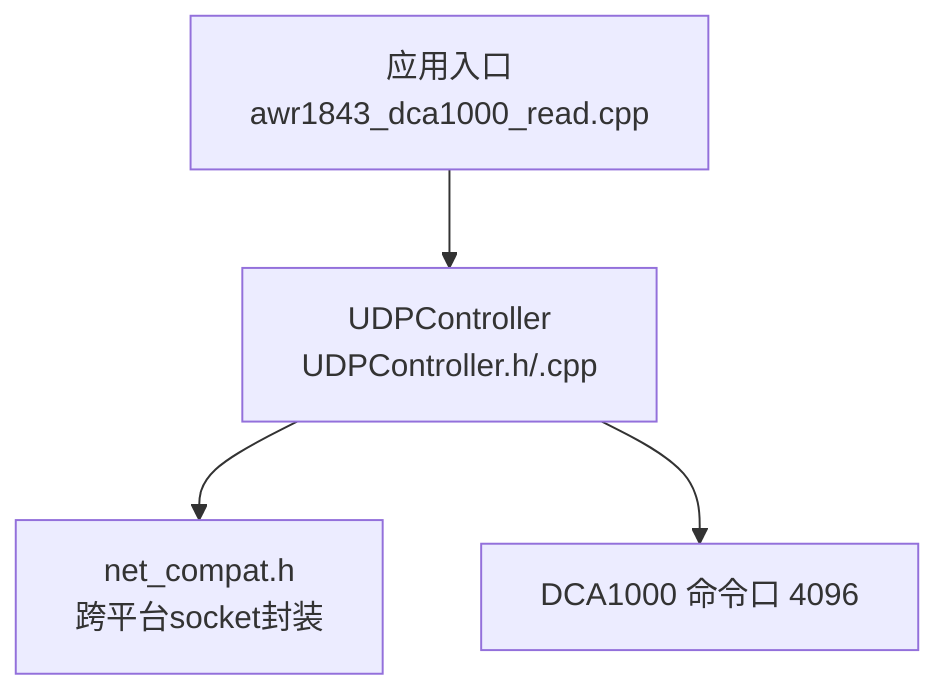
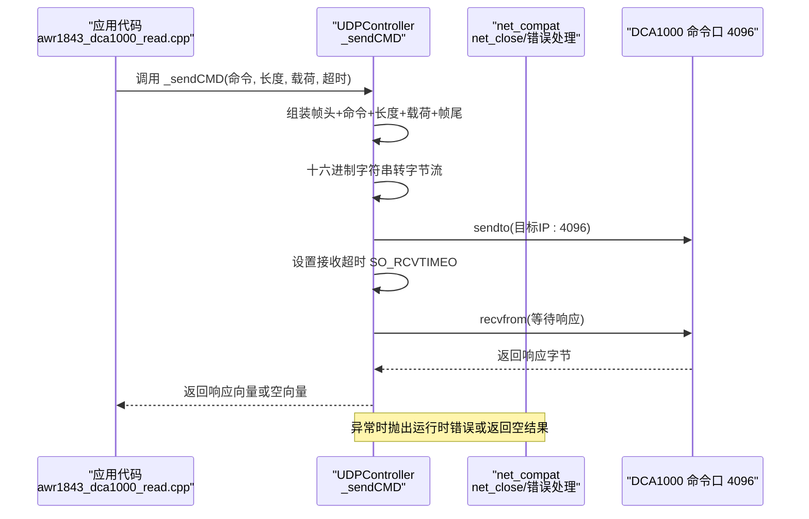
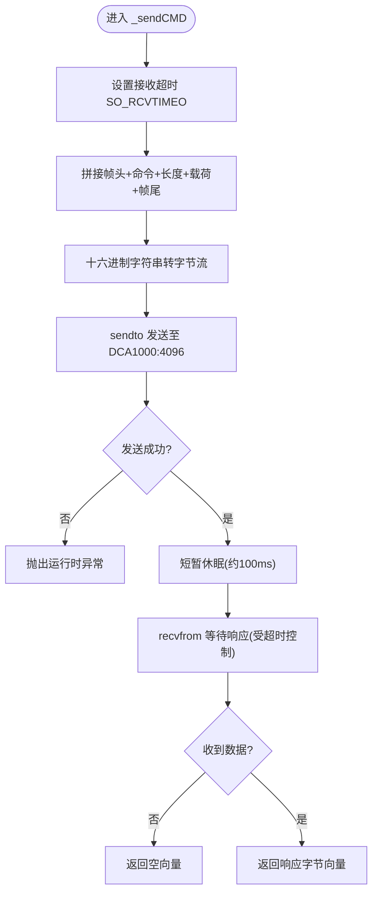
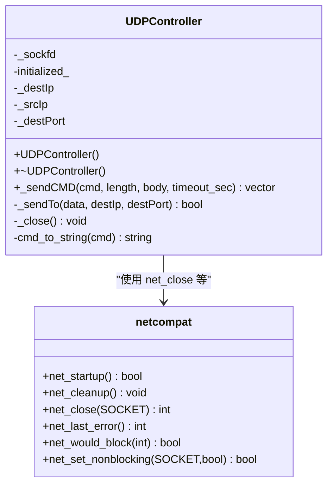

# DCA1000 命令控制

<cite>
**本文引用的文件**
- [UDPController.h](file://awr1843_dca1000_read/UDPController.h)
- [UDPController.cpp](file://awr1843_dca1000_read/UDPController.cpp)
- [net_compat.h](file://awr1843_dca1000_read/net_compat.h)
- [awr1843_dca1000_read.cpp](file://awr1843_dca1000_read/awr1843_dca1000_read.cpp)
</cite>

## 目录
1. [简介](#简介)
2. [项目结构](#项目结构)
3. [核心组件](#核心组件)
4. [架构总览](#架构总览)
5. [详细组件分析](#详细组件分析)
6. [依赖关系分析](#依赖关系分析)
7. [性能与超时处理](#性能与超时处理)
8. [故障排查指南](#故障排查指南)
9. [结论](#结论)

## 简介
本章节聚焦于 UDPController 通过命令口 4096 向 DCA1000 发送控制命令的协议、命令集与收发/超时处理，并说明其底层跨平台 socket 依赖。该模块负责设备侧（DCA1000）的配置与启停录制等控制面操作，与数据面（数据口 4098）解耦。

## 项目结构
- UDPController 位于 awr1843_dca1000_read 目录，提供面向 DCA1000 的命令控制能力。
- net_compat.h 提供跨平台 socket 抽象，屏蔽 Windows/POSIX 差异。
- awr1843_dca1000_read.cpp 中演示了典型命令序列：复位、系统连接、配置、读取版本、开始/停止录制等。

图表来源
- [UDPController.h:45-97](file://awr1843_dca1000_read/UDPController.h#L45-L97)
- [UDPController.cpp:32-57](file://awr1843_dca1000_read/UDPController.cpp#L32-L57)
- [net_compat.h:39-97](file://awr1843_dca1000_read/net_compat.h#L39-L97)
- [awr1843_dca1000_read.cpp:66-132](file://awr1843_dca1000_read/awr1843_dca1000_read.cpp#L66-L132)

章节来源
- [UDPController.h:1-102](file://awr1843_dca1000_read/UDPController.h#L1-L102)
- [UDPController.cpp:1-156](file://awr1843_dca1000_read/UDPController.cpp#L1-L156)
- [net_compat.h:1-100](file://awr1843_dca1000_read/net_compat.h#L1-L100)
- [awr1843_dca1000_read.cpp:60-140](file://awr1843_dca1000_read/awr1843_dca1000_read.cpp#L60-L140)

## 核心组件
- UDPController：封装对 DCA1000 的控制面通信，包括构造/析构、绑定本地端口、发送命令、等待响应、关闭套接字。
- CommandCode：定义 DCA1000 支持的命令类型，如复位、配置、启停录制、读取版本等。
- net_compat：统一 SOCKET/INVALID_SOCKET/SOCKET_ERROR 等名称与错误码获取、非阻塞设置等辅助函数。

章节来源
- [UDPController.h:20-35](file://awr1843_dca1000_read/UDPController.h#L20-L35)
- [UDPController.h:45-97](file://awr1843_dca1000_read/UDPController.h#L45-L97)
- [net_compat.h:39-97](file://awr1843_dca1000_read/net_compat.h#L39-L97)

## 架构总览
下图展示了从上层调用到网络层的关键交互路径，以及命令帧在 UDP 上的传输流程。

图表来源
- [UDPController.cpp:62-110](file://awr1843_dca1000_read/UDPController.cpp#L62-L110)
- [UDPController.cpp:112-133](file://awr1843_dca1000_read/UDPController.cpp#L112-L133)
- [UDPController.cpp:24-30](file://awr1843_dca1000_read/UDPController.cpp#L24-L30)
- [net_compat.h:59-65](file://awr1843_dca1000_read/net_compat.h#L59-L65)

## 详细组件分析

### 协议格式与帧结构
- 帧组成：帧头 + 命令 + 长度 + 载荷 + 帧尾
- 帧头：固定为“5aa5”
- 命令：由 CommandCode 映射得到的两位十六进制串（例如“0100”、“0500”等）
- 长度：以十六进制字符串表示的长度字段（示例中常为“0000”或“0600”）
- 载荷：可选参数体，按十六进制字符串拼接
- 帧尾：固定为“aaee”
- 编码方式：将上述各段拼接成十六进制字符串后，每两个字符解析为一个字节，形成最终发送的字节流

注意：
- 帧头常量与数值常量同时存在，实际发送使用字符串拼接方式；数值常量用于校验或扩展用途。
- 长度字段与载荷均为十六进制字符串形式，需确保偶数字节对齐。

章节来源
- [UDPController.h:10-16](file://awr1843_dca1000_read/UDPController.h#L10-L16)
- [UDPController.cpp:72-82](file://awr1843_dca1000_read/UDPController.cpp#L72-L82)

### 命令集 CommandCode
- 复位FPGA：RESET_FPGA_CMD_CODE
- 复位AR设备：RESET_AR_DEV_CMD_CODE
- 配置FPGA通用参数：CONFIG_FPGA_GEN_CMD_CODE
- 配置EEPROM：CONFIG_EEPROM_CMD_CODE
- 开始录制：RECORD_START_CMD_CODE
- 停止录制：RECORD_STOP_CMD_CODE
- 开始回放：PLAYBACK_START_CMD_CODE
- 停止回放：PLAYBACK_STOP_CMD_CODE
- 系统连接：SYSTEM_CONNECT_CMD_CODE
- 系统错误上报：SYSTEM_ERROR_CMD_CODE
- 配置数据包参数：CONFIG_PACKET_DATA_CMD_CODE
- 配置数据模式AR设备：CONFIG_DATA_MODE_AR_DEV_CMD_CODE
- 初始化FPGA回放：INIT_FPGA_PLAYBACK_CMD_CODE
- 读取FPGA版本：READ_FPGA_VERSION_CMD_CODE

这些命令在上层通过枚举值传入，内部会映射为对应的十六进制命令串参与帧拼装。

章节来源
- [UDPController.h:20-35](file://awr1843_dca1000_read/UDPController.h#L20-L35)
- [UDPController.h:58-81](file://awr1843_dca1000_read/UDPController.h#L58-L81)

### 发送与接收流程
- 构造阶段：创建 UDP Socket，绑定本地 IP 与端口 4096，标记已初始化。
- 发送阶段：
  - 设置接收超时时间（秒），随后拼装命令帧。
  - 将十六进制字符串转为字节流，调用底层 sendto 发送到 DCA1000 的 4096 端口。
  - 若发送失败，抛出运行时异常。
- 接收阶段：
  - 短暂休眠后进入 recvfrom 等待响应，受 SO_RCVTIMEO 控制。
  - 若接收出错，返回空向量；否则返回收到的字节向量。
- 关闭阶段：析构时调用 netcompat::net_close 释放资源。

图表来源
- [UDPController.cpp:62-110](file://awr1843_dca1000_read/UDPController.cpp#L62-L110)
- [UDPController.cpp:112-133](file://awr1843_dca1000_read/UDPController.cpp#L112-L133)

章节来源
- [UDPController.cpp:32-57](file://awr1843_dca1000_read/UDPController.cpp#L32-L57)
- [UDPController.cpp:62-110](file://awr1843_dca1000_read/UDPController.cpp#L62-L110)
- [UDPController.cpp:112-133](file://awr1843_dca1000_read/UDPController.cpp#L112-L133)
- [UDPController.cpp:24-30](file://awr1843_dca1000_read/UDPController.cpp#L24-L30)

### 典型命令序列（来自示例）
- 复位 AR 设备 → 复位 FPGA → 系统连接 → 配置 FPGA 通用参数 → 配置数据包参数 → 读取 FPGA 版本 → 开始录制 → 启动雷达传感器 → 停止录制
- 以上序列体现了控制面的标准编排：先复位与连接，再下发配置，最后启停录制。

章节来源
- [awr1843_dca1000_read.cpp:68-132](file://awr1843_dca1000_read/awr1843_dca1000_read.cpp#L68-L132)

## 依赖关系分析
- UDPController 依赖 net_compat.h 提供的跨平台 socket 能力（如 net_close）。
- 上层示例 awr1843_dca1000_read.cpp 直接调用 UDPController 的公共接口进行命令发送。

图表来源
- [UDPController.h:45-97](file://awr1843_dca1000_read/UDPController.h#L45-L97)
- [net_compat.h:39-97](file://awr1843_dca1000_read/net_compat.h#L39-L97)

章节来源
- [UDPController.h:45-97](file://awr1843_dca1000_read/UDPController.h#L45-L97)
- [net_compat.h:39-97](file://awr1843_dca1000_read/net_compat.h#L39-L97)

## 性能与超时处理
- 超时机制：通过 setsockopt 设置 SO_RCVTIMEO，单位为秒；当超过指定时间未收到响应，recvfrom 返回错误，上层返回空向量。
- 发送失败处理：若 sendto 未完整发送，抛出运行时异常，调用方应捕获并处理。
- 接收缓冲：MAX_SIZE 限制单次最大接收包大小，避免过大内存占用。
- 建议：
  - 根据链路质量调整超时时间，避免过短导致误判、过长影响吞吐。
  - 对于批量命令，可在调用间增加适当延时，保证设备状态稳定。
  - 关注返回值是否为空，结合日志定位丢包或设备无响应问题。

章节来源
- [UDPController.cpp:62-110](file://awr1843_dca1000_read/UDPController.cpp#L62-L110)
- [UDPController.h:37](file://awr1843_dca1000_read/UDPController.h#L37)

## 故障排查指南
- 无法绑定本地端口：检查本地 IP 是否有效、端口是否被占用；构造函数在 bind 失败时会抛出异常。
- 发送失败：确认目标 IP 与端口正确（DCA1000 命令口 4096），并确保网络连通。
- 接收超时：增大超时时间或检查设备是否在线；若 recvfrom 返回错误，上层返回空向量，需判断并重试。
- 资源释放：析构时调用 netcompat::net_close 关闭 socket，避免句柄泄漏。
- 跨平台差异：Windows 下需要 WSAStartup；POSIX 下使用标准 BSD socket API；net_compat 已做统一封装。

章节来源
- [UDPController.cpp:32-57](file://awr1843_dca1000_read/UDPController.cpp#L32-L57)
- [UDPController.cpp:24-30](file://awr1843_dca1000_read/UDPController.cpp#L24-L30)
- [net_compat.h:43-56](file://awr1843_dca1000_read/net_compat.h#L43-L56)

## 结论
UDPController 提供了对 DCA1000 的稳定控制面通信能力，采用“5aa5 头 + 命令 + 长度 + 载荷 + aaee 尾”的帧格式，并通过 net_compat.h 实现跨平台 socket 兼容。上层可通过统一的 CommandCode 枚举发起复位、配置、启停录制等操作，配合合理的超时与错误处理策略，能够可靠地完成设备控制任务。