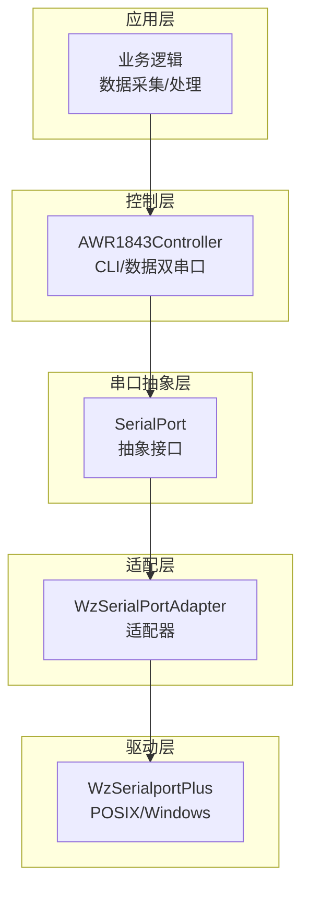
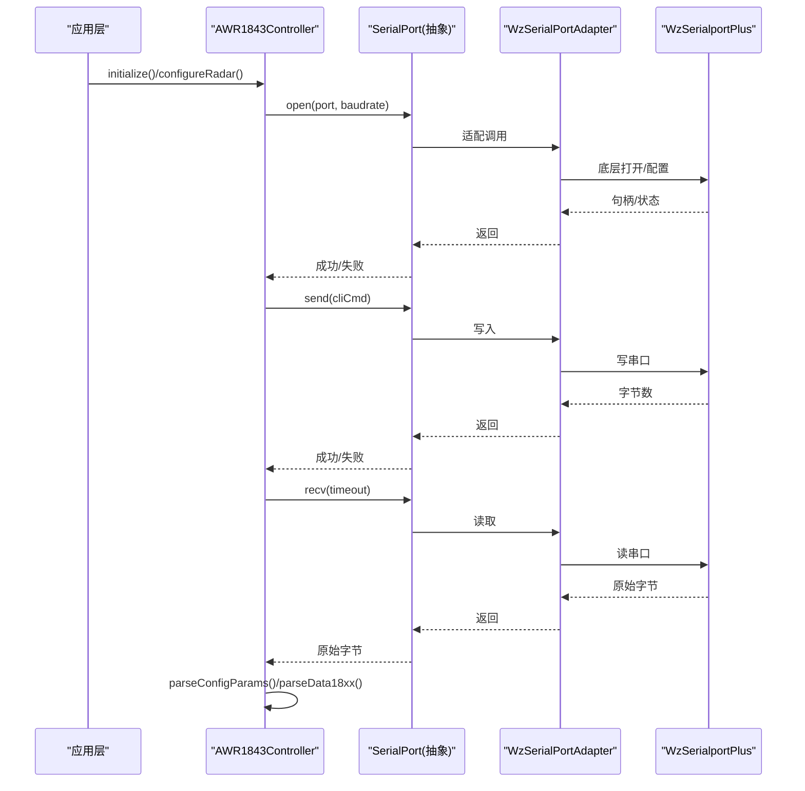
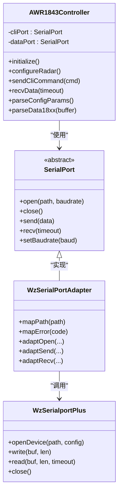

# 串口通信与 AWR1843 雷达控制

<cite>
**本文引用的文件**   
- [SerialPort.h](file://SerialPort.h)
- [WzSerialPortAdapter.h](file://WzSerialPortAdapter.h)
- [WzSerialportPlus.cpp](file://WzSerialportPlus.cpp)
- [WzSerialportPlus.h](file://WzSerialportPlus.h)
- [AWR1843Controller.h](file://AWR1843Controller.h)
- [CMakeLists.txt](file://CMakeLists.txt)
</cite>

## 目录
1. [简介](#简介)
2. [项目结构](#项目结构)
3. [核心组件](#核心组件)
4. [架构总览](#架构总览)
5. [详细组件分析](#详细组件分析)
6. [依赖关系分析](#依赖关系分析)
7. [性能考量](#性能考量)
8. [故障排查指南](#故障排查指南)
9. [结论](#结论)
10. [附录](#附录)

## 简介
本文件聚焦于 AWR1843 毫米波雷达工具中的串口通信栈与设备控制流程，系统性梳理以下要点：
- 串口抽象层到驱动适配的三层设计：SerialPort 抽象基类 → WzSerialPortAdapter 适配器 → WzSerialportPlus 底层驱动。
- AWR1843Controller 的双串口设计（CLI 命令口与数据口）及配置下发流程。
- cfg 配置解析、参数计算以及 TLV 帧解析（parseData18xx）。

本项目为 C++17 实现，仅依赖标准库；串口相关代码通过跨平台封装支持 POSIX(termios) 分支，确保在 Linux/Windows 等多平台可用。

## 项目结构
围绕串口与 AWR1843 控制的代码主要分布在以下文件中：
- SerialPort.h：定义串口抽象接口，屏蔽平台差异。
- WzSerialPortAdapter.h：将上层抽象接口适配到底层 WzSerialportPlus 驱动。
- WzSerialportPlus.cpp/.h：具体平台实现（POSIX/Windows），提供打开、读写、超时等能力。
- AWR1843Controller.h：头文件内联实现，负责 CLI 命令下发、cfg 解析、参数推导、TLV 帧解析。
- CMakeLists.txt：构建目标定义（test_udp 与 radar_full），后者包含串口链。

图表来源
- [AWR1843Controller.h](file://AWR1843Controller.h)
- [SerialPort.h](file://SerialPort.h)
- [WzSerialPortAdapter.h](file://WzSerialPortAdapter.h)
- [WzSerialportPlus.cpp](file://WzSerialportPlus.cpp)
- [WzSerialportPlus.h](file://WzSerialportPlus.h)

章节来源
- [CMakeLists.txt](file://CMakeLists.txt)

## 核心组件
- SerialPort 抽象基类：定义统一的串口操作接口（打开、关闭、发送、接收、设置波特率等），屏蔽平台差异，便于上层解耦。
- WzSerialPortAdapter 适配器：将 SerialPort 接口映射到 WzSerialportPlus 的具体实现，完成参数转换与错误码对齐。
- WzSerialportPlus 底层驱动：基于 termios（POSIX）或 Windows API 的串口实现，提供线程安全读写、超时控制、流控等。
- AWR1843Controller：头文件内联实现，管理两个独立串口实例（CLI 命令口与数据口），负责：
  - 读取并逐行下发 mmWave CLI 配置文件（cfg）。
  - 从 profileCfg/frameCfg/channelCfg 推导距离分辨率、多普勒分辨率、最大速度等关键参数。
  - 解析 TLV 帧（parseData18xx），提取 I/Q 数据与元信息。

章节来源
- [SerialPort.h](file://SerialPort.h)
- [WzSerialPortAdapter.h](file://WzSerialPortAdapter.h)
- [WzSerialportPlus.cpp](file://WzSerialportPlus.cpp)
- [WzSerialportPlus.h](file://WzSerialportPlus.h)
- [AWR1843Controller.h](file://AWR1843Controller.h)

## 架构总览
下图展示从应用层到驱动层的调用序列，以及 AWR1843Controller 对双串口的使用方式。

图表来源
- [AWR1843Controller.h](file://AWR1843Controller.h)
- [SerialPort.h](file://SerialPort.h)
- [WzSerialPortAdapter.h](file://WzSerialPortAdapter.h)
- [WzSerialportPlus.cpp](file://WzSerialportPlus.cpp)
- [WzSerialportPlus.h](file://WzSerialportPlus.h)

## 详细组件分析

### 串口抽象层：SerialPort
- 职责：定义统一接口，包括端口打开/关闭、发送/接收、波特率设置、超时配置等。
- 设计要点：
  - 以纯虚函数暴露能力，避免上层耦合具体平台。
  - 错误码与异常策略需与适配器层对齐，保证上层可统一处理。
  - 建议提供异步/阻塞两种读取模式，以便在高吞吐场景下降低阻塞开销。

章节来源
- [SerialPort.h](file://SerialPort.h)

### 适配层：WzSerialPortAdapter
- 职责：将 SerialPort 抽象接口转换为 WzSerialportPlus 的具体调用，完成参数映射与错误处理。
- 设计要点：
  - 将不同平台的端口名/路径格式统一为抽象接口期望的形式。
  - 将底层返回值转换为抽象接口约定的状态码或异常类型。
  - 可在适配器中增加重试、退避、日志等横切关注点。

章节来源
- [WzSerialPortAdapter.h](file://WzSerialPortAdapter.h)

### 驱动层：WzSerialportPlus
- 职责：实现跨平台串口访问，POSIX 分支基于 termios，Windows 分支基于 WinAPI。
- 设计要点：
  - 线程安全：读写互斥、缓冲区同步。
  - 超时控制：非阻塞 I/O 或 select/poll 机制，避免长时间阻塞。
  - 流控与校验：可选硬件流控、CRC/校验位配置。
  - 资源管理：RAII 风格的生命周期管理，自动释放句柄。

章节来源
- [WzSerialportPlus.cpp](file://WzSerialportPlus.cpp)
- [WzSerialportPlus.h](file://WzSerialportPlus.h)

### 控制层：AWR1843Controller（双串口设计）
- 双串口通道：
  - CLI 命令口：用于下发 mmWave CLI 配置与启停命令（典型波特率 115200）。
  - 数据口：用于接收雷达原始数据（典型波特率 921600）。
- 配置下发流程：
  - initialize()/configureRadar() 读取 cfg 文件，按行发送 CLI 命令。
  - 等待响应并校验，失败时回滚或重试。
- 参数计算：
  - parseConfigParams() 从 profileCfg/frameCfg/channelCfg 推导：
    - 距离分辨率、最大不模糊距离
    - 多普勒分辨率、最大速度
    - 采样率、带宽、帧周期等
- TLV 帧解析：
  - parseData18xx() 解析 TLV 头部与载荷，提取 I/Q 数据块、时间戳、帧号等元信息。
  - 根据 MAGIC_WORD 标识帧起始，结合长度字段进行边界校验。

图表来源
- [AWR1843Controller.h](file://AWR1843Controller.h)
- [SerialPort.h](file://SerialPort.h)
- [WzSerialPortAdapter.h](file://WzSerialPortAdapter.h)
- [WzSerialportPlus.cpp](file://WzSerialportPlus.cpp)
- [WzSerialportPlus.h](file://WzSerialportPlus.h)

章节来源
- [AWR1843Controller.h](file://AWR1843Controller.h)

### 配置解析与参数计算（cfg→参数）
- cfg 文件内容：mmWave CLI 命令逐行文本，包含 profileCfg、frameCfg、channelCfg 等关键行。
- 解析流程：
  - 读取 cfg 文件，按行匹配关键字段。
  - 将字符串参数转为数值，建立内部参数表。
  - 依据 TI 算法公式推导分辨率、最大速度、帧周期等。
- 关键点：
  - 单位换算（Hz、m/s、dBm 等）需严格一致。
  - 参数一致性检查（如采样率与带宽匹配、帧周期与 chirp 数量匹配）。

章节来源
- [AWR1843Controller.h](file://AWR1843Controller.h)

### TLV 帧解析（parseData18xx）
- 帧结构：
  - 魔数（MAGIC_WORD）标识帧起始。
  - TLV 头部：类型、长度、版本等。
  - 载荷：I/Q 数据块、时间戳、帧号、状态字等。
- 解析步骤：
  - 定位 MAGIC_WORD，校验后续长度字段。
  - 遍历 TLV 条目，按类型分发处理。
  - 提取 I/Q 复数样本，组装为 FrameDataSingleRx/FrameDataAllRx。
- 错误处理：
  - 长度越界、魔数不匹配、校验失败时丢弃帧并记录日志。

章节来源
- [AWR1843Controller.h](file://AWR1843Controller.h)

## 依赖关系分析
- 模块耦合：
  - AWR1843Controller 依赖 SerialPort 抽象接口，不直接感知平台差异。
  - WzSerialPortAdapter 作为中间层，隔离抽象与实现。
  - WzSerialportPlus 是具体实现，被适配器调用。
- 外部依赖：
  - POSIX 环境依赖 termios；Windows 环境依赖 WinAPI。
  - 无第三方库，仅标准库。

图表来源
- [AWR1843Controller.h](file://AWR1843Controller.h)
- [SerialPort.h](file://SerialPort.h)
- [WzSerialPortAdapter.h](file://WzSerialPortAdapter.h)
- [WzSerialportPlus.cpp](file://WzSerialportPlus.cpp)
- [WzSerialportPlus.h](file://WzSerialportPlus.h)

章节来源
- [CMakeLists.txt](file://CMakeLists.txt)

## 性能考量
- 高吞吐数据口：
  - 数据口波特率较高（如 921600），建议使用非阻塞 I/O 与环形缓冲，减少拷贝与锁竞争。
  - 批量读取与零拷贝策略可降低 CPU 占用。
- 低延迟命令口：
  - CLI 命令口应优先保证低延迟与可靠性，必要时采用短超时与重试。
- 内存管理：
  - 避免频繁分配/释放，复用缓冲区，减少 GC/堆压力。
- 线程模型：
  - 读写分离，生产者-消费者队列解耦，避免阻塞主循环。

[本节为通用指导，不涉及具体文件]

## 故障排查指南
- 常见症状：
  - 无法打开端口：检查权限、端口号、路径格式。
  - 乱码或丢包：确认波特率、校验位、停止位一致；检查缓冲区大小与超时。
  - 配置未生效：核对 cfg 行顺序与关键字段；查看 CLI 响应是否报错。
  - TLV 解析失败：检查魔数、长度字段、I/Q 数据对齐。
- 调试手段：
  - 启用详细日志，记录发送/接收原始字节。
  - 使用串口抓包工具验证链路。
  - 逐步缩小问题范围（先 CLI 后数据口）。

章节来源
- [AWR1843Controller.h](file://AWR1843Controller.h)
- [WzSerialportPlus.cpp](file://WzSerialportPlus.cpp)
- [WzSerialportPlus.h](file://WzSerialportPlus.h)

## 结论
本串口栈通过“抽象—适配—驱动”三层设计，实现了跨平台、可扩展的串口通信能力；AWR1843Controller 以双串口分离 CLI 与数据通路，配合 cfg 解析与 TLV 帧解析，形成完整的雷达控制与数据采集闭环。建议在高性能场景下进一步优化 I/O 模型与内存管理，以提升吞吐与稳定性。

[本节为总结性内容，不涉及具体文件]

## 附录
- 构建目标：
  - test_udp：不含串口链，三平台可构建，配合 Python 回放泵测试 UDP→重组→解析。
  - radar_full：包含串口链的完整程序，用于实时采集与解析。
- 网络地址约定：
  - 上位机 IP 192.168.33.30，DCA1000 IP 192.168.33.180。
  - 帧字节数 = numRX × numChirpsEachFrame × numADCSamples × 4（每采样点 2×int16 的 I/Q）。

章节来源
- [CMakeLists.txt](file://CMakeLists.txt)