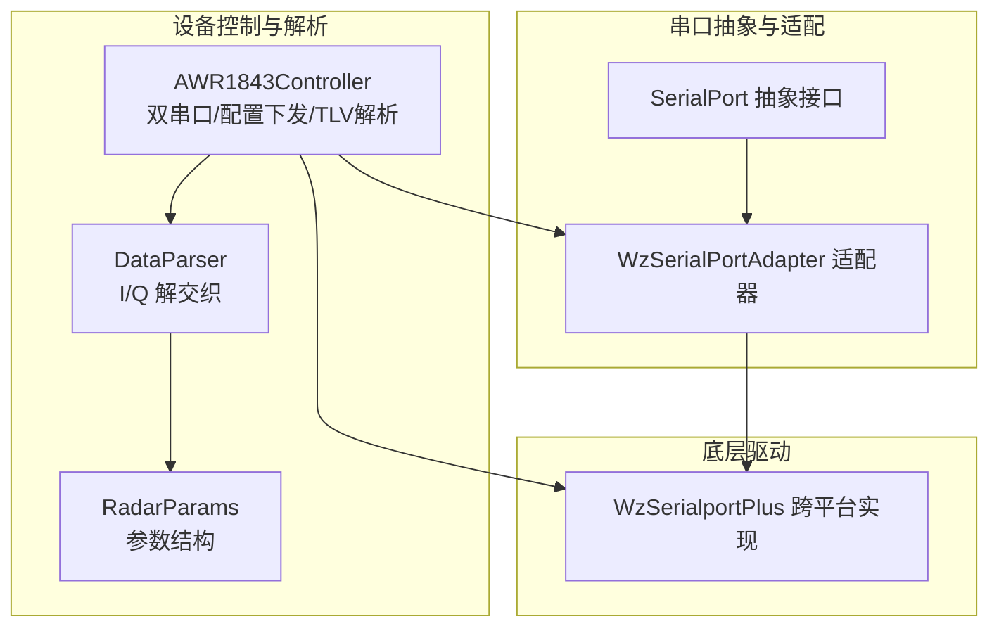
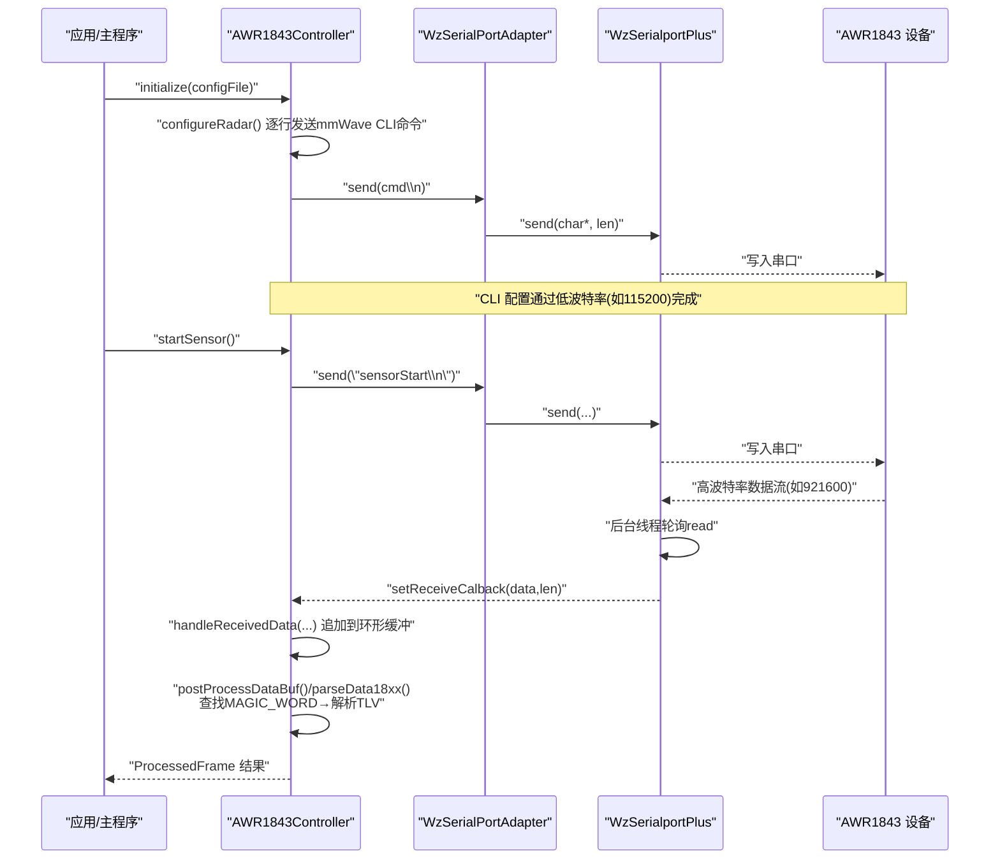
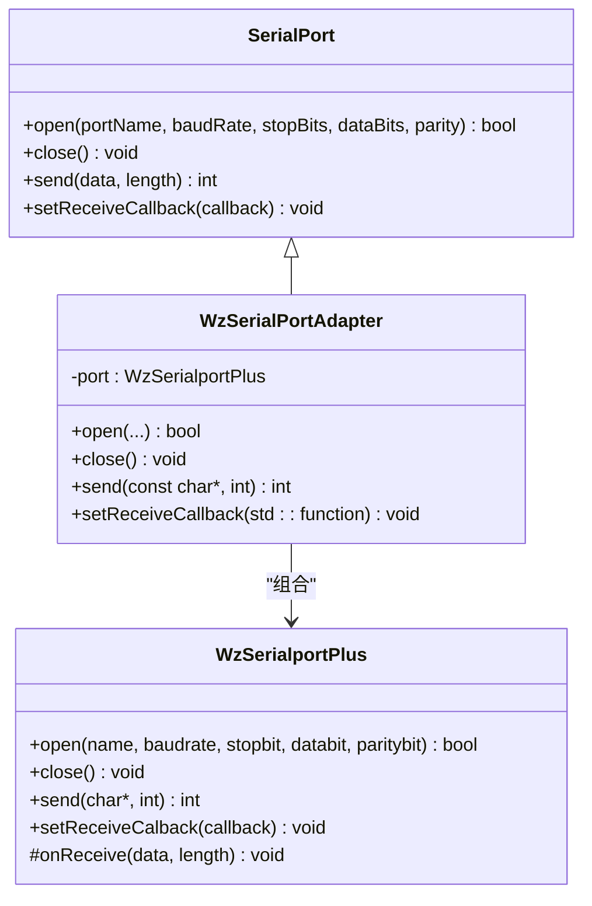
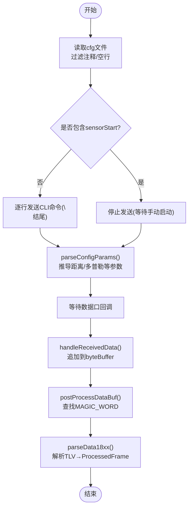
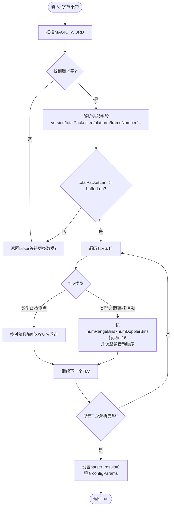
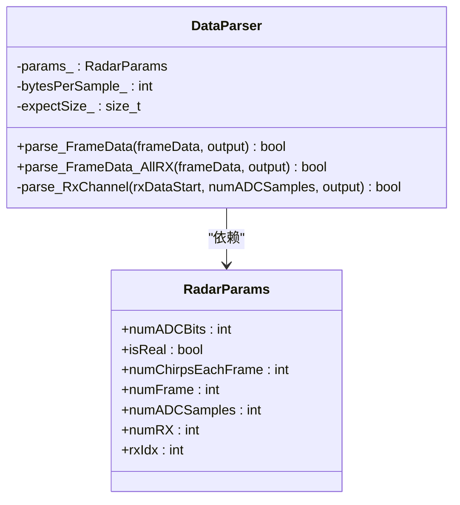
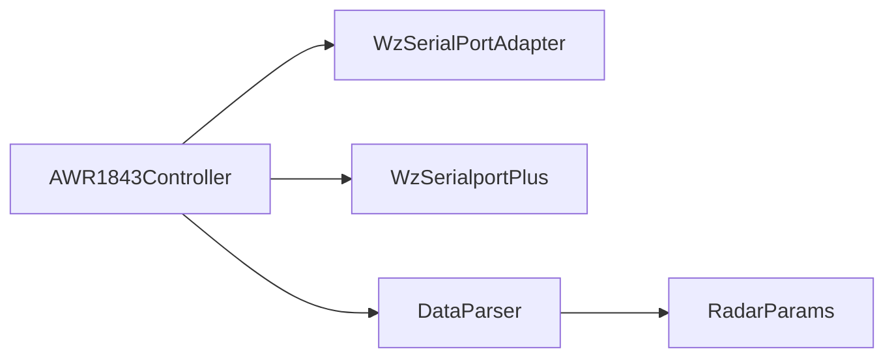

# 串口通信与 AWR1843 雷达控制

<cite>
**本文引用的文件**
- [SerialPort.h](file://awr1843_dca1000_read/SerialPort.h)
- [WzSerialPortAdapter.h](file://awr1843_dca1000_read/WzSerialPortAdapter.h)
- [WzSerialportPlus.h](file://awr1843_dca1000_read/WzSerialportPlus.h)
- [WzSerialportPlus.cpp](file://awr1843_dca1000_read/WzSerialportPlus.cpp)
- [AWR1843Controller.h](file://awr1843_dca1000_read/AWR1843Controller.h)
- [DataParser.h](file://awr1843_dca1000_read/DataParser.h)
- [DataParser.cpp](file://awr1843_dca1000_read/DataParser.cpp)
- [RadarParams.h](file://awr1843_dca1000_read/RadarParams.h)
</cite>

## 目录
1. [简介](#简介)
2. [项目结构](#项目结构)
3. [核心组件](#核心组件)
4. [架构总览](#架构总览)
5. [详细组件分析](#详细组件分析)
6. [依赖关系分析](#依赖关系分析)
7. [性能考量](#性能考量)
8. [故障排查指南](#故障排查指南)
9. [结论](#结论)

## 简介
本文件聚焦于 AWR1843 毫米波雷达工具中的“串口栈”与“设备控制/数据解析链路”，围绕以下目标展开：
- 梳理串口抽象层到具体实现的层次：SerialPort 抽象基类 → WzSerialPortAdapter 适配器 → WzSerialportPlus 底层驱动。
- 解析 AWR1843Controller 的双串口设计（CLI 配置口 + 数据口）、cfg 配置下发、参数计算，以及 TLV 帧解析（parseData18xx）。
- 说明与 DCA1000 UDP 数据链路的衔接点（由 DataParser 负责将原始字节还原为复数 I/Q），以便后续扩展 FFT/CFAR/检测等处理流程。

## 项目结构
与本次文档相关的核心文件位于 awr1843_dca1000_read 目录下，按职责分层组织：
- 串口抽象与适配：SerialPort.h、WzSerialPortAdapter.h
- 跨平台串口实现：WzSerialportPlus.h/.cpp
- 雷达设备控制与 TLV 解析：AWR1843Controller.h
- 雷达数据解析（I/Q）：DataParser.h/.cpp、RadarParams.h

图示来源
- [SerialPort.h:1-29](file://awr1843_dca1000_read/SerialPort.h#L1-L29)
- [WzSerialPortAdapter.h:1-39](file://awr1843_dca1000_read/WzSerialPortAdapter.h#L1-L39)
- [WzSerialportPlus.h:1-81](file://awr1843_dca1000_read/WzSerialportPlus.h#L1-L81)
- [WzSerialportPlus.cpp:1-386](file://awr1843_dca1000_read/WzSerialportPlus.cpp#L1-L386)
- [AWR1843Controller.h:1-642](file://awr1843_dca1000_read/AWR1843Controller.h#L1-L642)
- [DataParser.h:1-45](file://awr1843_dca1000_read/DataParser.h#L1-L45)
- [DataParser.cpp:1-126](file://awr1843_dca1000_read/DataParser.cpp#L1-L126)
- [RadarParams.h:1-14](file://awr1843_dca1000_read/RadarParams.h#L1-L14)

章节来源
- [SerialPort.h:1-29](file://awr1843_dca1000_read/SerialPort.h#L1-L29)
- [WzSerialPortAdapter.h:1-39](file://awr1843_dca1000_read/WzSerialPortAdapter.h#L1-L39)
- [WzSerialportPlus.h:1-81](file://awr1843_dca1000_read/WzSerialportPlus.h#L1-L81)
- [WzSerialportPlus.cpp:1-386](file://awr1843_dca1000_read/WzSerialportPlus.cpp#L1-L386)
- [AWR1843Controller.h:1-642](file://awr1843_dca1000_read/AWR1843Controller.h#L1-L642)
- [DataParser.h:1-45](file://awr1843_dca1000_read/DataParser.h#L1-L45)
- [DataParser.cpp:1-126](file://awr1843_dca1000_read/DataParser.cpp#L1-L126)
- [RadarParams.h:1-14](file://awr1843_dca1000_read/RadarParams.h#L1-L14)

## 核心组件
- SerialPort 抽象基类：定义统一的串口打开、关闭、发送与接收回调注册接口，屏蔽平台差异。
- WzSerialPortAdapter 适配器：将上层对 const char* 的发送语义适配到底层库的 char* 发送接口，并转发接收回调。
- WzSerialportPlus 底层驱动：跨平台封装 Windows/POSIX 串口操作，内部启动独立线程轮询读取，触发 onReceive 与用户回调。
- AWR1843Controller：管理 CLI 配置口与数据口的双串口生命周期；从 cfg 文本解析 mmWave CLI 命令并下发；根据 profileCfg/frameCfg/channelCfg 推导距离/多普勒分辨率等关键参数；在数据口上查找魔术字、解析 TLV 帧，输出结构化 ProcessedFrame。
- DataParser：将一帧原始字节流按 chirp×rx×sample 布局解交织为复数 I/Q 矩阵，供上层进行信号处理。

章节来源
- [SerialPort.h:1-29](file://awr1843_dca1000_read/SerialPort.h#L1-L29)
- [WzSerialPortAdapter.h:1-39](file://awr1843_dca1000_read/WzSerialPortAdapter.h#L1-L39)
- [WzSerialportPlus.h:1-81](file://awr1843_dca1000_read/WzSerialportPlus.h#L1-L81)
- [WzSerialportPlus.cpp:1-386](file://awr1843_dca1000_read/WzSerialportPlus.cpp#L1-L386)
- [AWR1843Controller.h:1-642](file://awr1843_dca1000_read/AWR1843Controller.h#L1-L642)
- [DataParser.h:1-45](file://awr1843_dca1000_read/DataParser.h#L1-L45)
- [DataParser.cpp:1-126](file://awr1843_dca1000_read/DataParser.cpp#L1-L126)
- [RadarParams.h:1-14](file://awr1843_dca1000_read/RadarParams.h#L1-L14)

## 架构总览
下图展示了从应用层到硬件串口的调用链，以及 AWR1843Controller 如何协调 CLI 配置与数据口 TLV 解析。

图示来源
- [AWR1843Controller.h:259-308](file://awr1843_dca1000_read/AWR1843Controller.h#L259-L308)
- [AWR1843Controller.h:409-438](file://awr1843_dca1000_read/AWR1843Controller.h#L409-L438)
- [AWR1843Controller.h:454-583](file://awr1843_dca1000_read/AWR1843Controller.h#L454-L583)
- [WzSerialPortAdapter.h:16-36](file://awr1843_dca1000_read/WzSerialPortAdapter.h#L16-L36)
- [WzSerialportPlus.cpp:350-380](file://awr1843_dca1000_read/WzSerialportPlus.cpp#L350-L380)

## 详细组件分析

### 串口抽象与适配层
- SerialPort 抽象接口定义了 open/close/send/setReceiveCallback 四个方法，统一了不同平台的串口行为。
- WzSerialPortAdapter 继承自 SerialPort，内部持有 WzSerialportPlus 实例，负责：
  - 将 const char* 转换为底层所需的 char*（发送不修改数据，使用 const_cast 安全转换）。
  - 将 std::function<void(char*, int)> 回调透传给底层库。
- WzSerialportPlus 提供跨平台实现：
  - Windows 使用 CreateFile/ReadFile/WriteFile 与 DCB/COMMTIMEOUTS 配置。
  - POSIX 使用 termios 配置波特率、数据位、校验位、停止位，并以非阻塞 read 轮询。
  - 内部启动独立线程循环读取，触发 onReceive 与用户回调，避免阻塞上层逻辑。

图示来源
- [SerialPort.h:10-27](file://awr1843_dca1000_read/SerialPort.h#L10-L27)
- [WzSerialPortAdapter.h:10-37](file://awr1843_dca1000_read/WzSerialPortAdapter.h#L10-L37)
- [WzSerialportPlus.h:30-79](file://awr1843_dca1000_read/WzSerialportPlus.h#L30-L79)

章节来源
- [SerialPort.h:1-29](file://awr1843_dca1000_read/SerialPort.h#L1-L29)
- [WzSerialPortAdapter.h:1-39](file://awr1843_dca1000_read/WzSerialPortAdapter.h#L1-L39)
- [WzSerialportPlus.h:1-81](file://awr1843_dca1000_read/WzSerialportPlus.h#L1-L81)
- [WzSerialportPlus.cpp:88-316](file://awr1843_dca1000_read/WzSerialportPlus.cpp#L88-L316)

### AWR1843Controller 双串口设计与配置下发
- 双串口设计：
  - CLI 串口（低波特率，默认 115200）用于发送 mmWave CLI 命令与接收响应。
  - 数据串口（高波特率，默认 921600）用于接收雷达输出的二进制数据流。
- 初始化与配置：
  - initialize 读取 cfg 文本，过滤注释与空行，缓存命令列表。
  - configureRadar 逐条发送命令（以换行结尾），遇到 sensorStart 即停止（后续手动启动）。
  - parseConfigParams 从 profileCfg/frameCfg/channelCfg 推导 numRangeBins、numDopplerBins、rangeResolution、dopplerResolution、maxRange、maxVelocity 等关键参数。
- 传感器启停：
  - startSensor 发送 sensorStart（首次带参数，后续不带），stopSensor 发送 sensorStop。
- 数据接收与缓冲：
  - 通过 dataPort.setReceiveCalback 注册回调，内部 handleReceivedData 将数据追加至线程安全的 byteBuffer，溢出时保留最新数据。
  - postProcessDataBuf 扫描缓冲区，定位 MAGIC_WORD，调用 parseData18xx 解析单帧。

图示来源
- [AWR1843Controller.h:259-308](file://awr1843_dca1000_read/AWR1843Controller.h#L259-L308)
- [AWR1843Controller.h:311-381](file://awr1843_dca1000_read/AWR1843Controller.h#L311-L381)
- [AWR1843Controller.h:409-438](file://awr1843_dca1000_read/AWR1843Controller.h#L409-L438)
- [AWR1843Controller.h:454-583](file://awr1843_dca1000_read/AWR1843Controller.h#L454-L583)

章节来源
- [AWR1843Controller.h:259-308](file://awr1843_dca1000_read/AWR1843Controller.h#L259-L308)
- [AWR1843Controller.h:311-381](file://awr1843_dca1000_read/AWR1843Controller.h#L311-L381)
- [AWR1843Controller.h:409-438](file://awr1843_dca1000_read/AWR1843Controller.h#L409-L438)
- [AWR1843Controller.h:454-583](file://awr1843_dca1000_read/AWR1843Controller.h#L454-L583)

### TLV 帧解析（parseData18xx）
- 魔术字匹配：在缓冲区中搜索固定长度的 MAGIC_WORD，定位帧头起始位置。
- 头部解析：读取版本、总包长度、平台标识、帧号、CPU周期、目标点数、TLV数量、子帧号等字段。
- TLV 遍历：
  - 检测到点（类型 1）：按对象数量解析 X/Y/Z/V 浮点数组。
  - 距离-多普勒热图（类型 5）：按 numRangeBins × numDopplerBins 的 int16 二维数组拷贝，并进行多普勒维度顺序调整。
- 完整性检查：若 totalPacketLen 大于当前可用数据，则返回不完整，等待后续数据拼接。

图示来源
- [AWR1843Controller.h:454-583](file://awr1843_dca1000_read/AWR1843Controller.h#L454-L583)

章节来源
- [AWR1843Controller.h:454-583](file://awr1843_dca1000_read/AWR1843Controller.h#L454-L583)

### 数据解析链路（DataParser）
- 输入：一帧原始字节流，布局为 [chirp][rx][sample]，每个采样点为 2×int16（I/Q）。
- 输出：
  - FrameDataSingleRx：[chirp][sample] 复数序列（单 RX）。
  - FrameDataAllRx：[chirp][rx][sample] 复数矩阵（全 RX）。
- 关键点：
  - 预分配内存以减少运行时开销。
  - 将 uint8_t 指针 reinterpret 为 int16_t 指针，按步长访问 I/Q 数据。
  - 线程安全：内部使用互斥锁保护解析过程。

图示来源
- [DataParser.h:16-41](file://awr1843_dca1000_read/DataParser.h#L16-L41)
- [RadarParams.h:5-13](file://awr1843_dca1000_read/RadarParams.h#L5-L13)

章节来源
- [DataParser.h:1-45](file://awr1843_dca1000_read/DataParser.h#L1-L45)
- [DataParser.cpp:1-126](file://awr1843_dca1000_read/DataParser.cpp#L1-L126)
- [RadarParams.h:1-14](file://awr1843_dca1000_read/RadarParams.h#L1-L14)

## 依赖关系分析
- 耦合关系：
  - AWR1843Controller 同时依赖 WzSerialPortAdapter 与 WzSerialportPlus，分别用于 CLI 与数据口。
  - DataParser 仅依赖 RadarParams，与串口层解耦，便于替换数据源（例如来自 UDPReceiver 的重组帧）。
- 外部依赖：
  - WzSerialportPlus 内部依赖操作系统 API（Windows WinAPI 或 POSIX termios/ioctl）。
- 潜在风险：
  - 多线程并发：数据口回调与 postProcessDataBuf 共享 byteBuffer，需确保互斥访问（已使用 mutex）。
  - 缓冲区溢出策略：采用覆盖旧数据的滑动窗口，可能丢失历史帧，需结合业务场景评估。

图示来源
- [AWR1843Controller.h:20-22](file://awr1843_dca1000_read/AWR1843Controller.h#L20-L22)
- [DataParser.h:1-45](file://awr1843_dca1000_read/DataParser.h#L1-L45)
- [RadarParams.h:1-14](file://awr1843_dca1000_read/RadarParams.h#L1-L14)

章节来源
- [AWR1843Controller.h:1-642](file://awr1843_dca1000_read/AWR1843Controller.h#L1-L642)
- [DataParser.h:1-45](file://awr1843_dca1000_read/DataParser.h#L1-L45)
- [RadarParams.h:1-14](file://awr1843_dca1000_read/RadarParams.h#L1-L14)

## 性能考量
- 串口读取线程节拍：底层驱动每 10ms 轮询一次，兼顾实时性与 CPU 占用。
- 缓冲区大小：最大 32KB，适合高频数据流的短时缓存；若需要更长的帧聚合，可考虑增大上限或引入队列。
- 解析路径优化：
  - 使用 memcpy 与整型重解释减少逐字节处理开销。
  - 预分配输出容器，降低动态分配频率。
- 多普勒维度重排：在解析距离-多普勒热图后进行顺序调整，保证后续 FFT 处理的正确性。

## 故障排查指南
- 串口无法打开：
  - 检查端口名与权限（POSIX 下 /dev/tty* 权限；Windows 下 COM 端口占用）。
  - 确认波特率支持（POSIX 端不支持的波特率会直接失败）。
- 无数据回调：
  - 确认数据口回调已注册且未为空。
  - 检查设备是否已启动（sensorStart 是否成功发送）。
- 解析失败：
  - 检查 MAGIC_WORD 是否被截断（缓冲区不足导致）。
  - 核对 frameCfg/profileCfg/channelCfg 是否与设备实际配置一致。
  - 验证 totalPacketLen 与实际数据长度一致性。
- 数据错位：
  - 确认 I/Q 布局与解交织顺序（chirp×rx×sample）与设备输出一致。
  - 多普勒维度顺序调整后是否正确。

章节来源
- [WzSerialportPlus.cpp:214-316](file://awr1843_dca1000_read/WzSerialportPlus.cpp#L214-L316)
- [AWR1843Controller.h:454-583](file://awr1843_dca1000_read/AWR1843Controller.h#L454-L583)
- [DataParser.cpp:20-56](file://awr1843_dca1000_read/DataParser.cpp#L20-L56)

## 结论
本项目通过清晰的串口抽象与适配层，实现了跨平台稳定的串口通信；AWR1843Controller 以双串口模式分离配置与数据通道，结合 cfg 解析与 TLV 帧解析，形成完整的设备控制与数据获取链路。DataParser 作为独立的解析模块，提供了与数据源无关的 I/Q 解交织能力，便于后续接入 Range/Doppler/CFAR/检测等算法流水线。整体架构职责清晰、扩展性强，适合在工程实践中进一步演进。