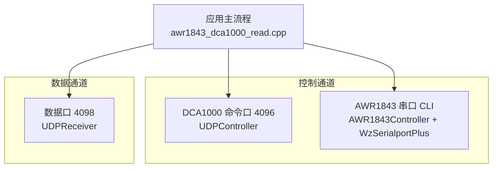
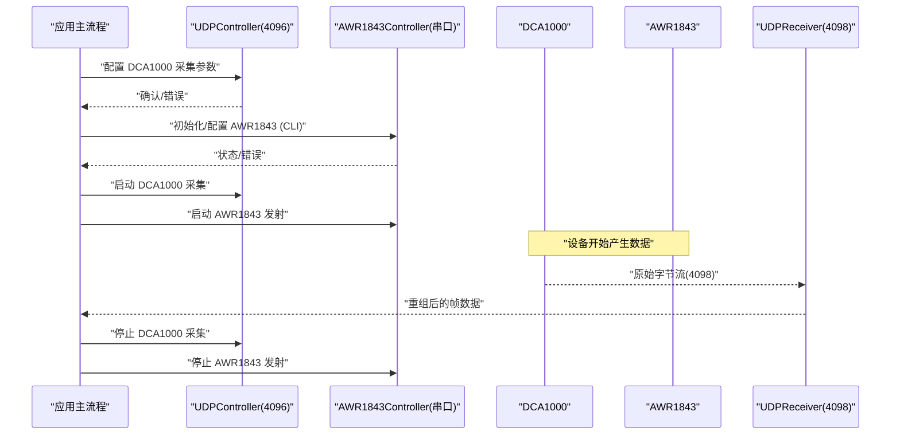
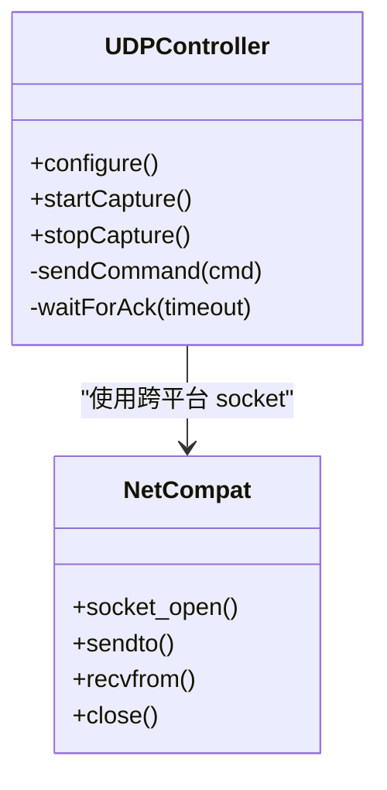
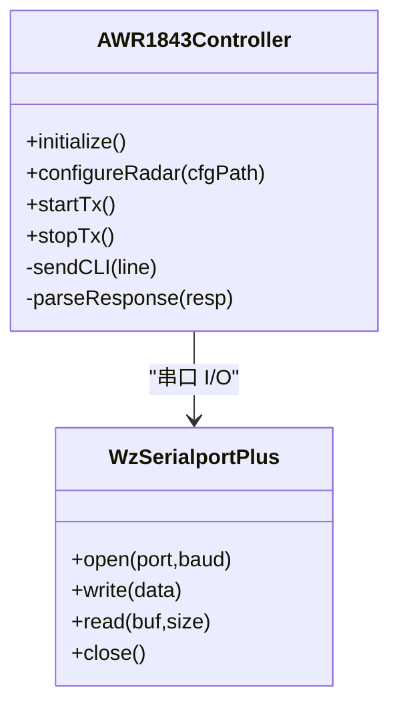
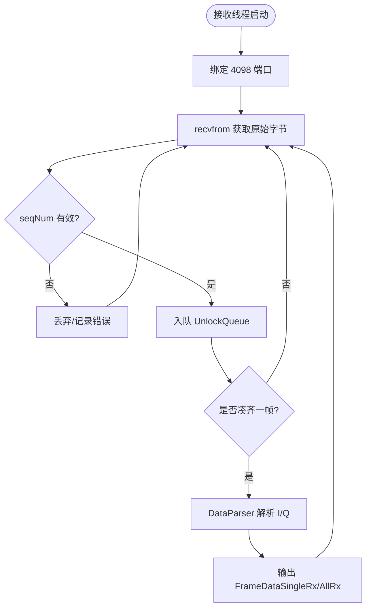
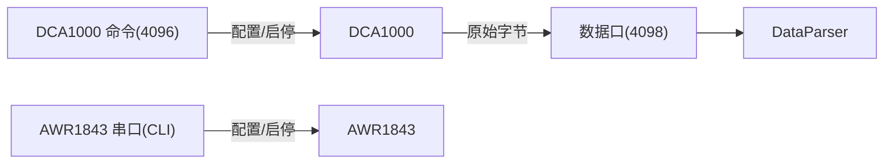
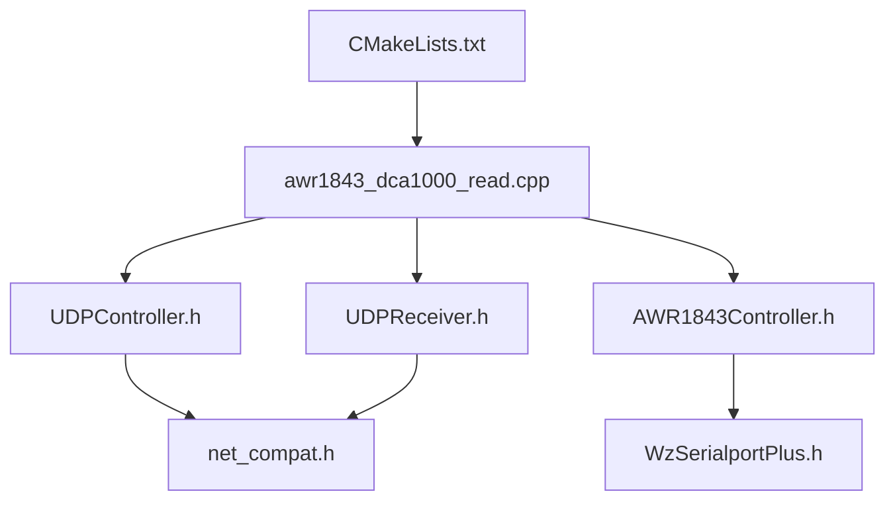

# 雷达与 DCA1000 设备控制

<cite>
**本文引用的文件**   
- [CMakeLists.txt](file://CMakeLists.txt)
- [awr1843_dca1000_read.cpp](file://awr1843_dca1000_read.cpp)
- [net_compat.h](file://net_compat.h)
- [UDPController.h](file://UDPController.h)
- [AWR1843Controller.h](file://AWR1843Controller.h)
- [WzSerialportPlus.h](file://WzSerialportPlus.h)
- [UDPReceiver.h](file://UDPReceiver.h)
</cite>

## 目录
1. [简介](#简介)
2. [项目结构](#项目结构)
3. [核心组件](#核心组件)
4. [架构总览](#架构总览)
5. [详细组件分析](#详细组件分析)
6. [依赖关系分析](#依赖关系分析)
7. [性能考虑](#性能考虑)
8. [故障排查指南](#故障排查指南)
9. [结论](#结论)
10. [附录](#附录)

## 简介
本章节聚焦“配置/启停设备”语义域，将针对 DCA1000 的 UDP 命令控制（命令口 4096）与针对 AWR1843 的串口控制（CLI 115200 / 数据口 921600）统一归并，明确两条控制通道的职责、共性与差异，并与数据接收通路（数据口 4098）严格区分。读者可据此理解：
- 控制通道用于下发配置、启动/停止采集等“设备管理”操作；
- 数据通道仅负责搬运原始字节并进行帧重组与解析，不参与控制逻辑；
- 两套控制通道在接口抽象、错误处理与生命周期管理方面具有共性，但在传输介质、协议与时序上存在显著区别。

## 项目结构
- CMake 定义两个目标：
  - test_udp：不含串口链，三平台可构建，配合 Python 回放泵测试 UDP→重组→解析；
  - radar_full：包含串口链的完整程序，支持实时采集与离线解析两种模式。
- awr1843_dca1000_read.cpp 通过 #if 0/#if 1 切换 main：
  - #if 0：实时采集入口；
  - #if 1（当前默认）：离线 bin→CSV 解析入口。
- 网络地址约定：上位机 IP 192.168.33.30，DCA1000 IP 192.168.33.180。
- 三条独立通信通道：
  - DCA1000 命令口 4096（UDPController）；
  - 数据口 4098（UDPReceiver）；
  - AWR1843 串口 CLI 115200 / 数据口 921600（AWR1843Controller + WzSerialportPlus）。

图表来源
- [CMakeLists.txt](file://CMakeLists.txt)
- [awr1843_dca1000_read.cpp](file://awr1843_dca1000_read.cpp)

章节来源
- [CMakeLists.txt](file://CMakeLists.txt)
- [awr1843_dca1000_read.cpp](file://awr1843_dca1000_read.cpp)

## 核心组件
- UDPController（DCA1000 命令口 4096）
  - 职责：向 DCA1000 发送采集配置与启停命令，建立/释放以太网采集会话。
  - 特性：基于 net_compat 跨平台 socket，使用固定端口 4096，面向无连接 UDP 的可靠封装（重传/超时策略由上层决定）。
- AWR1843Controller（AWR1843 串口 CLI）
  - 职责：通过串口向 AWR1843 下发 mmWave CLI 命令，完成雷达初始化、参数配置、启动/停止采集。
  - 特性：header-only 实现，内部依赖 WzSerialportPlus（POSIX termios 分支）进行跨平台串口访问；CLI 波特率 115200，数据回传可能走 921600。
- UDPReceiver（数据口 4098）
  - 职责：接收 DCA1000 经以太网推送的原始采样字节流，按序列号重组为完整帧，交由 DataParser 解析为 I/Q 数据。
  - 特性：基于 net_compat 跨平台 socket，使用固定端口 4098，采用 UnlockQueue + seqNum 机制保证有序重组。

章节来源
- [UDPController.h](file://UDPController.h)
- [AWR1843Controller.h](file://AWR1843Controller.h)
- [WzSerialportPlus.h](file://WzSerialportPlus.h)
- [UDPReceiver.h](file://UDPReceiver.h)
- [net_compat.h](file://net_compat.h)

## 架构总览
下图展示“控制通道 vs 数据通道”的整体分工与交互关系。控制通道负责“配置/启停”，数据通道负责“搬运/重组/解析”。

图表来源
- [UDPController.h](file://UDPController.h)
- [AWR1843Controller.h](file://AWR1843Controller.h)
- [UDPReceiver.h](file://UDPReceiver.h)
- [awr1843_dca1000_read.cpp](file://awr1843_dca1000_read.cpp)

## 详细组件分析

### DCA1000 命令控制（UDPController，命令口 4096）
- 职责边界
  - 仅负责向 DCA1000 下发采集相关命令（如 LVDS/以太网流配置、触发采集、停止采集等）；
  - 不涉及数据帧重组与解析。
- 关键行为
  - 建立到 DCA1000 的 UDP 连接（目的 IP 192.168.33.180，端口 4096）；
  - 发送配置包与启停指令，等待响应或超时重试；
  - 错误码映射与异常恢复（网络不可达、超时、校验失败等）。
- 与数据通路的隔离
  - 命令口 4096 与数据口 4098 完全分离，避免控制流量干扰数据吞吐；
  - 控制逻辑不直接访问帧重组队列或解析器。

图表来源
- [UDPController.h](file://UDPController.h)
- [net_compat.h](file://net_compat.h)

章节来源
- [UDPController.h](file://UDPController.h)
- [net_compat.h](file://net_compat.h)

### AWR1843 串口控制（AWR1843Controller，CLI 115200 / 数据口 921600）
- 职责边界
  - 通过串口与 AWR1843 的 mmWave CLI 交互，完成雷达初始化、profile/frame/channel 配置、启动/停止发射；
  - 读取 CLI 返回状态，驱动上层状态机。
- 关键行为
  - header-only 设计，控制逻辑集中在头文件；
  - 依赖 WzSerialportPlus（POSIX termios）进行跨平台串口读写；
  - 对 CLI 命令进行逐行下发与应答匹配，处理乱码编码问题（GBK→UTF-8 显示异常不影响功能）。
- 与数据通路的隔离
  - 串口链路仅承载 CLI 文本与控制反馈，不承载原始采样数据；
  - 数据回传（921600）属于 CLI 输出带宽需求，非采样数据通道。

图表来源
- [AWR1843Controller.h](file://AWR1843Controller.h)
- [WzSerialportPlus.h](file://WzSerialportPlus.h)

章节来源
- [AWR1843Controller.h](file://AWR1843Controller.h)
- [WzSerialportPlus.h](file://WzSerialportPlus.h)

### 数据接收通路（UDPReceiver，数据口 4098）
- 职责边界
  - 仅负责从 DCA1000 接收原始字节流，按序列号重组为完整帧，交给 DataParser 解析为复数 I/Q；
  - 不参与任何设备控制逻辑。
- 关键行为
  - 基于 net_compat 跨平台 socket 监听 4098 端口；
  - 使用 UnlockQueue + seqNum 保证顺序与完整性；
  - 帧大小 = numRX × numChirpsEachFrame × numADCSamples × 4。
- 与控制通路的隔离
  - 4098 端口仅承载数据，不与 4096 命令口混用；
  - 控制命令不会进入数据重组队列。

图表来源
- [UDPReceiver.h](file://UDPReceiver.h)
- [net_compat.h](file://net_compat.h)

章节来源
- [UDPReceiver.h](file://UDPReceiver.h)
- [net_compat.h](file://net_compat.h)

### 控制与数据的统一视图
- 共同点
  - 均遵循“配置/启停设备”的语义：先配置后启动，完成后停止；
  - 均需处理网络/串口的异步 I/O、超时与错误码；
  - 均依赖跨平台抽象（net_compat、WzSerialportPlus）。
- 差异点
  - 传输介质：UDP 以太网 vs 串口；
  - 协议形态：二进制命令包 vs 文本 CLI；
  - 端口/速率：4096/4098 固定端口 vs 115200/921600 波特率；
  - 可靠性策略：UDP 需上层重传/超时，串口自带物理层保障但需应用层应答匹配。

图表来源
- [UDPController.h](file://UDPController.h)
- [AWR1843Controller.h](file://AWR1843Controller.h)
- [UDPReceiver.h](file://UDPReceiver.h)

## 依赖关系分析
- 控制模块依赖
  - UDPController 依赖 net_compat 提供的跨平台 socket；
  - AWR1843Controller 依赖 WzSerialportPlus 的 POSIX termios 分支；
  - 两者均被应用主流程调用，形成“控制面”与“数据面”解耦。
- 构建与入口
  - CMakeLists.txt 定义 test_udp 与 radar_full 两个目标；
  - awr1843_dca1000_read.cpp 提供实时与离线两种 main 入口。

图表来源
- [CMakeLists.txt](file://CMakeLists.txt)
- [awr1843_dca1000_read.cpp](file://awr1843_dca1000_read.cpp)
- [UDPController.h](file://UDPController.h)
- [AWR1843Controller.h](file://AWR1843Controller.h)
- [UDPReceiver.h](file://UDPReceiver.h)
- [net_compat.h](file://net_compat.h)
- [WzSerialportPlus.h](file://WzSerialportPlus.h)

章节来源
- [CMakeLists.txt](file://CMakeLists.txt)
- [awr1843_dca1000_read.cpp](file://awr1843_dca1000_read.cpp)

## 性能考虑
- 控制通道
  - UDP 命令包应批量合并、减少往返次数；合理设置超时与重试上限；
  - 串口 CLI 命令建议按行拆分、避免阻塞大段写入；必要时使用非阻塞 I/O。
- 数据通道
  - 4098 端口接收线程应与重组/解析线程解耦，避免背压；
  - 帧重组队列容量需覆盖网络抖动与丢包窗口；
  - 帧大小计算需与配置文件一致，避免解析错位。

[本节为通用指导，不直接分析具体文件]

## 故障排查指南
- 常见症状
  - DCA1000 无法启动采集：检查 4096 端口连通性、IP 配置与命令格式；
  - AWR1843 无响应：确认串口波特率 115200、CLI 命令顺序与应答匹配；
  - 数据缺失或乱序：核查 4098 端口接收、seqNum 连续性、UnlockQueue 容量。
- 定位方法
  - 启用日志打印（控制命令收发、串口应答、UDP 包统计）；
  - 使用抓包工具验证 4096/4098 端口报文；
  - 对比 cfg 参数与帧大小计算，确保一致性。

章节来源
- [UDPController.h](file://UDPController.h)
- [AWR1843Controller.h](file://AWR1843Controller.h)
- [UDPReceiver.h](file://UDPReceiver.h)

## 结论
- 控制通道（DCA1000 命令口 4096、AWR1843 串口）与数据通道（数据口 4098）职责清晰、相互解耦；
- 两条控制通道在“配置/启停设备”语义下具有一致的生命周期管理与错误处理范式，但在传输介质与协议上存在本质差异；
- 建议在扩展数据处理流水线时，严格以 DataParser 的输出类型作为接入点，避免侵入控制逻辑。

[本节为总结性内容，不直接分析具体文件]

## 附录
- 术语表
  - 命令口 4096：DCA1000 的 UDP 控制端口；
  - 数据口 4098：DCA1000 的以太网数据端口；
  - CLI 115200/921600：AWR1843 串口波特率（控制与高带宽回传）。
- 参考路径
  - 控制入口与构建：见 CMakeLists.txt 与 awr1843_dca1000_read.cpp；
  - 控制实现：UDPController.h、AWR1843Controller.h、WzSerialportPlus.h；
  - 数据实现：UDPReceiver.h、net_compat.h。

[本节为补充信息，不直接分析具体文件]