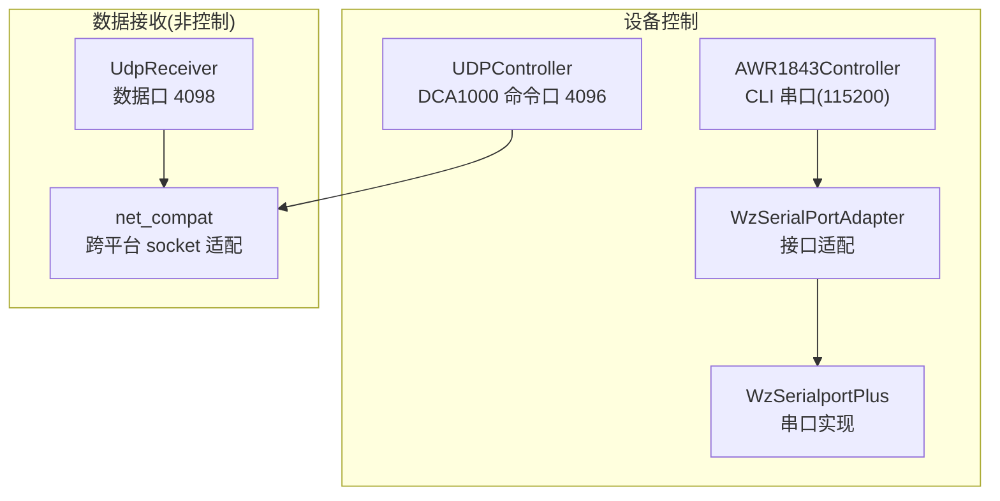
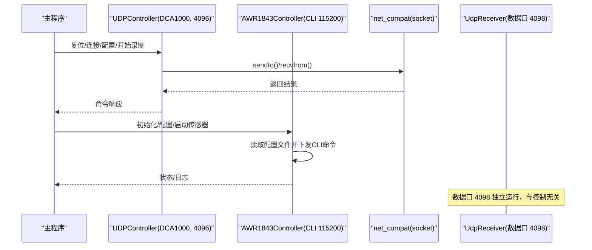
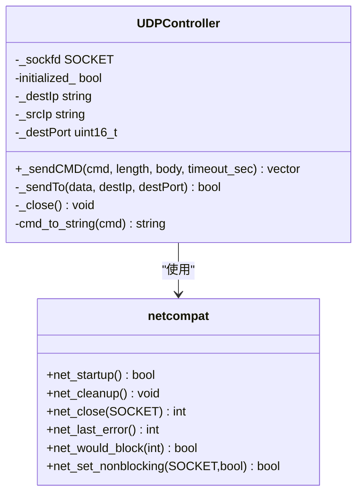
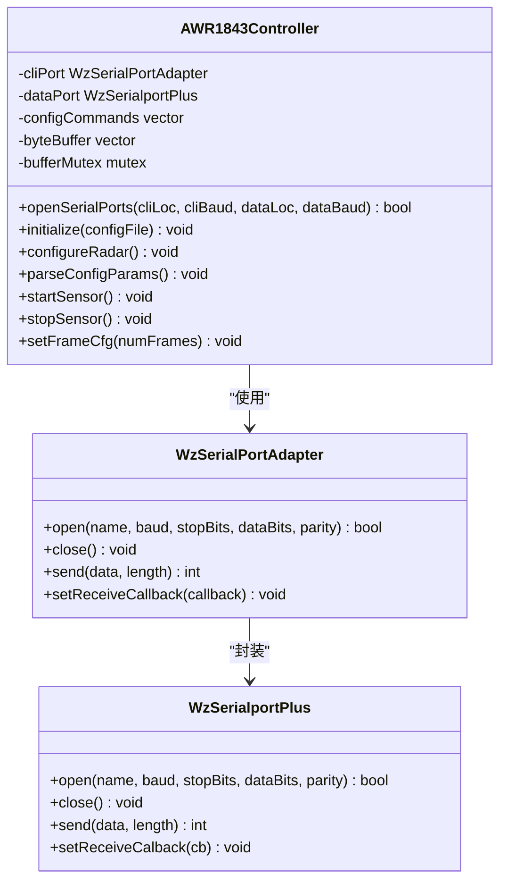
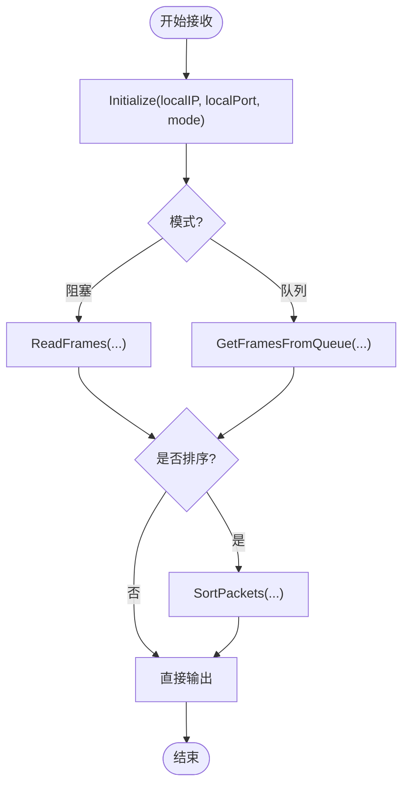
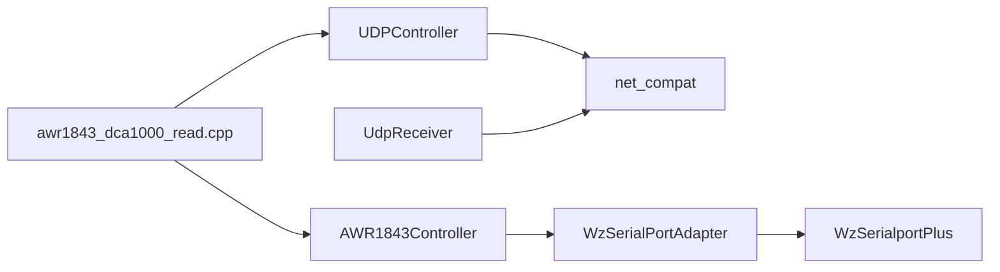

# 雷达与 DCA1000 设备控制

<cite>
**本文引用的文件**   
- [README.md](file://README.md)
- [awr1843_dca1000_read.cpp](file://awr1843_dca1000_read/awr1843_dca1000_read.cpp)
- [UDPController.h](file://awr1843_dca1000_read/UDPController.h)
- [UDPController.cpp](file://awr1843_dca1000_read/UDPController.cpp)
- [AWR1843Controller.h](file://awr1843_dca1000_read/AWR1843Controller.h)
- [WzSerialportPlus.h](file://awr1843_dca1000_read/WzSerialportPlus.h)
- [WzSerialPortAdapter.h](file://awr1843_dca1000_read/WzSerialPortAdapter.h)
- [UdpReceiver.h](file://awr1843_dca1000_read/UdpReceiver.h)
- [UdpReceiver.cpp](file://awr1843_dca1000_read/UdpReceiver.cpp)
- [net_compat.h](file://awr1843_dca1000_read/net_compat.h)
</cite>

## 目录
1. [引言](#引言)
2. [项目结构](#项目结构)
3. [核心组件](#核心组件)
4. [架构总览](#架构总览)
5. [详细组件分析](#详细组件分析)
6. [依赖关系分析](#依赖关系分析)
7. [性能考虑](#性能考虑)
8. [故障排查指南](#故障排查指南)
9. [结论](#结论)

## 引言
本章节聚焦“配置/启停设备”的语义域，将两条控制通道统一归口：
- DCA1000 命令控制：通过 UDP 命令口（端口 4096）发送采集卡控制指令，完成复位、系统连接、FPGA/数据模式配置、开始/停止录制等。
- AWR1843 串口控制：通过 CLI 串口（默认 115200）下发 mmWave CLI 命令，完成传感器初始化、帧参数设置、启动/停止采集；同时提供数据串口（默认 921600）用于接收雷达输出（该数据链路不属于“控制”，而是“数据接收”）。

需要明确区分：
- 控制通道（命令口 4096 / 串口 CLI）负责“配置/启停设备”。
- 数据接收通道（数据口 4098）属于“数据搬运与重组”，不应混入控制流程。

## 项目结构
与设备控制直接相关的源文件如下：
- DCA1000 命令控制：UDPController（头/实现）、net_compat（跨平台 socket 适配）
- AWR1843 串口控制：AWR1843Controller（头文件为主）、WzSerialportPlus（串口库）、WzSerialPortAdapter（适配器）
- 数据接收（仅用于对比区分）：UdpReceiver（数据口 4098）
- 主程序入口：awr1843_dca1000_read.cpp（演示控制流程与离线解析）

图表来源
- [UDPController.h:1-102](file://awr1843_dca1000_read/UDPController.h#L1-L102)
- [UDPController.cpp:1-156](file://awr1843_dca1000_read/UDPController.cpp#L1-L156)
- [AWR1843Controller.h:1-642](file://awr1843_dca1000_read/AWR1843Controller.h#L1-L642)
- [WzSerialportPlus.h:1-81](file://awr1843_dca1000_read/WzSerialportPlus.h#L1-L81)
- [WzSerialPortAdapter.h:1-39](file://awr1843_dca1000_read/WzSerialPortAdapter.h#L1-L39)
- [UdpReceiver.h:1-116](file://awr1843_dca1000_read/UdpReceiver.h#L1-L116)
- [UdpReceiver.cpp:1-415](file://awr1843_dca1000_read/UdpReceiver.cpp#L1-L415)
- [net_compat.h:1-100](file://awr1843_dca1000_read/net_compat.h#L1-L100)

章节来源
- [README.md:1-116](file://README.md#L1-L116)
- [awr1843_dca1000_read.cpp:1-212](file://awr1843_dca1000_read/awr1843_dca1000_read.cpp#L1-L212)

## 核心组件
- UDPController：封装对 DCA1000 的命令收发，使用 UDP 协议，目标端口 4096，内置命令码映射与简单请求-响应等待。
- AWR1843Controller：封装对 AWR1843 的 CLI 控制，读取配置文件并逐行下发 mmWave CLI 命令，支持 start/stop sensor、frameCfg 等。
- WzSerialportPlus / WzSerialPortAdapter：提供跨平台串口能力与统一接口，供控制器调用。
- net_compat：为 UDPController 与 UdpReceiver 提供统一的 socket API 抽象。
- UdpReceiver：数据口 4098 的数据接收与帧重组，与控制无关，用于对比说明职责边界。

章节来源
- [UDPController.h:1-102](file://awr1843_dca1000_read/UDPController.h#L1-L102)
- [UDPController.cpp:1-156](file://awr1843_dca1000_read/UDPController.cpp#L1-L156)
- [AWR1843Controller.h:1-642](file://awr1843_dca1000_read/AWR1843Controller.h#L1-L642)
- [WzSerialportPlus.h:1-81](file://awr1843_dca1000_read/WzSerialportPlus.h#L1-L81)
- [WzSerialPortAdapter.h:1-39](file://awr1843_dca1000_read/WzSerialPortAdapter.h#L1-L39)
- [UdpReceiver.h:1-116](file://awr1843_dca1000_read/UdpReceiver.h#L1-L116)
- [net_compat.h:1-100](file://awr1843_dca1000_read/net_compat.h#L1-L100)

## 架构总览
从“配置/启停设备”的角度，两条控制通道的职责如下：
- DCA1000 命令控制（UDP 4096）：面向采集卡的系统级控制，包括复位、系统连接、FPGA/数据模式配置、开始/停止录制。
- AWR1843 串口控制（CLI 115200）：面向雷达传感器的配置与启停，包括 profile/frame/channel 配置、sensorStart/sensorStop。

数据接收通路（UDP 4098）只负责把 DCA1000 推送的原始字节按序列号重组为一帧，交由上层解析器处理，不参与任何控制逻辑。

图表来源
- [UDPController.cpp:1-156](file://awr1843_dca1000_read/UDPController.cpp#L1-L156)
- [AWR1843Controller.h:259-308](file://awr1843_dca1000_read/AWR1843Controller.h#L259-L308)
- [UdpReceiver.cpp:231-283](file://awr1843_dca1000_read/UdpReceiver.cpp#L231-L283)
- [net_compat.h:1-100](file://awr1843_dca1000_read/net_compat.h#L1-L100)

## 详细组件分析

### DCA1000 命令控制（UDPController）
- 职责
  - 建立 UDP Socket，绑定本地 IP/端口（默认 4096），向 DCA1000 目标地址（默认 192.168.33.180）发送命令。
  - 构造带头部/尾部与命令码的消息体，发送后阻塞等待响应。
  - 暴露高层接口以发送复位、系统连接、FPGA/数据模式配置、开始/停止录制等命令。
- 关键设计点
  - 命令码枚举集中管理，内部映射为十六进制字符串拼接消息体。
  - 超时机制通过 SO_RCVTIMEO 设置，避免无限等待。
  - 跨平台 socket 操作由 net_compat 统一。
- 典型调用顺序
  - 复位 ARM/FPGA → 系统连接 → 配置 FPGA/数据包参数 → 开始录制 → 后续 stop 录制。

图表来源
- [UDPController.h:1-102](file://awr1843_dca1000_read/UDPController.h#L1-L102)
- [UDPController.cpp:1-156](file://awr1843_dca1000_read/UDPController.cpp#L1-L156)
- [net_compat.h:1-100](file://awr1843_dca1000_read/net_compat.h#L1-L100)

章节来源
- [UDPController.h:1-102](file://awr1843_dca1000_read/UDPController.h#L1-L102)
- [UDPController.cpp:1-156](file://awr1843_dca1000_read/UDPController.cpp#L1-L156)

### AWR1843 串口控制（AWR1843Controller）
- 职责
  - 打开 CLI 串口（115200）与数据串口（921600），前者用于控制命令，后者用于接收雷达输出（注意：数据串口属于数据链路，不在“控制”范畴内）。
  - 读取 mmWave CLI 配置文件，逐行发送命令，遇到 sensorStart 前停止（后续再手动启动）。
  - 解析配置项推导距离/多普勒分辨率等参数，便于上层处理。
  - 提供 startSensor/stopSensor、setFrameCfg 等控制接口。
- 关键设计点
  - 头文件即实现（header-only），所有控制逻辑集中在头文件中。
  - 通过 WzSerialPortAdapter 统一串口接口，底层由 WzSerialportPlus 实现。
  - 线程安全缓冲区用于暂存数据串口回调数据（与控制无关，但体现数据/控制分离的设计）。
- 典型调用顺序
  - 构造函数中 openSerialPorts → initialize(configFile) → configureRadar() → parseConfigParams() → startSensor()/stopSensor()。

图表来源
- [AWR1843Controller.h:1-642](file://awr1843_dca1000_read/AWR1843Controller.h#L1-L642)
- [WzSerialPortAdapter.h:1-39](file://awr1843_dca1000_read/WzSerialPortAdapter.h#L1-L39)
- [WzSerialportPlus.h:1-81](file://awr1843_dca1000_read/WzSerialportPlus.h#L1-L81)

章节来源
- [AWR1843Controller.h:220-308](file://awr1843_dca1000_read/AWR1843Controller.h#L220-L308)
- [AWR1843Controller.h:383-438](file://awr1843_dca1000_read/AWR1843Controller.h#L383-L438)
- [WzSerialPortAdapter.h:1-39](file://awr1843_dca1000_read/WzSerialPortAdapter.h#L1-L39)
- [WzSerialportPlus.h:1-81](file://awr1843_dca1000_read/WzSerialportPlus.h#L1-L81)

### 数据接收通路（UdpReceiver，仅作对比）
- 职责
  - 监听数据口 4098，按包序列号重组为一帧，支持阻塞与非阻塞队列两种模式。
  - 统计丢包、帧数等信息，供上层诊断。
- 与控制的差异
  - 不涉及任何设备配置或启停命令，仅做数据搬运与重组。
  - 与 UDPController 共用 net_compat，但用途不同。

图表来源
- [UdpReceiver.h:1-116](file://awr1843_dca1000_read/UdpReceiver.h#L1-L116)
- [UdpReceiver.cpp:140-229](file://awr1843_dca1000_read/UdpReceiver.cpp#L140-L229)
- [UdpReceiver.cpp:377-410](file://awr1843_dca1000_read/UdpReceiver.cpp#L377-L410)

章节来源
- [UdpReceiver.h:1-116](file://awr1843_dca1000_read/UdpReceiver.h#L1-L116)
- [UdpReceiver.cpp:1-415](file://awr1843_dca1000_read/UdpReceiver.cpp#L1-L415)

## 依赖关系分析
- UDPController 依赖 net_compat 进行跨平台 socket 操作。
- AWR1843Controller 依赖 WzSerialPortAdapter 与 WzSerialportPlus 进行串口通信。
- UdpReceiver 同样依赖 net_compat，但与 UDPController 无耦合。
- 主程序 awr1843_dca1000_read.cpp 在实时模式下组合上述组件，形成“控制→数据接收→解析”的完整链路。

图表来源
- [awr1843_dca1000_read.cpp:1-212](file://awr1843_dca1000_read/awr1843_dca1000_read.cpp#L1-L212)
- [UDPController.h:1-102](file://awr1843_dca1000_read/UDPController.h#L1-L102)
- [AWR1843Controller.h:1-642](file://awr1843_dca1000_read/AWR1843Controller.h#L1-L642)
- [UdpReceiver.h:1-116](file://awr1843_dca1000_read/UdpReceiver.h#L1-L116)
- [net_compat.h:1-100](file://awr1843_dca1000_read/net_compat.h#L1-L100)

章节来源
- [awr1843_dca1000_read.cpp:1-212](file://awr1843_dca1000_read/awr1843_dca1000_read.cpp#L1-L212)

## 性能考虑
- 控制通道
  - UDPController 每次命令发送后短睡眠等待响应，适合低频控制场景；若批量配置可合并命令以减少往返。
  - AWR1843Controller 逐行发送 CLI 命令，建议合理批量化与最小化冗余命令，降低串口拥塞风险。
- 数据通道（对比参考）
  - UdpReceiver 支持非阻塞与队列模式，在高吞吐下可降低 CPU 占用；需根据网络与磁盘写入能力调整缓冲区大小与超时。

[本节为通用指导，不直接分析具体文件]

## 故障排查指南
- UDP 控制失败
  - 检查本地与 DCA1000 的 IP/端口是否正确（默认 PC 192.168.33.30，DCA1000 192.168.33.180，命令口 4096）。
  - 确认防火墙未拦截 UDP 4096 端口。
  - 查看 UDPController 的异常抛出与返回值，必要时增大超时时间。
- 串口控制失败
  - 确认 CLI 串口名称与波特率（默认 115200）正确，未被其他进程占用。
  - 检查配置文件路径与内容，确保命令语法符合 mmWave CLI。
  - 观察 AWR1843Controller 的日志输出，定位具体失败的命令。
- 数据接收问题（与控制无关）
  - 确认数据口 4098 已绑定且能收到包。
  - 检查序列号与帧长计算，确保重组逻辑与配置一致。

章节来源
- [UDPController.cpp:1-156](file://awr1843_dca1000_read/UDPController.cpp#L1-L156)
- [AWR1843Controller.h:220-308](file://awr1843_dca1000_read/AWR1843Controller.h#L220-L308)
- [UdpReceiver.cpp:1-415](file://awr1843_dca1000_read/UdpReceiver.cpp#L1-L415)

## 结论
- 两条控制通道（DCA1000 UDP 4096 与 AWR1843 CLI 串口）共同承担“配置/启停设备”的职责，分别面向采集卡与雷达传感器。
- 数据接收通道（UDP 4098）仅负责数据搬运与重组，与控制严格解耦。
- 通过 net_compat 与串口适配层，系统在 Windows/POSIX 上具备一致的编程模型，便于维护与扩展。