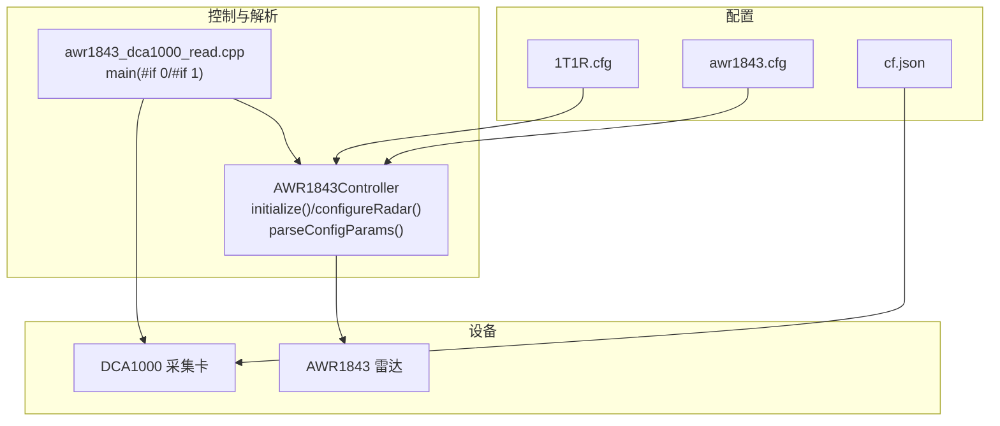
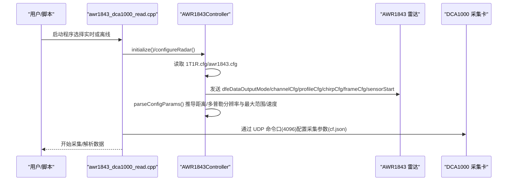
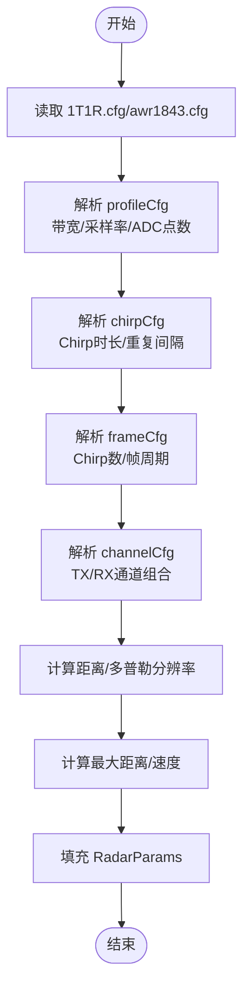
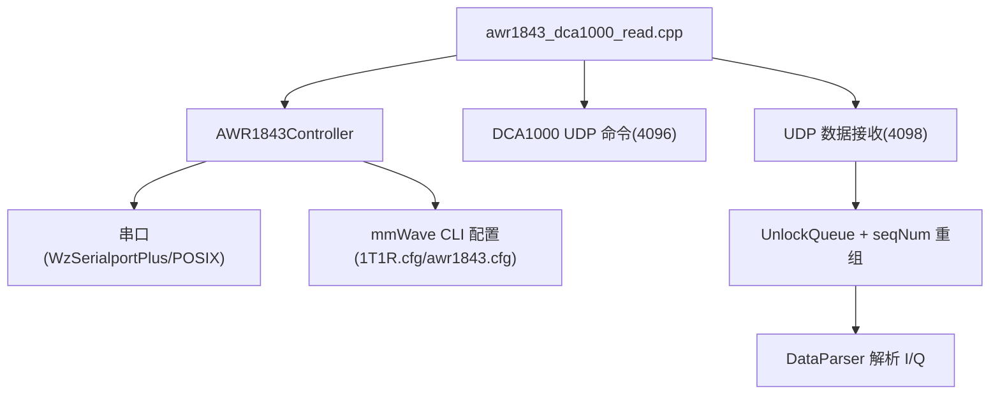

# 雷达与采集参数配置文件

<cite>
**本文引用的文件**   
- [1T1R.cfg](file://1T1R.cfg)
- [awr1843.cfg](file://awr1843.cfg)
- [cf.json](file://cf.json)
- [AWR1843Controller.h](file://include/AWR1843Controller.h)
- [AWR1843Controller.cpp](file://src/AWR1843Controller.cpp)
- [awr1843_dca1000_read.cpp](file://src/awr1843_dca1000_read.cpp)
- [CMakeLists.txt](file://CMakeLists.txt)
</cite>

## 目录
1. [简介](#简介)
2. [项目结构](#项目结构)
3. [核心组件](#核心组件)
4. [架构总览](#架构总览)
5. [详细组件分析](#详细组件分析)
6. [依赖关系分析](#依赖关系分析)
7. [性能考虑](#性能考虑)
8. [故障排查指南](#故障排查指南)
9. [结论](#结论)
10. [附录](#附录)

## 简介
本文件面向 AWR1843 毫米波雷达 + DCA1000 采集卡的原始数据采集与解析工具，重点讲解以下配置与推导逻辑：
- mmWave CLI 配置文件（1T1R.cfg / awr1843.cfg）中关键命令字段含义与用法，包括 dfeDataOutputMode、channelCfg、profileCfg、chirpCfg、frameCfg、sensorStart 等。
- AWR1843Controller 如何读取并下发这些配置，并从 profileCfg/frameCfg/channelCfg 推导距离分辨率、多普勒分辨率、最大可测距离/速度等雷达参数。
- cf.json 中 DCA1000 的 LVDS/以太网流、dataFormatMode、packetDelay 等采集参数的作用与设置要点。

本项目为 C++17，仅依赖标准库；AWR1843Controller 为 header-only 实现，控制逻辑集中在头文件中；数据链路分为“接收与重组”和“解析”两层；设备控制统一由串口（AWR1843 CLI）与网络（DCA1000 UDP 命令口）完成。

## 项目结构
- 雷达配置文件：1T1R.cfg、awr1843.cfg，逐行包含 mmWave CLI 命令，供 AWR1843Controller.initialize()/configureRadar() 读取并下发。
- 采集配置：cf.json 描述 DCA1000 的采集模式与网络参数。
- 控制器与解析：AWR1843Controller.h/.cpp 负责串口通信与 CLI 命令下发，parseConfigParams() 从配置行推导雷达参数；awr1843_dca1000_read.cpp 提供实时采集与离线解析两种入口。
- 构建系统：CMakeLists.txt 定义 test_udp 与 radar_full 两个目标。

图表来源
- [CMakeLists.txt:1-200](file://CMakeLists.txt#L1-L200)
- [awr1843_dca1000_read.cpp:1-200](file://src/awr1843_dca1000_read.cpp#L1-L200)

章节来源
- [CMakeLists.txt:1-200](file://CMakeLists.txt#L1-L200)
- [awr1843_dca1000_read.cpp:1-200](file://src/awr1843_dca1000_read.cpp#L1-L200)

## 核心组件
- AWR1843Controller（头文件实现）
  - initialize()/configureRadar()：读取 1T1R.cfg/awr1843.cfg 中的 CLI 命令并逐行下发至 AWR1843 串口。
  - parseConfigParams()：从 profileCfg/frameCfg/channelCfg 等行解析关键字段，推导雷达参数（距离分辨率、多普勒分辨率、最大距离/速度等），填充内部 RadarParams 结构。
- awr1843_dca1000_read.cpp
  - #if 0：实时采集主循环，启动 DCA1000 与 AWR1843，接收 UDP 数据并重组帧后交给 DataParser。
  - #if 1：离线 bin→CSV 解析主循环，直接读取已保存的 .bin 文件进行解析。
- CMakeLists.txt
  - 定义 test_udp（不含串口链，三平台可构建）与 radar_full（含串口链的完整程序）。

章节来源
- [AWR1843Controller.h:1-200](file://include/AWR1843Controller.h#L1-L200)
- [AWR1843Controller.cpp:1-50](file://src/AWR1843Controller.cpp#L1-L50)
- [awr1843_dca1000_read.cpp:1-200](file://src/awr1843_dca1000_read.cpp#L1-L200)
- [CMakeLists.txt:1-200](file://CMakeLists.txt#L1-L200)

## 架构总览
下图展示配置读取、参数推导与设备控制的总体流程：

图表来源
- [awr1843_dca1000_read.cpp:1-200](file://src/awr1843_dca1000_read.cpp#L1-L200)
- [AWR1843Controller.h:1-200](file://include/AWR1843Controller.h#L1-L200)

## 详细组件分析

### mmWave CLI 配置文件（1T1R.cfg / awr1843.cfg）
- 文件组织
  - 每行为一条 mmWave CLI 命令，按顺序包含 dfeDataOutputMode、channelCfg、profileCfg、chirpCfg、frameCfg、sensorStart 等。
  - AWR1843Controller.initialize()/configureRadar() 会逐行读取并发送到 AWR1843 串口。
- 关键命令与字段说明
  - dfeDataOutputMode：设置 DFE（数字前端）数据输出模式（如复数 I/Q 或实数采样格式），影响后续数据解析与字节序。
  - channelCfg：通道配置，指定 TX/RX 通道组合与极化方式，决定单帧有效通道数 numRX，直接影响帧大小与空间分辨率。
  - profileCfg：射频波形轮廓，包含载频、调频斜率、带宽、采样率、ADC 采样点数等，用于计算距离分辨率与最大可测距离。
  - chirpCfg：线性调频步进配置，包含 Chirp 持续时间、空闲时间、上升时间、Chirp 重复间隔等，用于计算多普勒分辨率与最大可测速度。
  - frameCfg：帧级配置，包含帧内 Chirp 数、Chirp 间延迟、帧周期等，结合 chirpCfg 确定多普勒维度的采样密度与速度量程。
  - sensorStart：启动传感器，使上述配置生效并开始发射与接收。
- 参数推导逻辑（由 parseConfigParams() 完成）
  - 距离分辨率 ΔR：由带宽 B 与光速 c 推导，ΔR ≈ c/(2B)。
  - 最大可测距离 Rmax：由采样率 fs 与 ADC 采样点数 N_adc 推导，Rmax ≈ (c·fs·N_adc)/(2·B·fs) = c·N_adc/(2·B)。
  - 多普勒分辨率 Δv：由 Chirp 重复间隔 T_chirp 与帧内 Chirp 数 N_chirps 推导，Δv ≈ λ/(2·T_chirp·N_chirps)。
  - 最大可测速度 vmax：由波长 λ 与 Chirp 重复频率 f_prf=1/T_chirp 推导，vmax ≈ λ·f_prf/4。
  - 帧字节数：numRX × numADCSamples × 2×int16(I/Q) × numChirpsEachFrame。
- 注意事项
  - 确保 profileCfg 的带宽与采样率匹配，避免混叠。
  - chirpCfg 的空闲时间与上升时间需满足芯片时序约束。
  - frameCfg 的帧周期应满足上位机处理与网络传输能力。

章节来源
- [1T1R.cfg:1-200](file://1T1R.cfg#L1-L200)
- [awr1843.cfg:1-200](file://awr1843.cfg#L1-L200)
- [AWR1843Controller.h:1-200](file://include/AWR1843Controller.h#L1-L200)

### AWR1843Controller 参数推导流程
- 读取与下发
  - initialize()/configureRadar() 打开串口，逐行读取配置文件，调用 CLI 接口发送命令。
- 参数解析与推导
  - parseConfigParams() 解析 profileCfg/frameCfg/channelCfg 的关键字段，计算并填充 RadarParams（距离分辨率、多普勒分辨率、最大距离/速度、帧大小等）。
- 错误处理
  - 对非法或不完整的配置行进行校验，返回错误码或抛出异常，便于上层捕获与提示。

图表来源
- [AWR1843Controller.h:1-200](file://include/AWR1843Controller.h#L1-L200)

章节来源
- [AWR1843Controller.h:1-200](file://include/AWR1843Controller.h#L1-L200)
- [AWR1843Controller.cpp:1-50](file://src/AWR1843Controller.cpp#L1-L50)

### DCA1000 采集配置（cf.json）
- 文件作用
  - 描述 DCA1000 的采集模式与网络参数，供 UDPController 在命令口(4096)下发给 DCA1000。
- 关键字段说明
  - dataFormatMode：数据格式模式（如复数 I/Q 或实数），需与 AWR1843 的 dfeDataOutputMode 一致。
  - packetDelay：UDP 包延迟（微秒），用于控制 DCA1000 发包节奏，避免丢包。
  - 以太网流配置：包括 IP、端口、数据包大小等，确保与上位机网络栈匹配。
  - LVDS 配置：若使用 LVDS 直连，则需设置相应引脚与时序参数（通常由 DCA1000 硬件跳线或固件决定）。
- 注意事项
  - dataFormatMode 必须与 AWR1843 的输出一致，否则解析失败。
  - packetDelay 过大导致吞吐不足，过小可能导致丢包，需根据链路能力调优。
  - 网络地址约定：上位机 IP 192.168.33.30，DCA1000 IP 192.168.33.180。

章节来源
- [cf.json:1-200](file://cf.json#L1-L200)

## 依赖关系分析
- AWR1843Controller 依赖串口通信（WzSerialportPlus/POSIX 适配）与配置文件解析。
- awr1843_dca1000_read.cpp 依赖 AWR1843Controller 与 DCA1000 的 UDP 控制（UDPController）。
- 数据链路：UDPReceiver（数据口4098）+ UnlockQueue + seqNum 重组 → DataParser（I/Q 还原）。
- 构建系统：CMakeLists.txt 定义 test_udp 与 radar_full 两个目标，前者不含串口链，后者包含完整链路。

图表来源
- [CMakeLists.txt:1-200](file://CMakeLists.txt#L1-L200)
- [awr1843_dca1000_read.cpp:1-200](file://src/awr1843_dca1000_read.cpp#L1-L200)

章节来源
- [CMakeLists.txt:1-200](file://CMakeLists.txt#L1-L200)
- [awr1843_dca1000_read.cpp:1-200](file://src/awr1843_dca1000_read.cpp#L1-L200)

## 性能考虑
- 带宽与采样率：提高带宽可提升距离分辨率，但需保证 ADC 采样率与存储/传输能力。
- Chirp 重复间隔：缩短 T_chirp 可提高速度量程，但会降低多普勒分辨率，需权衡。
- 帧大小与网络吞吐：numRX × numADCSamples × numChirps 越大，UDP 吞吐压力越大，需调整 packetDelay 与 MTU。
- 解析效率：DataParser 应避免不必要的拷贝与转换，尽量使用零拷贝或内存映射。

[本节为通用指导，不直接分析具体文件]

## 故障排查指南
- 配置下发失败
  - 检查串口波特率（CLI 115200）与连接状态。
  - 确认配置文件顺序正确，无语法错误。
- 参数推导异常
  - 检查 profileCfg 的带宽与采样率是否合理。
  - 确认 chirpCfg 的空闲时间与上升时间满足约束。
- 数据丢包或解析失败
  - 调整 DCA1000 的 packetDelay。
  - 检查 dataFormatMode 是否与 AWR1843 输出一致。
  - 验证网络地址与端口配置。

章节来源
- [AWR1843Controller.h:1-200](file://include/AWR1843Controller.h#L1-L200)
- [cf.json:1-200](file://cf.json#L1-L200)

## 结论
- 1T1R.cfg/awr1843.cfg 定义了 AWR1843 的 mmWave CLI 配置，Awr1843Controller 负责读取、下发与参数推导。
- cf.json 定义了 DCA1000 的采集参数，需与 AWR1843 的输出模式一致。
- 合理的参数配置与调优是获得高质量雷达数据的关键。

[本节为总结，不直接分析具体文件]

## 附录
- 常用命令速查
  - dfeDataOutputMode：设置 DFE 输出格式。
  - channelCfg：配置 TX/RX 通道。
  - profileCfg：设置带宽、采样率、ADC 点数。
  - chirpCfg：设置 Chirp 时序。
  - frameCfg：设置帧结构与周期。
  - sensorStart：启动传感器。
- 参考路径
  - AWR1843Controller.h：参数推导与 CLI 下发逻辑。
  - awr1843_dca1000_read.cpp：实时与离线主循环。
  - CMakeLists.txt：构建目标定义。

[本节为补充信息，不直接分析具体文件]