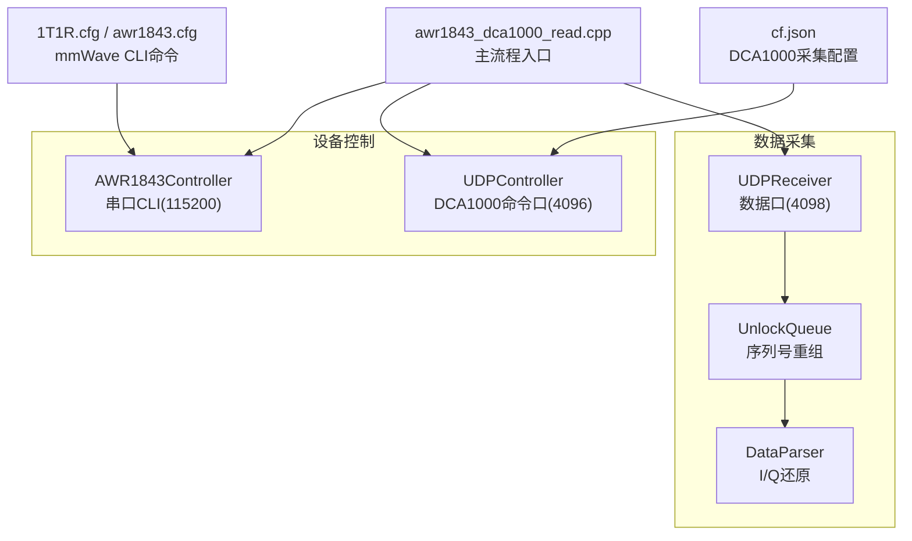
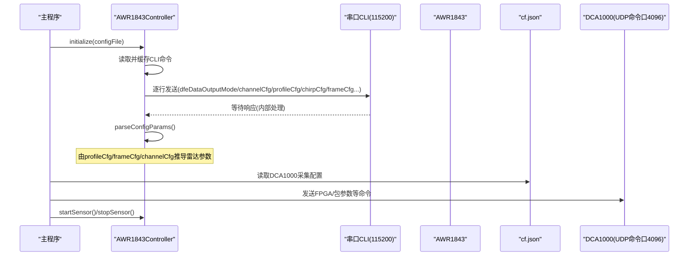
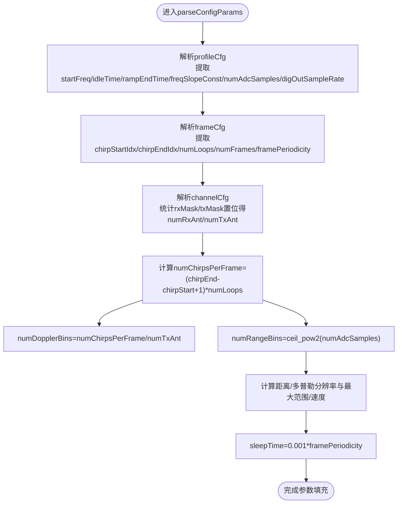
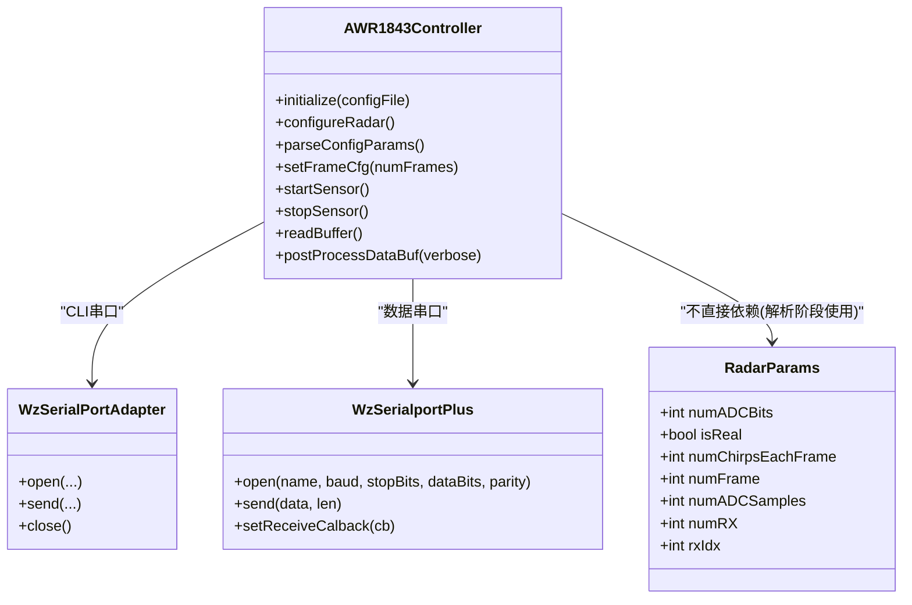

# 雷达与采集参数配置文件

<cite>
**本文引用的文件**
- [1T1R.cfg](file://awr1843_dca1000_read/1T1R.cfg)
- [awr1843.cfg](file://awr1843_dca1000_read/awr1843.cfg)
- [cf.json](file://awr1843_dca1000_read/cf.json)
- [AWR1843Controller.h](file://awr1843_dca1000_read/AWR1843Controller.h)
- [RadarParams.h](file://awr1843_dca1000_read/RadarParams.h)
- [awr1843_dca1000_read.cpp](file://awr1843_dca1000_read/awr1843_dca1000_read.cpp)
</cite>

## 目录
1. [简介](#简介)
2. [项目结构](#项目结构)
3. [核心组件](#核心组件)
4. [架构总览](#架构总览)
5. [详细组件分析](#详细组件分析)
6. [依赖关系分析](#依赖关系分析)
7. [性能考虑](#性能考虑)
8. [故障排查指南](#故障排查指南)
9. [结论](#结论)
10. [附录](#附录)

## 简介
本文件聚焦于 AWR1843 毫米波雷达与 DCA1000 采集卡的配置与参数推导，围绕以下目标展开：
- 解读 mmWave CLI 配置文件 1T1R.cfg / awr1843.cfg 中的关键命令（如 dfeDataOutputMode、channelCfg、profileCfg、chirpCfg、frameCfg、sensorStart 等）及其关键字段含义。
- 说明 AWR1843Controller 如何读取并下发这些配置，并从 profileCfg/frameCfg/channelCfg 推导距离分辨率、多普勒分辨率、最大距离/速度等雷达参数。
- 解释 cf.json 中 DCA1000 的 LVDS/以太网流、dataFormatMode、packetDelay 等采集相关配置项。

## 项目结构
本项目为 C++17 实现，仅依赖标准库，包含两条独立链路：
- 设备控制链路：DCA1000 通过 UDP 命令口（4096）进行配置；AWR1843 通过串口 CLI（115200）接收 mmWave CLI 命令。
- 数据接收链路：UDPReceiver 从数据口（4098）接收原始字节，按帧重组后交由 DataParser 解析为复数 I/Q。

图表来源
- [AWR1843Controller.h:259-308](file://awr1843_dca1000_read/AWR1843Controller.h#L259-L308)
- [awr1843_dca1000_read.cpp:54-142](file://awr1843_dca1000_read/awr1843_dca1000_read.cpp#L54-L142)

章节来源
- [awr1843_dca1000_read.cpp:54-142](file://awr1843_dca1000_read/awr1843_dca1000_read.cpp#L54-L142)
- [AWR1843Controller.h:259-308](file://awr1843_dca1000_read/AWR1843Controller.h#L259-L308)

## 核心组件
- AWR1843Controller：负责读取 mmWave CLI 配置文件、逐行下发至 AWR1843 串口 CLI，并在 parseConfigParams() 中根据 profileCfg/frameCfg/channelCfg 计算雷达关键参数（距离/多普勒分辨率、最大距离/速度、每帧 chirp 数、FFT 点数等）。
- RadarParams：用于描述数据格式与帧尺寸（ADC位数、是否实数、每帧 chirp 数、每 chirp ADC 采样数、RX 天线数等），在离线解析路径中被 DataParser 使用。
- cf.json：描述 DCA1000 的采集模式与数据包参数（数据记录模式、传输模式、捕获模式、LVDS 模式、数据格式模式、包延迟等）。

章节来源
- [AWR1843Controller.h:311-381](file://awr1843_dca1000_read/AWR1843Controller.h#L311-L381)
- [RadarParams.h:5-13](file://awr1843_dca1000_read/RadarParams.h#L5-L13)
- [cf.json:1-10](file://awr1843_dca1000_read/cf.json#L1-L10)

## 架构总览
下图展示了从配置文件到参数推导与设备控制的端到端流程：

图表来源
- [AWR1843Controller.h:259-308](file://awr1843_dca1000_read/AWR1843Controller.h#L259-L308)
- [AWR1843Controller.h:311-381](file://awr1843_dca1000_read/AWR1843Controller.h#L311-L381)
- [awr1843_dca1000_read.cpp:54-142](file://awr1843_dca1000_read/awr1843_dca1000_read.cpp#L54-L142)

## 详细组件分析

### mmWave CLI 配置文件字段解读（1T1R.cfg / awr1843.cfg）
两个配置文件均为 mmWave CLI 命令文本，逐行下发给 AWR1843。以下为常用命令及关键字段的含义与作用：

- sensorStop / flushCfg
  - 作用：停止传感器运行并清空当前配置，确保后续配置生效。
- dfeDataOutputMode
  - 作用：设置 DFE 数据输出模式（例如原始 ADC 或处理后数据）。该值影响后续数据格式与解析方式。
- channelCfg
  - 关键字段：rxMask、txMask
  - 作用：选择启用的 RX/TX 通道掩码。控制器通过统计掩码中置位数量得到 numRxAnt/numTxAnt，并据此推导虚拟天线数与多普勒维度。
- adcCfg / adcbufCfg
  - 作用：配置 ADC 采样率、缓冲器等底层参数，间接影响 digOutSampleRate 与 numADCSamples。
- profileCfg
  - 关键字段（顺序以代码解析为准）：startFreq、idleTime、rampEndTime、freqSlopeConst、numAdcSamples、digOutSampleRate 等
  - 作用：定义 FMCW 波形参数，是推导距离/速度分辨率与最大范围/速度的核心输入。
- chirpCfg
  - 作用：对单个 chirp 的参数进行细化（如功率、起始频率偏移等），通常与 frameCfg 配合决定每帧 chirp 序列。
- frameCfg
  - 关键字段：chirpStartIdx、chirpEndIdx、numLoops、numFrames、framePeriodicity、triggerSelect、triggerDelay
  - 作用：组织 chirp 循环与帧周期，控制器据此计算每帧 chirp 总数与多普勒维度的 bin 数。
- lvdsStreamCfg
  - 作用：配置 LVDS 流式输出参数，与 DCA1000 的采集模式协同工作。
- cfarCfg / multiObjBeamForming / clutterRemoval / calibData 等
  - 作用：CFAR 检测、波束成形、杂波抑制与校准数据加载，属于信号处理链路的配置，不影响基础物理分辨率推导。
- guiMonitor / aoaFovCfg / cfarFovCfg 等
  - 作用：调试监控与视场限制，便于可视化与边界约束。
- sensorStart
  - 作用：启动传感器开始发射与采集。控制器在 configureRadar() 中遇到此命令会停止继续下发，留待上层调用 startSensor() 触发。

章节来源
- [1T1R.cfg:23-51](file://awr1843_dca1000_read/1T1R.cfg#L23-L51)
- [awr1843.cfg:23-51](file://awr1843_dca1000_read/awr1843.cfg#L23-L51)
- [AWR1843Controller.h:285-308](file://awr1843_dca1000_read/AWR1843Controller.h#L285-L308)

### AWR1843Controller 参数推导流程
AWR1843Controller 在 initialize() 中读取配置文件并缓存命令，随后在 parseConfigParams() 中解析 profileCfg/frameCfg/channelCfg 的关键字段，计算如下雷达参数：

- 每帧 chirp 数：numChirpsPerFrame = (chirpEndIdx - chirpStartIdx + 1) × numLoops
- 多普勒 bin 数：numDopplerBins = numChirpsPerFrame / numTxAnt
- 距离 bin 数：numRangeBins = 将 numAdcSamples 向上取整到最近的 2 的幂
- 距离分辨率：基于 digOutSampleRate、freqSlopeConst、numAdcSamples 推导
- 多普勒分辨率：基于 startFreq、idleTime、rampEndTime、numDopplerBins、numTxAnt 推导
- 最大距离：基于 digOutSampleRate、freqSlopeConst 推导
- 最大速度：基于 startFreq、idleTime、rampEndTime、numTxAnt 推导
- 帧休眠时间：sleepTime = 0.001 × framePeriodicity

图表来源
- [AWR1843Controller.h:311-381](file://awr1843_dca1000_read/AWR1843Controller.h#L311-L381)

章节来源
- [AWR1843Controller.h:311-381](file://awr1843_dca1000_read/AWR1843Controller.h#L311-L381)

### 与 RadarParams 的关系
RadarParams 主要用于描述数据格式与帧尺寸，供 DataParser 在离线解析路径中使用：
- numADCBits：ADC 位数（通常为 16）
- isReal：是否为实数数据（本项目一般为复数 I/Q）
- numChirpsEachFrame：每帧 chirp 数（与 frameCfg 推导一致）
- numADCSamples：每个 chirp 的 ADC 采样数（与 profileCfg 一致）
- numRX：接收天线数（与 channelCfg 的 rxMask 一致）
- rxIdx：选中的 RX 索引（单天线场景下可忽略）
- numFrame：总帧数（用于批量处理）

注意：RadarParams 并不参与 AWR1843Controller 的推导过程，而是作为数据解析阶段的契约型参数。

章节来源
- [RadarParams.h:5-13](file://awr1843_dca1000_read/RadarParams.h#L5-L13)
- [awr1843_dca1000_read.cpp:146-212](file://awr1843_dca1000_read/awr1843_dca1000_read.cpp#L146-L212)

### DCA1000 采集配置（cf.json）
cf.json 描述了 DCA1000 的采集模式与数据包参数，关键字段包括：
- dataLoggingMode：数据记录模式（如 raw）
- dataTransferMode：数据传输模式（如 LVDSCapture）
- dataCaptureMode：数据捕获模式（如 ethernetStream）
- lvdsMode：LVDS 模式（数值表示具体编码/通道配置）
- dataFormatMode：数据格式模式（影响 I/Q 打包与字节序）
- packetDelay_us：数据包延迟（微秒级，用于控制以太网包间隔）

这些参数与 lvdsStreamCfg 以及 DCA1000 的 FPGA/包参数命令共同决定最终的数据流结构与网络传输行为。

章节来源
- [cf.json:1-10](file://awr1843_dca1000_read/cf.json#L1-L10)
- [awr1843_dca1000_read.cpp:96-104](file://awr1843_dca1000_read/awr1843_dca1000_read.cpp#L96-L104)

## 依赖关系分析
- AWR1843Controller 依赖 WzSerialportPlus/WzSerialPortAdapter 进行串口通信，并通过内部 split/bytesToUint32/bytesToFloat 等辅助函数解析命令行与二进制数据。
- main 程序在实时模式下通过 UDPController 向 DCA1000 发送配置命令，在离线模式下通过 DataParser 解析已保存的 .bin 文件。
- 数据链路（UDPReceiver→UnlockQueue→DataParser）与控制链路（UDPController/串口CLI）相互独立，避免混淆。

图表来源
- [AWR1843Controller.h:220-256](file://awr1843_dca1000_read/AWR1843Controller.h#L220-L256)
- [RadarParams.h:5-13](file://awr1843_dca1000_read/RadarParams.h#L5-L13)

章节来源
- [AWR1843Controller.h:220-256](file://awr1843_dca1000_read/AWR1843Controller.h#L220-L256)
- [RadarParams.h:5-13](file://awr1843_dca1000_read/RadarParams.h#L5-L13)

## 性能考虑
- 缓冲区上限：内部 byteBuffer 最大为 32768 字节，溢出时会丢弃旧数据保留最新片段，避免内存增长。
- 线程安全：数据写入采用互斥锁保护，防止多线程竞争。
- 解析效率：parseConfigParams() 仅扫描配置命令一次，复杂度 O(N)，N 为配置行数；数据解析时按魔术字定位帧头，整体线性扫描。
- 网络与串口：串口波特率分别为 115200（CLI）与 921600（数据），需确保系统 IO 吞吐能力满足高帧率需求。

[本节为通用指导，不涉及具体文件分析]

## 故障排查指南
- 配置文件打开失败：检查配置文件路径与权限。
- 串口打开失败：确认端口名与波特率正确，避免与其他进程占用冲突。
- 配置未生效：确保 flushCfg 在修改前执行；sensorStart 仅在需要时调用。
- 数据不完整：检查 UDP 数据口（4098）与 UnlockQueue 重组逻辑，确认 seqNum 连续性与网络丢包情况。
- 解析错误：核对 RadarParams 与配置文件的一致性（numChirpsEachFrame、numADCSamples、numRX），确保帧大小计算正确。

章节来源
- [AWR1843Controller.h:259-282](file://awr1843_dca1000_read/AWR1843Controller.h#L259-L282)
- [awr1843_dca1000_read.cpp:156-170](file://awr1843_dca1000_read/awr1843_dca1000_read.cpp#L156-L170)

## 结论
- 1T1R.cfg 与 awr1843.cfg 通过 mmWave CLI 命令定义雷达波形、通道与帧结构；AWR1843Controller 能自动解析并推导关键物理参数，便于上层算法直接使用。
- cf.json 提供 DCA1000 的采集模式与数据包参数，与 lvdsStreamCfg 协同确保正确的数据流格式与网络传输节奏。
- 建议在实际部署中严格对齐 RadarParams 与配置文件，确保帧大小与解析契约一致，避免数据错位或解析失败。

[本节为总结性内容，不涉及具体文件分析]

## 附录
- 帧字节数计算公式（参考注释）：BYTES_PER_FRAME = numRX × numChirpsEachFrame × numADCSamples × 4（每采样点为 2×int16 的 I/Q）。
- 网络地址约定：上位机 IP 192.168.33.30，DCA1000 IP 192.168.33.180。

章节来源
- [awr1843_dca1000_read.cpp:39-41](file://awr1843_dca1000_read/awr1843_dca1000_read.cpp#L39-L41)