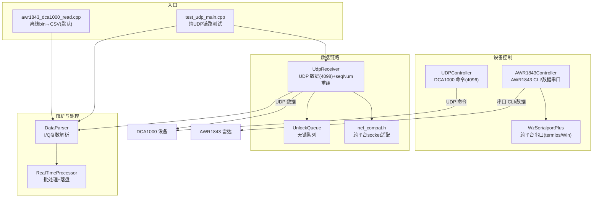
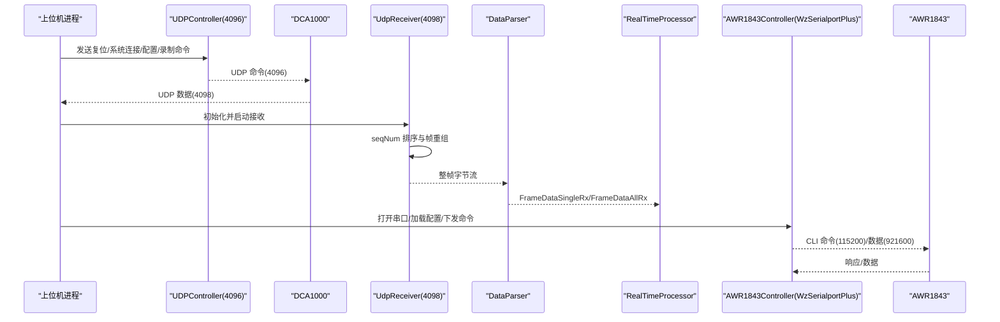
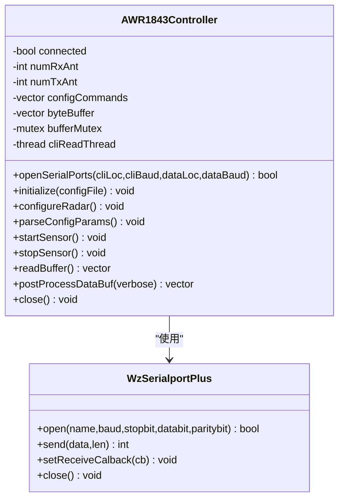
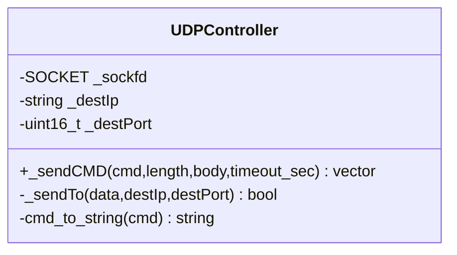
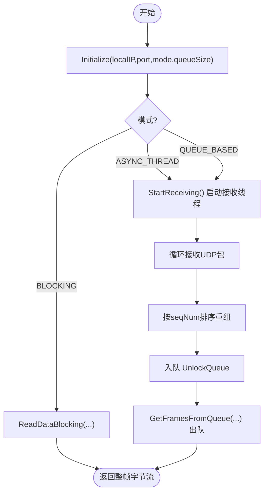
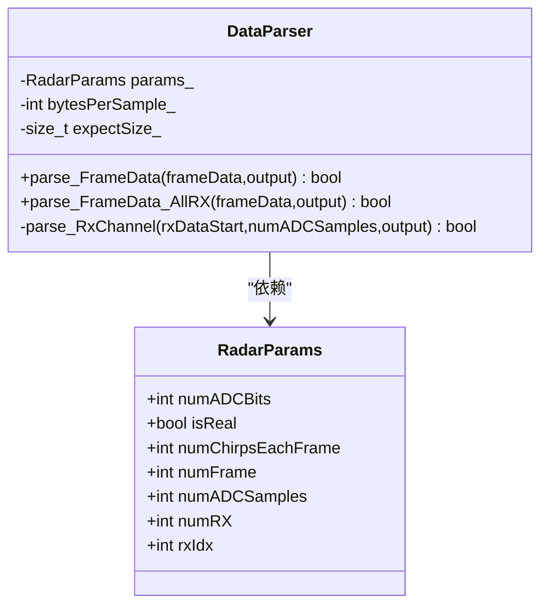
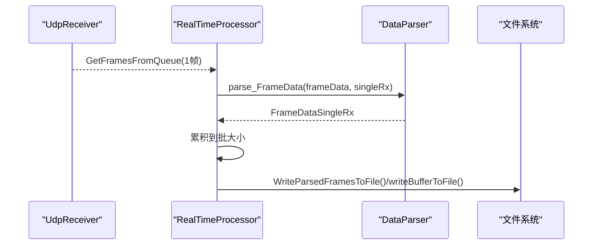
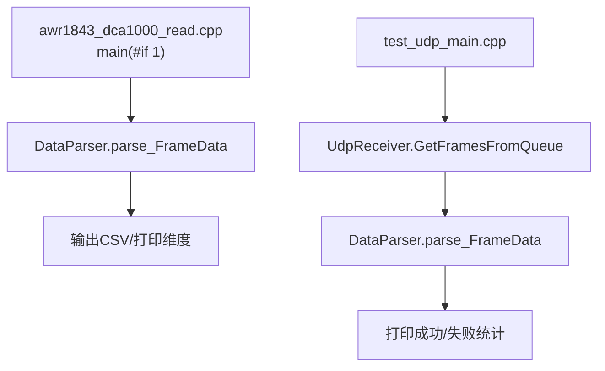
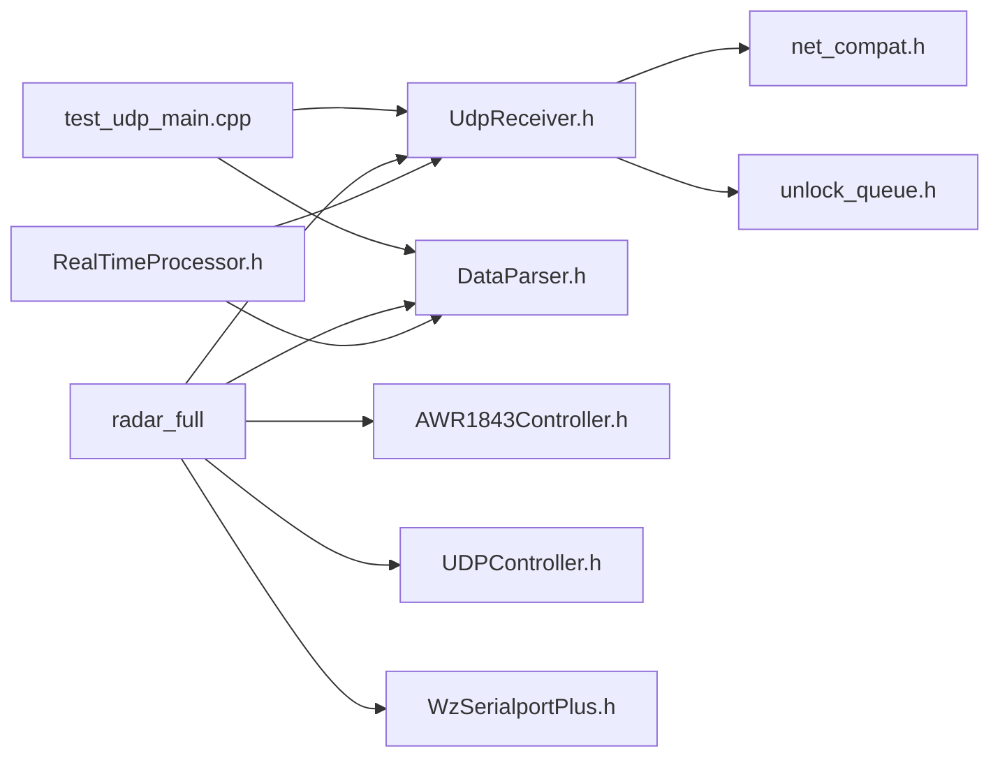

# 项目概述与整体架构

<cite>
**本文引用的文件**   
- [README.md](file://README.md)
- [CMakeLists.txt](file://CMakeLists.txt)
- [awr1843_dca1000_read.cpp](file://awr1843_dca1000_read/awr1843_dca1000_read.cpp)
- [net_compat.h](file://awr1843_dca1000_read/net_compat.h)
- [UDPController.h](file://awr1843_dca1000_read/UDPController.h)
- [UdpReceiver.h](file://awr1843_dca1000_read/UdpReceiver.h)
- [DataParser.h](file://awr1843_dca1000_read/DataParser.h)
- [RadarParams.h](file://awr1843_dca1000_read/RadarParams.h)
- [AWR1843Controller.h](file://awr1843_dca1000_read/AWR1843Controller.h)
- [WzSerialportPlus.h](file://awr1843_dca1000_read/WzSerialportPlus.h)
- [RealTimeProcessor.h](file://awr1843_dca1000_read/RealTimeProcessor.h)
- [test_udp_main.cpp](file://awr1843_dca1000_read/test_udp_main.cpp)
</cite>

## 目录
1. [简介](#简介)
2. [项目结构](#项目结构)
3. [核心组件](#核心组件)
4. [架构总览（命令/数据/串口三通道并行）](#架构总览命令数据串口三通道并行)
5. [详细组件分析](#详细组件分析)
6. [依赖关系分析](#依赖关系分析)
7. [性能与并发特性](#性能与并发特性)
8. [故障排查要点](#故障排查要点)
9. [结论](#结论)

## 简介
本项目面向 TI AWR1843 毫米波雷达与 DCA1000 采集卡，提供原始数据采集、解析与存储能力。技术栈为 C++17，仅依赖标准库；通过 net_compat.h 实现跨平台网络层封装，WzSerialportPlus 在 POSIX 分支使用 termios 完成跨平台串口支持。项目提供两条可构建目标：
- test_udp：不含串口链的“UDP 接收 → seqNum 重组 → DataParser 解析”链路测试入口，三平台可构建，便于配合 Python 回放泵验证数据通路。
- radar_full：完整程序，包含串口链与 UDP 控制/数据链路，默认 main 走离线 bin→CSV 解析分支。

三通道并行说明：
- 命令通道：上位机 ↔ DCA1000（UDP 命令口 4096），由 UDPController 负责。
- 数据通道：DCA1000 → 上位机（UDP 数据口 4098），由 UdpReceiver 负责帧重组与交付。
- 串口通道：上位机 ↔ AWR1843（CLI 115200 / 数据口 921600），由 AWR1843Controller 驱动 WzSerialportPlus 完成配置与传感器启停。

## 项目结构
顶层包含 CMake 构建脚本与 README；核心源码位于 awr1843_dca1000_read 目录，按职责划分模块：
- 设备控制：UDPController（DCA1000 命令）、AWR1843Controller + WzSerialportPlus（AWR1843 串口）。
- 数据链路：UdpReceiver（UDP 数据接收与重组）、UnlockQueue（无锁队列）、net_compat.h（跨平台 socket 适配）。
- 数据解析：DataParser（将字节还原为复数 I/Q，支持单 Rx/全 Rx）。
- 实时处理：RealTimeProcessor（生产者-消费者式批处理与落盘）。
- 入口与测试：awr1843_dca1000_read.cpp（双 main 切换）、test_udp_main.cpp（纯 UDP 链路测试）。

图示来源
- [CMakeLists.txt:20-47](file://CMakeLists.txt#L20-L47)
- [UDPController.h:45-97](file://awr1843_dca1000_read/UDPController.h#L45-L97)
- [UdpReceiver.h:34-114](file://awr1843_dca1000_read/UdpReceiver.h#L34-L114)
- [DataParser.h:16-41](file://awr1843_dca1000_read/DataParser.h#L16-L41)
- [AWR1843Controller.h:86-214](file://awr1843_dca1000_read/AWR1843Controller.h#L86-L214)
- [WzSerialportPlus.h:30-79](file://awr1843_dca1000_read/WzSerialportPlus.h#L30-L79)
- [net_compat.h:39-99](file://awr1843_dca1000_read/net_compat.h#L39-L99)
- [awr1843_dca1000_read.cpp:145-212](file://awr1843_dca1000_read/awr1843_dca1000_read.cpp#L145-L212)
- [test_udp_main.cpp:43-116](file://awr1843_dca1000_read/test_udp_main.cpp#L43-L116)

章节来源
- [README.md:1-116](file://README.md#L1-L116)
- [CMakeLists.txt:1-63](file://CMakeLists.txt#L1-L63)

## 核心组件
- 设备控制
  - UDPController：封装 DCA1000 命令协议，固定目的 IP/端口，发送复位、系统连接、FPGA/数据包配置、录制启停等命令。
  - AWR1843Controller：header-only 实现，负责打开 CLI/数据串口、读取 mmWave CLI 配置文件并下发、解析配置参数、启动/停止传感器。
  - WzSerialportPlus：跨平台串口抽象，POSIX 分支基于 termios，Windows 分支基于 Win32 API。
- 数据链路
  - UdpReceiver：基于 net_compat.h 的跨平台 socket，支持阻塞/异步线程/队列三种模式；内部对 UDP 包进行 seqNum 排序与重组，输出整帧字节流。
  - UnlockQueue：无锁队列，用于解耦接收与处理。
  - net_compat.h：统一 SOCKET/INVALID_SOCKET/SOCKET_ERROR 及 net_startup/cleanup/close/would_block/set_nonblocking 等 API。
- 数据解析
  - DataParser：根据 RadarParams 将一帧原始字节解交织为复数 I/Q，支持单 Rx 与全 Rx 两种输出类型。
- 实时处理
  - RealTimeProcessor：以队列方式从 UdpReceiver 取帧，调用 DataParser 解析后批量写入二进制或 CSV（取决于上层主流程）。
- 入口与测试
  - awr1843_dca1000_read.cpp：#if 0/#if 1 切换实时采集与离线 bin→CSV 解析（当前默认离线）。
  - test_udp_main.cpp：不依赖串口/DCA1000 命令通道，纯 UDP 链路测试，适合与 Python 回放泵联调。

章节来源
- [UDPController.h:45-97](file://awr1843_dca1000_read/UDPController.h#L45-L97)
- [AWR1843Controller.h:86-214](file://awr1843_dca1000_read/AWR1843Controller.h#L86-L214)
- [WzSerialportPlus.h:30-79](file://awr1843_dca1000_read/WzSerialportPlus.h#L30-L79)
- [UdpReceiver.h:34-114](file://awr1843_dca1000_read/UdpReceiver.h#L34-L114)
- [net_compat.h:39-99](file://awr1843_dca1000_read/net_compat.h#L39-L99)
- [DataParser.h:16-41](file://awr1843_dca1000_read/DataParser.h#L16-L41)
- [RealTimeProcessor.h:11-77](file://awr1843_dca1000_read/RealTimeProcessor.h#L11-L77)
- [awr1843_dca1000_read.cpp:145-212](file://awr1843_dca1000_read/awr1843_dca1000_read.cpp#L145-L212)
- [test_udp_main.cpp:43-116](file://awr1843_dca1000_read/test_udp_main.cpp#L43-L116)

## 架构总览（命令/数据/串口三通道并行）
三条独立通信通道并行工作，互不干扰：
- 命令通道（UDP 4096）：上位机通过 UDPController 向 DCA1000 发送配置/控制命令，如复位、系统连接、FPGA/数据包参数配置、录制启停等。
- 数据通道（UDP 4098）：DCA1000 将 ADC 原始数据以 UDP 包形式发送到上位机，UdpReceiver 负责按 seqNum 重组为整帧字节流，再交由 DataParser 解析为复数 I/Q。
- 串口通道（CLI 115200 / 数据 921600）：AWR1843Controller 通过串口与雷达交互，加载 mmWave CLI 配置文件并下发，控制传感器启停。

图示来源
- [UDPController.h:45-97](file://awr1843_dca1000_read/UDPController.h#L45-L97)
- [UdpReceiver.h:34-114](file://awr1843_dca1000_read/UdpReceiver.h#L34-L114)
- [DataParser.h:16-41](file://awr1843_dca1000_read/DataParser.h#L16-L41)
- [RealTimeProcessor.h:11-77](file://awr1843_dca1000_read/RealTimeProcessor.h#L11-L77)
- [AWR1843Controller.h:86-214](file://awr1843_dca1000_read/AWR1843Controller.h#L86-L214)
- [WzSerialportPlus.h:30-79](file://awr1843_dca1000_read/WzSerialportPlus.h#L30-L79)

## 详细组件分析

### 设备控制：AWR1843Controller（头文件实现）
- 职责
  - 打开 CLI 与数据串口，注册回调将数据写入环形缓冲。
  - 读取 mmWave CLI 配置文件（profileCfg/frameCfg/channelCfg 等），逐行下发至雷达。
  - 从配置行推导关键参数（距离/多普勒分辨率、最大范围/速度、天线数等）。
  - 提供 startSensor/stopSensor 等控制接口。
- 关键点
  - header-only：控制逻辑集中在头文件，同名 .cpp 为空。
  - 多线程：CLI 读取线程与数据回调写入缓冲，使用互斥保护缓冲区。
  - 配置解析：parseConfigParams 从 profileCfg/frameCfg/channelCfg 计算物理量。

图示来源
- [AWR1843Controller.h:86-214](file://awr1843_dca1000_read/AWR1843Controller.h#L86-L214)
- [WzSerialportPlus.h:30-79](file://awr1843_dca1000_read/WzSerialportPlus.h#L30-L79)

章节来源
- [AWR1843Controller.h:258-381](file://awr1843_dca1000_read/AWR1843Controller.h#L258-L381)
- [AWR1843Controller.h:408-438](file://awr1843_dca1000_read/AWR1843Controller.h#L408-L438)

### 设备控制：UDPController（DCA1000 命令通道）
- 职责
  - 封装 DCA1000 命令协议，构造头部/长度/载荷/尾部，发送至 DCA1000 指定 IP/端口（4096）。
  - 提供 _sendCMD 接口，返回响应字节向量。
- 关键点
  - 固定目的地址：DCA1000 IP 192.168.33.180，源 IP 192.168.33.30。
  - 命令枚举 CommandCode 覆盖复位、系统连接、FPGA/数据包配置、录制启停等。

图示来源
- [UDPController.h:45-97](file://awr1843_dca1000_read/UDPController.h#L45-L97)

章节来源
- [UDPController.h:20-35](file://awr1843_dca1000_read/UDPController.h#L20-L35)
- [UDPController.h:83-91](file://awr1843_dca1000_read/UDPController.h#L83-L91)

### 数据链路：UdpReceiver（UDP 数据通道）
- 职责
  - 绑定本地 IP/端口（默认 4098），接收 DCA1000 的 UDP 数据包。
  - 按 seqNum 排序重组为整帧字节流，支持阻塞/异步线程/队列模式。
  - 暴露 GetFramesFromQueue 供上层消费。
- 关键点
  - 使用 net_compat.h 屏蔽 Windows/POSIX socket 差异。
  - 内部维护 packet_queue_（UnlockQueue）与统计信息 ReceiveStats。

图示来源
- [UdpReceiver.h:34-114](file://awr1843_dca1000_read/UdpReceiver.h#L34-L114)
- [net_compat.h:39-99](file://awr1843_dca1000_read/net_compat.h#L39-L99)

章节来源
- [UdpReceiver.h:47-74](file://awr1843_dca1000_read/UdpReceiver.h#L47-L74)
- [UdpReceiver.h:75-114](file://awr1843_dca1000_read/UdpReceiver.h#L75-L114)

### 数据解析：DataParser（I/Q 复数还原）
- 职责
  - 将一帧原始字节按 chirp/rx/sample 维度解交织，输出复数 I/Q。
  - 支持单 Rx（FrameDataSingleRx）与全 Rx（FrameDataAllRx）两种输出。
- 关键点
  - 输入帧大小 = numRX × numChirpsEachFrame × numADCSamples × 4（每采样点 2×int16 的 I/Q）。
  - 解析过程受 RadarParams 控制。

图示来源
- [DataParser.h:16-41](file://awr1843_dca1000_read/DataParser.h#L16-L41)
- [RadarParams.h:5-13](file://awr1843_dca1000_read/RadarParams.h#L5-L13)

章节来源
- [DataParser.h:16-41](file://awr1843_dca1000_read/DataParser.h#L16-L41)
- [RadarParams.h:5-13](file://awr1843_dca1000_read/RadarParams.h#L5-L13)

### 实时处理：RealTimeProcessor（批处理与落盘）
- 职责
  - 从 UdpReceiver 队列取帧，调用 DataParser 解析，累积到批大小后写入文件。
  - 支持写入解析后的复数 I/Q 二进制或原始 ADC 二进制（通过 #if 切换）。
- 关键点
  - 生产-消费者模型：接收线程与处理线程分离。
  - 扩展接入点：在 parse_FrameData 成功后，以 FrameDataSingleRx/FrameDataAllRx 作为后续算法（Range-FFT/Doppler-FFT/CFAR/目标检测）的级间接口。

图示来源
- [RealTimeProcessor.h:11-77](file://awr1843_dca1000_read/RealTimeProcessor.h#L11-L77)
- [RealTimeProcessor.h:82-139](file://awr1843_dca1000_read/RealTimeProcessor.h#L82-L139)
- [DataParser.h:16-41](file://awr1843_dca1000_read/DataParser.h#L16-L41)

章节来源
- [RealTimeProcessor.h:46-77](file://awr1843_dca1000_read/RealTimeProcessor.h#L46-L77)
- [RealTimeProcessor.h:162-183](file://awr1843_dca1000_read/RealTimeProcessor.h#L162-L183)

### 入口与测试
- awr1843_dca1000_read.cpp
  - #if 0 分支：实时采集（含 DCA1000 命令与串口控制）。
  - #if 1 分支（默认）：离线 bin→CSV 解析，使用 DataParser 输出单 Rx 与全 Rx 结果。
- test_udp_main.cpp
  - 纯 UDP 链路测试，不依赖串口与 DCA1000 命令通道，适合与 Python 回放泵联调。

图示来源
- [awr1843_dca1000_read.cpp:145-212](file://awr1843_dca1000_read/awr1843_dca1000_read.cpp#L145-L212)
- [test_udp_main.cpp:43-116](file://awr1843_dca1000_read/test_udp_main.cpp#L43-L116)

章节来源
- [awr1843_dca1000_read.cpp:145-212](file://awr1843_dca1000_read/awr1843_dca1000_read.cpp#L145-L212)
- [test_udp_main.cpp:43-116](file://awr1843_dca1000_read/test_udp_main.cpp#L43-L116)

## 依赖关系分析
- 构建目标
  - test_udp：test_udp_main.cpp + UdpReceiver.cpp + DataParser.cpp，链接 Threads::Threads，可选 ws2_32（Windows）。
  - radar_full：awr1843_dca1000_read.cpp + AWR1843Controller.cpp + DataParser.cpp + UDPController.cpp + UdpReceiver.cpp + WzSerialportPlus.cpp，链接 Threads::Threads，可选 ws2_32（Windows）。
- 模块耦合
  - UdpReceiver 依赖 net_compat.h 与 UnlockQueue。
  - RealTimeProcessor 依赖 UdpReceiver 与 DataParser。
  - AWR1843Controller 依赖 WzSerialportPlus。
  - 入口程序按需组合上述模块。

图示来源
- [CMakeLists.txt:20-47](file://CMakeLists.txt#L20-L47)
- [UdpReceiver.h:34-114](file://awr1843_dca1000_read/UdpReceiver.h#L34-L114)
- [net_compat.h:39-99](file://awr1843_dca1000_read/net_compat.h#L39-L99)
- [AWR1843Controller.h:86-214](file://awr1843_dca1000_read/AWR1843Controller.h#L86-L214)
- [WzSerialportPlus.h:30-79](file://awr1843_dca1000_read/WzSerialportPlus.h#L30-L79)
- [RealTimeProcessor.h:11-77](file://awr1843_dca1000_read/RealTimeProcessor.h#L11-L77)

章节来源
- [CMakeLists.txt:20-47](file://CMakeLists.txt#L20-L47)

## 性能与并发特性
- 并发模型
  - UdpReceiver 支持异步线程与队列模式，降低丢包风险，提高吞吐。
  - RealTimeProcessor 采用生产者-消费者模型，批处理减少 I/O 次数。
- 内存与缓存
  - AWR1843Controller 使用固定大小缓冲与覆盖策略避免溢出。
  - DataParser 按帧为单位处理，避免大对象频繁分配。
- 跨平台网络
  - net_compat.h 统一非阻塞设置与错误码判断，提升在不同平台的稳定性。

[本节为通用性能讨论，无需具体文件引用]

## 故障排查要点
- 网络问题
  - 确认上位机 IP 192.168.33.30 与 DCA1000 IP 192.168.33.180 在同一网段。
  - 检查 UDP 端口：命令 4096、数据 4098。
- 串口问题
  - 确认 CLI 115200 与数据 921600 波特率正确，串口名称无误。
- 数据完整性
  - 帧字节数需与实际配置一致：numRX × numChirpsEachFrame × numADCSamples × 4。
  - 若出现丢帧，增大队列大小或调整批大小。
- 日志与统计
  - 使用 UdpReceiver 的统计信息（receivedPacketNum/errorCount/totalFrames）辅助定位。

章节来源
- [UdpReceiver.h:25-32](file://awr1843_dca1000_read/UdpReceiver.h#L25-L32)
- [awr1843_dca1000_read.cpp:39-40](file://awr1843_dca1000_read/awr1843_dca1000_read.cpp#L39-L40)

## 结论
本项目围绕 AWR1843 + DCA1000 的原始数据采集与解析，构建了清晰的三通道并行架构：命令（UDP 4096）、数据（UDP 4098）、串口（CLI/数据）。通过 net_compat.h 与 WzSerialportPlus 实现跨平台能力，UdpReceiver 与 DataParser 形成稳定的数据通路，RealTimeProcessor 提供可扩展的批处理与落盘机制。test_udp 与 radar_full 两个构建目标分别满足快速验证与完整功能需求，便于在不同平台上开发与调试。