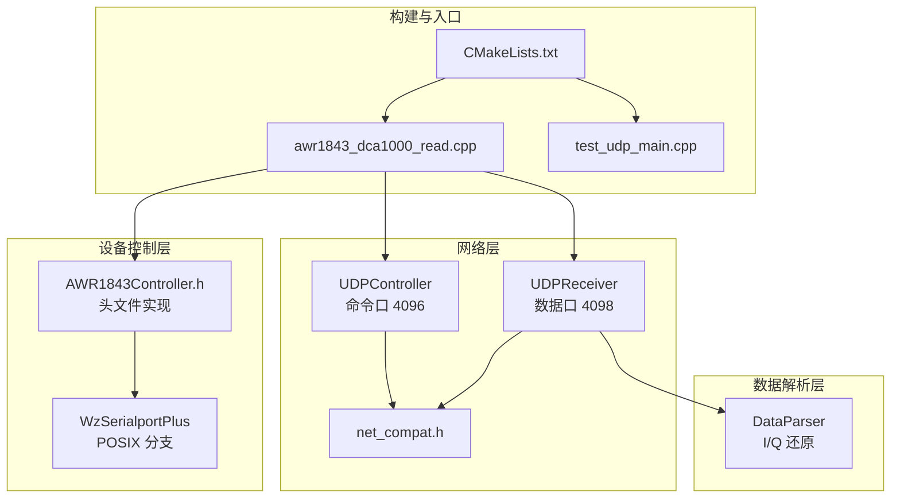
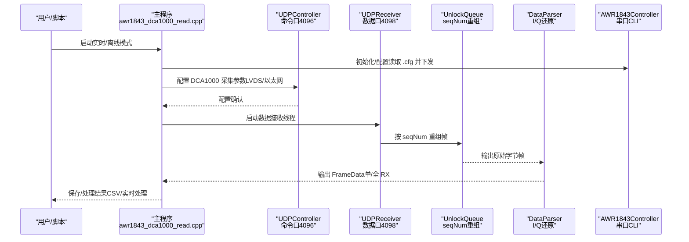
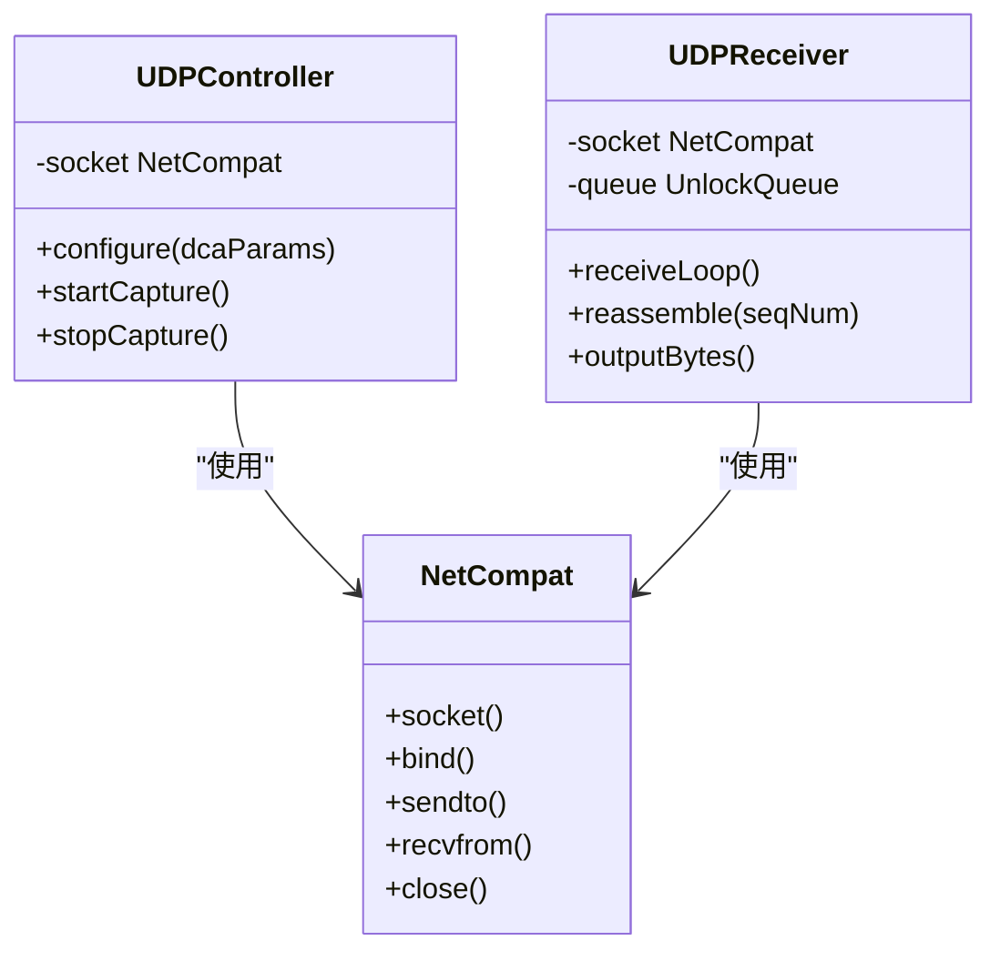
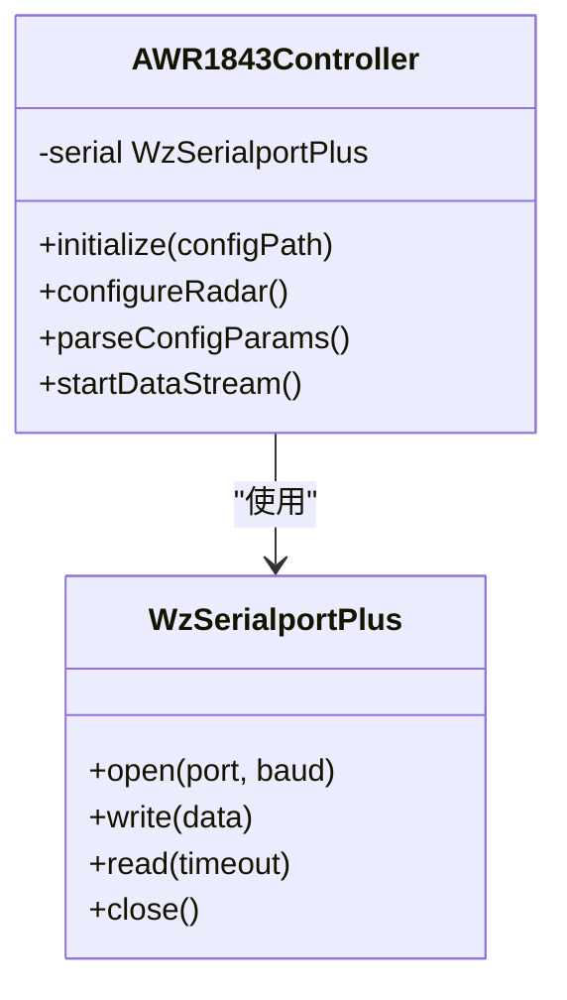
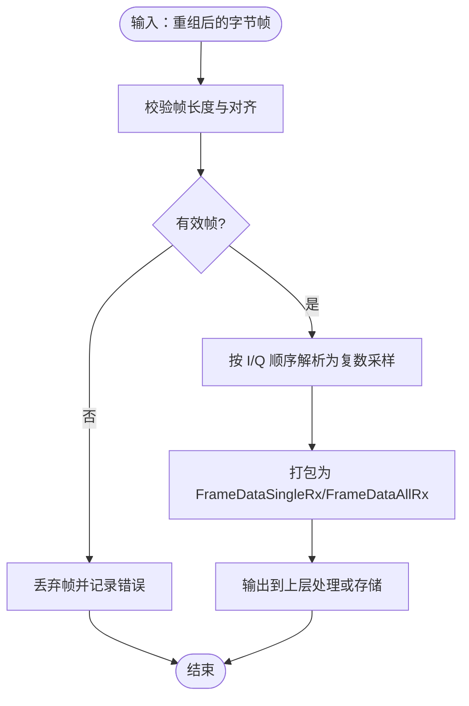
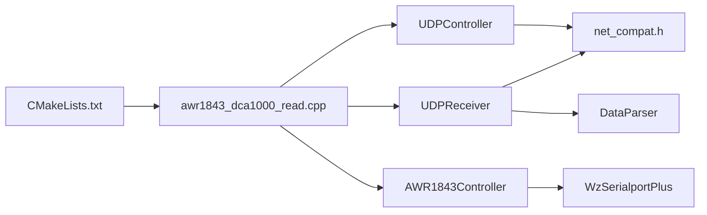

# 项目概述与整体架构

<cite>
**本文引用的文件**
- [CMakeLists.txt](file://CMakeLists.txt)
- [awr1843_dca1000_read.cpp](file://awr1843_dca1000_read.cpp)
- [net_compat.h](file://net_compat.h)
- [AWR1843Controller.h](file://AWR1843Controller.h)
- [UDPReceiver.h](file://UDPReceiver.h)
- [DataParser.h](file://DataParser.h)
- [WzSerialportPlus.h](file://WzSerialportPlus.h)
- [test_udp_main.cpp](file://test_udp_main.cpp)
</cite>

## 目录
1. [简介](#简介)
2. [项目结构](#项目结构)
3. [核心组件](#核心组件)
4. [架构总览（命令/数据/串口三通道并行）](#架构总览命令数据串口三通道并行)
5. [详细组件分析](#详细组件分析)
6. [依赖关系分析](#依赖关系分析)
7. [性能考虑](#性能考虑)
8. [故障排查指南](#故障排查指南)
9. [结论](#结论)
10. [附录](#附录)

## 简介
本项目面向 TI AWR1843 毫米波雷达与 DCA1000 采集卡的原始数据采集与解析，提供跨平台 C++17 实现，仅依赖标准库。项目从 Windows-only 版本演进而来，新增 net_compat.h、POSIX 分支的 WzSerialportPlus、以及 test_udp_main.cpp 等跨平台组件。系统通过三条独立通信通道并行工作：
- 命令通道：DCA1000 网络命令口（UDP 4096），用于配置采集参数与启停采集。
- 数据通道：DCA1000 数据口（UDP 4098），承载 I/Q 原始帧，经序列号重组后交由解析器还原为复数采样。
- 串口通道：AWR1843 CLI（115200 bps）与高速数据口（921600 bps），用于雷达初始化、配置下发与实时数据流控制。

本仓库以 CMake 构建，定义两个目标：
- test_udp：不含串口链路的轻量目标，配合 Python 回放泵测试 UDP→重组→解析链路。
- radar_full：包含串口链路的完整程序，支持实时采集与离线解析两种模式。

## 项目结构
- 顶层 CMakeLists.txt 定义构建目标与编译选项，区分是否启用串口链路。
- awr1843_dca1000_read.cpp 作为入口，通过 #if 0/#if 1 切换“实时采集”和“离线 bin→CSV 解析”两种 main。
- 网络层基于 net_compat.h 封装跨平台 socket，支撑 UDPReceiver 与 UDPController。
- 设备控制层由 AWR1843Controller（头文件实现）与 WzSerialportPlus（POSIX 分支）组成。
- 数据解析层由 DataParser 将字节流还原为 FrameDataSingleRx/FrameDataAllRx 等结构化类型。

图表来源
- [CMakeLists.txt](file://CMakeLists.txt)
- [awr1843_dca1000_read.cpp](file://awr1843_dca1000_read.cpp)
- [net_compat.h](file://net_compat.h)
- [AWR1843Controller.h](file://AWR1843Controller.h)
- [WzSerialportPlus.h](file://WzSerialportPlus.h)
- [test_udp_main.cpp](file://test_udp_main.cpp)

章节来源
- [CMakeLists.txt](file://CMakeLists.txt)
- [awr1843_dca1000_read.cpp](file://awr1843_dca1000_read.cpp)

## 核心组件
- 构建与入口
  - CMakeLists.txt：定义 test_udp 与 radar_full 两个目标，控制是否包含串口链路。
  - awr1843_dca1000_read.cpp：提供两种运行模式（实时采集/离线解析），默认进入离线解析。
- 网络层
  - net_compat.h：跨平台 socket 抽象，屏蔽 POSIX/Winsock 差异。
  - UDPController：DCA1000 命令口（4096）客户端，负责发送采集配置与启停指令。
  - UDPReceiver：DCA1000 数据口（4098）接收端，按 seqNum 进行帧重组，输出原始字节。
- 设备控制层
  - WzSerialportPlus：POSIX 分支的串口适配，供 AWR1843Controller 使用。
  - AWR1843Controller.h：头文件实现的雷达控制器，读取 mmWave CLI 配置文件并下发命令，解析 profileCfg/frameCfg/channelCfg 推导分辨率等参数。
- 数据解析层
  - DataParser：将重组后的字节流还原为复数 I/Q 采样，输出 FrameDataSingleRx/FrameDataAllRx 等结构，供上层处理或写入 CSV。

章节来源
- [CMakeLists.txt](file://CMakeLists.txt)
- [awr1843_dca1000_read.cpp](file://awr1843_dca1000_read.cpp)
- [net_compat.h](file://net_compat.h)
- [AWR1843Controller.h](file://AWR1843Controller.h)
- [WzSerialportPlus.h](file://WzSerialportPlus.h)

## 架构总览（命令/数据/串口三通道并行）
系统采用“三通道并行 + 两层数据通路”的设计：
- 命令通道（DCA1000 命令口 4096）：UDPController 负责配置 LVDS/以太网流参数与采集启停。
- 数据通道（DCA1000 数据口 4098）：UDPReceiver 接收原始字节，UnlockQueue 与 seqNum 完成帧重组；DataParser 将字节还原为 I/Q 复数。
- 串口通道（AWR1843 CLI 115200 / 数据口 921600）：AWR1843Controller 读取 mmWave CLI 配置文件并下发命令，驱动雷达初始化与运行。

图表来源
- [awr1843_dca1000_read.cpp](file://awr1843_dca1000_read.cpp)
- [net_compat.h](file://net_compat.h)
- [AWR1843Controller.h](file://AWR1843Controller.h)

章节来源
- [awr1843_dca1000_read.cpp](file://awr1843_dca1000_read.cpp)

## 详细组件分析

### 构建与入口（CMakeLists.txt 与 awr1843_dca1000_read.cpp）
- CMakeLists.txt 定义两个可执行目标：
  - test_udp：不包含串口链路，便于在任意平台验证 UDP→重组→解析链路。
  - radar_full：包含串口链路，支持完整的实时采集流程。
- awr1843_dca1000_read.cpp 通过条件编译切换 main：
  - #if 0：实时采集模式，启动 UDPReceiver 与 AWR1843Controller。
  - #if 1（默认）：离线解析模式，读取已捕获的 bin 文件并转换为 CSV。

章节来源
- [CMakeLists.txt](file://CMakeLists.txt)
- [awr1843_dca1000_read.cpp](file://awr1843_dca1000_read.cpp)

### 网络层（net_compat.h、UDPController、UDPReceiver）
- net_compat.h：统一 socket API，屏蔽 POSIX 与 Winsock 差异，确保跨平台一致性。
- UDPController：向 DCA1000 命令口（4096）发送配置与启停指令，属于设备控制通道。
- UDPReceiver：监听数据口（4098），按 seqNum 进行帧重组，输出原始字节流。

图表来源
- [net_compat.h](file://net_compat.h)

章节来源
- [net_compat.h](file://net_compat.h)

### 设备控制层（WzSerialportPlus 与 AWR1843Controller.h）
- WzSerialportPlus：POSIX 分支的串口适配器，提供跨平台的串口读写能力。
- AWR1843Controller.h：头文件实现的雷达控制器，负责：
  - 读取 mmWave CLI 配置文件（如 1T1R.cfg/awr1843.cfg）。
  - 逐行下发命令，初始化雷达与射频参数。
  - 从 profileCfg/frameCfg/channelCfg 推导距离/多普勒分辨率等关键参数。

图表来源
- [AWR1843Controller.h](file://AWR1843Controller.h)
- [WzSerialportPlus.h](file://WzSerialportPlus.h)

章节来源
- [AWR1843Controller.h](file://AWR1843Controller.h)
- [WzSerialportPlus.h](file://WzSerialportPlus.h)

### 数据解析层（DataParser）
- DataParser 将重组后的字节流还原为复数 I/Q 采样，输出类型为 FrameDataSingleRx/FrameDataAllRx。
- 帧大小约定：numRX × numChirpsEachFrame × numADCSamples × 4（每采样点 2×int16 的 I/Q）。
- 解析结果可用于实时处理（Range/Doppler/CFAR）或离线写入 CSV。

图表来源
- [DataParser.h](file://DataParser.h)

章节来源
- [DataParser.h](file://DataParser.h)

### 测试与回放（test_udp_main.cpp）
- test_udp_main.cpp 提供独立的 UDP 测试入口，不依赖串口链路。
- 可与 Python 回放脚本配合，模拟 DCA1000 数据流，验证 UDP→重组→解析链路。

章节来源
- [test_udp_main.cpp](file://test_udp_main.cpp)

## 依赖关系分析
- 构建依赖：CMakeLists.txt 决定是否包含串口链路，影响最终可执行文件的模块集合。
- 运行时依赖：
  - UDPReceiver 依赖 net_compat.h 提供的 socket 接口。
  - AWR1843Controller 依赖 WzSerialportPlus 进行串口通信。
  - DataParser 依赖重组后的字节流，输出结构化数据给上层。

图表来源
- [CMakeLists.txt](file://CMakeLists.txt)
- [awr1843_dca1000_read.cpp](file://awr1843_dca1000_read.cpp)
- [net_compat.h](file://net_compat.h)
- [AWR1843Controller.h](file://AWR1843Controller.h)
- [WzSerialportPlus.h](file://WzSerialportPlus.h)
- [DataParser.h](file://DataParser.h)

章节来源
- [CMakeLists.txt](file://CMakeLists.txt)
- [awr1843_dca1000_read.cpp](file://awr1843_dca1000_read.cpp)

## 性能考虑
- 数据通道优化：
  - 使用 UnlockQueue 与 seqNum 重组，避免锁竞争与丢包导致的乱序。
  - 批量读取与零拷贝策略可减少系统调用开销。
- 解析层优化：
  - DataParser 按固定步长解析 I/Q，避免动态分配。
  - 输出结构化类型以减少后续转换成本。
- 串口控制：
  - AWR1843Controller 批量下发配置命令，减少 CLI 交互延迟。
- 网络层：
  - net_compat.h 统一 API，便于在不同平台上调优 socket 缓冲区与超时。

[本节为通用指导，不直接分析具体文件]

## 故障排查指南
- 网络问题：
  - 检查上位机 IP（192.188.33.30）与 DCA1000 IP（192.188.33.180）是否正确。
  - 确认端口映射：命令口 4096、数据口 4098。
- 串口问题：
  - 确认波特率：CLI 115200、数据口 921600。
  - 检查权限与端口占用。
- 解析失败：
  - 核对帧大小公式：numRX × numChirpsEachFrame × numADCSamples × 4。
  - 检查 I/Q 顺序与字节对齐。
- 配置问题：
  - 确认 mmWave CLI 配置文件路径与内容正确。
  - 检查 cf.json 中 DCA1000 采集参数（LVDS/以太网流）。

章节来源
- [awr1843_dca1000_read.cpp](file://awr1843_dca1000_read.cpp)
- [AWR1843Controller.h](file://AWR1843Controller.h)

## 结论
本项目以清晰的三通道并行架构实现了 AWR1843+DCA1000 的原始数据采集与解析。通过 net_compat.h 的跨平台抽象、AWR1843Controller 的头文件实现、以及 DataParser 的高效解析，系统在保持简洁依赖的同时提供了强大的功能扩展性。建议后续数据处理流程（Range/Doppler/CFAR）统一接入 RealTimeDataProcessor::ProcessingLoop 或离线解析入口，确保数据契约一致。

[本节为总结，不直接分析具体文件]

## 附录
- 术语表：
  - AWR1843：TI 毫米波雷达芯片。
  - DCA1000：TI 数据采集卡，提供 UDP 数据流输出。
  - mmWave CLI：雷达命令行接口，用于配置与调试。
- 参考文件：
  - 配置文件：1T1R.cfg/awr1843.cfg（mmWave CLI 命令文本）。
  - 采集参数：cf.json（DCA1000 采集参数）。

[本节为补充信息，不直接分析具体文件]