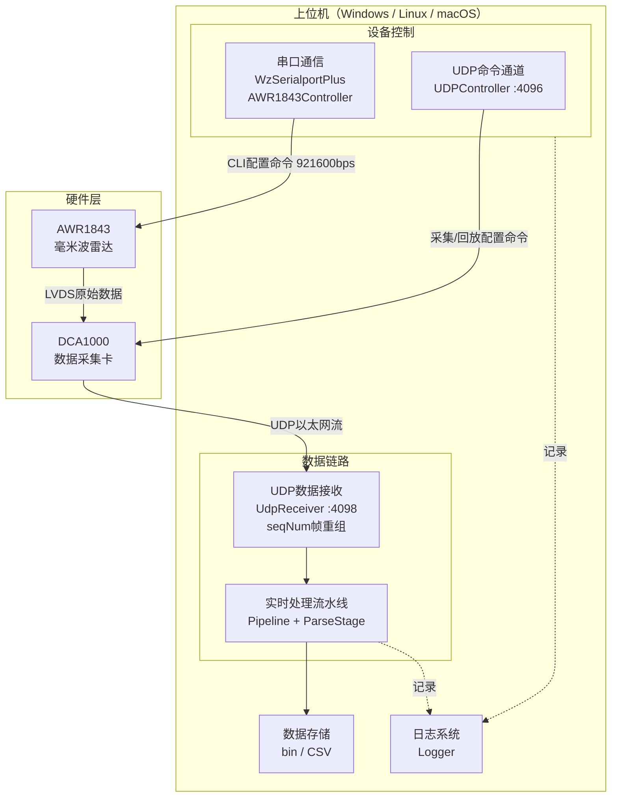
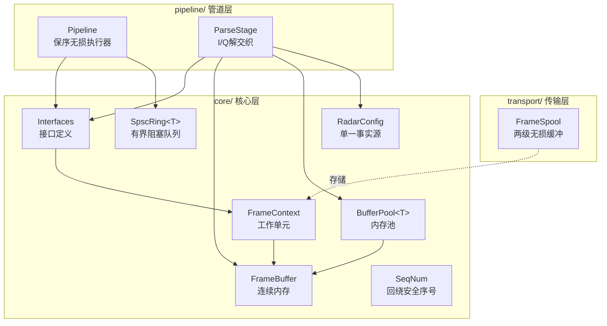
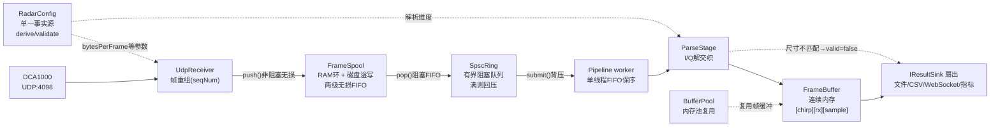
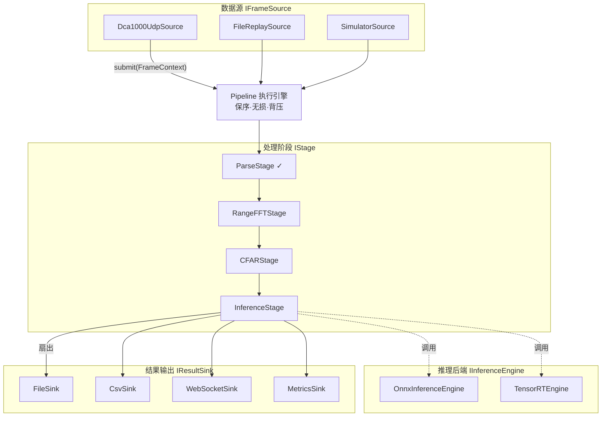

# AWR1843-DCA1000 雷达数据采集与处理工具

## 项目简介

本项目是一款针对德州仪器（TI）AWR1843毫米波雷达与DCA1000数据采集卡的开源工具，用于实现雷达原始数据的实时采集、解析、处理与存储。支持离线数据解析与转换，可将二进制雷达数据转换为CSV格式便于分析，并提供灵活的参数配置与日志记录功能。

项目近期完成了核心数据处理流水线的**架构重构**，从原有的ad-hoc实现迁移到全新的**无丢失、顺序保持**的实时处理架构，在保持向后兼容的同时，为后续扩展（FFT/CFAR/NN推理/WebSocket实时显示）奠定了坚实基础。

## 功能特点

### 设备控制与数据采集

- **设备控制**：通过UDP协议与DCA1000通信，支持复位、配置、启动/停止采集等命令
- **雷达控制**：通过串口与AWR1843雷达交互，实现传感器启动与关闭
- **数据解析**：支持单天线与全天线数据解析，将原始ADC数据转换为复数形式
- **数据存储**：支持二进制原始数据与CSV格式数据保存
- **配置灵活**：通过JSON配置文件与代码参数双重控制采集参数

### 新架构特性（Phase 0-3 地基）

- **无丢失、顺序保持的实时处理流水线**：从根本上修正了原架构中会静默丢帧/乱序的队列缺陷
- **单一事实源配置管理**：`RadarConfig` 收敛三处漂移的配置为统一来源，通过 `derive()` 计算派生值、`validate()` 校验一致性
- **有界阻塞队列**：`SpscRing` 替代不安全的 `UnlockQueue`，满则回压不丢，提供显式无丢失契约
- **内存池复用**：`BufferPool` 消除每帧分配开销，预分配对象减少运行时分配压力
- **两级无损缓冲**：`FrameSpool`（RAM环 + 磁盘溢写）确保生产者永不阻塞且数据不丢失
- **保序管道执行**：`Pipeline` 单工作线程FIFO消费，输出顺序==提交顺序，无需重排序
- **连续内存解析**：`ParseStage` 替代传统 `DataParser`，写入单一连续分配，无内部互斥锁
- **接口驱动可扩展**：`IFrameSource/IStage/IResultSink/IInferenceEngine` 接口支持依赖倒置，新增处理阶段仅需实现 `IStage`
- **自动化测试**：3个测试套件、10169条断言、100%通过，全部无硬件依赖可在CI运行

## 系统架构

### 整体系统架构图

下图展示硬件设备与上位机之间的三条独立链路：串口控制链、UDP 命令控制链（4096）与 UDP 数据链路（4098）。



### 分层架构图

新架构 `src/` 树采用 core / transport / pipeline 三层划分，依赖单向向下，上层仅依赖下层接口：



## 新架构组件说明

### 核心层（src/core/）

| 组件 | 文件 | 职责 |
|------|------|------|
| **RadarConfig** | `src/core/RadarConfig.{h,cpp}` | 单一事实源；集中管理数据格式参数与frameCfg/profileCfg配置，`derive()` 计算派生值（bytesPerFrame、numRangeBins等），`validate()` 验证配置一致性 |
| **SpscRing&lt;T&gt;** | `src/core/SpscRing.h` | 有界阻塞队列，替代不安全的UnlockQueue；`push()` 满则阻塞（背压传播），`try_push()` 永不阻塞，`pop()` 空则阻塞，`close()` 优雅关闭 |
| **BufferPool&lt;T&gt;** | `src/core/BufferPool.h` | 线程安全对象池，`acquire()` 返回带自定义析构器的shared_ptr，自动归还对象，消除每帧malloc开销 |
| **FrameBuffer** | `src/core/FrameBuffer.h` | 连续、缓存友好的存储，布局为行优先 `[chirp][rx][sample]`，替代三层嵌套vector，适合FFT/CFAR/NN |
| **FrameContext** | `src/core/FrameContext.h` | 流水线工作单元，携带单调uint64 frameSeq（保序/丢帧判据）+ raw/parsed载荷 + 时间戳 |
| **Interfaces** | `src/core/Interfaces.h` | 依赖倒置接缝：`IFrameSource`（产生有序无损帧）、`IStage`（管道步骤）、`IResultSink`（扇出消费者）、`IInferenceEngine`（NN后端抽象） |
| **SeqNum** | `src/core/SeqNum.h` | uint32序列号回绕安全比较（RFC1982/TCP式），防止长跑回绕误判 |

### 传输层（src/transport/）

| 组件 | 文件 | 职责 |
|------|------|------|
| **FrameSpool** | `src/transport/FrameSpool.{h,cpp}` | 两级无损FIFO：Tier 1为有界RAM环形缓冲区，Tier 2溢出到磁盘文件；`push()` 非阻塞且无损，`pop()` 阻塞且保持FIFO顺序；跨RAM→磁盘边界保持严格FIFO |

### 管道层（src/pipeline/）

| 组件 | 文件 | 职责 |
|------|------|------|
| **Pipeline** | `src/pipeline/Pipeline.{h,cpp}` | 顺序保持、无丢失的管道执行器；单工作线程按FIFO顺序弹出帧，依次运行各 `IStage`，扇出到各 `IResultSink`；`submit()` 满则阻塞（背压），`stop()` 优雅排空 |
| **ParseStage** | `src/pipeline/ParseStage.{h,cpp}` | 替代DataParser的管道阶段；将原始DCA1000 int16 I/Q字节解交织为连续FrameBuffer；保持与旧DataParser相同的字节布局，输出匹配旧的bin→CSV黄金标准；无内部mutex，可选BufferPool复用 |

### 实时处理流水线架构图

下图展示从 UDP 数据包到磁盘落盘的完整数据流，以及 `RadarConfig`、`SpscRing`、`BufferPool`、`FrameSpool`、`Pipeline`、`ParseStage` 等核心组件的交互关系：



**关键数据流说明**：
- `FrameSpool` 作为 record-then-process 兜底，RAM 满则溢写磁盘，生产者（socket 排空线程）永不阻塞也永不丢包
- `SpscRing` 在数据路径上满则阻塞，逐级回压，移除一切 drop-oldest 语义
- `Pipeline` 单 worker FIFO 消费，保证输出顺序 == 提交顺序，无需 Resequencer
- `RadarConfig` 作为单一事实源，供帧重组与解析共用一致参数

## 环境要求

- **操作系统**：Windows / Linux / macOS（跨平台支持，已通过跨平台改造）
- **编译环境**：C++17及以上标准的编译器（如MSVC、GCC、Clang）
- **构建系统**：CMake 3.15+
- **依赖库**：无第三方库依赖（仅使用C++标准库 + 系统线程库）
- **平台特定**：
  - Windows：自动链接 ws2_32（Winsock2）
  - Linux/macOS：需要 pthread（通过 CMake `find_package(Threads)` 自动处理）
- **硬件要求**：AWR1843雷达模块、DCA1000数据采集卡、USB转串口适配器（仅实时采集模式需要；离线解析和单元测试无需硬件）

## 安装步骤

1. 克隆仓库到本地
   ```bash
   git clone https://github.com/Lukad77/awr1843-radar-toolkit.git
   cd awr1843-radar-toolkit
   ```

2. 使用 CMake 构建项目（三平台通用）
   ```bash
   cmake -S . -B build -DCMAKE_BUILD_TYPE=Release
   cmake --build build -j
   ```

3. 运行单元测试验证新架构组件（无需硬件）
   ```bash
   ctest --test-dir build --output-on-failure
   ```

4. 根据硬件连接修改配置参数（IP地址、串口名称、雷达参数等）

### 构建目标说明

CMake 定义了五个独立的可执行目标：

| 目标 | 用途 | 硬件依赖 |
|------|------|----------|
| `test_udp` | 网络采集链路测试（UDP接收→seqNum重组→DataParser解析） | 无（配合Python回放泵） |
| `radar_full` | 完整程序（含串口链与DCA1000命令通道） | 需要 |
| `radar_core_tests` | 新架构基础组件单测（SeqNum/SpscRing/FrameBuffer/BufferPool/RadarConfig） | 无 |
| `radar_pipeline_tests` | 流水线骨架单测（ParseStage单/全Rx + Pipeline保序无损） | 无 |
| `radar_spool_tests` | 两级无损FrameSpool单测（RAM→磁盘溢写FIFO保序） | 无 |

## 使用说明

### 实时数据采集模式

1. 确保AWR1843与DCA1000正确连接并供电
2. 配置网络：将PC与DCA1000连接至同一局域网（默认DCA1000 IP为192.168.33.30）
3. 修改主程序中注释为`#if 0`的`main`函数为启用状态（将`#if 0`改为`#if 1`，同时将原`#if 1`改为`#if 0`）
4. 重新编译：`cmake --build build -j`
5. 根据实际硬件配置修改雷达参数：
   ```cpp
   Radar::RadarParams params;
   params.numADCBits = 16;         // ADC位数
   params.numADCSamples = 256;     // 每chirp的ADC采样数
   params.numChirpsEachFrame = 64; // 每帧的chirp数
   params.numRX = 4;               // 接收天线数量
   params.rxIdx = 0;               // 目标接收天线索引
   ```
6. 运行程序，数据将保存至指定路径（默认：`F:\\RadarData\\adc_<timestamp>.bin`）
7. 按Enter键停止采集

### 离线数据解析模式（默认模式）

1. 将需要解析的二进制数据文件路径修改至主程序：
   ```cpp
   std::ifstream inputFile("D:\\radar_dataset\\1105\\坐姿轻微晃动.bin", std::ios::binary);
   ```
2. 确保主程序中注释为`#if 1`的`main`函数为启用状态（默认即为此模式）
3. 编译并运行：`cmake --build build -j && ./build/radar_full`
4. 解析后的数据将保存为CSV文件
5. 程序同时支持解析全天线数据并输出解析信息

### 网络链路测试模式（无硬件）

配合 Python 回放泵脚本，将本地 `.bin` 文件按帧重放至 UDP 端口：
```bash
./build/test_udp <bind_ip> <bind_port> <bytes_per_frame>
```
默认监听 `0.0.0.0:4098`，开启 seqNum 排序重组，Ctrl-C 优雅退出并输出统计信息。

## 配置文件说明

`cf.json`用于配置DCA1000工作参数：
```json
{
  "DCA1000Config": {
    "dataLoggingMode": "raw",          // 数据记录模式：原始数据
    "dataTransferMode": "LVDSCapture", // 数据传输模式：LVDS捕获
    "dataCaptureMode": "ethernetStream", // 数据捕获模式：以太网流
    "lvdsMode": 2,                     // LVDS模式
    "dataFormatMode": 3,               // 数据格式模式
    "packetDelay_us": 5                // 数据包延迟（微秒）
  }
}
```

新架构中，`RadarConfig` 作为单一事实源管理所有雷达采集和处理参数，可通过 `derive()` 一次计算所有派生值（bytesPerFrame、numRangeBins、分辨率等），通过 `validate()` 校验配置一致性，避免多份配置漂移。

## 代码结构说明

### 传统实时处理层（awr1843_dca1000_read/）

| 文件名称 | 功能描述 |
|----------|----------|
| `awr1843_dca1000_read.cpp` | 主程序入口，包含实时采集（`#if 0`）与离线解析（`#if 1`）两种模式 |
| `UDPController.h/.cpp` | DCA1000 UDP通信控制，实现命令发送与响应处理 |
| `AWR1843Controller.h/.cpp` | AWR1843雷达控制，实现传感器启动与数据处理 |
| `DataParser.h/.cpp` | 雷达数据解析器，支持单天线与全天线数据解析 |
| `RealTimeProcessor.h` | 实时数据处理器，实现数据接收、缓存与存储 |
| `UdpReceiver.h/.cpp` | UDP数据接收与帧重组，支持阻塞与队列两种模式 |
| `Logger.h` | 日志系统，支持多级别日志输出与线程安全 |
| `WzSerialportPlus.h/.cpp` | 跨平台串口通信实现（Win32 DCB/POSIX termios双实现） |
| `net_compat.h` | 网络兼容层，统一Windows Winsock2与POSIX BSD socket差异 |
| `test_udp_main.cpp` | 网络链路测试入口，无硬件依赖 |
| `cf.json` | DCA1000配置文件 |

### 新架构核心组件层（src/）

| 文件路径 | 功能描述 |
|----------|----------|
| `src/core/RadarConfig.h/.cpp` | 单一事实源配置管理，`derive()`计算派生值，`validate()`校验一致性 |
| `src/core/SpscRing.h` | 有界阻塞队列，替代不安全的UnlockQueue，提供无损背压机制 |
| `src/core/BufferPool.h` | 线程安全对象池，消除每帧分配开销，自动归还复用 |
| `src/core/FrameBuffer.h` | 连续内存存储，布局为`[chirp][rx][sample]`，缓存友好 |
| `src/core/FrameContext.h` | 流水线工作单元，携带frameSeq + raw/parsed载荷 + 时间戳 |
| `src/core/Interfaces.h` | 接口定义：IFrameSource/IStage/IResultSink/IInferenceEngine |
| `src/core/SeqNum.h` | uint32序列号回绕安全比较原语 |
| `src/transport/FrameSpool.h/.cpp` | 两级无损FIFO（RAM环+磁盘溢写），确保零丢包 |
| `src/pipeline/Pipeline.h/.cpp` | 保序无损管道执行器，单工作线程FIFO消费 |
| `src/pipeline/ParseStage.h/.cpp` | I/Q解交织管道阶段，替代DataParser，连续内存无mutex |
| `src/tests/test_core.cpp` | 基础组件单测（SeqNum/SpscRing/FrameBuffer/BufferPool/RadarConfig） |
| `src/tests/test_pipeline.cpp` | 流水线单测（ParseStage + Pipeline保序无损） |
| `src/tests/test_spool.cpp` | FrameSpool单测（两级缓冲FIFO保序与溢写验证） |

## 数据格式说明

- **原始二进制数据**：按帧组织，每帧大小计算方式为`numRxAnt * numChirpsPerFrame * numADCSamples * 4`（4字节/采样点，复数int16 I/Q）
- **解析后数据**：以复数形式（I/Q分量）存储，每个采样点包含实部（I）和虚部（Q）
- **CSV格式**：每行对应一个chirp数据，每个采样点以"I,Q"形式表示，采样点间以逗号分隔
- **FrameBuffer布局**：行优先 `[chirp][rx][sample]`，索引计算 `idx = (chirp * numRx + rx) * numSamples + sample`

## 常见问题排查

### 传统组件问题

1. **UDP连接失败**：检查网络配置是否正确，确保PC与DCA1000 IP在同一网段
2. **串口无法打开**：确认串口名称正确，检查雷达是否正确供电，关闭占用串口的其他程序
3. **数据解析错误**：检查`BYTES_PER_FRAME`定义是否与实际配置一致，确保输入文件完整
4. **文件无法写入**：检查目标路径是否存在，确保程序有写入权限
5. **数据不完整**：增加`FRAME_BATCH_SIZE`参数可减少写入频率，提高数据完整性

### 新架构组件问题

6. **RadarConfig配置校验失败**：检查 `RadarConfig::validate()` 返回的错误信息，确认 `bytesPerFrame` 计算是否正确，确保 `numAdcSamples` 为偶数且 `rxIdx` 在有效范围内
7. **SpscRing队列阻塞**：监控 `size()` 和 `capacity()`，确认背压机制正常工作；若消费端处理过慢导致持续阻塞，考虑增大队列容量或优化下游处理速度
8. **BufferPool对象泄漏**：监控 `free_count()`，确认对象回收正常；检查 `shared_ptr` 生命周期管理，避免悬垂引用导致对象无法归还
9. **Pipeline处理延迟**：监控 `backlog()` 确认处理速度跟上生产速度；检查各 `IStage::process()` 返回值，识别被丢弃的帧
10. **FrameSpool磁盘溢写**：监控 `diskPeak()` 确认是否发生溢出；若频繁溢写，考虑增大 `ramCapFrames` 或优化消费速度；检查磁盘写入权限和剩余空间
11. **ParseStage尺寸不匹配**：检查 `expectedBytes()` 与实际帧大小是否一致；确认 `RadarConfig` 的 `numRxAnt`、`numChirpsPerFrame`、`numAdcSamples` 配置与实际雷达配置匹配

### 构建问题

12. **CMake找不到线程库**：Linux/macOS 确保安装了 pthread 开发包；Windows 上线程库为空实现，通常不会出现此问题
13. **Windows下链接错误**：确认 CMakeLists.txt 中包含 `ws2_32` 链接（已在 CMake 中自动处理）
14. **测试目标构建失败**：检查 `src/` 目录下相应组件是否正确编译，确认 C++17 标准已启用

## 后续扩展开发指南

新架构通过接口驱动设计（`IFrameSource`/`IStage`/`IResultSink`/`IInferenceEngine`）支持低耦合扩展。新增处理能力只需实现相应接口并注册到 `Pipeline`，无需修改执行器或核心组件。

### 扩展开发架构图

下图展示四个可插拔扩展点：`IFrameSource`（数据源）、`IStage`（处理阶段）、`IInferenceEngine`（推理后端）与 `IResultSink`（结果输出）。标 ✓ 为已实现，其余为后续扩展示例：



### 新增处理阶段（IStage）

实现 `IStage` 接口，在 `Pipeline` 中按顺序注册即可串联到处理链路：

```cpp
#include "core/Interfaces.h"

class RangeFFTStage : public radar::IStage {
public:
    const char* name() const override { return "RangeFFT"; }

    bool process(radar::FrameContext& ctx) override {
        // ctx.parsed 已由 ParseStage 填充为 FrameBuffer [chirp][rx][sample]
        // 在此执行距离FFT，结果可写回 ctx.parsed 或附加到自定义字段
        // 返回 true 保留帧，返回 false 标记丢弃（仅限 best-effort 分支）
        auto& fb = *ctx.parsed;
        // ... FFT 处理逻辑 ...
        return true;
    }
};

// 注册到 Pipeline
pipeline.addStage(std::make_shared<ParseStage>(cfg));
pipeline.addStage(std::make_shared<RangeFFTStage>());  // 新增阶段
```

**关键约定**：
- `process()` 在 Pipeline 单工作线程中调用，天然保序，无需内部加锁
- `ctx.parsed` 为 `shared_ptr<FrameBuffer>`，可直接读写连续内存
- 返回 `false` 表示显式丢弃（仅限显示旁路等 best-effort 分支，数据路径必须返回 `true`）

### 新增结果输出（IResultSink）

实现 `IResultSink` 接口，注册后 Pipeline 会将处理完的帧扇出到所有 Sink：

```cpp
class CsvSink : public radar::IResultSink {
public:
    void consume(const radar::FrameContext& ctx) override {
        // 将 ctx.parsed 写入 CSV 文件
    }
    void flush() override {
        // 刷新文件缓冲
    }
};

pipeline.addSink(std::make_shared<CsvSink>());
```

**典型 Sink 场景**：文件落盘、CSV 导出、WebSocket 实时推送、指标统计（延迟/丢帧/队列水位）。

### 新增数据源（IFrameSource）

实现 `IFrameSource` 接口，使实时 UDP 接收、文件回放、仿真器等不同来源统一接入 Pipeline：

```cpp
class FileReplaySource : public radar::IFrameSource {
public:
    bool open() override { /* 打开 .bin 文件 */ }
    void close() override { /* 关闭文件 */ }
    bool next(radar::FrameContext& out) override {
        // 读取下一帧原始字节，填充 out.raw 和 out.frameSeq
        // 返回 false 表示数据耗尽
    }
};

// 使用：source.next(ctx) -> pipeline.submit(ctx)
```

### 新增推理后端（IInferenceEngine）

实现 `IInferenceEngine` 接口，抽象 NN 后端（ONNX Runtime / TensorRT 等），供 `InferenceStage` 调用：

```cpp
class OnnxInferenceEngine : public radar::IInferenceEngine {
public:
    bool load(const std::string& modelPath) override { /* 加载模型 */ }
    bool infer(const float* input, std::size_t inN,
               float* output, std::size_t outN) override { /* 执行推理 */ }
};
```

### 扩展开发检查清单

| 检查项 | 说明 |
|--------|------|
| 配置来源 | 所有维度参数从 `RadarConfig` 获取，不硬编码；调用 `derive()` 确保派生值正确 |
| 内存管理 | 使用 `BufferPool` 复用 `FrameBuffer`，避免每帧 malloc；`shared_ptr` 管理生命周期 |
| 线程安全 | Pipeline 单工作线程保证保序，`IStage::process()` 内无需加锁；Sink 的 `consume()` 可能被快速调用，注意写入竞态 |
| 数据完整性 | 帧尺寸不匹配时设置 `ctx.valid=false` 并计数告警，绝不静默转发残帧 |
| 背压传播 | `Pipeline::submit()` 满则阻塞回压；如需非阻塞，检查 `backlog()` 后决策 |
| 日志记录 | 关键节点使用 `Logger` 记录；高频路径避免重格式化 |
| 测试验证 | 新增组件编写单元测试，加入 CMake 测试目标，确保 `ctest` 全通过 |

### 后续阶段路线图

| 阶段 | 目标 | 关键组件 |
|------|------|------|
| Phase 2 后续 | 接入真实 UDP 源与文件回放 | `Dca1000UdpSource`、`FileReplaySource` |
| Phase 0/1 收尾 | 配置外置、遗留源 UTF-8 转换、拆分 `AWR1843Controller` | `AppConfig`(JSON)、`Logger` 启用 |
| Phase 3 后续 | WebSocket 实时显示旁路 | `WebSocketSink` + 前端 |
| Phase 4/5 | DSP 处理与推理 | `RangeFFT`/`DopplerFFT`/`CFAR`（FFTW/pffft）、`InferenceStage`（ONNX Runtime） |
| Phase 6 | 可观测性与优化 | `MetricsSink`（延迟/丢帧/队列水位/Spool 深度）、线程绑核、overload 告警 |

> 更详细的扩展开发指南（含传统链路接入点、数据契约、锁约定）请参阅 [数据处理流程扩展开发指南](.qoder/repowiki/zh/content/数据处理流程扩展开发指南.md) 和 [架构演进文档](docs/ARCHITECTURE_EVOLUTION.md)。

## 许可证

本项目采用MIT许可证，详情参见LICENSE文件。

## 致谢

本项目参考了德州仪器AWR1843与DCA1000的官方技术文档，部分通信协议与数据格式解析基于TI提供的SDK示例。
