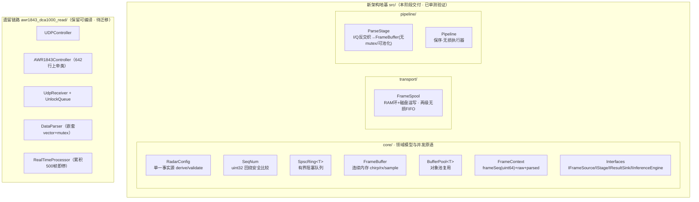
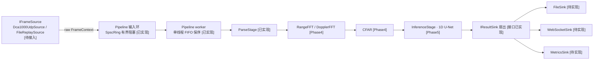
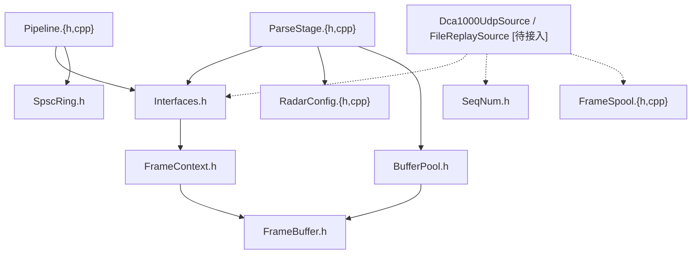
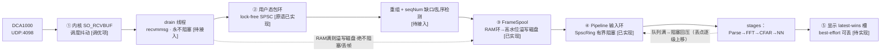

# AWR1843 雷达工具链 · 架构演进阶段性总结（Phase 0–3 地基）

> **范围与状态声明**
> 本文总结**已完成并经单元测试验证**的架构地基（Phase 0–3 核心组件 + Phase 2 两级无损缓冲）。
> 为保证"不大爆改、可回归"，**遗留链路 `awr1843_dca1000_read/` 全部保留且仍可编译运行**；新架构以并行的 `src/` 树交付。
> 图例：`[已实现]` = 本阶段交付并单测验证；`[待接入]` = 原语已就绪但尚未接入实时链路；`[Phase4+]` = 后续阶段。
> 依据用户要求，本阶段**暂不推进 Phase 4 及之后的实施**。

---

## 1. 执行摘要

- 交付了一套**无损、保序**的并发原语与处理流水线骨架，从根本上修正了原架构中会**静默丢帧/乱序**的队列缺陷，并把三处漂移的配置收敛为单一事实源。
- **验证结果：3 个测试套件、10169 条断言、100% 通过（ctest 3/3）**，全部在 macOS(clang) 上无硬件依赖运行。
- 遗留实时链路（真实硬件路径）保持不变；本阶段专注"地基正确性"，实时接入、DSP/NN、Web 显示为后续分期。

---

## 2. 完成状态一览

| 阶段 | 目标 | 状态 |
|---|---|---|
| Phase 0 | 工程卫生：UTF-8、配置外置、消除 `#if` 切换 | 新代码全 UTF-8；测试目标接入 CMake（部分：AppConfig/遗留编码转换后续） |
| Phase 1 | 领域模型与接口（依赖倒置） | **已完成**：`RadarConfig` 单一事实源 + `IFrameSource/IStage/IResultSink/IInferenceEngine` |
| Phase 2 | 无损采集/队列修复 + 两级缓冲 | **核心已完成**：`SpscRing` 替换 `UnlockQueue`、`FrameSpool` 两级缓冲、`SeqNum` 回绕安全（`Dca1000UdpSource`/`FileReplaySource` 待接入） |
| Phase 3 | 流水线框架 + Parse 阶段 | **已完成**：`Pipeline`（保序·无损）+ `ParseStage`（连续内存/无 mutex/可池化） |
| Phase 4+ | FFT/CFAR/NN/WebSocket 显示 | 未开始（需 FFTW/ONNX/WS 等重依赖或硬件） |

---

## 3. 已完成功能特性清单（Phase 0–3 核心组件）

### core/ — 领域模型与并发原语

| 组件 | 文件 | 职责 | 关键 API |
|---|---|---|---|
| RadarConfig | `src/core/RadarConfig.{h,cpp}` | **单一事实源**；一次派生 bytesPerFrame/RangeBins/DopplerBins/分辨率并校验 | `derive()` / `validate(err)` |
| SeqNum | `src/core/SeqNum.h` | uint32 序号**回绕安全**比较（RFC1982/TCP 式） | `seq_diff/lt/le/gt/ge` / `seq_gap` |
| SpscRing&lt;T&gt; | `src/core/SpscRing.h` | 有界阻塞队列，替换 `UnlockQueue` | `push`(阻塞)/`try_push`(非阻塞)/`pop`/`try_pop`/`close` |
| FrameBuffer | `src/core/FrameBuffer.h` | 单块**连续内存** `[chirp][rx][sample]` | `resize/at/index/data` |
| BufferPool&lt;T&gt; | `src/core/BufferPool.h` | 线程安全对象池，消除每帧分配 | `create/acquire`(自动归还) |
| FrameContext | `src/core/FrameContext.h` | 流水线工作单元；`frameSeq`(uint64)+raw+parsed+valid+时间戳 | — |
| Interfaces | `src/core/Interfaces.h` | 依赖倒置的接缝 | `IFrameSource/IStage/IResultSink/IInferenceEngine` |

### transport/ — 多级缓冲

| 组件 | 文件 | 职责 | 关键 API |
|---|---|---|---|
| FrameSpool | `src/transport/FrameSpool.{h,cpp}` | **RAM 环 + 磁盘溢写**两级无损 FIFO（record-then-process 落点） | `push`(非阻塞/无损)/`pop`(阻塞FIFO)/`diskPeak` |

### pipeline/ — 处理骨架

| 组件 | 文件 | 职责 | 关键 API |
|---|---|---|---|
| ParseStage | `src/pipeline/ParseStage.{h,cpp}` | I/Q 反交织→`FrameBuffer`；**无 mutex、单写者、可池化**；单/全 Rx | `parse` / `process` |
| Pipeline | `src/pipeline/Pipeline.{h,cpp}` | 保序·无损执行器（单 worker FIFO + 阻塞回压） | `addStage/addSink/start/submit/stop` |

### tests/ — 单元与集成测试

| 套件 | 文件 | 覆盖 |
|---|---|---|
| radar_core_tests | `src/tests/test_core.cpp` | SeqNum / SpscRing / FrameBuffer / BufferPool / RadarConfig |
| radar_pipeline_tests | `src/tests/test_pipeline.cpp` | ParseStage(单/全 Rx) + Pipeline 保序·无损 |
| radar_spool_tests | `src/tests/test_spool.cpp` | FrameSpool 溢写保序/逐字节一致/回用/close |

---

## 4. 当前 vs 初始：关键差异对比

### 4.1 总览

| 维度 | 原始架构 | 当前（新地基） |
|---|---|---|
| **队列** | `UnlockQueue`：生产者在溢出分支 `_out.fetch_add` 与消费者竞争 `_out`，**静默丢/错位**（drop-oldest 语义） | `SpscRing`：**有界阻塞，满则回压不丢**；`try_push` 供 drain 非阻塞 |
| **帧数据结构** | `vector<vector<vector<complex<float>>>>` 三层堆分配，每帧 resize/深拷贝 | `FrameBuffer` **单块连续内存** + `BufferPool` 复用，O(1) 索引 |
| **配置** | `RadarParams`/`ConfigParams`/frameCfg 三处重复；`BYTES_PER_FRAME=1*64*256*4` 与 `numRX=4` **手工失配** | `RadarConfig` **单一事实源** + `derive()` + `validate()` |
| **序号/溢出** | packet `seqNum`(uint32) 直接按绝对值比较，长跑回绕误判 | 内部 `frameSeq`(uint64) + `SeqNum` **回绕安全**比较线上 uint32 |
| **解析** | `DataParser` 持内部 `mutex`；写嵌套 vector | `ParseStage` **单写者无 mutex**；写连续内存；可池化 |
| **处理生命周期** | `RealTimeProcessor` 累积 500 帧即 `processing_=false` **停止** | `Pipeline` **持续运行**、保序、阻塞回压无损 |
| **背压** | 无（靠 drop-oldest 覆盖丢弃） | **有界阻塞 FIFO 逐级回压** + `FrameSpool` 两级兜底 |
| **缓冲层级** | 单一队列（且会丢） | **多级**：内核→包环→FrameSpool(RAM+磁盘)→阶段 FIFO→显示槽 |
| **职责划分** | `AWR1843Controller` **642 行上帝类**（串口+配置+参数+TLV 解析全内联头文件） | 接口分层；`ParseStage` 独立；实现落 `.cpp` |
| **自动化测试** | 无 | **3 套 ctest，10169 断言，100% 通过** |
| **编码/构建** | GBK 源码在 mac/Linux 乱码告警 | 新代码全 UTF-8；CMake 增 3 个测试目标 + `enable_testing` |

### 4.2 代码结构
- 从"头文件内联的巨类"转为**分层模块**（core/transport/pipeline/tests），依赖单向：`Pipeline→Interfaces→FrameContext→FrameBuffer`。
- 通过接口（`IStage` 等）解耦，FFT/CFAR/NN 未来只需新增 stage，无需改动执行器。

### 4.3 可靠性
- 队列层面消除数据竞争与静默丢弃；解析层面消除锁与共享写；帧完整性可显式标记（`FrameContext.valid`）。

### 4.4 性能
- **内存**：单块连续分配替代三层嵌套 vector，缓存友好、利于 SIMD/FFT；`BufferPool` 消除每帧 malloc/深拷贝。
- **并发**：CV 驱动的阻塞队列替代 1ms 忙等轮询；单 worker 顺序消费天然保序。

### 4.5 可维护/可扩展
- 单一 `RadarConfig` 杜绝参数漂移；新增能力=新增 stage/sink；测试可无硬件回归。

---

## 5. 已解决的原始问题（重点）

| 原始问题 | 原实现（文件） | 新方案（组件） | 验证 | 状态 |
|---|---|---|---|---|
| **队列静默丢帧/错位** | `unlock_queue.h`：`Put` 溢出分支生产者改 `_out` | `SpscRing` 有界阻塞、`try_push` 非阻塞、**取消 drop-oldest** | 满则 `try_push` 返回 false（不丢）；10 万元素跨线程严格 FIFO 且总和校验 | **已实现并验证** |
| **丢帧（背压缺失）** | drop-oldest 覆盖写 | 阻塞回压 + `FrameSpool` 两级兜底 | Pipeline 5000 帧过小环零丢；Spool 溢写后逐字节一致 | **已实现并验证** |
| **乱序** | 依赖包重组，多线程无保序 | 单 worker FIFO + `frameSeq` + `SeqNum` 回绕比较 | Pipeline 输出 `frameSeq` 严格 0..N-1；Spool FIFO 保序 | **已实现并验证** |
| **序号溢出** | packet `seqNum`(uint32) 绝对值比较 | 内部 `uint64 frameSeq` + `seq_diff((int32)(a-b))` | `seq_lt(0xFFFFFFFF,0)` 等回绕断言 | **已实现并验证** |
| **配置失配** | `BYTES_PER_FRAME` 与 `numRX` 手工不一致 | `RadarConfig.derive()/validate()` | 派生值断言 + 非法配置被拒 | **已实现并验证** |
| **数据结构低效** | 三层嵌套 vector + 每帧深拷贝 | 连续 `FrameBuffer` + `BufferPool` | 索引正确性 + 池复用（地址回收） | **已实现并验证** |
| **非持续处理** | 累积 500 帧即停 | `Pipeline` 持续运行 | 5000 帧连续通过 | **已实现（待接入实时源）** |
| **上帝类/锁** | `AWR1843Controller` 642 行；`DataParser` 内部 mutex | 接口分层；`ParseStage` 单写者无 mutex | 反交织对拍参考实现 | **Parse 已实现；控制器拆分待接入** |

---

## 6. 如何满足"不丢帧、不乱序"硬约束

分层论证（标注已验证/待接入）：

1. **源端（待接入）**：drain 线程 `recvmmsg` + 增大 `SO_RCVBUF`，**永不阻塞**（否则内核丢 UDP）。
2. **完整性检测（待接入）**：按 `seqNum` 用 `SeqNum` **回绕安全**检测缺口/乱序；缺包→标记 `valid=false` + 计数告警，**绝不静默吐残帧**。 ← 回绕比较原语**已实现验证**。
3. **无损缓冲（已实现验证）**：`FrameSpool` RAM 环满则**溢写磁盘**，push 永不阻塞/丢帧；跨 RAM→磁盘**严格 FIFO**。→ 即 record-then-process 兜底。
4. **有界回压（已实现验证）**：`SpscRing` 数据路径**满则阻塞**、逐级回压，**移除一切 drop-oldest**。
5. **保序处理（已实现验证）**：`Pipeline` 单 worker FIFO 消费 ⇒ 输出顺序 == 输入顺序（无需 Resequencer）；`frameSeq`(uint64) 全链路做保序/丢帧判据。
6. **显示解耦（待实现）**：仅显示旁路 best-effort 可丢，**不影响数据路径无损**。

> 结论：构成"不丢不乱"的核心原语（无损有界队列、两级缓冲、回绕安全序号、保序执行器）**均已实现并单测验证**；剩余为把它们接到真实 UDP 源（Phase 2 后续）与显示旁路（Phase 3 后续）。

---

## 7. 架构可视化

### 7.1 当前分层架构图



### 7.2 数据处理流水线流程图



### 7.3 组件依赖关系图



### 7.4 多级缓冲与队列数据流向图



---

## 8. 组件交互与数据流（说明）

- **配置装配**：`RadarConfig.derive()` 一次算出 `bytesPerFrame` 等，供源、`ParseStage`、缓冲共用，杜绝失配。
- **采集→缓冲（待接入）**：drain 线程收包→（缺口检测）→`FrameSpool.push()`；RAM 满自动溢写磁盘，**永不回压源**。
- **缓冲→流水线**：消费者从 `FrameSpool.pop()` 取有序帧，`Pipeline.submit()` 入 `SpscRing`（满则阻塞回压）。
- **流水线内**：worker 顺序 `pop`→依次 `IStage.process(ctx)`（`ParseStage` 填充 `ctx.parsed`）→扇出 `IResultSink.consume(ctx)`。
- **保序保证**：单 worker FIFO 消费单一队列 ⇒ 输出顺序 == 提交顺序。

---

## 9. 测试覆盖与验证结果

### 9.1 结果汇总

```
ctest --test-dir build --output-on-failure
  1/3 radar_core_tests ....... Passed   (40/40 checks)
  2/3 radar_pipeline_tests ... Passed   (5011/5011 checks)
  3/3 radar_spool_tests ...... Passed   (5118/5118 checks)
100% tests passed, 0 failed —— 合计 10169 断言全部通过
```

### 9.2 覆盖矩阵（组件 → 已验证行为）

| 组件 | 已验证行为 |
|---|---|
| SeqNum | 回绕比较（`0xFFFFFFFF < 0`）、跨界距离、gap 正/负 |
| SpscRing | 满则 `try_push` 失败（不丢）、`try_pop` FIFO、**10 万元素跨线程严格 FIFO + 总和无损**、`close` 唤醒 |
| FrameBuffer | `total/index/at` 正确性、连续布局 |
| BufferPool | 预分配计数、归还回收、**复用同一地址（无新分配）** |
| RadarConfig | `numChirpsPerFrame/DopplerBins/RangeBins(pow2)/bytesPerFrame` 派生、非 2 幂上取整、非法配置被拒 |
| ParseStage | 单/全 Rx 反交织**对拍参考实现**、尺寸不符被拒 |
| Pipeline | 5000 帧过**小环制造回压**仍**零丢 + 严格保序 + 全部解析成功** |
| FrameSpool | **确实溢写**(diskPeak>0)、跨 RAM→磁盘 FIFO **逐字节一致**、排空后回用 RAM、多线程 `close` 干净收尾 |

### 9.3 覆盖说明
- 上述为**功能/行为覆盖**（含并发与回压路径）与断言计数；**尚未接入行级覆盖率工具**（后续可加 `-fprofile-arcs -ftest-coverage` / `llvm-cov` 出具行覆盖率）。
- 全部测试**无硬件依赖**，可在 CI（三平台）常态运行。

---

## 10. 尚未实现与下一步

- **Phase 2 后续**：`Dca1000UdpSource`（`recvmmsg` + 缺口/乱序检测，写入 `FrameSpool`）、`FileReplaySource`（回放泵驱动整链，做无损/保序专项注入测试）。← **无硬件即可端到端验证"不丢不乱"的关键闭环**。
- **Phase 0/1 收尾**：`AppConfig`(JSON) 外置硬编码、遗留源 UTF-8 转换、启用 `Logger`、拆分 `AWR1843Controller`。
- **Phase 3 后续**：`WebSocketSink` + 前端（best-effort 显示旁路）。
- **Phase 4/5**：`RangeFFT/DopplerFFT/CFAR`（FFTW/pffft）、`InferenceStage`（ONNX Runtime）。
- **Phase 6**：`MetricsSink`（延迟/丢帧/队列水位/Spool 深度）、线程绑核、overload 告警、行覆盖率。

---

## 附录 A：本阶段新增文件

```
src/core/SeqNum.h            src/core/SpscRing.h        src/core/FrameBuffer.h
src/core/BufferPool.h        src/core/FrameContext.h    src/core/Interfaces.h
src/core/RadarConfig.h       src/core/RadarConfig.cpp
src/transport/FrameSpool.h   src/transport/FrameSpool.cpp
src/pipeline/ParseStage.h    src/pipeline/ParseStage.cpp
src/pipeline/Pipeline.h      src/pipeline/Pipeline.cpp
src/tests/test_core.cpp      src/tests/test_pipeline.cpp src/tests/test_spool.cpp
CMakeLists.txt（新增 3 个测试目标 + enable_testing）
```

## 附录 B：构建与验证命令

```bash
cmake -S . -B build -DCMAKE_BUILD_TYPE=Release
cmake --build build -j
ctest --test-dir build --output-on-failure
```
